<!-- FRAMEWORK_SKELETON: LOCKED -->
# 目录

- [1. API列表](#1-api列表)
- [2. 接口详情](#2-接口详情)
  - [接口公共说明](#接口公共说明)
    - [接口响应规范](#接口响应规范)
    - [CLI 调试指南](#cli-调试指南)
    - [接口调用稳定性提醒](#接口调用稳定性提醒)
  - [2.1 运动控制模块](#21-运动控制模块)
    - [2.1.1 运控高层接口](#211-运控高层接口)
      - [2.1.1.1 运动模式控制](#2111-运动模式控制)
        - [【服务】查询运动模式服务](#服务查询运动模式服务)
        - [【服务】设置运动模式服务](#服务设置运动模式服务)
        - [【服务】设置全身动作服务](#服务设置全身动作服务)
      - [2.1.1.2 预设动作控制](#2112-预设动作控制)
        - [【服务】预设动作控制服务](#服务预设动作控制服务)
      - [2.1.1.3 速度控制](#2113-速度控制)
        - [【话题】走跑控制话题](#话题走跑控制话题)
      - [2.1.1.4 输入源控制](#2114-输入源控制)
        - [【服务】设置输入源服务](#服务设置输入源服务)
        - [【服务】获取当前控制输入源服务](#服务获取当前控制输入源服务)
      - [2.1.1.5 自定义上肢关节控制](#2115-自定义上肢关节控制)
        - [【话题】自定义上肢关节控制话题](#话题自定义上肢关节控制话题)
    - [2.1.2 运控低层接口](#212-运控低层接口)
      - [2.1.2.1 关节控制](#2121-关节控制)
        - [【话题】关节控制话题](#话题关节控制话题)
        - [【话题】关节状态话题](#话题关节状态话题)
  - [2.2 交互控制模块](#22-交互控制模块)
    - [2.2.1 语音控制](#221-语音控制)
      - [2.2.1.1 音量控制服务](#2211-音量控制服务)
        - [【服务】获取音量服务](#服务获取音量服务)
        - [【服务】设置音量服务](#服务设置音量服务)
        - [【服务】获取静音状态服务](#服务获取静音状态服务)
        - [【服务】设置静音服务](#服务设置静音服务)
      - [2.2.1.2 语音合成服务](#2212-语音合成服务)
        - [【服务】语音合成服务](#服务语音合成服务)
      - [2.2.1.3 音频文件播放服务](#2213-音频文件播放服务)
        - [【服务】音频文件播放服务](#服务音频文件播放服务)
      - [2.2.1.4 TCP音频播放](#2214-tcp音频播放)
        - [【TCP接口】音频播放](#tcp接口音频播放)
      - [2.2.1.5 TCP音频录制](#2215-tcp音频录制)
        - [【TCP接口】音频录制](#tcp接口音频录制)
      - [2.2.1.6 音频设备列表](#2216-音频设备列表)
        - [【话题】音频设备列表](#话题音频设备列表)
      - [2.2.1.7 语音识别](#2217-语音识别)
        - [【话题】语音识别结果](#话题语音识别结果)
    - [2.2.2 屏幕控制](#222-屏幕控制)
      - [2.2.2.1 表情与视频管理](#2221-表情与视频管理)
        - [【服务】播放表情和视频服务](#服务播放表情和视频服务)
    - [2.2.3 系统控制](#223-系统控制)
      - [2.2.3.1 主动关机服务](#2231-主动关机服务)
        - [【服务】主动关机服务](#服务主动关机服务)
  - [2.3 硬件抽象模块](#23-硬件抽象模块)
    - [2.3.1 触觉传感器](#231-触觉传感器)
      - [2.3.1.1 触觉传感器状态](#2311-触觉传感器状态)
        - [【话题】头部触摸状态话题](#话题头部触摸状态话题)
    - [2.3.2 视觉传感器](#232-视觉传感器)
      - [2.3.2.1 视觉采集管理](#2321-视觉采集管理)
        - [【服务】获取相机单帧图像服务](#服务获取相机单帧图像服务)
        - [【话题】获取相机视频流服务](#话题获取相机视频流服务)
        - [【服务】舵机控制服务](#服务舵机控制服务)
    - [2.3.3 电源管理](#233-电源管理)
      - [2.3.3.1 电源管理](#2331-电源管理)
        - [【话题】电源管理话题](#话题电源管理话题)
    - [2.3.4 灯语控制](#234-灯语控制)
      - [2.3.4.1 灯带控制](#2341-灯带控制)
        - [【服务】灯带控制服务](#服务灯带控制服务)
      - [2.3.4.2 颈部灯光](#2342-颈部灯光)
        - [【服务】颈部灯光控制服务](#服务颈部灯光控制服务)
        - [【话题】颈部灯光状态话题](#话题颈部灯光状态话题)
- [3. 下级协议定义](#3-下级协议定义)
  - [3.1 公共类型定义](#31-公共类型定义)
  - [3.2 运动控制模块](#32-运动控制模块)
    - [3.2.1 运控高层接口](#321-运控高层接口)
    - [3.2.2 运控低层接口](#322-运控低层接口)
  - [3.3 交互控制模块](#33-交互控制模块)
    - [3.3.1 公共交互类型](#331-公共交互类型)
    - [3.3.2 语音控制](#332-语音控制)
  - [3.4 硬件抽象模块](#34-硬件抽象模块)
    - [3.4.1 触觉传感器](#341-触觉传感器)
    - [3.4.2 视觉传感器](#342-视觉传感器)
    - [3.4.3 电源管理](#343-电源管理)
    - [3.4.4 灯语控制](#344-灯语控制)
      - [3.4.4.1 灯带控制](#3441-灯带控制)
      - [3.4.4.2 颈部灯光控制](#3442-颈部灯光控制)
      - [3.4.4.3 颈部灯光状态](#3443-颈部灯光状态)
- [4. 编程示例](#4-编程示例)
  - [4.1 运动控制模块](#41-运动控制模块)
    - [4.1.1 运控高层接口](#411-运控高层接口)
        - [动作控制](#动作控制)
        - [速度控制](#速度控制)
        - [自定义上肢关节控制](#自定义上肢关节控制)
        - [预设动作设置](#预设动作设置)
    - [4.1.2 运控低层接口](#412-运控低层接口)
        - [关节运动控制](#关节运动控制)
  - [4.2 交互控制模块](#42-交互控制模块)
    - [4.2.1 语音控制](#421-语音控制)
        - [音频播放](#音频播放)
        - [音频参数控制](#音频参数控制)
        - [音频录制](#音频录制)
        - [音频设备列表](#音频设备列表)
    - [4.2.2 屏幕控制](#422-屏幕控制)
        - [表情播放](#表情播放)
  - [4.3 硬件抽象模块](#43-硬件抽象模块)
    - [4.3.1 触觉传感器](#431-触觉传感器)
        - [读取触觉状态](#读取触觉状态)
    - [4.3.2 视觉传感器](#432-视觉传感器)
        - [摄像头单帧数据获取](#摄像头单帧数据获取)
        - [视频流获取](#视频流获取)
    - [4.3.3 电源管理](#433-电源管理)
        - [读取电源状态](#读取电源状态)
    - [4.3.4 灯语控制](#434-灯语控制)
        - [灯语控制](#灯语控制)
  - [4.4 系统控制模块](#44-系统控制模块)
    - [4.4.1 主动关机服务](#441-主动关机服务)
        - [主动关机](#主动关机)

---

<!-- FRAMEWORK_SKELETON: INDEX_MAPPING_START -->

# 1. API列表

| 模块分类 | 功能分类 | 接口名称 | 功能描述 |
|---|---|---|---|
| **运动控制模块**| 运控高层接口 | [`/aimdk_5Fmsgs/srv/GetMcAction`](#服务查询运动模式服务) | 查询运动状态 |
| | | [`/aimdk_5Fmsgs/srv/SetMcAction`](#服务设置运动模式服务) | 设置运动状态 |
| | | [`/aimdk_5Fmsgs/srv/SetMcMotion`](#服务设置全身动作服务) | 设置全身动作 |
| | | [`/aimdk_5Fmsgs/srv/SetMcPresetMotion`](#服务预设动作控制服务) | 设置预设动作控制 |
| | | [`/aima/mc/locomotion/velocity`](#话题走跑控制话题) | 走跑控制 |
| | | [`/aimdk_5Fmsgs/srv/SetMcInputSource`](#服务设置输入源服务) | 设置输入源 |
| | | [`/aimdk_5Fmsgs/srv/GetCurrentInputSource`](#服务获取当前控制输入源服务) | 查询当前控制输入源 |
| | | [`/aima/mc/custom/joint/command`](#话题自定义上肢关节控制话题) | 自定义上肢关节控制 |
| | 运控低层接口 | [`/aima/hal/joint/command`](#话题关节控制话题) | 关节控制命令 |
| | | [`/aima/hal/joint/state`](#话题关节状态话题) | 关节状态反馈 |
|**交互控制模块**| 语音控制 | [`/aimdk_5Fmsgs/srv/PlayTts`](#服务语音合成服务) | 语音合成服务|
| | | [`/aimdk_5Fmsgs/srv/GetVolume`](#服务获取音量服务) | 获取音量 |
| | | [`/aimdk_5Fmsgs/srv/SetVolume`](#服务设置音量服务) | 设置音量 |
| | | [`/aimdk_5Fmsgs/srv/GetMute`](#服务获取静音状态服务) | 获取静音状态 |
| | | [`/aimdk_5Fmsgs/srv/SetMute`](#服务设置静音服务) | 设置静音 |
| | | [`/aimdk_5Fmsgs/srv/PlayAudioFile`](#服务音频文件播放服务) | 音频文件播放 |
| | | TCP 端口 `6001`（PulseAudio simple-protocol-tcp） | 音频文件播放（TCP 直连） |
| | | TCP 端口 `4713`（PulseAudio native-protocol-tcp） | 音频录制（TCP 直连） |
| | | [`/aima/hal/audio/audio_device_list`](#话题音频设备列表) | 音频设备列表（查询输入/输出设备） |
| | | [`/aima/agent/asr_result`](#话题语音识别结果) | 语音识别结果 |
| | 屏幕控制 | [`/aimdk_5Fmsgs/srv/PlayEmotion`](#服务播放表情和视频服务) | 播放表情和视频 |
| | 系统控制 | [`/aimdk_5Fmsgs/srv/ShutdownTask`](#服务主动关机服务) | 主动关机服务 |
|**硬件抽象模块** | 触觉传感器 | [`/aima/hal/touch/state`](#话题头部触摸状态话题) | 头部触摸状态 |
| | 视觉传感器 | [`/aima/hal/camera/CaptureJpegImage`](#服务获取相机单帧图像服务) | 获取指定相机单帧JPEG图像 |
| | | [`rtsp_url = "rtsp://<IP>:<Port>/live_<camera_id>"`](#话题获取相机视频流服务) | RTSP流媒体服务 |
| | | [`/aimdk_5Fmsgs/srv/SetServo`](#服务舵机控制服务) | 舵机位置与速度控制 |
| | 电源管理 | [`/aima/hal/bms/state`](#话题电源管理话题) | 电源管理相关数据 |
| | 灯语控制 | [`/aimdk_5Fmsgs/srv/LedStripCommand`](#服务灯带控制服务) | 设置整机灯语样式 |
| | | [`/aimdk_5Fmsgs/srv/SetNeckLight`](#服务颈部灯光控制服务) | 控制颈部灯光开关 |
| | | [`/aima/hal/neck_light/state`](#话题颈部灯光状态话题) | 颈部灯光状态反馈 |

<!-- FRAMEWORK_SKELETON: INDEX_MAPPING_END -->

# 2. 接口详情

本SDK提供了一套完整的ROS2接口，用于控制启元机器人。接口遵循ROS2标准，支持C++和Python两种编程语言，为开发者提供灵活、高效的机器人应用开发环境。

## 接口公共说明

### 接口响应规范

SDK 采用统一的响应模型。服务调用通常返回 `CommonResponse` 或 `CommonTaskResponse`，建议遵循“框架返回码优先，业务状态码随后”的判定原则。

**完整响应模型概览**

| 字段 | 类型 | 语义说明 |
| :--- | :--- | :--- |
| **header** | `ResponseHeader` | **RPC / 框架层信息**。包含系统时间戳 `stamp` 与返回码 `code`。 |
| **status / state** | `CommonState` | **核心业务状态**。反映具体指令的执行进展，通过 `.value` 获取。 |
| **message** | `string` | **诊断信息**。当调用非 `SUCCESS` 时，提供可读的错误排查描述。 |
| **task_id** | `uint64` | **任务标识**。仅在 `CommonTaskResponse` 中提供，用于异步任务追踪。 |

**1. 系统状态码语义映射 (ResponseHeader)**

该结构体定义了分布式通信及框架层的响应状态。

| 字段 | 类型 | 语义说明 |
| :--- | :--- | :--- |
| **stamp** | `builtin_interfaces/Time` | **时间戳**。框架层生成的消息处理时间。 |
| **code** | `int64` | **框架返回码 (Enum)**。见下表枚举描述。 |

<!-- DERIVED_TABLE_START: ResponseCode -->
| code值 | 枚举标识 | 框架解析 | 开发者处理建议 |
| :--- | :--- | :--- | :--- |
| `0` | `SUCCESS` | 调度成功 | 请求已被底层系统接受并进入执行序列。 |
| `1` | `FAIL` | 调度失败 | 请求被拦截（如状态机冲突、资源占用或权限不足）。 |
<!-- DERIVED_TABLE_END: ResponseCode -->

**2. 业务状态码语义映射 (CommonState)**

以下枚举定义了整个二次开发 SDK 的全生命周期状态语义：

<!-- DERIVED_TABLE_START: CommonState -->
| 状态值 | 枚举标识 | 业务解析 | 开发者处理建议 |
| :--- | :--- | :--- | :--- |
| `0` | `UNKNOWN` | 未知状态 | 建议记录日志并触发系统自检或安全回退。 |
| `1` | `SUCCESS` | 调用成功 | 业务逻辑正常完成或异步请求已成功入队。 |
| `2` | `FAILURE` | 执行失败 | 业务规则冲突或资源报错，请查阅 `message` 诊断。 |
| `3` | `ABORTED` | 任务中止 | 任务已被外部停止、中途取消或被高优先级任务抢占。 |
| `4` | `TIMEOUT` | 响应超时 | 检查网络链路、底层驱动状态或系统负载。 |
| `5` | `INVALID` | 无效请求 | 检查参数是否越界、格式是否非法或状态机切换是否受限。 |
| `6` | `IN_MANUAL` | 手动接管 | 机器人处于离线物理接管或手动维护模式，拒绝指令。 |
| `100` | `NOT_READY` | 系统未就绪 | 模块仍处于引导/初始化阶段，建议延时重试。 |
| `200` | `PENDING` | 任务排队中 | 异步任务已受理，正处于底层执行器的资源消费序列。 |
| `300` | `CREATED` | 任务已创建 | 任务实例已就绪并完成预设参数绑定，等待执行开口。 |
| `400` | `RUNNING` | 正在运行 | 任务处于活动状态，正实时控制机器人硬件或消耗资源。 |
<!-- DERIVED_TABLE_END: CommonState -->

**CommonState reason 故障原因枚举**

当业务调用失败时，`CommonResponse` 的 `status.reason` 或 `CommonTaskResponse` 的 `state.reason` 字段提供具体的失败原因：

<!-- DERIVED_TABLE_START: CommonStateReason -->
| 原因值 | 枚举标识 | 业务解析 | 开发者处理建议 |
| :--- | :--- | :--- | :--- |
| `0` | `REASON_SUCCESS` | 成功 | 无需额外处理。 |
| `1` | `REASON_OPENBOX` | 开箱状态中 | 等待开箱流程完成或关闭箱体。 |
| `2` | `REASON_STARTUP_CHECK` | 开机自检中 | 等待系统自检流程完成。 |
| `3` | `REASON_SHUTDOWN` | 关机状态中 | 机器人处于关机状态，无法执行指令。 |
| `4` | `REASON_FROM` | 当前形态不支持 | 检查当前机器人形态是否支持该操作。 |
| `5` | `REASON_LOW_BATTERY` | 低电量限制 | 充电或等待电量恢复至安全阈值。 |
| `6` | `REASON_CHARGE` | 正在充电中 | 充电状态下部分功能受限，请断开充电器。 |
| `7` | `REASON_NO_WHITELIST` | 动作不在白名单 | 该动作未授权，请联系管理员添加白名单。 |
| `8` | `REASON_HDS` | HDS故障 | 检查硬件驱动状态或重启HDS服务。 |
| `9` | `REASON_ACTION` | 当前模式不支持 | 切换到支持的操作模式后重试。 |
| `10` | `REASON_OBSTACLE_FORWARD` | 前方有障碍物 | 清除前方障碍物或调整路径。 |
| `11` | `REASON_OBSTACLE_BACK` | 后方有障碍物 | 清除后方障碍物或调整路径。 |
| `12` | `REASON_OBSTACLE_LEFT` | 左方有障碍物 | 清除左方障碍物或调整路径。 |
| `13` | `REASON_OBSTACLE_RIGHT` | 右方有障碍物 | 清除右方障碍物或调整路径。 |
| `14` | `REASON_OBSTACLE_UP` | 上方有障碍物 | 清除上方障碍物或调整路径。 |
| `15` | `REASON_TASK_RUNNING` | 其他任务正在运行 | 等待当前任务完成或取消后再重试。 |
| `16` | `REASON_TARGET_STATE` | 机器人已经是目标状态 | 无需重复执行，机器人已处于目标状态。 |
| `17` | `REASON_NOT_FOUND` | 未找到 | 检查目标动作、资源或配置是否存在。 |
| `18` | `REASON_NO_SKILL_LIST` | 无技能列表 | 检查技能列表配置是否已加载。 |
| `19` | `REASON_FORM_MIS_MATCH` | 形态不匹配 | 检查当前机器人形态是否满足动作要求。 |
| `20` | `REASON_ACTION_NOT_MATCH` | 动作不匹配 | 检查请求动作与当前状态机上下文是否一致。 |
| `21` | `REASON_ACTION_BLACKLISTED` | 动作在黑名单中 | 该动作被限制执行，请确认动作授权或黑名单配置。 |
| `22` | `REASON_NO_TRANSFER_PATH` | 无可用转换路径 | 当前状态无法转换到目标状态，请调整起始状态或转换路径。 |
| `23` | `REASON_NO_ELIGIBLE_SKILL` | 无符合条件的技能 | 检查当前条件下是否存在可执行技能。 |
| `24` | `REASON_INDOOR_WHOLE_BODY` | 室内模式下暂不支持该动作 | 切换到室外模式后重试。 |
| `25` | `REASON_ENGINE_NOT_READY` | 动作配置未就绪 | 等待动作引擎完成初始化后重试。 |
| `26` | `REASON_NOT_SUPPORTED` | 当前机型不支持该功能 | 确认目标机型是否具备该功能。 |
| `27` | `REASON_STAND_UP_IN_PROGRESS` | 机器人正在起立 | 等待起立完成后再执行操作。 |
| `28` | `REASON_NOT_INTERRUPTIBLE` | 当前动画不可打断 | 等待当前动画播放完毕。 |
| `29` | `REASON_INTERRUPT_INVALID` | 当前动画 ID 无效 | 检查目标动画 ID 是否正确。 |
| `30` | `REASON_TRANSFORM_CONDITION` | 当前状态不满足变形/动作执行条件 | 调整机器人状态以满足执行条件。 |
<!-- DERIVED_TABLE_END: CommonStateReason -->

> **多级判别准则**：开发者应首先核对 `header.code == 0`（系统调度成功），再结合 `status.value == 1`（业务逻辑成功）来判定最终结果。
> **故障详情获取**：当调用失败（包括框架及其业务层）时，建议通过 `message` 字段获取具体的错误排查详情。
> **故障原因定位**：当业务调用失败时，可通过 `status.reason` 字段获取具体的失败原因（详见上方 CommonState reason 故障原因枚举）。
> **状态码冲突提醒**：部分底层模块（如运动模式控制接口）返回的 `status.value` 遵循 `McActionStatus` 协议，其 `100` 代码代表 `RUNNING`。处理反馈时请务必核对具体接口的模型定义。

---

### CLI 调试指南

您可以利用 ROS 2 命令行工具对上述接口进行点对点调试：
- **服务调用 (Service Call)**：`ros2 service call <service_name> <service_type> '<data>'`
- **话题发布 (Topic Pub)**：`ros2 topic pub <topic_name> <message_type> '<data>'`
- **参数获取**：
  - **字段溯源**：载荷中的 Key 必须与对应 `.srv` 或 `.msg` 定义中的字段名**严格一致**。若定义存在嵌套，需按层级展开。
- **填充规范**：数值直接填写；布尔值全小写 `true/false`；字符串建议“外层单引、内层双引”（如 `'text: "..."'`）。
- **缺省占位**：对 `RequestHeader` 等嵌套对象，建议直接使用 `{}` 占位（例如 `header: {}`）。
- **示例**：`ros2 service call /aimdk_5Fmsgs/srv/SetMcAction aimdk_msgs/srv/SetMcAction '{header: {}, source: "sdk_rpc", command: {action: {value: 201}}}'`

---

### 接口调用稳定性提醒

在代码中动态创建（实例化）新的 ROS 2 Client 后，即使 `wait_for_service` 返回成功，底层的通信链路可能仍需极短的时间（通常为毫秒级）来完成最终的连接匹配。
- **现象**：在 Client 刚创建后的瞬间发起的**首次**请求，即便网络正常，也可能出现“请求发出了但服务端没收到”的情况（在跨芯片通讯场景下较常见）。
- **开发建议**：
    1. **推荐长连接**：建议在节点初始化时一次性创建 Client 并全局复用，**避免**在业务循环或函数内部频繁创建与销毁 Client。
    2. **增加重试或延时**：如必须动态创建，建议在服务就绪后额外等待一小段时间（如 200ms），或为首次调用增加重试逻辑。
> 详情可参考 ROS2 官方关于 Client 匹配滞后的 [技术讨论](https://github.com/ros2/ros2cli/issues/37)。

### 友好用户使用声明
> [!CAUTION]
> **重要安全性须知**：底层硬件控制（尤其是关节伺服）具有极高的物理操作性风险。在开始正式业务开发前，**请务必先行阅读并签署**根目录下的 [《友好用户使用声明》](./友好用户使用声明.md)。任何因不当指令导致的硬件损毁或安全事故，均由开发者承担全部后果。

---

## 2.1 运动控制模块

本模块负责启元机器人的运动控制，涵盖了高层运动模式（如走跑、预设动作）的全局管控指令，以及底层关节电机（角度、力位）伺服的精细化控制接口。

**核心功能**

- **高阶业务指令调用**：支持通过特定宏指令（Action/Motion）一键触发机器人预设动作或轨迹。
- **运动模式与信号源管理**：支持机器人整机运动状态（如走跑、站立）的查询切换及输入源优先级配置。
- **底层关节精细伺服控制**：支持下发关节电机标定量（位置、力矩等），支持进行高频状态监控。

### 2.1.1 运控高层接口

本模块提供高层运动指令全局管控，包含运动模式切换、输入源控制、走跑控制及预设动作触发。

#### 2.1.1.1 运动模式控制

**T1机型** 运控状态机切换逻辑如下：

```mermaid
graph LR
    %% 入口
    START(( )) -- Init --> PASSIVE

    %% 急停与基础恢复
    DAMPING["DAMPING_DEFAULT<br/>阻尼急停"]
    PASSIVE["PASSIVE_DEFAULT<br/>零力矩急停"]
    BIPED_RECOVERY["BIPED_RECOVERY<br/>双足恢复"]

    %% 四足起始状态
    Q_GET_DOWN["QUADRUPED_GET_DOWN_DEFAULT<br/>四足趴下"]
    Q_SIT_DOWN["QUADRUPED_SIT_DOWN_DEFAULT<br/>四足坐下"]
    Q_STAND["QUADRUPED_STAND_DEFAULT<br/>四足位控站立"]
    Q_RECOVERY["QUADRUPED_RECOVERY<br/>四足恢复"]

    %% 四足基础运动
    subgraph QBASE["四足基础运动"]
        Q_TERRAIN["QUADRUPED_LOCOMOTION_TERRAIN<br/>四足越障"]
        Q_DEFAULT["QUADRUPED_LOCOMOTION_DEFAULT<br/>四足行走"]
        Q_RUN["QUADRUPED_LOCOMOTION_RUN<br/>四足高速模式"]
    end

    %% 四足技能与形态转换
    subgraph QSKILL["四足技能类"]
        direction TB
        subgraph QSKILL_ROW1[" "]
            direction LR
            Q_BIONIC["QUADRUPED_LOCOMOTION_BIONIC<br/>仿生-支持姿态控制"]
            Q_HANDSHAKE["QUADRUPED_LOCOMOTION_HANDSHAKE<br/>握手"]
            Q_PRIDE["QUADRUPED_LOCOMOTION_PRIDE<br/>傲娇"]
        end
        subgraph QSKILL_ROW2[" "]
            direction LR
            Q_STRETCH["QUADRUPED_LOCOMOTION_STRETCH<br/>伸展"]
            Q_PLEASURE["QUADRUPED_LOCOMOTION_PLEASURE<br/>愉快"]
            Q_DANCE["QUADRUPED_LOCOMOTION_DANCE<br/>舞蹈"]
        end
        subgraph QSKILL_ROW3[" "]
            direction LR
            Q_JUMP["QUADRUPED_LOCOMOTION_JUMP<br/>原地跳跃"]
            Q_BACKFLIP["QUADRUPED_LOCOMOTION_BACKFLIP<br/>后空翻"]
        end
    end

    subgraph Q2B["四足变双足"]
        Q2B_DEFAULT["QUADRUPED_TO_BIPED<br/>普通变形"]
        Q2B_ROTATE["QUADRUPED_TO_BIPED_ROTATE<br/>旋转变形"]
    end

    %% 双足状态
    subgraph BWBC["双足全身控制"]
        B_CUSTOM["BIPED_CUSTOM_UPPER<br/>双足二开上肢控制模式"]
        B_WBC["BIPED_LOCOMOTION_WBC<br/>双足全身控制模式"]
        B_ANIMATION["BIPED_LOCOMOTION_ANIMATION<br/>双足动作执行模式"]
    end

    subgraph BBASE["双足基础运动"]
        B_RUN["BIPED_LOCOMOTION_RUN<br/>双足跑步"]
        B_DEFAULT["BIPED_LOCOMOTION_DEFAULT<br/>双足运动默认"]
        B_TERRAIN["BIPED_LOCOMOTION_TERRAIN<br/>双足越野"]
    end

    subgraph BSKILL["双足技能类"]
        B_ROTATE["BIPED_LOCOMOTION_ROTATE_LOCAL<br/>双足局部旋转"]
        B_MOONWALK["BIPED_LOCOMOTION_MOONWALK<br/>双足太空步"]
    end

    subgraph B2Q["双足变四足"]
        B2Q_DEFAULT["BIPED_TO_QUADRUPED<br/>普通变形"]
        B2Q_ROTATE["BIPED_TO_QUADRUPED_ROTATE<br/>旋转变形"]
    end

    %% 用户可设置路径
    PASSIVE <-- SetMcAction --> DAMPING
    PASSIVE -->|SetMcAction| Q_GET_DOWN
    PASSIVE -->|SetMcAction| Q_SIT_DOWN
    PASSIVE -->|SetMcAction| Q_STAND
    PASSIVE -->|SetMcAction| Q_RECOVERY
    PASSIVE -->|SetMcAction| BIPED_RECOVERY

    Q_STAND <-- SetMcAction --> Q_GET_DOWN
    Q_STAND <-- SetMcAction --> Q_SIT_DOWN
    Q_GET_DOWN <-- SetMcAction --> Q_SIT_DOWN
    Q_STAND -->|SetMcAction| QBASE

    QBASE -->|SetMcAction| QSKILL
    QSKILL -.-> QBASE
    QBASE -->|SetMcAction| Q2B

    B_WBC <-- SetMcAction --> B_CUSTOM
    B_WBC <-- SetMcAction --> B_ANIMATION
    BWBC -->|SetMcAction| BBASE
    BBASE -.-> BWBC
    BWBC -->|SetMcAction| BSKILL
    BSKILL -.-> BWBC
    BWBC -->|SetMcAction| B2Q

    %% 系统自动切换路径
    BIPED_RECOVERY -.-> BWBC
    Q_RECOVERY -.-> QBASE
    Q2B -.-> BWBC
    B2Q -.-> QBASE

    %% 图例
    LEGEND_TRANSITION["过渡状态，不在该状态停留"]
    LEGEND_POSITION["位置控制"]
    LEGEND_TORQUE["力矩控制"]
    LG_USER_A(" ") -->|用户可设置| LG_USER_B(" ")
    LG_AUTO_A(" ") -.->|系统控制，自动切换| LG_AUTO_B(" ")

    %% 样式
    classDef position fill:#d5e8d4,stroke:#82b366,color:#333333
    classDef torque fill:#fff2cc,stroke:#d6b656,color:#333333
    classDef transition fill:#f5f5f5,stroke:#666666,color:#333333,stroke-dasharray: 5 5
    classDef bionic fill:#f8cecc,stroke:#b85450,color:#333333
    classDef group fill:#dae8fc,stroke:#6c8ebf,color:#333333

    class PASSIVE,DAMPING,Q_GET_DOWN,Q_SIT_DOWN,Q_STAND,LEGEND_POSITION position
    class Q_RECOVERY,BIPED_RECOVERY,Q_TERRAIN,Q_DEFAULT,Q_RUN,Q_HANDSHAKE,Q_PRIDE,Q_STRETCH,Q_PLEASURE,Q_DANCE,Q_JUMP,Q_BACKFLIP,Q2B_DEFAULT,Q2B_ROTATE,B_CUSTOM,B_WBC,B_ANIMATION,B_RUN,B_DEFAULT,B_TERRAIN,B_ROTATE,B_MOONWALK,B2Q_DEFAULT,B2Q_ROTATE,LEGEND_TORQUE torque
    class Q_BIONIC bionic
    class LEGEND_TRANSITION transition

    %% 图例箭头端点隐藏为空心点
    classDef legendDot fill:transparent,stroke:transparent,color:transparent
    class LG_USER_A,LG_USER_B,LG_AUTO_A,LG_AUTO_B legendDot

    style QBASE fill:#dae8fc,stroke:#6c8ebf
    style QSKILL fill:#dae8fc,stroke:#6c8ebf
    style QSKILL_ROW1 fill:transparent,stroke:transparent
    style QSKILL_ROW2 fill:transparent,stroke:transparent
    style QSKILL_ROW3 fill:transparent,stroke:transparent
    style Q2B fill:#dae8fc,stroke:#6c8ebf
    style BWBC fill:#dae8fc,stroke:#6c8ebf
    style BBASE fill:#dae8fc,stroke:#6c8ebf
    style BSKILL fill:#dae8fc,stroke:#6c8ebf
    style B2Q fill:#dae8fc,stroke:#6c8ebf
```

<!-- DERIVED_DIAGRAM_START: McStateTransition -->

<!-- DERIVED_DIAGRAM_END: McStateTransition -->

  > ⚠️ **状态切换限制**：
  
  > 状态的切换通常需要严格遵循上图中箭头指向的逻辑连线路径（不支持跨状态强行越级切换）。若您下发不在合法拓扑连线范围内的 `Action` 指令，将触发底层控制系统拦截保护。
  
  > 图中 **实线** 表示用户可通过 `SetMcAction` 主动设置的切换路径，**虚线** 表示系统控制的自动切换路径。恢复、变形和技能类动作通常不建议作为业务驻留状态使用。
  
  > **阻尼急停** (`DAMPING_DEFAULT`) 与 **零力矩急停** (`PASSIVE_DEFAULT`) 之间可按图示路径切换。阻尼急停用于快速进入阻尼保护，恢复业务动作前应先回到零力矩急停。
  
  > **零力矩急停** (`PASSIVE_DEFAULT`) 是主要起始状态，可切换至四足站立/趴下/坐下、四足恢复、双足恢复以及阻尼急停等入口状态。
  
  > **四足恢复** (`QUADRUPED_RECOVERY`)、**双足恢复** (`BIPED_RECOVERY`) 以及四足/双足形态变换类动作执行完成后，系统会自动落位到图中虚线指向的基础控制状态。

##### 【服务】查询运动模式服务
**功能描述**

查询机器人当前正在执行的运动或形态动作（Action）生命周期阶段。

**接口元数据**

- 版本：1.0 (Stable)
- 接口类型：Service
- 接口名称：/aimdk_5Fmsgs/srv/GetMcAction
- 数据类型：`aimdk_msgs/srv/GetMcAction`
- 数据流向：Robot -> Outer (状态/查询返回)
- 调用方式：Service Call (调用/请求)
- CLI 调用：`ros2 service call /aimdk_5Fmsgs/srv/GetMcAction aimdk_msgs/srv/GetMcAction '{...}'`
- QoS：Reliable（服务默认 QoS）

**接口定义**

<!-- PROTOCOL_START: GetMcAction -->
- 协议路径：`aimdk_msgs/mc/action/srv/GetMcAction.srv`
```srv
# ==========================================
# [请求部分 Request] 客户端下发的数据结构
# ==========================================
CommonRequest    request    # Request 部分

---
# ==========================================
# [响应部分 Response] 服务端返回的数据结构
# ==========================================
ResponseHeader    header
McActionInfo      info      # Action信息
```
<!-- PROTOCOL_END: GetMcAction -->

**GetMcAction 协议定义**

| 字段 | 数据类型 | 描述 |
|---|---|---|
| `request` | [`CommonRequest`](#commonrequest) | 请求参数（包含优先级等通用配置） |
| `header` | [`ResponseHeader`](#responseheader) | 响应头信息（包含序列号与状态回传） |
| `info` | [`McActionInfo`](#mcactioninfo) | 当前机器人运动模式的详细信息 |

**特别说明**

- **状态轮询与业务时序控制**：
  1. 动作的物理切换在下发后虽立即返回成功，但机械实际过渡可能长达数秒，此期间并发其他指令极易引发冲撞风险。
  2. 下发切换请求后，开发者需启动循环高频探测。当且仅当本接口返回的 `status.value` 由 `200 (TRANSITION)` 变更为 `100 (RUNNING)` 时，方可进入下一步业务逻辑。
- **未知动作的防御性兜底解析**：当探测到 `info.current_action.value` 等于 `0` 时，切勿将其简单判定为机器人处于“空闲待机态”。
  1. 在特定状态下，底层可能触发了仅驻留于配置文件中、尚未映射至公开 API 枚举表的内部保护动作，导致强制序列化回退为 `0`。
  2. 遇到 `value = 0` 无法对应已知场景时，业务逻辑必须优先提取 `info.action_desc` 字段。该字段能无视枚举字典限制，直接上报底层内核当前真正在跑的字符串标签。

**编程示例**

<!-- REDIRECTION_LINK_START: ActionControl -->
- Cpp示例：[点击跳转](#动作控制-cpp示例)
- Python示例：[点击跳转](#动作控制-Python示例)
<!-- REDIRECTION_LINK_END: ActionControl -->

##### 【服务】设置运动模式服务
**功能描述**

设置合法的运动模式（如稳定站立或走跑等）。

**接口元数据**

- 版本：0.1 (Beta / 开发中)
- 接口类型：Service
- 接口名称：/aimdk_5Fmsgs/srv/SetMcAction
- 数据类型：`aimdk_msgs/srv/SetMcAction`
- 数据流向：Outer -> Robot (控制命令/设置)
- 调用方式：Service Call (调用/请求)
- CLI 调用：`ros2 service call /aimdk_5Fmsgs/srv/SetMcAction aimdk_msgs/srv/SetMcAction '{...}'`
- QoS：Reliable（服务默认 QoS）

**接口定义**

<!-- PROTOCOL_START: SetMcAction -->
- 协议路径：`aimdk_msgs/mc/action/srv/SetMcAction.srv`
```srv
# ==========================================
# [请求部分 Request] 客户端下发的数据结构
# ==========================================
RequestHeader      header
string             source     # 触发源
McActionCommand    command    # Action命令

---
# ==========================================
# [响应部分 Response] 服务端返回的数据结构
# ==========================================
CommonTaskResponse response
```
<!-- PROTOCOL_END: SetMcAction -->

**SetMcAction 协议定义**

| 字段 | 数据类型 | 描述 |
|---|---|---|
| `header` | [`RequestHeader`](#requestheader) | 请求头 |
| `source` | [`string`](#string) | 触发源 |
| `command` | [`McActionCommand`](#mcactioncommand) | Action命令 |
| `response` | [`CommonTaskResponse`](#commontaskresponse) | 任务响应（含 task_id） |

**特别说明**

- **双通道调用**：底层接口支持通过整型标识符 (`action.value`) 或字符串描述 (`action_desc`) 两种方式下发动作指令。
- **解析顺序与回退逻辑**：
  1. 系统优先解析 `action.value`。若该数值在内核枚举映射中存在（例如 `1` 对应 `PASSIVE_DEFAULT`），则直接执行对应动作。
  2. 若 `action.value` 为空值（`0`）或未定义的数值，系统将退而解析 `action_desc` 字段。若该字符串配置文件中定义的动作名称精确匹配，则执行对应动作。
- **状态切换逻辑图**：当前机型的运动模式状态切换规则及其闭环拓扑详见 [2.1.1.1 运动模式控制](#2111-运动模式控制) 章节。
- **MIMIC 类动作切换建议**：MIMIC 类模仿动作不建议通过 `SetMcAction` 直接切换。调用 `SetMcMotion` 执行此类动作时，系统会自动从 `QUADRUPED_LOCOMOTION_DEFAULT` 或 `BIPED_LOCOMOTION_WBC` 切换至对应的 MIMIC Action；动作完成后，再自动切回 `QUADRUPED_LOCOMOTION_DEFAULT` 或 `BIPED_LOCOMOTION_WBC`。

**SetMcAction 业务状态码 (response.state.value)**

当 `header.code == 0`（系统调度成功）时，`response.state.value` 提供 SetMcAction 特有的业务结果：

| 状态码 | 含义 | 是否支持 |
|---|---|---|
| `1` | action 设置成功，开始切换逻辑 | 是 |
| `-1001` | 未定义从当前 action 切换到目标 action 的规则 | 是 |
| `-1002` | 当前action未定义，一般不会报 | 是 |
| `-1003` | 目标action未定义 | 是 |
| `-1004` | 机器人姿态不具备切换目标action的能力 | 是 |
| `-1005` | 未定义目标action的行为 | 是 |
| `-1006` | 目标action行为和当前action行为不支持切换 | 是 |
| `-1007` | action切换超时 | 否 |
| `-10001` | 请求过于频繁（500ms 一次） | 是 |
| `-10002` | 触发源为空，不响应请求 | 是 |

- **McAction 枚举值列表**：
  **T1机型** 支持的 McAction 枚举值如下：
  | 常量名 | 数值 | 描述 |
  |---|---|---|
  | `PASSIVE_DEFAULT` | `1` | 被动模式 |
  | `DAMPING_DEFAULT` | `2` | 阻尼模式 |
  | `QUAD_LIE_DOWN` | `3` | 四足躺下 |
  | `QUADRUPED_TO_BIPED` | `10` | 四足切换两足形态-常规 |
  | `QUADRUPED_TO_BIPED_ROTATE` | `11` | 四足切换两足形态-带旋转 |
  | `BIPED_TO_QUADRUPED` | `20` | 两足切换四足形态-常规 |
  | `BIPED_TO_QUADRUPED_ROTATE` | `21` | 两足切换四足形态-旋转 |
  | `QUADRUPED_RECOVERY` | `100` | 倒地四足站起 |
  | `QUADRUPED_STAND_DEFAULT` | `101` | 四足站立模式 |
  | `QUADRUPED_LOCOMOTION_DEFAULT` | `102` | 四足行走/奔跑模式 |
  | `QUADRUPED_LOCOMOTION_RUN` | `112` | 四足奔跑模式 |
  | `QUADRUPED_LOCOMOTION_TERRAIN` | `103` | 四足越障行走模式 |
  | `QUADRUPED_LOCOMOTION_BIONIC` | `104` | 四足仿生模式 |
  | `QUADRUPED_LOCOMOTION_BACKFLIP` | `106` | 四足后空翻 |
  | `QUADRUPED_LOCOMOTION_HANDSHAKE` | `107` | 四足握手 |
  | `QUADRUPED_LOCOMOTION_SIT` | `108` | 四足坐下 |
  | `QUADRUPED_LOCOMOTION_DANCE` | `109` | 四足跳舞 |
  | `QUADRUPED_GET_DOWN_DEFAULT` | `110` | 四足趴下 |
  | `QUADRUPED_SIT_DOWN_DEFAULT` | `111` | 四足坐下 |
  | `QUADRUPED_LOCOMOTION_PRIDE` | `113` | 四足骄傲 |
  | `QUADRUPED_LOCOMOTION_PLEASURE` | `114` | 四足愉快 |
  | `QUADRUPED_READY_STAND_DEFAULT` | `115` | 四足准备站立 |
  | `QUADRUPED_LOCOMOTION_JUMP` | `116` | 四足跳跃 |
  | `QUADRUPED_LOCOMOTION_STRETCH` | `117` | 四足伸展 |
  | `QUADRUPED_PUSH_UP` | `118` | 四足俯卧撑 |
  | `QUADRUPED_MIMIC` | `119` | 四足模仿动作 |
  | `QUADRUPED_CROUCH_DEFAULT` | `120` | 四足蜷缩 |
  | `QUADRUPED_LOCOMOTION_STEP` | `121` | 四足踏步模式 |
  | `BIPED_RECOVERY` | `200` | 倒地两足站起 |
  | `BIPED_STAND_DEFAULT` | `201` | 两足站立模式 |
  | `BIPED_LOCOMOTION_DEFAULT` | `202` | 两足行走/奔跑模式 |
  | `BIPED_LOCOMOTION_TERRAIN` | `203` | 两足越障行走模式 |
  | `BIPED_LOCOMOTION_ROTATE_LOCAL` | `204` | 双足原地旋转 |
  | `BIPED_LOCOMOTION_MOONWALK` | `206` | 双足太空步 |
  | `BIPED_LOCOMOTION_RUN` | `207` | 双足奔跑模式 |
  | `BIPED_MIMIC` | `208` | 双足模仿动作 |
  | `BIPED_LOCOMOTION_WBC` | `300` | 双足全身控制模式 |
  | `BIPED_LOCOMOTION_ANIMATION` | `301` | 双足动画控制模式 |
  | `BIPED_RECORD_UPPER` | `302` | 双足控制上肢录制模式 |
  | `BIPED_GIMBAL` | `303` | 双足 gimbal 轨迹移动模式 |
  | `BIPED_CUSTOM_UPPER` | `1014` | 上肢控制 |

**编程示例**

<!-- REDIRECTION_LINK_START: ActionControl_Set -->
- Cpp示例：[点击跳转](#动作控制-cpp示例)
- Python示例：[点击跳转](#动作控制-Python示例)
<!-- REDIRECTION_LINK_END: ActionControl_Set -->

##### 【服务】设置全身动作服务
**功能描述**

有别于上面那种按键触发式的固有动作控制（Action），`Motion` 接口专门用于运控高级开发——**播放基于神经网络推理模型 (.onnx) 或是特定外部特征文件记录的动作细则序列**。

**接口元数据**

- 版本：0.6.0 (Beta / 开发中)
- 接口类型：Service
- 接口名称：/aimdk_5Fmsgs/srv/SetMcMotion
- 数据类型：`aimdk_msgs/srv/SetMcMotion`
- 调用方式：Call (服务客户端下发)
- CLI 调用：`ros2 service call /aimdk_5Fmsgs/srv/SetMcMotion aimdk_msgs/srv/SetMcMotion '{...}'`
- QoS：Reliable（服务默认 QoS）

**接口定义**

<!-- PROTOCOL_START: SetMcMotion -->
- 协议路径：`aimdk_msgs/mc/motion/srv/SetMcMotion.srv`
```srv
# ==========================================
# [请求部分 Request] 客户端下发的数据结构
# ==========================================
RequestHeader    header          # 此接口是播放全身动作接口
string           source          # 触发源，定义见 McTaskSource.msg
int32            type            # 资源类型

# 自有模型
int32            MIMIC_QY = 1

# 灵创模型
int32            MIMIC_LC = 2

string           motion          # 全身动作名称，若motion为空，加载model中resource; 反之，从本地加载执行资源。
string           model           # onnx 模型绝对路径
string           resource        # 资源绝对路径，比如轨迹参考
bool             interrupt       # 是否打断(给后面animation接口合并预留)

# 操作类型
int32            operation

# 预先加载
int32            PRELOAD = 1

# 开始执行
int32            EXECUTION = 2

---
# ==========================================
# [响应部分 Response] 服务端返回的数据结构
# ==========================================
CommonTaskResponse    response   # 响应头 (含 task_id)
```
<!-- PROTOCOL_END: SetMcMotion -->

**SetMcMotion 协议定义**

| 字段 | 数据类型 | 描述 |
|---|---|---|
| `header` | [`RequestHeader`](#requestheader) | 请求头 |
| `source` | [`string`](#string) | 触发源，语义参考 [`McTaskSource`](#mctasksource) |
| `type` | `int32` | 资源类型 (`1`: MIMIC_QY, `2`: MIMIC_LC) |
| `motion` | `string` | 全身动作名称 |
| `model` | `string` | onnx 模型绝对路径 |
| `resource` | `string` | 资源绝对路径，比如轨迹参考 |
| `interrupt` | `bool` | 是否打断 |
| `operation` | `int32` | 操作类型 (`1`: PRELOAD 预先加载, `2`: EXECUTION 开始执行) |
| `response` | [`CommonTaskResponse`](#commontaskresponse) | 响应头 (含 task_id) |

**特别说明**

- **强制时序前置条件**：
  1. **开启基础框架阀门**：调用本接口前，最好先使用 `SetMcAction` 接口将系统切入相关的Action（`BIPED_STAND_DEFAULT` 或 `BIPED_WALK_RUN`）。
  2. **阻塞确认状态跃迁**：框架开启指令发出后，切勿立刻盲发本动作。调用端必须写明轮询检测逻辑，通过比对 `GetMcAction` 的实时反馈，确认底层执行态彻底平稳跃迁并停留至 `RUNNING` 后，方能安全地下发最终动作指令。
- **仅支持内置动作调用**：
  1. 调用者必须在 `motion` 字段传入系统内置的合法动作名称（如 `"INTRO_POSE1"`，系统可用的 Motion 列表参见下表）。若传入空值或未登记名称，接口将无法正常执行。
  **T1机型** **Motion** 枚举值列表：
<!-- DERIVED_TABLE_START: MotionList_T1 -->
| 名称 | Type | 描述 |
| :--- | :--- | :--- |
| `BIPED_MIMIC_SKATING` | 双足 Mimic | 人形滑冰 30s，含下腰 |
| `BIPED_MIMIC_SHOW` | 双足 Mimic | 人形炫耀，带腰部 |
| `QUAD_MIMIC` | 四足 Mimic | 四足扭腰 |
| `QUAD_MIMIC_PRIDE` | 四足 Mimic | 四足骄傲 |
| `QUAD_MIMIC_PONDER` | 四足 Mimic | 四足思考 |
| `QUAD_MIMIC_HEED` | 四足 Mimic | 四足聆听 |
| `QUAD_MIMIC_GLANCE` | 四足 Mimic | 四足四处看，亮相展示 |
| `QUAD_MIMIC_DANCE_TWO` | 四足 Mimic | 四足跳舞动作 2 |
| `QUAD_MIMIC_DANCE_THREE` | 四足 Mimic | 四足跳舞动作 3 |
| `QUAD_MIMIC_TALK_ONE` | 四足 Mimic | 四足讲话 1，幅度小 |
| `QUAD_MIMIC_TALK_TWO` | 四足 Mimic | 四足讲话 2，幅度小 |
| `QUAD_MIMIC_TALK_THREE` | 四足 Mimic | 四足讲话 3 |
| `QUAD_MIMIC_TALK_FOUR` | 四足 Mimic | 四足讲话 4 |
| `QUAD_MIMIC_TALK_FIVE` | 四足 Mimic | 四足动作 5，基于动作 2 放大 |
| `QUAD_MIMIC_SCARED` | 四足 Mimic | 四足害怕 |
| `QUAD_MIMIC_RHYTHM_TWO` | 四足 Mimic | 四足律动 2 |
| `QUAD_MIMIC_RHYTHM` | 四足 Mimic | 四足律动 |
| `QUAD_MIMIC_SAD` | 四足 Mimic | 四足难过 |
| `QUAD_MIMIC_HANDSHAKE` | 四足 Mimic | 四足握手 |
| `QUAD_MIMIC_GREET` | 四足 Mimic | 四足打招呼 |
<!-- DERIVED_TABLE_END: MotionList_T1 -->
  2. 服务端目前不提供解析 `model` 和 `resource` 等外部路径字段实现相应功能。
- **异步任务编排机制（非阻塞响应）**：
  1. 此服务采用非阻塞队列机制。接口返回 `SUCCESS` 及 `task_id`，仅代表动作请求校验合格且已成功入队。
  2. 由于物理动作耗时长，服务端不会阻塞等待执行结束。上层若需监控实际动作何时播完，需保存 `task_id` 去异步监听专属的排队进度。

**编程示例**

- Cpp示例：[点击跳转](#动作控制-cpp示例)
- Python示例：[点击跳转](#动作控制-Python示例)

#### 2.1.1.2 预设动作控制

##### 【服务】预设动作控制服务
**功能描述**

用于控制机器人的局部或全身执行预设的动画序列。与 `SetMcMotion` 依赖神经网络推理不同，`PresetMotion` 通常播放的是基于关键帧或预录制的关节空间轨迹文件（如 `.csv`）。常用于礼仪挥手、比心、拍照姿态等固定交互动作。执行前需要确保机器人已进入稳定站立模式。

**接口元数据**

- 版本：1.0 (Stable)
- 接口类型：Service
- 接口名称：/aimdk_5Fmsgs/srv/SetMcPresetMotion
- 数据类型：`aimdk_msgs/srv/SetMcPresetMotion`
- 数据流向：Outer -> Robot (控制命令)
- 调用方式：Service Call (调用/请求)
- CLI 调用：`ros2 service call /aimdk_5Fmsgs/srv/SetMcPresetMotion aimdk_msgs/srv/SetMcPresetMotion '{...}'`
- QoS：Reliable（服务默认 QoS）

**接口定义**

<!-- PROTOCOL_START: SetMcPresetMotion -->
- 协议路径：`aimdk_msgs/mc/motion/srv/SetMcPresetMotion.srv`
```srv
# ==========================================
# [请求部分 Request] 客户端下发的数据结构
# ==========================================
RequestHeader     header
string            source       # 触发源，定义见 McTaskSource.msg
McControlArea     area         # 控制区域
McPresetMotion    motion       # 预设动作
bool              interrupt    # 是否打断前一个动作
string            ani_path     # 自定义动作地址

---
# ==========================================
# [响应部分 Response] 服务端返回的数据结构
# ==========================================
CommonTaskResponse    response
```
<!-- PROTOCOL_END: SetMcPresetMotion -->

**SetMcPresetMotion 协议定义**

| 字段 | 数据类型 | 描述 |
|---|---|---|
| `header` | [`RequestHeader`](#requestheader) | 请求头 |
| `source` | [`string`](#string) | 触发源，语义参考 [`McTaskSource`](#mctasksource) |
| `area` | [`McControlArea`](#mccontrolarea) | 控制区域 |
| `motion` | [`McPresetMotion`](#mcpresetmotion) | 预设动作 |
| `interrupt` | `bool` | 是否打断前一个动作 |
| `ani_path` | `string` | 自定义动作地址 |
| `response` | [`CommonTaskResponse`](#commontaskresponse) | - |

**特别说明**

- **强制时序前置条件**：
  1. **开启基础框架阀门**：调用本接口前，必须先使用 `SetMcAction` 接口将系统切入指定的Action（`BIPED_LOCOMOTION_WBC`）。
  2. **阻塞确认状态跃迁**：框架开启指令发出后，切勿立刻盲发本动作。调用端必须写明轮询检测逻辑，通过比对 `GetMcAction` 的实时反馈，确认底层执行态彻底平稳跃迁并停留至 `RUNNING` 后，方能安全地下发最终动作指令。
  **T1机型** 支持的预设动作列表如下：
<!-- DERIVED_TABLE_START: PresetMotionList_T1 -->
| 动作编号 | 描述 |
| :---: | :--- |
| `100` | 恢复初始姿态 |
| `1001` | 右手挥手 |
| `1002` | 右手握手 |
| `1003` | 右手挥手（远距） |
| `1004` | 右手碰拳 |
| `1005` | 右手加油欢呼 |
| `1006` | 右手持摄像杆 |
| `1007` | 右手拍照抬起 |
| `1011` | 左手挥手 |
| `1012` | 左手握手 |
| `1013` | 左手挥手（远距） |
| `1014` | 左手碰拳 |
| `1015` | 左手加油欢呼 |
| `1016` | 左手抬起 |
| `2001` | 双手比心 |
| `2002` | 双手喜悦挥动 |
| `2003` | 说话动作 |
| `2004` | 说话动作 1 |
| `2005` | 说话动作 2 |
| `2006` | 说话动作 3 |
| `2007` | 说话动作 4 |
| `2008` | 说话动作 5 |
| `2009` | 说话动作 6 |
| `2011` | 拍照动作 1 |
| `2012` | 拍照动作 2 |
| `2013` | 拍照动作 3 |
| `2014` | 拍照动作 4 |
| `2015` | 双手抬起 |
| `2016` | 双手加油欢呼 / 舞蹈 1 |
| `2017` | 骄傲 |
| `2020` | 三连拍 |
| `2021` | 跳舞动作 |
| `2022` | 蛇形舞动 1 |
| `2023` | 蛇形舞动 2+3 |
| `2024` | 小幅度说话 |
| `2025` | 人形炫耀（仅上肢） |
| `2026` | 人形拥抱 |
| `2027` | 人形炫耀（带腰部） |
| `2028` | 人形炫耀（腰部明显） |
| `2029` | 人形滑冰（30s） |
| `2030` | 人形滑冰（备用） |
| `2031` | 人形律动 |
| `2032` | 人形喜悦 |
| `2033` | 人形难过 |
| `2034` | 人形害怕 |
| `2035` | 人形思考 1 |
| `2036` | 人形思考 2 |
| `2037` | 人形思考 3 |
| `2038` | 人形思考 4 |
| `2039` | 人形转圈 90° |
| `2040` | 人形转圈 360° |
| `2041` | 人形聆听 |
| `2042` | 破冰舞蹈 |
| `2043` | 蛇形舞动 2（导演剪辑） |
| `2044` | 跳舞动作（更新版） |
| `3038` | 单臂击掌 |
| `3040` | 双手欢呼 |
| `3043` | 双手挥舞 |
| `3045` | 双手挥舞 2 |
| `3046` | 双手挥舞 3 |
| `3047` | 左右手挥舞 |
| `3048` | 双手欢呼 1 |
| `3052` | 打招呼 |
| `3054` | 双手欢呼 2 |
| `3055` | 双手欢呼 3 |
| `3056` | 打招呼 2 |
| `3061` | 全身跳舞 2 |
| `3062` | 保持手臂动作 1 |
| `3064` | 保持手臂动作 2 |
| `3065` | 保持手臂动作 3 |
<!-- DERIVED_TABLE_END: PresetMotionList_T1 -->
- **支持外部绝对路径加载**：
  1. 若 `ani_path` 非空，优先加载其指定的 `.csv` 路径文件；否则退回使用 `motion` 枚举去匹配内置库。
  2. `area` 控制掩码仅作上层标识参考。系统不会基于此过滤动作，而完全依照提取出的文件曲线强驱电机。
- **缺失强制稳态拦截机制**：
  1. 服务端不设置稳态检查，在任何极端运动姿态中发出的动画预设指令都会被立即响应下发。
  2. 为避免控制权冲突导致设备动作不可控，业务端必须主动施加安全时序约束。强烈建议配合 `GetMcAction` 进行状态判断，确认系统已落位至稳定状态后再下发预设请求。
- **防打断模式拒接断言特征**：
  1. 当 `interrupt = false`，且当前系统正处于其他动画序列的播放进程中时，服务端会拒接本次新覆盖下发请求以保护原有动画完成。
  2. 被拦截时接口返回的 `state` 依然是 `RUNNING`。调用方无法通过系统态识别失败，必须协同解析头帧错误码判定：`header.code == 0` 代表新请求被正常响应入队，`header.code == 1` 即被拦截丢弃。
- **预置自定义动作播放**：
  **T1机型** 支持用户加载自定义轨迹进行动作播放。轨迹数据需采用固定的 **.csv** 格式，且采样率必须严格匹配 **120fps**。
  1. 若在接口请求中指定了机上 `.csv` 文件的绝对路径，系统将尝试解析并执行该轨迹。
  2. 轨迹文件可通过 APP"手把手教学"功能录制生成（文件存储于 `/robot/userdata/sd/custom_motions/`，文件名格式为 `<用户输入名称>_<时间戳>_<编号>.csv`），亦可使用"灵创"工具或 Blender 等三维软件制作导出（需符合固定列定义格式）。
  3. `.csv` 文件示例可参考如下（仅显示前10行）：
     ```csv
     left_shoulder_pitch_joint,left_shoulder_roll_joint,left_shoulder_yaw_joint,left_elbow_joint,right_shoulder_pitch_joint,right_shoulder_roll_joint,right_shoulder_yaw_joint,right_elbow_joint,waist_roll_joint,waist_yaw_joint
     0.0,0.17994344234466553,0.0,1.399998426437378,0.0,-0.17994344234466553,0.0,1.399998426437378,0.0,0.0
     -0.00011743895447580144,0.1799049973487854,-8.103636355372146e-05,1.3994921445846558,-0.00011743901995941997,-0.1799049973487854,8.103636355372146e-05,1.3994921445846558,0.0,0.0
     -0.00046682049287483096,0.17979085445404053,-0.0003218810888938606,1.3979878425598145,-0.00046682075480930507,-0.17979085445404053,0.0003218810888938606,1.3979878425598145,0.0,0.0
     -0.0010437417076900601,0.17960278689861298,-0.0007191374897956848,1.3955069780349731,-0.0010437422897666693,-0.17960278689861298,0.0007191374897956848,1.3955069780349731,0.0,0.0
     -0.0018437996041029692,0.17934243381023407,-0.001269408967345953,1.39207124710083,-0.0018438005354255438,-0.17934243381023407,0.001269408967345953,1.39207124710083,0.0,0.0
     -0.002862590830773115,0.17901161313056946,-0.0019692990463227034,1.387702465057373,-0.002862592227756977,-0.17901161313056946,0.0019692990463227034,1.387702465057373,0.0,0.0
     -0.0040957136079669,0.17861206829547882,-0.002815410727635026,1.382421851158142,-0.004095715470612049,-0.17861206829547882,0.002815410727635026,1.382421851158142,0.0,0.0
     -0.005538763012737036,0.17814549803733826,-0.003804347477853298,1.3762513399124146,-0.00553876580670476,-0.17814549803733826,0.003804347477853298,1.3762513399124146,0.0,0.0
     -0.007187338545918465,0.17761366069316864,-0.004932713229209185,1.3692123889923096,-0.007187342271208763,-0.17761366069316864,0.004932713229209185,1.3692123889923096,0.0,0.0
     ```

**编程示例**

<!-- REDIRECTION_LINK_START: PresetMotion -->
- Cpp示例：[点击跳转](#预设动作设置-cpp示例)
- Python示例：[点击跳转](#预设动作设置-Python示例)
<!-- REDIRECTION_LINK_END: PresetMotion -->

#### 2.1.1.3 速度控制

##### 【话题】走跑控制话题
**功能描述**

控制机器人在水平面内的平移速度（前进/侧移）及转向速度。该接口专门用于接收外部（如遥控器、App 摇杆、自主导航 PNC）连续、高频发送的速度控制指令，它是所有“移动指令”的主干汇聚口。

**接口元数据**

- 版本：1.0 (Stable)
- 接口类型：Topic
- 接口名称：/aima/mc/locomotion/velocity
- 数据类型：`aimdk_msgs/msg/McLocomotionVelocity`
- 数据流向：Outer -> Robot (控制命令)
- 调用方式：Publish (发布)
- CLI 调用：`ros2 topic pub /aima/mc/locomotion/velocity aimdk_msgs/msg/McLocomotionVelocity '{...}'`
- QoS：Reliable / Volatile / Depth=10
- 频率：50 Hz ~ 100 Hz

**接口定义**

<!-- PROTOCOL_START: McLocomotionVelocity -->
- 协议路径：`aimdk_msgs/mc/motion/McLocomotionVelocity.msg`
```msg
# ==========================================
# [话题载荷 Payload] 走跑速度控制指令结构体
# ==========================================
MessageHeader    header              # ROS2 标准头部信息（包含时间戳）
string           source              # 指令下发端口来源 (如: pad, rc, navigation)
float64          forward_velocity    # （X轴）前后前进线速度 (|v| > 0.2 m/s)
float64          lateral_velocity    # （Y轴）左右横排行线速度 (|v| > 0.2 m/s)
float64          angular_velocity    # （Z轴）原地偏航旋转角速度 (|v| > 0.2 rad/s)
float64          pitch_velocity      # 机体俯仰速度控制
float64          level               # 机身高度升降调节 (-1.0 ~ 1.0)
```
<!-- PROTOCOL_END: McLocomotionVelocity -->

**McLocomotionVelocity 协议定义**

| 字段 | 数据类型 | 描述 |
|---|---|---|
| `header` | [`MessageHeader`](#messageheader) | 消息头 |
| `source` | `string` | 消息源 |
| `forward_velocity` | `float64` | 前进速度 (m/s) |
| `lateral_velocity` | `float64` | 侧移速度 (m/s) |
| `angular_velocity` | `float64` | 转向速度 (rad/s) |
| `pitch_velocity` | `float64` | 预留字段，当前不生效。俯仰速度 (rad/s)，正值为俯，负值为仰 |
| `level` | `float64` | wbc下可控制高度|

**特别说明**

- **指令源仲裁与抢占机制**：
  1. `source` 必须填入合法的自定义的已注册标识（输入源设置方法参见 [输入源控制](#输入源控制) 章节）。系统基于来源优先级进行仲裁，高优先级源会自动拦截低优先级指令。
  2. **输入源冲突避免**：调用走跑控制接口时，自定义的输入源标识（`source`）**严禁**与系统内置信源（如 `rc`、`pnc`、`interaction`、`vr`、`app_proxy`、`coreon_fusion`重复使用，以防不同信源在同层级互相冲刷覆盖，引发不可预期的物理运动表现。系统内置输入源参见：[内置输入源配置表](#内置输入源配置表)。
  3. 若单一信源中断超过 1000ms，系统将自动触发“脱锁”机制释放控制权，并按序顺延至次级信源或触发安全停机。
- **运动模式与生效时序要求**：
  1. 发送速度指令前，要求机器人已通过 `SetMcAction` 成功切换至运动模式（如 `BIPED_WALK_RUN`、 `BIPED_LOCOMOTION_WBC`）。
  2. 建议调用端通过 `GetMcAction` 确认底层状态彻底进入 `RUNNING` 后再下发控制指令，否则下发的走跑控制无法生效。
  3. **速度范围限制**：针对 **T1机型**，线速度与角速度的具体取值范围请严格参考上文的 **McLocomotionVelocity 协议定义** 表格。二开脚本配置的最低速度是通用参考值；不同运动模式最低速度各不相同。即使指令速度小于脚本里设定的值，机器人可能仍然会执行运动。只是低于硬件本身最低速度运行时，关节容易出现抖动、异响，不推荐这样使用。
  4. **极值速度预警**：在极低速度或接近速度边界值时，整机运动控制系统为维持机体动态平衡可能会触发代偿机制，从而引发非预期的运动姿态。建议在实际控制中尽量避免下发处于该极限区间的速度指令。

**编程示例**

<!-- REDIRECTION_LINK_START: VelocityControl -->
- Cpp示例：[点击跳转](#速度控制-cpp示例)
- Python示例：[点击跳转](#速度控制-Python示例)
<!-- REDIRECTION_LINK_END: VelocityControl -->

#### 2.1.1.4 输入源控制

输入源控制是一套基于优先级的“交通指挥系统”，通过对**实时指令流**的唯一锁定与超时脱锁监控，确保机器人在多端并发操作下的运动稳定与物理安全。

优先级配置参考如下：

| 优先级范围 | 控制层级 | 典型信源示例 |
| :--- | :--- | :--- |
| **100 - 80** | **系统级控制** | 紧急停止 (E-Stop)、安全保护模式、物理阻感回撤等 |
| **79 - 60** | **高级控制** | 工业遥控器 (RC)、App 手动遥控、实体摇杆等 |
| **59 - 40** | **中级控制** | 语音控制指令、手势动作交互控制等 |
| **39 - 20** | **低级控制** | **SDK 二次开发信号**、PNC 仿真/自主算法等 |
| **19 - 0** | **备用控制** | 研发调试模式、低压测试、离线仿真补丁等 |

##### 内置输入源配置表

<!-- DERIVED_TABLE_START: InputSourceConfig -->
| 输入源标识 (source) | 预设优先级别 | 超时自动脱锁 (ms) | 对应物理信源说明 |
| :--- | :--- | :--- | :--- |
| `rc` | 80 | 1000 | 工业级实体遥控器 (Remote Control) |
| `pnc` | 80 | 1000 | 导航规划算法 (Planning and Control) |
| `interaction` | 80 | 1000 | 语音、视觉手势等交互指令源 |
| `vr` | 70 | 1000 | VR 远程操控终端 |
| `app_proxy` | 60 | 1000 | 移动端 App 代理转发信源 |
<!-- DERIVED_TABLE_END: InputSourceConfig -->

仲裁逻辑满足以下三项核心准则：
- **高优先级绝对抢占**：若系统当前由低优先级信源控制，此时一旦检测到高优先级信源（如 `rc`）的有效指令，系统将瞬间切换“指挥锁”，低优先级源会自动被拦截并静默处理。
- **等优先级互斥保护**：当多个相同优先级的信源同时发布指令时，系统遵循“先入为主”原则。当前已获得控制权的信源会独占“指挥锁”，直到其主动停止发送或发生指令超时。
- **超时脱锁与平滑顺延**：系统为每个信源都设有 1000ms（默认）的 Watchdog。一旦当前主控源指令中断超过该阈值，系统会自动释放控制权，并按优先级降序自动寻找下一个已就绪的候补信源，以确保运动指令流的连续性。

##### 【服务】设置输入源服务
**功能描述**

动态管理多个控制信号输入源（如手柄控制、算法控制等），并执行优先级仲裁配置。

**接口元数据**

- 版本：1.0 (Stable)
- 接口类型：Service
- 接口名称：/aimdk_5Fmsgs/srv/SetMcInputSource
- 数据类型：`aimdk_msgs/srv/SetMcInputSource`
- 数据流向：Outer -> Robot (控制命令)
- 调用方式：Service Call (调用/请求)
- CLI 调用：`ros2 service call /aimdk_5Fmsgs/srv/SetMcInputSource aimdk_msgs/srv/SetMcInputSource '{...}'`
- QoS：Reliable（服务默认 QoS）

**接口定义**

<!-- PROTOCOL_START: SetMcInputSource -->
- 协议路径：`aimdk_msgs/mc/motion/srv/SetMcInputSource.srv`
```srv
# ==========================================
# [请求部分 Request] 客户端下发的数据结构
# ==========================================
CommonRequest    request         # Request 部分
McInputAction    action          # ADD MODIFY DELETE DISABLE ENABLE
McInputSource    input_source

---
# ==========================================
# [响应部分 Response] 服务端返回的数据结构
# ==========================================
CommonTaskResponse    response
```
<!-- PROTOCOL_END: SetMcInputSource -->

**SetMcInputSource 协议定义**

| 字段 | 数据类型 | 描述 |
|---|---|---|
| `request` | [`CommonRequest`](#commonrequest) | Request 部分 |
| `action` | [`McInputAction`](#mcinputaction) |  |
| `input_source` | [`McInputSource`](#mcinputsource) |  |
| `response` | [`CommonTaskResponse`](#commontaskresponse) |  |

**特别说明**

- **接口 Action 与参数必填矩阵**：针对不同的 `action.value`，对 `input_source` 结构的填充要求有严格区别。
<!-- DERIVED_TABLE_START: InputActionMapping -->
| 动作类型 (`action.value`) | 功能说明 | `input_source` 必填参数 |
| :--- | :--- | :--- |
| **INPUTACTION_ADD (1001)** | 添加新输入源 | `name`, `priority`, `timeout` |
| **INPUTACTION_MODIFY (1002)** | 修改现有源属性 | `name`, `priority`, `timeout` |
| **INPUTACTION_DELETE (1003)** | 删除输入源 | `name` |
| **INPUTACTION_ENABLE (2001)** | 启用输入源 | `name` |
| **INPUTACTION_DISABLE (2002)** | 禁用输入源 | `name` |
<!-- DERIVED_TABLE_END: InputActionMapping -->
- **操作逻辑与隐式激活规则**：
  1. 系统会校验 `action` 与信源的当前状态。例如对已经存在的 `source` 再次执行 `ADD` 操作会触发参数校验报错。
  2. 只要 `ADD (1001)` 操作成功，该信源在内存中将被默认为 **Enable**（开启）态并直接参与仲裁，无需额外执行启用。
- **⚠️ 核心性能风险：修改不持久化**：
  1. 本接口所做的任何修改（添加、修改、启用或禁用等）**仅保存在当前运行内存（RAM）中**。
  2. 此操作**不会回刷 YAML 配置文件**。若系统重启，所有通过本接口生效的输入源配置都将丢失，系统将恢复为配置文件预设状态。

**编程示例**

- Cpp示例：[点击跳转](#速度控制-cpp示例)
- Python示例：[点击跳转](#速度控制-Python示例)

##### 【服务】获取当前控制输入源服务
**功能描述**

查询当前处于激活状态的控制输入源。

**接口元数据**

- 版本：1.0 (Stable)
- 接口类型：Service
- 接口名称：/aimdk_5Fmsgs/srv/GetCurrentInputSource
- 数据类型：`aimdk_msgs/srv/GetCurrentInputSource`
- 数据流向：Robot -> Outer (状态/查询返回)
- 调用方式：Service Call (调用/请求)
- CLI 调用：`ros2 service call /aimdk_5Fmsgs/srv/GetCurrentInputSource aimdk_msgs/srv/GetCurrentInputSource '{...}'`
- QoS：Reliable（服务默认 QoS）

**接口定义**

<!-- PROTOCOL_START: GetCurrentInputSource -->
- 协议路径：`aimdk_msgs/mc/motion/srv/GetCurrentInputSource.srv`
```srv
# ==========================================
# [请求部分 Request] 客户端下发的数据结构
# ==========================================
CommonRequest    request    # Request 部分

---
# ==========================================
# [响应部分 Response] 服务端返回的数据结构
# ==========================================
CommonTaskResponse    response
McInputSource         input_source
```
<!-- PROTOCOL_END: GetCurrentInputSource -->

**GetCurrentInputSource 协议定义**

| 字段 | 数据类型 | 描述 |
|---|---|---|
| `request` | [`CommonRequest`](#commonrequest) | Request 部分 |
| `response` | [`CommonTaskResponse`](#commontaskresponse) |  |
| `input_source` | [`McInputSource`](#mcinputsource) |  |

**特别说明**

- **仲裁结果快照与控制权抖动监测**：
  1. 本接口返回调用瞬间系统内真正获得“设备物理控制权”，且正在驱动底层硬件运行的唯一控制源标识。
  2. 若 `name` 字段在多个标识间频繁切换（控制权抖动），通常意味着系统内存在不合理的信源竞争，会导致机器人动作执行出现明显卡顿。
- **关于空值（""）的初始化状态说明**：
  1. 在系统正常运行及已有信源接入的背景下，`input_source.name` 字段受限于默认配置一般不会为空。
  2. 仅在机器人开机启动后、尚未收到任何合法运动控制指令包的“初始化未受控”阶段，该字段才会上报为空字符串。
- **控制权归属权与指令活跃态的区别**：
  接口反映的是当前时刻的“受控归属权”。即便当前主控信源因通信超时导致机器人停动，本接口在未出现新的合法抢占者前，依然会返回该控制源的标识。因此开发者不能仅凭此接口返回的标识，就断定当前信源的控制流依然是高频、持续且活跃的。
- **业务逻辑的闭环认证基准**：
  1. 本接口是验证第三方应用（如 App 或 PNC 算法）是否成功获得机器人控制权的核心判定基准。
  2. 强烈建议在执行 `SetMcInputSource` 提权操作后，定期通过此接口校验 `name` 字段的返回结果，以建立完整的控制权校验闭环。

**编程示例**

- Cpp示例：[点击跳转](#速度控制-cpp示例)
- Python示例：[点击跳转](#速度控制-Python示例)

#### 2.1.1.5 自定义上肢关节控制

##### 【话题】自定义上肢关节控制话题
**功能描述**

用于向 MC 层下发自定义上肢关节目标命令。MC 接收该 topic 后，会在内部按 `JointCommand.name` 匹配对应关节数据，并将目标值传到当前自定义上肢控制流程中。

**接口元数据**

- 版本：1.0 (Stable)
- 接口类型：Topic
- 接口名称：/aima/mc/custom/joint/command
- 数据类型：`aimdk_msgs/msg/McCustomJointCommand`
- 数据流向：Outer -> Robot (控制命令)
- 调用方式：Publish (发布)
- CLI 调用：`ros2 topic pub /aima/mc/custom/joint/command aimdk_msgs/msg/McCustomJointCommand '{...}'`
- QoS：Best Effort / Volatile / Depth=10
- 频率：100 Hz

**接口定义**

<!-- PROTOCOL_START: McCustomJointCommand -->
- 协议路径：`aimdk_msgs/mc/motion/McCustomJointCommand.msg`
```msg
# ==========================================
# [话题载荷 Payload] 自定义上肢关节控制指令
# ==========================================
MessageHeader    header              # 消息头
JointCommand[]   joints              # 上肢关节目标命令数组
```
<!-- PROTOCOL_END: McCustomJointCommand -->

**McCustomJointCommand 协议定义**

| 字段 | 数据类型 | 描述 |
|---|---|---|
| `header` | [`MessageHeader`](#messageheader) | 消息头 |
| `joints` | [`JointCommand[]`](#jointcommand) | 上肢关节目标命令数组 |

**JointCommand 子结构定义**

`joints` 数组中的元素复用 [`JointCommand`](#jointcommand) 定义，字段含义与关节名称、位置、速度、力矩、刚度、阻尼参数保持一致。

**特别说明**

- **运动模式与生效时序要求**：
  1. 使用本接口时，请确保机器人原生MC正常运行。
  2. 发送自定义上肢关节命令前，必须先将机器人切换至 `BIPED_CUSTOM_UPPER` 模式。
  3. 建议调用端通过 `GetMcAction` 确认 `action_desc` 已进入 `BIPED_CUSTOM_UPPER`，且 `status` 已进入 `RUNNING`，确认机器人稳定后，再开始发布 `/aima/mc/custom/joint/command`。
- **与 HAL 低层关节直控的区别**：
  1. 本接口由 MC 层接收并传给自定义上肢控制流程，不等同于 [`/aima/hal/joint/command`](#话题关节控制话题) 的 HAL 低层伺服直控接口。
  2. 调用端不应将 `McCustomJointCommand` 当作 `JointCommandArray` 使用；两者 topic、消息类型、控制链路和安全边界均不同。
- **数据完整性要求**：
  1. 本 topic 仅控制上肢 6 个关节。安全起见，每帧建议完整填写这 6 个关节的目标值，其余关节可不填。
  2. `joints[]` 的顺序任意即可，但 `joints[].name` 必须使用文档中列出的正式关节名称。名称缺失或拼写错误会导致对应子指令无法被 MC 正确匹配。
  3. 未填写的关节目标值会按 `0` 处理，可能导致关节目标突变、姿态异常或其他不可预期的物理风险。
  4. 建议以稳定的 100 Hz 频率连续发布，并保持 `header.stamp` 单调递增，避免控制流抖动或乱序。
- **起止姿态安全要求**：
  1. 控制发起前，必须关注机器人当前关节起始位置，避免直接下发与当前姿态偏差过大的目标命令，否则关节可能发生突变。
  2. 控制结束前，建议先将上肢关节位姿平滑恢复到默认站立状态附近，再切换到其他动作，以降低后续动作切换时的意外风险。

**编程示例**

<!-- REDIRECTION_LINK_START: CustomUpperControl -->
- Cpp示例：[点击跳转](#自定义上肢关节控制-cpp示例)
- Python示例：[点击跳转](#自定义上肢关节控制-Python示例)
<!-- REDIRECTION_LINK_END: CustomUpperControl -->

### 2.1.2 运控低层接口

本模块提供底层关节电机伺服控制，包含关节位置/力矩命令下发与自由度状态循环上报。

#### 2.1.2.1 关节控制

提供机器人全身关节电机的底层同步控制与多维状态反馈架构，支持位置、力矩及阻抗参数实时交互。

**T1机型** 的关节及限位信息如下：

<!-- DERIVED_TABLE_START: JointLimitConfig -->
| 关节归属 | 关节正式名称 (`name`) | 最小值 (rad) | 最大值 (rad) | 最大力矩 (N·m) |
| :--- | :--- | :---: | :---: | :---: |
| **左手臂** | `FL_HIP_ROLL_Joint` | -0.4712 | 0.4712 | 60 |
| | `FL_HIP_PITCH_Joint` | -1.2217 | 4.3633 | 60 |
| | `FL_KNEE_Joint` | -2.618 | 2.618 | 60 |
| **右手臂** | `FR_HIP_ROLL_Joint` | -0.4712 | 0.4712 | 60 |
| | `FR_HIP_PITCH_Joint` | -1.2217 | 4.3633 | 60 |
| | `FR_KNEE_Joint` | -2.618 | 2.618 | 60 |
| **左腿部** | `RL_HIP_ROLL_Joint` | -1.5708 | 1.5708 | 60 |
| | `RL_HIP_PITCH_Joint` | 0.0 | 3.1416 | 60 |
| | `RL_KNEE_Joint` | -2.618 | -0.1745 | 60 |
| | `RL_FOOT_Joint` | -10.0 | 10.0 | 60 |
| **右腿部** | `RR_HIP_ROLL_Joint` | -1.5708 | 1.5708 | 60 |
| | `RR_HIP_PITCH_Joint` | 0.0 | 3.1416 | 60 |
| | `RR_KNEE_Joint` | -2.618 | -0.1745 | 60 |
| | `RR_FOOT_Joint` | -10.0 | 10.0 | 60 |
<!-- DERIVED_TABLE_END: JointLimitConfig -->

> **注意事项**
> 1. **连续转动关节 (inf)**：支持无限旋转，但务必避开内部线缆缠绕物理极限。
> 2. **多级越限保护**：超出表中软件限位可能触发底层固件拦截，导致电机强制关断 。
> 3. **量纲与坐标系**：遵循右手法则，位置单位为 `rad`，力矩单位为 `N·m`。
> 4. **边缘增益管理**：接近限位时建议降低 `stiffness` (K_p) 增益以抑制物理震荡，实现平滑落位。

##### 【话题】关节控制话题
**功能描述**

用于下发全身关节的控制目标值（位置、速度、力矩及 PD 增益）。
> ⚠️ **硬件安全警告**：使用底层关节控制接口前，**必须确保机器人进入低层运控开发者模式，且本体的高层运控模块处于关闭状态**。若高层指令与底层伺服流发生指令冲突，可能会引发剧烈的物理震颤或不可预期的异常保护行为。
> 进入低层运控开发者模式的指令及模式说明可参考 [快速入门指南 - 开发者模式说明](./PrimeBot_SDK快速入门与集成指南.md#4-开发者模式说明)。

**接口元数据**

- 版本：1.0 (Stable)
- 接口类型：Topic
- 接口名称：/aima/hal/joint/command
- 数据类型：`aimdk_msgs/msg/JointCommandArray`
- 数据流向：Outer -> Robot (控制命令)
- 调用方式：Publish (发布/写入控制)
- CLI 调用：`ros2 topic pub /aima/hal/joint/command aimdk_msgs/msg/JointCommandArray '{...}'`
- QoS：Best Effort / Volatile / Depth=10
- 频率：1000 Hz

**接口定义**

<!-- PROTOCOL_START: JointCommandArray -->
- 协议路径：`aimdk_msgs/hal/msg/JointCommandArray.msg`
```msg
# ==========================================
# [话题载荷 Payload] 关节控制指令数组
# ==========================================
MessageHeader    header              # 消息头
JointCommand[]   joints              # 关节指令列表
```
<!-- PROTOCOL_END: JointCommandArray -->

**JointCommandArray 协议定义**

| 字段 | 数据类型 | 描述 |
|---|---|---|
| `header` | [`MessageHeader`](#messageheader) | 消息头 |
| `joints` | [`JointCommand[]`](#jointcommand) | 关节指令列表 |

**JointCommand 子结构定义**

<!-- PROTOCOL_START: JointCommand -->
- 协议路径：`aimdk_msgs/hal/msg/JointCommand.msg`
```msg
# ==========================================
# [子结构] 关节控制指令结构体
# ==========================================
string           name                # 关节名称
float64          position            # 目标位置 (rad)
float64          velocity            # 目标速度 (rad/s)
float64          effort              # 目标力矩 (Nm)
float64          stiffness           # 刚度系数设置
float64          damping             # 阻尼系数设置
```
<!-- PROTOCOL_END: JointCommand -->

**JointCommand 协议定义**

| 字段 | 数据类型 | 描述 |
|---|---|---|
| `name` | `string` | 关节名称 |
| `position` | `float64` | 目标位置 (rad) |
| `velocity` | `float64` | 目标速度 (rad/s) |
| `effort` | `float64` | 目标力矩 (Nm) |
| `stiffness` | `float64` | 刚度系数设置 (K_p) |
| `damping` | `float64` | 阻尼系数设置 (K_d) |

**特别说明**

- **控制安全与指令幅值限制**：
  1. **步进增量限制**：单帧位置增量绝对值禁止超过 **0.2 rad**。大幅度突跳会导致扭矩过激，存在减速器崩齿或母线过流风险。
  2. **软关机离线逻辑**：程序运行异常或正常退出前，必须发送一帧全量空指令（设置 `stiffness: 0.0, damping: 5.0`），使机器人平稳进入阻尼保护态，严禁直接断连指令流。
- **寻址逻辑与数据完整性要求**：
  1. **逻辑寻址机制**：底层 HAL 仅通过 `name` 字段作为逻辑地址匹配电机。任何字段缺失或拼写错误都将导致对应子指令被静默丢弃。
  2. **全量下发策略**：强烈建议每帧下发完整的全身关节数据包（Cohesion），确保整机姿态在每一个高频权重节拍内高度同步，防止局部肢体逻辑断点。
- **频率特性与时序确定性保障**：
  1. **确定性频率保障**：建议稳定维持在 **500Hz - 1000Hz** 之间。若频率跌至 100Hz 以下，可能会触发硬件 Watchdog 安全保护并引发电机啸叫。
  2. **时钟单调性要求**：`header.stamp` 必须源于机载系统时钟且严格单调递增。底层总线驱动会自动丢弃任何乱序或重复的时间戳数据包，以确保物理执行的时序一致性。

**编程示例**

<!-- REDIRECTION_LINK_START: JointControl -->
- Cpp示例：[点击跳转](#关节运动控制-cpp示例)
- Python示例：[点击跳转](#关节运动控制-Python示例)
<!-- REDIRECTION_LINK_END: JointControl -->
##### 【话题】关节状态话题
**功能描述**

实时回传机器人全身电机的运行状态、传感器读数及健康信息。

**接口元数据**

- 版本：1.0 (Stable)
- 接口类型：Topic
- 接口名称：/aima/hal/joint/state
- 数据类型：`aimdk_msgs/msg/JointStateArray`
- 数据流向：Robot -> Outer (状态反馈)
- 调用方式：Subscribe (订阅/读取反馈)
- CLI 调用：`ros2 topic echo /aima/hal/joint/state`
- QoS：Best Effort / Volatile / Depth=10
- 频率：500 Hz

**接口定义**

<!-- PROTOCOL_START: JointStateArray -->
- 协议路径：`aimdk_msgs/hal/msg/JointStateArray.msg`
```msg
# ==========================================
# [话题载荷 Payload] 关节状态上报数组
# ==========================================
MessageHeader    header              # 消息头
JointState[]     joints              # 关节状态上报列表
```
<!-- PROTOCOL_END: JointStateArray -->

**JointStateArray 协议定义**

| 字段 | 数据类型 | 是否必填 | 描述 |
|---|---|---|---|
| `header` | [`MessageHeader`](#messageheader) | 选填 | 消息头 |
| `joints` | [`JointState[]`](#jointstate) | **必填** | 关节状态上报列表 |

**JointState 子结构定义**

<!-- PROTOCOL_START: JointState -->
- 协议路径：`aimdk_msgs/hal/msg/JointState.msg`
```msg
# ==========================================
# [子结构] 关节状态上报结构体
# ==========================================
string           name                # 关节名称
float64          position            # 当前位置反馈 (rad)
float64          velocity            # 当前速度反馈 (rad/s)
float64          effort              # 当前力矩反馈 (Nm)
int16            coil_temp           # 线圈温度 (℃)
int16            motor_temp          # 电机温度 (℃)
uint8            motor_vol           # 电机电压 (V)
```
<!-- PROTOCOL_END: JointState -->

**JointState 协议定义**

| 字段 | 数据类型 | 描述 |
|---|---|---|
| `name` | `string` | 关节名称 |
| `position` | `float64` | 当前位置 (rad) |
| `velocity` | `float64` | 当前速度 (rad/s) |
| `effort` | `float64` | 当前力矩 (Nm) |
| `coil_temp` | `int16` | 线圈温度 (℃) |
| `motor_temp` | `int16` | 电机温度 (℃) |
| `motor_vol` | `uint8` | 电机电压 (V) |

**特别说明**

- **二开模式下的频率说明**：开启二次开发模式时，`/aima/hal/joint/state` 的实际发布及接收频率会低于 **1000 Hz**；**1000 Hz 并非该话题在二开模式下的保证频率**。应用应按实际接收频率处理状态数据，避免将 1000 Hz 作为实时同步或控制计算的前提。
- **全量反馈与逻辑寻址机制**：
  1. **状态反馈完整性**：每帧均会完整上报机器人全身上下所有电机的实时状态。
  2. **解析安全建议**：列表顺序通常与 `JointCommandArray` 保持一致，但出于安全性与逻辑鲁棒性考量，解析时强制建议通过 `name` 字段执行键值匹配，以防止物理总线更新导致的列表乱序风险。

**编程示例**

<!-- REDIRECTION_LINK_START: JointState -->
- Cpp示例：[点击跳转](#关节运动控制-cpp示例)
- Python示例：[点击跳转](#关节运动控制-Python示例)
<!-- REDIRECTION_LINK_END: JointState -->

## 2.2 交互控制模块

本模块提供人机交互界面，包含音量配置、文本转语音（TTS）播报以及音频采集流面板接口。

**核心功能**

- **音量与音频管理**：支持查询和设置整机系统主音量百分比，及获取高频原始音频流数据。
- **语音合成播报 (TTS)**：提供文本一键转音频播放接口，支持语音语义化指令交互通道。
- **屏幕联动与表情管理**：支持通过调用特定索引，一键播放对应内置表情动画（Emotion）及视频。

### 2.2.1 语音控制

本模块提供基础语音交互控制，包含系统音量调整、TTS（文本转语音）合成播放及状态流获取。

#### 2.2.1.1 音量控制服务

##### 【服务】获取音量服务
**功能描述**

查询机器人当前扬声器的音量设定值。

**接口元数据**

- 版本：1.0 (Stable)
- 接口类型：Service
- 接口名称：/aimdk_5Fmsgs/srv/GetVolume
- 数据类型：`aimdk_msgs/srv/GetVolume`
- 数据流向：Robot -> Outer (状态/查询返回)
- 调用方式：Service Call (调用/请求)
- CLI 调用：`ros2 service call /aimdk_5Fmsgs/srv/GetVolume aimdk_msgs/srv/GetVolume '{...}'`
- QoS：Reliable（服务默认 QoS）

**接口定义**

<!-- PROTOCOL_START: GetVolume -->
- 协议路径：`aimdk_msgs/hal/audio/srv/GetVolume.srv`
```srv
# ==========================================
# [请求部分 Request] 客户端下发的数据结构
# ==========================================
CommonRequest     request         # 请求头

---
# ==========================================
# [响应部分 Response] 服务端返回的数据结构
# ==========================================
CommonResponse    response        # 响应头
uint32            audio_volume    # 当前音量（0~100）
```
<!-- PROTOCOL_END: GetVolume -->

**GetVolume 协议定义**

| 字段 | 数据类型 | 描述 |
|---|---|---|
| `request` | [`CommonRequest`](#commonrequest) | 请求头 |
| `response` | [`CommonResponse`](#commonresponse) | 响应头 |
| `audio_volume` | `uint32` | 当前音量（0~100） |

**特别说明**

- **状态独立性与逻辑关联**：
  1. **与 Mute 状态独立**：`GetVolume` 接口仅返回系统音量刻度，与静音状态完全独立。音量和静音互不联动，需分别通过 `SetVolume` 和 `SetMute` 控制。
  2. **发声确认基准**：如需确认机器人当前是否真实发声，建议结合 `GetMute` 接口状态进行综合逻辑判断。
- **音量类型枚举（VolumeType）**：
  | 枚举值 | 数值 | 说明 |
  |---|---|---|
  | `SPEAKRE_BUILT_IN` | `0x00` | 本体扬声器 |
  | `SPEAKER_BLUETOOTH` | `0x20` | 蓝牙音响 |
  | `MIC` | `0x10` | 麦克风 |

  > 注：`VolumeType` 用于区分不同音频设备的音量控制目标，可通过 `VolumeChange` 话题获取音量类型变化。

**编程示例**

<!-- REDIRECTION_LINK_START: GetVolume -->
- Cpp示例：[点击跳转](#音频参数控制-cpp示例)
- Python示例：[点击跳转](#音频参数控制-Python示例)
<!-- REDIRECTION_LINK_END: GetVolume -->

##### 【服务】设置音量服务
**功能描述**

设定机器人扬声器的音量值。

**接口元数据**

- 版本：1.0 (Stable)
- 接口类型：Service
- 接口名称：/aimdk_5Fmsgs/srv/SetVolume
- 数据类型：`aimdk_msgs/srv/SetVolume`
- 数据流向：Outer -> Robot (控制命令/设置)
- 调用方式：Service Call (调用/请求)
- CLI 调用：`ros2 service call /aimdk_5Fmsgs/srv/SetVolume aimdk_msgs/srv/SetVolume '{...}'`
- QoS：Reliable（服务默认 QoS）

**接口定义**

<!-- PROTOCOL_START: SetVolume -->
- 协议路径：`aimdk_msgs/hal/audio/srv/SetVolume.srv`
```srv
# ==========================================
# [请求部分 Request] 客户端下发的数据结构
# ==========================================
CommonRequest    request
uint32           audio_volume    # 请求音量（0~100）

---
# ==========================================
# [响应部分 Response] 服务端返回的数据结构
# ==========================================
CommonResponse    response
uint32            audio_volume    # 播放音量（0~100）
```
<!-- PROTOCOL_END: SetVolume -->

**SetVolume 协议定义**

| 字段 | 数据类型 | 描述 |
|---|---|---|
| `request` | [`CommonRequest`](#commonrequest) | 请求头 |
| `audio_volume` | `uint32` | 请求音量（0~100） |
| `response` | [`CommonResponse`](#commonresponse) | 响应头 |
| `audio_volume` | `uint32` | 播放音量（0~100） |

**特别说明**

- **音量数值边界保护机制**：
  1. **参数自动截断**：若请求值超出有效范围（如 > 100），系统会自动将其强制截断至 100 并返回成功，而非抛出错误。开发者无需在应用层执行严格的数值预校验。
- **配置持久化与重启恢复逻辑**：
  1. **持久化存储**：该接口的操作是永久性的。最新的音量设定会自动写入系统内部配置文件。
  2. **冷启动自动加载**：即使机器人执行冷重启，底层音频模块也会在初始化时自动加载上次设定的音量，确保持续的交互体验。

**编程示例**

<!-- REDIRECTION_LINK_START: SetVolume -->
- Cpp示例：[点击跳转](#音频参数控制-cpp示例)
- Python示例：[点击跳转](#音频参数控制-Python示例)
<!-- REDIRECTION_LINK_END: SetVolume -->

##### 【服务】获取静音状态服务
**功能描述**

查询机器人当前是否处于静音输出状态。

**接口元数据**

- 版本：1.0 (Stable)
- 接口类型：Service
- 接口名称：/aimdk_5Fmsgs/srv/GetMute
- 数据类型：`aimdk_msgs/srv/GetMute`
- 数据流向：Robot -> Outer (状态/查询返回)
- 调用方式：Service Call (调用/请求)
- CLI 调用：`ros2 service call /aimdk_5Fmsgs/srv/GetMute aimdk_msgs/srv/GetMute '{...}'`
- QoS：Reliable（服务默认 QoS）

**接口定义**

<!-- PROTOCOL_START: GetMute -->
- 协议路径：`aimdk_msgs/hal/audio/srv/GetMute.srv`
```srv
# ==========================================
# [请求部分 Request] 客户端下发的数据结构
# ==========================================
CommonRequest    request

---
# ==========================================
# [响应部分 Response] 服务端返回的数据结构
# ==========================================
CommonResponse    response
bool              is_mute     # 当前静音状态
```
<!-- PROTOCOL_END: GetMute -->

**GetMute 协议定义**

| 字段 | 数据类型 | 描述 |
|---|---|---|
| `request` | [`CommonRequest`](#commonrequest) | 请求头 |
| `response` | [`CommonResponse`](#commonresponse) | 响应头 |
| `is_mute` | `bool` | 是否处于静音状态 (`true`: 已静音；`false`: 非静音) |

**特别说明**

- **音量数值与 Mute 状态的并行逻辑**：
  1. **状态并行解耦**：静音状态与音量值完全独立运行。机器人可以同时处于 `is_mute: true` 且 `audio_volume: 50`。两者互不联动，需分别通过 `SetVolume` 和 `SetMute` 控制。
- **底层物理保障与状态持久化**：
  1. **硬件级静音效果**：在 `is_mute: true` 时，底层音频功放将通过物理闭环彻底屏蔽输出，确保完全零底噪输出。
  2. **配置持久化**：静音状态同样会被同步至系统配置路径下。即使机器人冷重启，初始化时也会自动恢复上次设定的静音状态。

**编程示例**

<!-- REDIRECTION_LINK_START: GetMute -->
- Cpp示例：[点击跳转](#音频参数控制-cpp示例)
- Python示例：[点击跳转](#音频参数控制-Python示例)
<!-- REDIRECTION_LINK_END: GetMute -->

##### 【服务】设置静音服务
**功能描述**

切换机器人扬声器的静音模式（开启或关闭）。

**接口元数据**

- 版本：1.0 (Stable)
- 接口类型：Service
- 接口名称：/aimdk_5Fmsgs/srv/SetMute
- 数据类型：`aimdk_msgs/srv/SetMute`
- 数据流向：Outer -> Robot (控制命令/设置)
- 调用方式：Service Call (调用/请求)
- CLI 调用：`ros2 service call /aimdk_5Fmsgs/srv/SetMute aimdk_msgs/srv/SetMute '{...}'`
- QoS：Reliable（服务默认 QoS）

**接口定义**

<!-- PROTOCOL_START: SetMute -->
- 协议路径：`aimdk_msgs/hal/audio/srv/SetMute.srv`
```srv
# ==========================================
# [请求部分 Request] 客户端下发的数据结构
# ==========================================
CommonRequest    request
bool             is_mute    # 请求静音状态 | true(mute) | false(unmute)

---
# ==========================================
# [响应部分 Response] 服务端返回的数据结构
# ==========================================
CommonResponse    response
bool              is_mute     # 当前静音状态
```
<!-- PROTOCOL_END: SetMute -->

**SetMute 协议定义**

| 字段 | 数据类型 | 描述 |
|---|---|---|
| `request` | [`CommonRequest`](#commonrequest) | 请求头 |
| `is_mute` | `bool` | 请求静音状态 |
| `response` | [`CommonResponse`](#commonresponse) | 响应头 |
| `is_mute` | `bool` | 当前静音状态 |

**特别说明**

- **瞬时控制优先级与静音效应**：
  1. **全局瞬时静默**：该接口具有系统级高优先级。一旦设为 `true`，全系统内所有媒体音频、语音播报及提示音将立即进入静默状态（物理功放关断）。
- **配置持久化与重启一致性**：
  1. **状态持久化保存**：该接口的操作是持久化的。系统会自动将最新状态写入配置文件，并确保机器人在冷重启后依然能保持设定的静音模式。
- **输出控制与静音独立性**：
  1. **音量与静音独立控制**：音量（`SetVolume`）与静音（`SetMute`）互不联动，需分别调用。取消静音后音量值保持不变，不会自动恢复或调整。
  2. **输出端专属控制**：该接口仅针对扬声器输出侧（Speaker），静音操作不会对麦克风输入或语音识别（ASR）模块产生任何影响。

**编程示例**

<!-- REDIRECTION_LINK_START: SetMute -->
- Cpp示例：[点击跳转](#音频参数控制-cpp示例)
- Python示例：[点击跳转](#音频参数控制-Python示例)
<!-- REDIRECTION_LINK_END: SetMute -->

#### 2.2.1.2 语音合成服务

##### 【服务】语音合成服务
**功能描述**

请求机器人合成并播放一段指定的文本语音（Text-To-Speech）。

> **网络依赖说明**：无网络（离线）情况下，本接口无法播放本地未缓存的新文本 TTS 语音。

**接口元数据**

- 版本：1.0 (Stable)
- 接口类型：Service
- 接口名称：/aimdk_5Fmsgs/srv/PlayTts
- 数据类型：`aimdk_msgs/srv/PlayTts`
- 数据流向：Outer -> Robot (控制命令/触发播报)
- 调用方式：Service Call (调用/请求)
- CLI 调用：`ros2 service call /aimdk_5Fmsgs/srv/PlayTts aimdk_msgs/srv/PlayTts '{...}'`
- QoS：Reliable（服务默认 QoS）

**接口定义**

<!-- PROTOCOL_START: PlayTts -->
- 协议路径：`aimdk_msgs/interaction/srv/PlayTts.srv`
```srv
# ==========================================
# [请求部分 Request] 客户端下发的数据结构
# ==========================================
CommonRequest     header
PlayTtsRequest    tts_req

---
# ==========================================
# [响应部分 Response] 服务端返回的数据结构
# ==========================================
CommonResponse     header
PlayTtsResponse    tts_resp
```
<!-- PROTOCOL_END: PlayTts -->

**PlayTts 协议定义**

| 字段 | 数据类型 | 描述 |
|---|---|---|
| `header` | [`CommonRequest`](#commonrequest) |  |
| `tts_req` | [`PlayTtsRequest`](#playttsrequest) |  |
| `header` | [`CommonResponse`](#commonresponse) | 响应头 (与 request.header 配对使用) |
| `tts_resp` | [`PlayTtsResponse`](#playttsresponse) | 播放响应回执数据 |

**PlayTtsRequest 子结构定义**

| 字段名 (`name`) | 数据类型 | 描述 |
| :--- | :--- | :--- |
| `text` | `string` | 需要合成并播放的文本内容 (建议 100 字以内) |
| `priority_level` | [`TtsPriorityLevel`](#ttsprioritylevel) | 播报主优先级等级（默认建议 `INTERACTION_L6`） |
| `priority_weight` | `uint32` | 优先级加权微调参数 (0-99)，用于同级内排序 |
| `domain` | `string` | 标识调用方来源（用于系统资源隔离与日志审计） |
| `trace_id` | `string` | 用于追踪单次播放请求的全局唯一 ID |
| `is_interrupted` | `bool` | 是否打断现有任务 (`true`: 立即抢占；`false`: 自动排队) |

**PlayTtsResponse 子结构定义**

| 字段名 (`name`) | 数据类型 | 描述 |
| :--- | :--- | :--- |
| `text` | `string` | 本次处理的原始文本内容 |
| `priority_level` | [`TtsPriorityLevel`](#ttsprioritylevel) | 任务实际被分配的主优先级等级 |
| `priority_weight` | `uint32` | 任务实际被分配的子加权偏差值 |
| `domain` | `string` | 任务所属的业务领域标识 |
| `trace_id` | `string` | 任务追踪 ID |
| `is_success` | `bool` | 播报请求是否成功进入底层调度队列 |
| `error_message` | `string` | 请求失败（即 `is_success: false`）时的具体原因描述 |
| `estimated_duration` | `uint32` | 预计播报时长 (ms)。**注：当前版本下由于流式合成而固定返回 0** |

**特别说明**

- **异步触发与非阻塞特性**：
  1. **播报非阻塞**：`PlayTts` 属于异步调度服务。Service 返回 `is_success: true` 仅代表播报请求已进入调度队列，不代表语音已播报完毕。
- **播报状态同步与闭环建议**：
  1. **时长字段局限**：由于 TTS 采用云端/本地流式合成，当前版本下 `estimated_duration` 固定返回 **0**。
  2. **任务闭环建议**：系统暂未开放播报结束的话题通知。若业务逻辑需在语音播报后执行（如先说话后走动），建议通过字数预估（约 200ms/字）进行延时处理。
- **任务优先级与仲裁策略**：
  1. **复合权重计算机制 (priority_level + priority_weight)**：
     系统通过 `主优先级` 与 `子加权` 合成计算最终权重（**最终权重 = 主级 * 100 + 子权**），数值越大则播放优先级越高。
     - **TtsPriorityLevel (推荐主级常量列表)**：
       | 常量名 (Enum) | 数值 (Value) | 典型应用场景 |
       | :--- | :---: | :--- |
       | `BACKGROUND_L1` | 1 | 后台低频日志、非交互式背景提醒 |
       | `SERVICE_L2` | 2 | 定时任务通知、设备状态常规汇报 |
       | `MISSION_L4` | 4 | 运控任务关键节点播报（如“开始清扫”） |
       | `INTERACTION_L6` | 6 | **(推荐默认)** 语音唤醒响应、实时交互首句 |
       | `SYSTEM_L7` | 7 | 系统重要提示（如“电量低”、“网络断开”） |
       | `WARNING_L8` | 8 | 危险预警（如“避障受阻”、“传感器遮挡”） |
       | `SAFETY_L10` | 10 | **(最高)** 生命安全警报、紧急紧急告知 |
     - **priority_weight (子级微调范围)**：`0 - 99`。当主级常量相同时，系统将根据子权数值进行二次排序调优（如 `L6 + 10` 优于 `L6 + 0` 播报）。
  2. **仲裁决策逻辑 (Arbitration Matrix)**：
     | 权重对比 | `is_interrupted: true` (抢占模式) | `is_interrupted: false` (非抢占模式) |
     | :--- | :--- | :--- |
     | **新任务权重 >= 当前任务** | 当前播报内容将被**立即掐断**（且不可恢复），新语音开始播放。 | 仲裁优先级相同时，新任务会存入缓冲区，在当前任务播放完成后再进行新任务处理。新任务仲裁优先级大于当前任务时，强制打断当前播放任务，播放新的tts。 |
     | **新任务权重 < 当前任务** | **请求丢弃**：该请求将被直接丢弃，接口返回 `is_success: false`。 | **请求丢弃**：该请求将被直接丢弃，接口返回 `is_success: false`。 |
- **系统性能与响应调优**：
  1. **文本长度建议**：单次播报文本建议控制在 **100 字以内**。由于流式合成的首包首句加载延迟，文本过长会增加初始响应时间。

**编程示例**

<!-- REDIRECTION_LINK_START: PlayTts -->
- Cpp示例：[点击跳转](#音频参数控制-cpp示例)
- Python示例：[点击跳转](#音频参数控制-python示例)
<!-- REDIRECTION_LINK_END: PlayTts -->

#### 2.2.1.3 音频文件播放服务

##### 【服务】音频文件播放服务
**功能描述**

该接口用于播放存储在机器人本地文件系统中的音频文件（如提示音、警报声、预录制语音等）。

**接口元数据**

- 版本：1.0 (Stable)
- 接口类型：Service
- 接口名称：/aimdk_5Fmsgs/srv/PlayAudioFile
- 数据类型：`aimdk_msgs/srv/PlayAudioFile`
- 数据流向：Outer -> Robot (控制命令/触发播放)
- 调用方式：Service Call (调用/请求)
- CLI 调用：`ros2 service call /aimdk_5Fmsgs/srv/PlayAudioFile aimdk_msgs/srv/PlayAudioFile '{...}'`
- QoS：Reliable（服务默认 QoS）

**接口定义**

<!-- PROTOCOL_START: PlayAudioFile -->
- 协议路径：`aimdk_msgs/hal/audio/srv/PlayAudioFile.srv`
```srv
# ==========================================
# [请求部分 Request] 客户端下发的数据结构
# ==========================================
CommonRequest    request
AudioFile        file       # 文件信息

---
# ==========================================
# [响应部分 Response] 服务端返回的数据结构
# ==========================================
CommonResponse    response
```
<!-- PROTOCOL_END: PlayAudioFile -->

**PlayAudioFile 协议定义**

| 字段 | 数据类型 | 描述 |
|---|---|---|
| `request` | [`CommonRequest`](#commonrequest) | 请求头 |
| `file` | [`AudioFile`](#audiofile) | 文件信息 |
| `response` | [`CommonResponse`](#commonresponse) | 响应头 |

**特别说明**

- **音频格式与兼容性建议**：
  1. **格式依赖**：
     - **WAV 文件**：系统会自动读取 RIFF 文件头。开发者一般无需手动填写 `AudioInfo`。
- **资源路径与加载性能**：
  1. **路径推荐**：**建议**在 `file_path` 中指定音频文件的 **绝对路径**。
  2. **响应时延优化**：为了保证交互的即时性，建议所有的提示音文件（Assets）均控制在 **1MB 以内**。文件过大会导致 I/O 加载耗时增加，语音响应存在人耳可感知的延迟。

**编程示例**

<!-- REDIRECTION_LINK_START: PlayAudioFile -->
- Cpp示例：[点击跳转](#音频文件播放-cpp示例)
- Python示例：[点击跳转](#音频文件播放-python示例)
<!-- REDIRECTION_LINK_END: PlayAudioFile -->

#### 2.2.1.4 TCP音频播放

##### 【TCP接口】音频播放
**功能描述**

通过 PulseAudio TCP 协议（`module-simple-protocol-tcp`）将音频数据流式发送到机器人扬声器播放。支持 WAV 文件（自动检测 RIFF 头并转换）和 PCM 文件（48kHz mono S16LE 直接传输）。

**接口元数据**

- 协议类型：TCP Socket（PulseAudio simple-protocol-tcp）
- 连接端口：`6001`
- 数据格式：48kHz，单声道（mono），16-bit PCM（S16LE）
- 数据流向：Outer -> Robot（TCP 流式传输）
- 前置条件：示例脚本（`play_audio_from_pc.py` / `play_audio_from_pc`）会通过 SSH 自动在机器人端加载 TCP 播放模块（端口 6001）（先检查是否已加载，已加载则跳过）。

**连接参数**

| 参数 | 值 | 描述 |
|---|---|---|
| `端口` | `6001` | TCP 监听端口 |
| `格式` | `s16le` | 16-bit 小端有符号整数 |
| `采样率` | `48000` | 48kHz |
| `声道数` | `1` | 单声道 |

**特别说明**

- **WAV 文件支持**：自动检测 RIFF 头，解析采样率、声道数等信息，并转换为 48kHz mono S16LE 格式。多声道 WAV 会进行智能混音（识别活跃通道，避免静音通道稀释信号）。非 48kHz 采样率会自动重采样。
- **流式传输**：以 100ms 为单位分块发送音频数据，通过精确定时补偿网络延迟，确保流畅播放。
- **PCM 文件**：直接传输，假设格式为 48kHz mono S16LE。
- **在机器人上直接运行**：若通过 SSH 登录到机器人板子执行示例脚本，IP 参数使用 `127.0.0.1` 即可，无需使用机器人的外部网络 IP。

**示例脚本使用方法**

**Python 示例**（`examples/python/play_audio_from_pc.py`）：

```bash
# 基本用法
python3 examples/python/play_audio_from_pc.py <机器人IP> <音频文件>

# 播放本地 WAV 文件
python3 examples/python/play_audio_from_pc.py <机器人IP> mic_mono.wav

# 使用 SSH 密钥（机器人需要密钥登录）
python3 examples/python/play_audio_from_pc.py -i ./<机器人SN>_soc0/id_ed25519 <机器人IP> mic_mono.wav
```

**C++ 示例**（`examples/cpp/src/play_audio_from_pc.cpp`，编译后运行）：

```bash
# 基本用法
ros2 run aimdk_examples_cpp play_audio_from_pc <机器人IP> <音频文件>

# 播放本地 WAV 文件
ros2 run aimdk_examples_cpp play_audio_from_pc <机器人IP> mic_mono.wav

# 使用 SSH 密钥（机器人需要密钥登录）
ros2 run aimdk_examples_cpp play_audio_from_pc -i ./<机器人SN>_soc0/id_ed25519 <机器人IP> mic_mono.wav
```

> **前置条件**：需先满足 [Cpp代码运行前置条件](#cpp代码运行前置条件)

> **SSH 密钥权限说明**：使用 `-i SSH_KEY` 参数时，密钥目录通常以 root 权限解压，需要修改为当前用户所有：
> ```bash
> sudo chown -R $USER:$USER ./<机器人SN>_soc0/
> chmod 600 ./<机器人SN>_soc0/id_ed25519
> ```
> 其中 `<机器人SN>_soc0` 为密钥目录名称，每台机器人的目录名称不同。

**支持的音频格式**：
- WAV 文件：自动检测 RIFF 头，转换为 48kHz mono S16LE
- PCM 文件：48kHz mono S16LE，直接传输

**输出示例**：
```
检测到 WAV 文件，正在转换...
WAV 格式: 44100Hz, 2ch, 16bit, 220500帧 (5.0秒)
混音: 2 声道 -> 单声道 (活跃通道: ch1, ch2)
各声道峰值: ch1=28456 ch2=28456
重采样: 44100Hz -> 48000Hz
转换完成: 480000 字节 (5.0 秒)
已连接 <机器人IP>:6001，播放 mic_mono.wav ...
已播放 5.0 / 5.0 秒
播放结束
```

**编程示例**

- Cpp示例：[点击跳转](#tcp音频播放-cpp示例)
- Python示例：[点击跳转](#tcp音频播放-python示例)

#### 2.2.1.5 TCP音频录制

##### 【TCP接口】音频录制
**功能描述**

从机器人麦克风阵列录制多声道音频。支持两种传输模式：

- **本机模式**（在机器人上直接运行）：通过 PulseAudio unix socket（共享内存）传输音频，效率更高。
- **远程模式**（在 PC 端运行）：通过 PulseAudio TCP 协议（`module-native-protocol-tcp`）传输音频。示例脚本会自动通过 SSH 在机器人端加载 TCP 录音模块。

录制格式为机器人麦克风原始格式：8声道 48kHz S16LE。

**接口元数据**

- 协议类型：PulseAudio unix socket（本机）或 TCP Socket（远程，native-protocol-tcp）
- 连接端口：`4713`（仅远程模式）
- 数据格式：48kHz，8声道，16-bit PCM（S16LE）
- 数据流向：Robot -> Outer
- 采集工具：`parec`（PulseAudio 命令行录音工具）
- 前置条件：远程模式需加载 `module-native-protocol-tcp` 模块（脚本自动处理）；本机已安装 `pulseaudio-utils`

**连接参数**

| 参数 | 值 | 描述 |
|---|---|---|
| `端口` | `4713` | PulseAudio native 协议 TCP 端口（仅远程模式） |
| `设备` | `alsa_input.platform-aw89403_sound.pro-input-0` | 机器人麦克风设备名 |
| `格式` | `s16le` | 16-bit 小端有符号整数 |
| `采样率` | `48000` | 48kHz |
| `声道数` | `8` | 8声道（回采 + 麦克） |

**声道说明**

| 声道 | 类型 |
|---|---|
| ch1-2 | 回采 |
| ch3-8 | 麦克 |

**模式自动检测**

示例脚本根据运行环境自动选择传输模式：

| 条件 | 模式 | 传输方式 |
|---|---|---|
| 在机器人上直接运行（IP 为 `127.0.0.1` / `localhost`） | 本机模式 | PulseAudio unix socket（共享内存） |
| 其他 IP | 远程模式 | PulseAudio TCP（端口 4713） |

**录音命令示例**

```bash
# 远程模式（PC 端运行）
PULSE_SERVER=tcp:<机器人IP>:4713 parec \
  --channels 8 --rate 48000 --format s16le \
  --device alsa_input.platform-aw89403_sound.pro-input-0 \
  > raw_8ch.pcm

# 本机模式（机器人上运行）
PULSE_SERVER=unix:/run/user/1000/pulse/native parec \
  --channels 8 --rate 48000 --format s16le \
  --device alsa_input.platform-aw89403_sound.pro-input-0 \
  > raw_8ch.pcm
```

> `parec` 输出为原始 PCM 数据，必须重定向到文件，否则会直接输出到终端。录音按 `Ctrl+C` 停止。

**特别说明**

- **原始多声道数据**：输出完整 8 声道 PCM 数据，不内置 VAD 或 ASR。开发者需自行处理通道分离和语音端点检测。
- **推荐通道**：ch5-6 为主要拾音通道，建议提取这两个通道进行混音后使用。示例代码中会提取 ch5-6 混合为单声道并放大 10 倍。
- **本机依赖**：需安装 `pulseaudio-utils`（`sudo apt install pulseaudio-utils`）。
- **在机器人上直接运行**：若通过 SSH 登录到机器人板子执行示例脚本，IP 参数使用 `127.0.0.1` 即可，自动使用共享内存传输（效率更高）。

**示例脚本使用方法**

**Python 示例**（`examples/python/record_audio.py`）：

```bash
# 基本用法（默认录音 5 秒）
python3 examples/python/record_audio.py <机器人IP>

# 指定录音时长（如 10 秒）
python3 examples/python/record_audio.py <机器人IP> 10

# 使用 SSH 密钥（机器人需要密钥登录）
python3 examples/python/record_audio.py -i ./<机器人SN>_soc0/id_ed25519 <机器人IP> 10
```

**C++ 示例**（`examples/cpp/src/record_audio.cpp`，编译后运行）：

```bash
# 基本用法（默认录音 5 秒）
ros2 run aimdk_examples_cpp record_audio <机器人IP>

# 指定录音时长（如 10 秒）
ros2 run aimdk_examples_cpp record_audio <机器人IP> 10

# 使用 SSH 密钥（机器人需要密钥登录）
ros2 run aimdk_examples_cpp record_audio -i ./<机器人SN>_soc0/id_ed25519 <机器人IP> 10
```

> **前置条件**：需先满足 [Cpp代码运行前置条件](#cpp代码运行前置条件)

> **SSH 密钥权限说明**：使用 `-i SSH_KEY` 参数时，密钥目录通常以 root 权限解压，需要修改为当前用户所有：
> ```bash
> sudo chown -R $USER:$USER ./<机器人SN>_soc0/
> chmod 600 ./<机器人SN>_soc0/id_ed25519
> ```
> 其中 `<机器人SN>_soc0` 为密钥目录名称，每台机器人的目录名称不同。

**输出文件**：
- `raw_8ch.wav`：完整 8 声道原始录音数据
  - **用途**：原始数据分析、自定义通道提取、算法开发
  - **注意**：不可直接播放（多数播放器不支持 8 声道），可用 Audacity 等专业工具查看各通道波形
  - **包含通道**：ch1-2 回采、ch3-8 麦克
- `mic_mono.wav`：从 ch5-6 麦克通道提取并混合放大的单声道录音（10 倍放大）
  - **用途**：直接播放试听、语音识别、语音处理
  - **播放方式**：`paplay mic_mono.wav` 或通过 `play_audio_from_pc` 示例在机器人扬声器播放

**输出示例**：
```
检测到远程环境，使用 TCP 传输
已在机器人端加载录音模块 (端口 4713)
远程模式（TCP: <机器人IP>:4713），录音 5 秒...
录音中 5.0 / 5 秒  (已接收 5.0 秒)
录音 3840000 字节 (5.0 秒)
分析中...

各通道音量:
  通道 1: 平均  123.4  峰值  5678  有声
  通道 2: 平均  118.2  峰值  5432  有声
  通道 3: 平均  456.7  峰值 12345  有声
  通道 4: 平均  432.1  峰值 11234  有声
  通道 5: 平均 1234.5  峰值 28456  有声
  通道 6: 平均 1201.3  峰值 27890  有声
  通道 7: 平均  345.6  峰值  9876  有声
  通道 8: 平均  321.0  峰值  9012  有声

保存: raw_8ch.wav, mic_mono.wav
播放: paplay mic_mono.wav
```

**编程示例**

- Cpp示例：[点击跳转](#音频录制-cpp示例)
- Python示例：[点击跳转](#音频录制-python示例)

#### 2.2.1.6 音频设备列表

##### 【话题】音频设备列表
**功能描述**

该话题周期性发布机器人当前的音频输入/输出设备列表。开发者可通过订阅此话题查询可用的麦克风（输入）和扬声器（输出）设备，包括内置音频设备和蓝牙设备，以及各设备的选中状态。适用于构建音频设备管理界面、蓝牙音频设备切换等场景。

**接口元数据**

- 版本：1.0 (Stable)
- 接口类型：Topic
- 接口名称：`/aima/hal/audio/audio_device_list`
- 数据类型：`aimdk_msgs/msg/AudioDeviceInfoList`
- 数据流向：Robot -> Outer (反馈)
- 调用方式：Subscribe
- CLI 调用：`ros2 topic echo /aima/hal/audio/audio_device_list`
- QoS：Best Effort / Volatile / Depth=10
- 频率：1 Hz

**接口定义**

<!-- PROTOCOL_START: AudioDeviceInfoList -->
- 协议路径：`aimdk_msgs/hal/audio/msg/AudioDeviceInfoList.msg`
```msg
# ==========================================
# [话题载荷 Payload] 音频设备列表
# ==========================================

# 音频输入设备列表（麦克风）
AudioDeviceInfo[] input_list

# 音频输出设备列表（扬声器）
AudioDeviceInfo[] output_list
```

- 协议路径：`aimdk_msgs/hal/audio/msg/AudioDeviceInfo.msg`
```msg
# ==========================================
# 一块音频设备的信息
# ==========================================

# 设备索引号
int32 id              # -1: auto mode

# 设备标志符
string device_addr    # builtin_mic builtin_speaker

# 设备类型
string device_type    # builtin bluetooth

# 设备名称
string device_name    # snd_card_name bluetooth

# 是否处于选中状态
bool is_sel
```
<!-- PROTOCOL_END: AudioDeviceInfoList -->

**AudioDeviceInfo 协议定义**

| 字段 | 数据类型 | 描述 |
|---|---|---|
| `id` | `int32` | 设备索引号 |
| `device_addr` | `string` | 设备标志符（如 `builtin_mic`、`builtin_speaker`） |
| `device_type` | `string` | 设备类型（`builtin` 内置、`bluetooth` 蓝牙） |
| `device_name` | `string` | 设备名称 |
| `is_sel` | `bool` | 是否处于选中状态（当前正在使用的设备） |

**AudioDeviceInfoList 协议定义**

| 字段 | 数据类型 | 描述 |
|---|---|---|
| `input_list` | [`AudioDeviceInfo`](#audiodeviceinfo)`[]` | 音频输入设备列表（麦克风） |
| `output_list` | [`AudioDeviceInfo`](#audiodeviceinfo)`[]` | 音频输出设备列表（扬声器） |

**使用说明**

1. **设备 ID 规则**：`id` 为 `0` 的设备始终是内置音频设备（`builtin`）。外部接入的设备（如蓝牙）从 `id=1` 开始依次递增分配，但 ID 是**动态分配**的——每次接入的顺序可能不同，同一个外部设备的 ID 在重新连接后可能会变化。因此**不应将 `id` 值作为设备的持久标识**，应使用 `device_addr` 来识别特定设备。
2. **设备类型识别**：通过 `device_type` 字段区分内置音频设备（`builtin`）和外部设备（如 `bluetooth`），便于在 UI 上分类展示。
3. **当前选中设备**：`is_sel` 为 `true` 的设备是当前正在使用的音频设备，同一列表中通常只有一个设备被选中。

**编程示例**

- Cpp示例：[点击跳转](#音频设备列表-cpp示例)
- Python示例：[点击跳转](#音频设备列表-python示例)

#### 2.2.1.9 语音识别

##### 【话题】语音识别结果
**功能描述**

该话题发布机器人当前的 ASR（自动语音识别）转写结果。每当机器人端检测到语音输入并产生识别文本时，会发布中间结果（`is_final=false`）和最终结果（`is_final=true`）。开发者可通过订阅此话题获取语音转文本的实时结果，用于语音指令处理、对话交互等场景。

**接口元数据**

- 版本：1.0 (Stable)
- 接口类型：Topic
- 接口名称：`/aima/agent/asr_result`
- 数据类型：`aimdk_msgs/msg/AsrResult`
- 数据流向：Robot -> Outer (反馈)
- 调用方式：Subscribe
- CLI 调用：`ros2 topic echo /aima/agent/asr_result`
- QoS：Best Effort / Volatile / Depth=10

**接口定义**

<!-- PROTOCOL_START: AsrResult -->
- 协议路径：`aimdk_msgs/agent/msg/AsrResult.msg`
```msg
# topic: /aima/agent/asr_result
MessageHeader header
# 识别文本
string text
# 事件ID，用于关联对话上下文
string event_id
# 是否为最终结果（false 表示中间/部分结果）
bool is_final
# 置信度 [0.0, 1.0]
float32 confidence
# 语言标签，如 "zh"、"en"
string language
```
<!-- PROTOCOL_END: AsrResult -->

**协议定义**

| 字段 | 数据类型 | 描述 |
|---|---|---|
| `header` | [`MessageHeader`](#messageheader) | 消息头 |
| `text` | `string` | 识别文本 |
| `event_id` | `string` | 事件ID，用于关联对话上下文 |
| `is_final` | `bool` | 是否为最终结果（`false` 表示中间/部分结果） |
| `confidence` | `float32` | 置信度 [0.0, 1.0] |
| `language` | `string` | 语言标签，如 `zh`、`en` |

**使用说明**

1. **中间结果与最终结果**：`is_final=false` 表示当前为中间/部分识别结果，文本可能随后续语音输入变化；`is_final=true` 表示本轮识别已完成，文本为最终结果。
2. **上下文关联**：通过 `event_id` 字段可将多次 ASR 结果关联到同一次对话交互中。
3. **置信度参考**：`confidence` 字段提供识别置信度（0.0~1.0），可用于过滤低置信度的识别结果。

**编程示例**

<!-- REDIRECTION_LINK_START: AsrResult -->
- Cpp示例：[点击跳转](#语音识别-cpp示例)
- Python示例：[点击跳转](#语音识别-python示例)

### 2.2.2 屏幕控制

本模块提供屏幕表情内容与联动管控，支持通过特定索引触发调用播放机器人表情动画。

#### 2.2.2.1 表情与视频管理

##### 【服务】播放表情和视频服务
**功能描述**

播放指定的机器人静态表情、动态表情序列或视频文件。

**接口元数据**

- 版本：1.0 (Stable)
- 接口类型：Service
- 接口名称：`/aimdk_5Fmsgs/srv/PlayEmotion`
- 数据类型：`aimdk_msgs/srv/PlayEmotion`
- 数据流向：Outer -> Robot (控制命令)
- 调用方式：Service Call (调用/请求)
- CLI 调用：`ros2 service call /aimdk_5Fmsgs/srv/PlayEmotion aimdk_msgs/srv/PlayEmotion '{...}'`
- QoS：Reliable（服务默认 QoS）
- **建议开发者对 `header.stamp` 做时间戳校验**：触摸事件基于物理触发生成，在系统负载较高或通信链路抖动时可能出现事件滞后到达的情况。建议在接收到触摸消息后，将 `header.stamp` 中的时间戳与当前系统时间进行比较，若差值超过业务可接受的阈值（如 500ms），则应丢弃该次触摸事件，避免因滞后触发的动作与用户预期不符。

**接口定义**

<!-- PROTOCOL_START: PlayEmotion -->
- 协议路径：`aimdk_msgs/interaction/srv/PlayEmotion.srv`
```srv
# ==========================================
# [请求部分 Request] 客户端下发的数据结构
# ==========================================
CommonRequest    header
string           type           # play type, "emotion" or "file"
int32[]          emotion_ids    # 播放的机器人内置表情id
string[]         file_paths     # 播放的视频地址
int32            priority       # 优先级，高优先级视频会打断低优先级视频。默认值0
int32            loop_count     # 整体配置的循环播放次数，大于0则播放具体次数。小于等于0，则表示循环播放 。默认值为1，表示播放一次

---
# ==========================================
# [响应部分 Response] 服务端返回的数据结构
# ==========================================
CommonResponse    header
```
<!-- PROTOCOL_END: PlayEmotion -->

**PlayEmotion 协议定义**

| 字段 | 数据类型 | 描述 |
|---|---|---|
| `header` | [`CommonRequest`](#commonrequest) | 请求头 |
| `type` | `string` | 播放类型 ("emotion" 或 "file") |
| `emotion_ids` | `int32[]` | 播放的机器人内置表情id数组 |
| `file_paths` | `string[]` | 播放的视频地址列表 |
| `priority` | `int32` | 播放优先级 |
| `loop_count` | `int32` | 循环播放次数 (<=0 为无限循环) |
| `header` | [`CommonResponse`](#commonresponse) | 响应头 |

**T1机型** 的 **Emotion** 枚举列表：
| Emotion ID | 描述 |
|---|---|
| `10` | 平静-1 |
| `11` | 平静-2 |
| `12` | 平静-3 |
| `13` | 空表情 |
| `14` | 睁眼 |
| `15` | 闭眼 |
| `16` | 轻微喜悦-2 |
| `17` | 轻微喜悦-3 |
| `18` | 中等喜悦 |
| `19` | 非常喜悦 |
| `20` | 害怕 |
| `21` | 难过 |
| `22` | 四处看 |
| `23` | 黑屏表情 |
| `60` | 无聊 |
| `90` | 轻微喜悦-1 |
| `102` | 轻微喜悦-4 |
| `130` | 困惑 |
| `230` | 疲惫 |
| `240` | 自信 |
| `250` | 聆听态 |
| `260` | 思考态 |
| `270` | 说话态 |

**特别说明**

- **文件格式要求**：当前仅支持 **mp4** 类型的文件格式，其他格式类型暂未开放。
- **播放模式切换**：`type` 字段决定了系统解析数据的逻辑。若为 `"emotion"`，系统将从预置表情库中查找 `emotion_ids`；若为 `"file"`，则解析 `file_paths` 中的多媒体文件。如下情况需要特别注意：
  1. `emotion_ids` 只能从内置表情库选择，不支持自定义。
  2. `file_paths` 必须使用绝对路径。
  3. `type` 字段是必填项，必须为 `"emotion"` 或 `"file"`。如果 `type` 为空或其他，即使 `emotion_ids` 或 `file_paths` 已填充，服务会在请求解析阶段返回 `FAILURE`，表情不会播放。
- **循环与终止**：`loop_count` 控制整体播放的循环次数。
  - `loop_count > 0`：按指定次数重复播放（例如 `loop_count = 3` 表示播放三遍后自动结束）。
  - `loop_count = 1`：默认值，播放一次后结束。
  - `loop_count <= 0`：表示无限循环，表情或视频将持续播放，直至收到新的 `PlayEmotion` 请求或系统重启。

**编程示例**

<!-- REDIRECTION_LINK_START: PlayEmotion -->
- Cpp示例：[点击跳转](#表情播放-cpp示例)
- Python示例：[点击跳转](#表情播放-Python示例)
<!-- REDIRECTION_LINK_END: PlayEmotion -->

### 2.2.3 系统控制

本模块提供系统级控制能力，包括主动关机等任务引擎层操作。

#### 2.2.3.1 主动关机服务

##### 【服务】主动关机服务
**功能描述**

请求机器人执行主动关机操作。该接口在 task engine 层实现，来源标识（`token.source`）不能为空，否则拒绝执行。

**接口元数据**

- 版本：1.0 (Stable)
- 接口类型：Service
- 接口名称：`/aimdk_5Fmsgs/srv/ShutdownTask`
- 数据类型：`aimdk_msgs/srv/ShutdownTask`
- 数据流向：Outer -> Robot (控制命令)
- 调用方式：Service Call (调用/请求)
- CLI 调用：`ros2 service call /aimdk_5Fmsgs/srv/ShutdownTask aimdk_msgs/srv/ShutdownTask "{header: {header: {stamp: {sec: 0, nanosec: 0}}}, token: {source: 'cli', token: ''}}"`
- QoS：Reliable（服务默认 QoS）

**接口定义**

<!-- PROTOCOL_START: ShutdownTask -->
- 协议路径：`aimdk_msgs/interaction/srv/ShutdownTask.srv`
```srv
# 主动关机接口（task engine 层）

# 请求头
CommonRequest header

# 来源如果为空, 则拒绝执行
TokenCommon token

---
# 响应头
CommonResponse header
```
<!-- PROTOCOL_END: ShutdownTask -->

**ShutdownTask 协议定义**

| 字段 | 数据类型 | 描述 |
|---|---|---|
| `header` | [`CommonRequest`](#commonrequest) | 请求头 |
| `token` | [`TokenCommon`](#tokencommon) | 来源令牌，`source` 不能为空 |
| `header` | [`CommonResponse`](#commonresponse) | 响应头 |

**TokenCommon 子结构定义**

| 字段名 (`name`) | 数据类型 | 描述 |
| :--- | :--- | :--- |
| `source` | `string` | 来源标识，不能为空 |
| `token` | `string` | 令牌，可为空 |

**特别说明**

- **来源校验**：`token.source` 字段为必填项。若为空字符串，服务端将拒绝执行并返回失败状态。
- **关机流程**：调用此接口后，系统将进入安全关机流程，依次停止各子系统服务后断电。请确保在调用前已保存重要数据。

> ⚠️ **安全警告**
>
> `ShutdownTask` 接口在收到请求后**立即执行关机**，**不会判断或等待机器人当前状态**。无论机器人处于何种工况（行走中、站立中、正在充电、正在执行任务等），系统都将直接进入关机流程。调用前请务必确认以下条件：
>
> 1. **机器人姿态安全**：机器人已处于坐卧或趴伏等稳定姿态，避免因站立/行走中突然断电导致摔倒、碰撞或机械损伤。
> 2. **负载与作业安全**：机器人当前未执行关键作业（如人机交互等），且未持有易碎、高温、危险物品。
> 3. **数据与任务安全**：所有重要数据已保存，正在运行的任务已正常终止或允许被中断。
> 4. **环境安全**：机器人所处环境安全，关机后不会对周围人员或设备造成风险。
>
> **建议**：在调用本接口前，先通过上层业务逻辑将机器人引导至安全姿态（如坐下），确认状态就绪后再发起关机请求。

**编程示例**

<!-- REDIRECTION_LINK_START: ShutdownTask -->
- Cpp示例：[点击跳转](#主动关机-cpp示例)
- Python示例：[点击跳转](#主动关机-Python示例)
<!-- REDIRECTION_LINK_END: ShutdownTask -->

## 2.3 硬件抽象模块

本模块起底底层感知与物理能耗数据，提供触觉状态面板、电池能耗看板及 LED 灯带语义化样式控制。

**核心功能**

- **底层传感状态读取**：支持高频刷新和读取触觉传感器、皮肤节点的实效触摸触发信号。
- **电源状态监控看板**：提供电池主电量、温度、健康度及充放电状态的实时能耗看板查询。
- **灯带样式语义化控制**：提供 LED 灯效果流转模式管理，支持彩虹、渐变、爆闪等视觉交互渲染。

### 2.3.1 触觉传感器

#### 2.3.1.1 触觉传感器状态

本模块提供触摸传感器的状态读取接口，支持精确检测多路皮肤节点的外界触摸触发状态。

##### 【话题】头部触摸状态话题
**功能描述**

该话题用于实时上报机器人头部触摸传感器的状态，包括触摸事件类型（如单击、双击、滑动等）以及触摸传感器的原始数据。

**接口元数据**

- 版本：1.0 (Stable)
- 接口类型：Topic
- 接口名称：/aima/hal/touch/state
- 数据类型：`aimdk_msgs/msg/TouchState`
- 数据流向：Robot -> Outer (状态反馈)
- 调用方式：Subscribe (订阅/读取反馈)
- CLI 调用：`ros2 topic echo /aima/hal/touch/state`
- QoS：Reliable / Volatile / Depth=1
- 频率：触发式上报

**接口定义**

<!-- PROTOCOL_START: TouchState -->
- 协议路径：`aimdk_msgs/hal/msg/TouchState.msg`

```msg
# ==========================================
# [话题载荷 Payload] 机器人触摸传感器状态
# ==========================================
MessageHeader    header                         # 消息头
uint8            sensor_id                      # 触摸传感器 ID（T系列：1=背部，2=胸部；Q系列：1=头部）
uint8            event_type                     # 触摸事件类型

# --- 触摸事件类型常量定义 ---
uint8            TOUCH_EVENT_NONE = 0           # 无触摸事件
uint8            TOUCH_EVENT_SINGLE_CLICK = 1   # 单击
uint8            TOUCH_EVENT_DOUBLE_CLICK = 2   # 双击
uint8            TOUCH_EVENT_TRIPLE_CLICK = 3   # 三击
uint8            TOUCH_EVENT_QUADRUPLE_CLICK = 4 # 四击
uint8            TOUCH_EVENT_QUINTUPLE_CLICK = 5 # 五击
uint8            TOUCH_EVENT_SEXTUPLE_CLICK = 6  # 六击
uint8            TOUCH_EVENT_MULTI_CLICK = 7    # 多次点击（超过六次）
uint8            TOUCH_EVENT_SLIDE_LEFT = 8     # 向左滑动
uint8            TOUCH_EVENT_SLIDE_RIGHT = 9    # 向右滑动
```
<!-- PROTOCOL_END: TouchState -->

**TouchState 协议定义**

| 字段 | 数据类型 | 描述 |
|---|---|---|
| `header` | [`MessageHeader`](#messageheader) | 消息头 |
| `sensor_id` | `uint8` | 触摸传感器 ID（T系列：1=背部，2=胸部；Q系列：1=头部） |
| `event_type` | `uint8` | 触摸事件类型 |

**T1机型** 的触摸事件类型枚举列表：

| 常量名 | 数值 | 描述 |
|---|---|---|
| `TOUCH_EVENT_NONE` | `0` | 无触摸事件 |
| `TOUCH_EVENT_SINGLE_CLICK` | `1` | 单击 |
| `TOUCH_EVENT_DOUBLE_CLICK` | `2` | 双击 |
| `TOUCH_EVENT_TRIPLE_CLICK` | `3` | 三击 |
| `TOUCH_EVENT_QUADRUPLE_CLICK` | `4` | 四击 |
| `TOUCH_EVENT_QUINTUPLE_CLICK` | `5` | 五击 |
| `TOUCH_EVENT_SEXTUPLE_CLICK` | `6` | 六击 |
| `TOUCH_EVENT_MULTI_CLICK` | `7` | 多次点击（超过六次） |
| `TOUCH_EVENT_SLIDE_LEFT` | `8` | 向左滑动 |
| `TOUCH_EVENT_SLIDE_RIGHT` | `9` | 向右滑动 |

**特别说明**

- 触摸事件为触发式上报，仅在状态变化时发送，未检测到触摸时不产生消息。
- 触摸状态仅有触发（`TOUCH_EVENT_SINGLE_CLICK`）和未触发两种状态。
- T1机型：触摸传感器 ID（T系列：1=背部，2=胸部）。

**编程示例**

<!-- REDIRECTION_LINK_START: TouchState -->
- Cpp示例：[点击跳转](#读取触觉状态-cpp示例)
- Python示例：[点击跳转](#读取触觉状态-Python示例)
<!-- REDIRECTION_LINK_END: TouchState -->

### 2.3.2 视觉传感器

#### 2.3.2.1 视觉采集管理

本模块提供各类视觉传感数据的采集与流转管控接口，支持多类型视觉传感器的数据获取。开发者可依据不同的 `camera_id` 获取对应相机的图像数据。

**T1机型** 支持的视觉传感器列表如下：

| 相机名称 | camera_id |
| :--- | :--- |
| 头部双目左机 | `head_stereo_left` |
| 头部双目右机 | `head_stereo_right` |

##### 【服务】获取相机单帧图像服务
**功能描述**

该服务用于捕获相机单帧 JPEG 图像并返回 JPEG 数据，支持可选的超时时间以控制等待新帧的最长时长。

**接口元数据**

- 版本：0.1 (Beta / 开发中)
- 接口类型：Service
- 接口名称：/aima/hal/camera/CaptureJpegImage
- 数据类型：`aimdk_msgs/srv/CaptureJpegImage`
- 数据流向：Robot -> Outer (数据流/视频图像)
- 调用方式：Service Call (调用/请求)
- CLI 调用：`ros2 service call /aima/hal/camera/CaptureJpegImage aimdk_msgs/srv/CaptureJpegImage '{...}'`
- QoS：Reliable（服务默认 QoS）

**接口定义**

<!-- PROTOCOL_START: CaptureJpegImage -->
- 协议路径：`aimdk_msgs/hal/camera/srv/CaptureJpegImage.srv`
```srv
# ==========================================
# [请求部分 Request] 客户端下发的数据结构
# ==========================================
CommonRequest    request
string           camera_id     
uint32           timeout_ms    # 可选项，等待新帧的超时时间，单位 ms；为 0 时使用服务端默认值

---
# ==========================================
# [响应部分 Response] 服务端返回的数据结构
# ==========================================
CommonResponse    response
JpegImage         jpeg        # JPEG 图片数据
```
<!-- PROTOCOL_END: CaptureJpegImage -->

**CaptureJpegImage 协议定义**

| 字段 | 数据类型 | 描述 |
|---|---|---|
| `request` | [`CommonRequest`](#commonrequest) | 请求头 |
| `camera_id` | `string` | 摄像头ID |
| `timeout_ms` | `uint32` | 可选项，等待新帧的超时时间，单位 ms；为 0 时使用服务端默认值 |
| `response` | [`CommonResponse`](#commonresponse) | 响应头 |
| `jpeg` | [`JpegImage`](#jpegimage) | JPEG 图片数据包装体 |

**接口返回值说明**

获取单帧图片成功时，返回数据包含以下关键信息：

| 字段 | 数据类型 | 说明 |
|------|----------|------|
| `jpeg.camera_id` | `string` | 实际返回图像的相机 ID |
| `jpeg.device` | `string` | 设备节点路径 |
| `jpeg.width` | `uint32` | 图像宽度（像素） |
| `jpeg.height` | `uint32` | 图像高度（像素） |
| `jpeg.framerate` | `uint32` | 帧率（fps） |
| `jpeg.exposure` | `uint32` | 曝光值 |
| `jpeg.gain` | `uint32` | 模拟增益 |
| `jpeg.image.data` | `uint8[]` | JPEG 图像二进制数据 |
| `jpeg.image.format` | `string` | 图像格式（通常为 "jpeg"） |

**特别说明**

- **图像抓取**：该服务为一次性抓取相机当前帧的 JPEG 图像，返回值位于响应的 `jpeg` 字段，类型为 `JpegImage`，包含相机 ID、设备名称、分辨率、帧率、曝光值、模拟增益以及 `sensor_msgs/CompressedImage image`（JPEG 数据）。
- **超时设置**：`timeout_ms` 参数用于控制等待新帧的最长时长，若在指定时间内未获取到新帧，服务返回错误；设置为 0 时使用系统默认超时时间（**1000 ms**）。
- **文件大小及传输**：
    - 返回的 JPEG 大小随分辨率与压缩率而变，常见分辨率下大小约为 50 KB ~ 1.5 MB。
    - 对应的业务端全链路响应时延约 **100‑500 ms**（受相机帧率、硬件编码及网络链路影响）。如需精确性能指标，请读取 `image.data` 长度并结合调用耗时进行统计。
- **取帧频率限制**：该服务为触发式 Service Call（非 Topic 流），需等待单次响应完成后方可发起下一次调用。受全链路响应时延（100~500 ms）限制，建议取帧频率为 **1 fps**，超过此频率可能响应超时。如需更高帧率的连续图像数据，请使用 [RTSP 视频流服务](#话题获取相机视频流服务)。
**编程示例**

<!-- REDIRECTION_LINK_START: CaptureJpegImage -->
- Cpp示例：[点击跳转](#摄像头单帧数据获取-cpp示例)
- Python示例：[点击跳转](#摄像头单帧数据获取-Python示例)
<!-- REDIRECTION_LINK_END: CaptureJpegImage -->

##### 【话题】获取相机视频流服务
**功能描述**

- 该服务提供相机实时视频流的 RTSP 地址，客户端可通过 RTSP 协议拉取连续视频帧，适用于监控、视觉感知等场景。

**接口元数据**

- 版本：0.1 (Beta / 开发中)
- 接口类型：RTSP
- 协议格式：`rtsp://<Robot-IP>:<Port>/live_<camera_id>`
- 数据流向：Robot -> Outer (数据流/视频流)
- 调用方式：RTSP流媒体

**特别说明**

- **双足形态下左目摄像头画面翻转**：机器人在双足人形态下，头部双目左机（`head_stereo_left`）的摄像头物理安装方向会导致 RTSP 原始画面上下颠倒。当前 SDK 提供的录像示例脚本（`get_video_stream`）未做形态判断和自动翻转处理，录制输出的视频画面将是倒置的。如需要在双足人形态下获得正向画面，开发者需在应用层根据当前形态（可通过 `GetMcAction` 服务查询）对视频帧进行 180° 旋转后再保存。
- **获取 RTSP IP**：
前置条件：确保机器人与开发PC/开发板在同一局域网下，并且防火墙已开放 RTSP 端口（默认 2554）。
  1. **有线网固定 IP**：若网线直连，则可直接使用机器人固定 IPv4（默认小脑板： `10.1.1.100`），启动后直接使用例如 `rtsp://10.1.1.100:2554/live_head_stereo_left` 访问。
  2. **无线网 IP**：机器人连接 Wi‑Fi或热点等无线网络后，运行 `hostname -I` 或 `ip -4 addr show <iface>` 获取 IP，使用例如 `rtsp://<IP>:2554/live_head_stereo_left` 访问。

**编程示例**

<!-- REDIRECTION_LINK_START: StreamRTSP -->
- Cpp示例：[点击跳转](#视频流获取-cpp示例)
- Python示例：[点击跳转](#视频流获取-Python示例)
<!-- REDIRECTION_LINK_END: StreamRTSP -->

##### 【服务】舵机控制服务
**功能描述**

该服务用于控制机器人舵机的位置和速度。通过设置目标位置和运动速度，实现机器人形态的平滑切换。

**接口元数据**

- 版本：0.1 (Beta / 开发中)
- 接口类型：Service
- 接口名称：/aimdk_5Fmsgs/srv/SetServo
- 数据类型：`aimdk_msgs/srv/SetServo`
- 数据流向：Outer -> Robot (控制命令)
- 调用方式：Service Call (调用/请求)
- CLI 调用：`ros2 service call /aimdk_5Fmsgs/srv/SetServo aimdk_msgs/srv/SetServo '{...}'`
- QoS：Reliable（服务默认 QoS）

**接口定义**

<!-- PROTOCOL_START: SetServo -->
- 协议路径：`aimdk_msgs/hal/srv/SetServo.srv`
```srv
# ==========================================
# [请求部分 Request] 客户端下发的数据结构
# ==========================================
CommonRequest    request                                # [Payload] 请求载荷

# 位置，范围为0-90度，0度为四足形态的位置，90度为双足形态的位置
uint8            position                               # 目标位置（0-90度）

# 速度，范围为100-1000。该值为每秒运动的步数，1步为0.225度。
uint16           speed                                  # 运动速度（100-1000步/秒）

---
# ==========================================
# [响应部分 Response] 服务端返回的数据结构
# ==========================================
CommonResponse header

```
<!-- PROTOCOL_END: SetServo -->

**接口返回值说明**

- `code = 0, status_value = 1`：请求已成功接收并尝试执行
- 其他返回值：请求失败，常见原因包括：
  - 服务器内部错误（硬件不可用等）
  - 超时或资源冲突
  - 参数超出范围（position: 0-90, speed: 100-1000）

**特别说明**

- **位置参数**：`position` 范围为 0-90 度
  - `0 度`：四足形态位置
  - `90 度`：双足形态位置
- **速度参数**：`speed` 范围为 100-1000
  - 单位为步/秒，1 步 = 0.225 度
  - 速度越快，舵机运动越迅速
- **使用建议**：建议根据实际场景选择合适的速度值，避免过快导致冲击或过慢影响体验

**编程示例**

<!-- REDIRECTION_LINK_START: SetServo -->
- Cpp示例：[点击跳转](#摄像头单帧数据获取-cpp示例)
- Python示例：[点击跳转](#摄像头单帧数据获取-Python示例)
<!-- REDIRECTION_LINK_END: SetServo -->

### 2.3.3 电源管理

#### 2.3.3.1 电源管理

本模块提供电池状态实时感知功能，涵盖电量、电压、电流、温度及其底层 BMS 运行状态。

##### 【话题】电源管理话题
**功能描述**

该话题实时发布机器人内部电池包的运行数据与健康信息。开发者可通过订阅此话题，获取精确的剩余电量 (SOC)、充放电倍率及异常报警标志，用于构建电量显示、续航预估或低电保护逻辑。

**接口元数据**

- 版本：1.0 (Stable)
- 接口类型：Topic
- 接口名称：/aima/hal/bms/state
- 数据类型：`aimdk_msgs/msg/Bms`
- 数据流向：Robot -> Outer (反馈)
- 调用方式：Subscribe
- CLI 调用：`ros2 topic echo /aima/hal/bms/state`
- QoS：Best Effort / Volatile / Depth=10
- 频率：1 Hz

**接口定义**

<!-- PROTOCOL_START: Bms -->
- 协议路径：`aimdk_msgs/hal/msg/Bms.msg`
```msg
# ==========================================
# [话题载荷 Payload] BMS 电池管理状态结构体
# ==========================================
MessageHeader header        # 数据头

# 版本信息
string manufacturer         # 厂家信息
string serial_number        # 序列号
string protocol_version     # 协议版本
string hardware_version     # 硬件版本
string software_version     # 软件版本

# 电源状态
uint16 power_request
# 1-触发长按—关机请求
# 2-请求短按+长按关机请求

# 状态位和状态码
uint32 status
# bit 0:  充电标志
# bit 1:  充电过流标志
# bit 2:  放电标志
# bit 3:  放电过流标志
# bit 4:  电池短路标志
# bit 5:  电芯电压过压标志
# bit 6:  电芯电压欠压标志
# bit 7:  电池总电压过压标志
# bit 8:  电池总电压欠压标志
# bit 9:  预留：电芯检测到开路标志
# bit 10: 温感传感器检测到开路标志
# bit 11: 电芯温度超过放电温度上限标志
# bit 12: 电芯温度超过充电温度上限标志
# bit 13: 电芯温度低于放电温度下限标志
# bit 14: 电芯温度低于充电温度下限标志
# bit 15: 电芯最大压差超过上限标志
# bit 16: MOSFET禁止充电标志（表示真正故障禁用）
# bit 17: MOSFET禁止放电标志（表示真正故障禁用）
# bit 18: MOSFET 温度超过工作温度上限标志
# bit 19: 电池包均衡线电阻超过上限标志
# bit 20: 电池充满状态
# bit 21: 电池包固件版本，0是老固件，1新固件
# bit 22: 电池座key是否短接，0短接，1断开
# bit 23: 电池包异常，0正常，1异常
# bit 24: 预留：二级过温警告，0正常，1异常
# bit 25: 有线充电器插入Key是否短接，1短接，0断开
# bit 26: 无线充电器接入状态，0空闲，1接入
# bit 27: 正常关机触发状态
# bit 28: 长按关机触发状态
# bit 29~31: 保留位

uint16 balance_line_resistance      # 电池包均衡线电阻（单位：mΩ）
uint32 voltage                      # 电池包电压（单位：mV）
int32 current                       # 电池包电流（单位：mA，充电为正，放电为负）
int32 power                         # 电池包输出功率（单位：mW）
float32 temperature                 # 电池包当前温度（单位：℃）
uint32 remaining_capacity           # 当前电池剩余容量（单位：mAh）
uint8 remaining_capacity_percentage # 当前电池剩余容量百分比（单位：％）
uint16 cycle_count                  # 当前电池包完整循环次数（单位：次）
uint32 cycle_total_capacity         # 总充放电容量累计（单位：mAh）
```
<!-- PROTOCOL_END: Bms -->

**Bms 协议定义**

| 字段 | 数据类型 | 是否必填 | 描述 |
|---|---|---|---|
| `header` | [`MessageHeader`](#messageheader) | 是 | 数据头 |
| `manufacturer` | `string` | 是 | 厂家信息 |
| `serial_number` | `string` | 是 | 序列号 |
| `protocol_version` | `string` | 是 | 协议版本 |
| `hardware_version` | `string` | 是 | 硬件版本 |
| `software_version` | `string` | 是 | 软件版本 |
| `power_request` | `uint16` | 是 | 电源请求状态 (1:关机请求, 2:短按+长按) |
| `status` | `uint32` | 是 | 状态位和状态码（详见位定义说明） |
| `balance_line_resistance` | `uint16` | 是 | 均衡线电阻（单位：mΩ） |
| `voltage` | `uint32` | 是 | 电池包电压（单位：mV） |
| `current` | `int32` | 是 | 电池包电流（单位：mA，充电为正） |
| `power` | `int32` | 是 | 电池包输出功率（单位：mW） |
| `temperature` | `float32` | 是 | 电池包当前温度（单位：℃） |
| `remaining_capacity` | `uint32` | 是 | 剩余容量（单位：mAh） |
| `remaining_capacity_percentage` | `uint8` | 是 | 剩余容量百分比（单位：％） |
| `cycle_count` | `uint16` | 是 | 完整循环次数（单位：次） |
| `cycle_total_capacity` | `uint32` | 是 | 总充放电容量累计（单位：mAh） |

**Bms status 位定义说明**

| Bit | 标识符 (Identifier) | 描述 |
|---|---|---|
| 0 | `chargeFlag` | 充电标志 |
| 1 | `chargeOverCurrentFlag` | 充电过流标志 |
| 2 | `dischargeFlag` | 放电标志 |
| 3 | `dischargeOverCurrentFlag` | 放电过流标志 |
| 4 | `shortCircuitFlag` | 电池短路标志 |
| 5 | `cellOverVoltageFlag` | 电芯电压过压标志 |
| 6 | `cellUnderVoltageFlag` | 电芯电压欠压标志 |
| 7 | `batteryOverVoltageFlag` | 电池总电压过压标志 |
| 8 | `batteryUnderVoltageFlag` | 电池总电压欠压标志 |
| 9 | `cellOpenCircuitFlag` | 预留：电芯检测到开路标志 |
| 10 | `tempSensorOpenFlag` | 温感传感器检测到开路标志 |
| 11 | `dischargeOverTempFlag` | 电芯温度超过放电温度上限标志 |
| 12 | `chargeOverTempFlag` | 电芯温度超过充电温度上限标志 |
| 13 | `dischargeUnderTempFlag` | 电芯温度低于放电温度上限标志 |
| 14 | `chargeUnderTempFlag` | 电芯温度低于充电温度上限标志 |
| 15 | `cellMaxDiffVoltageFlag` | 电芯最大压差超过上限标志 |
| 16 | `mosfetChargeDisableFlag` | MOSFET禁止充电标志（表示真正故障禁用） |
| 17 | `mosfetDischargeDisableFlag` | MOSFET禁止放电标志（表示真正故障禁用） |
| 18 | `mosfetOverTempFlag` | MOSFET 温度超过工作温度上限标志 |
| 19 | `balanceResOverFlag` | 电池包均衡线电阻超过上限标志 |
| 20 | `batteryFull` | 电池充满状态 |
| 21 | `batteryFirmwareVersion` | 电池包固件版本，0是老固件，1新固件 |
| 22 | `batteryKeyShort` | 电池座key是否短接 (0:短接 1:断开) |
| 23 | `batteryPackAbnormal` | 电池包异常 (0:正常 1:异常) |
| 24 | `secondaryOverTempWarning` | 预留：二级过温警告 (0:正常 1:异常) |
| 25 | `wiredChargerKeyShort` | 有线充电器插入Key是否短接 (1:短接 0:断开) |
| 26 | `wirelessChargerStatus` | 无线充电器接入状态 (0:空闲 1:接入) |
| 27 | `normalShutdownStatus` | 正常关机触发状态 |
| 28 | `longPressShutdownStatus` | 长按关机触发状态 |

**特别说明**

- **机型差异**：由于不同机器人机型（如 Q系列, T系列等）搭载的 BMS 硬件规格不同，上报的字段丰富程度可能存在差异。某些特定字段在特定机型上可能为 0 或无效值，属于正常现象。

**编程示例**

<!-- REDIRECTION_LINK_START: Bms -->
- Cpp示例：[点击跳转](#读取电池状态-cpp示例)
- Python示例：[点击跳转](#读取电池状态-Python示例)
<!-- REDIRECTION_LINK_END: Bms -->

### 2.3.4 灯语控制

#### 2.3.4.1 灯带控制

本模块提供灯带样式与语义化流光效果控制接口，支持高阶灯光颜色与频率渲染管控。

##### 【服务】灯带控制服务
**功能描述**

该服务用于控制机器人灯带的显示模式和颜色。通过参数可以切换灯带的预定义效果，实现状态指示、情感表达或交互提示。

**接口元数据**

- 版本：0.1 (Beta / 开发中)
- 接口类型：Service
- 接口名称：/aimdk_5Fmsgs/srv/LedStripCommand
- 数据类型：`aimdk_msgs/srv/LedStripCommand`
- 数据流向：Outer -> Robot (控制命令)
- 调用方式：Service Call (调用/请求)
- CLI 调用：`ros2 service call /aimdk_5Fmsgs/srv/LedStripCommand aimdk_msgs/srv/LedStripCommand '{...}'`
- QoS：Reliable（服务默认 QoS）

**接口定义**

<!-- PROTOCOL_START: LedStripCommand -->
- 协议路径：`aimdk_msgs/hal/srv/LedStripCommand.srv`
```srv
# ==========================================
# [请求部分 Request] 客户端下发的数据结构
# ==========================================
CommonRequest    request                                # [Payload] 请求载荷
uint8            led_strip_mode                         # 灯带模式

# --- led_strip_mode 常量枚举 ---
uint8            LED_ALL_OFF                    = 0     # 全部熄灭
uint8            LED_GREEN_FLOW                 = 1     # 绿色流水
uint8            LED_RAINBOW                    = 2     # 彩虹
uint8            LED_DANCING                    = 3     # 律动
uint8            LED_TWINKLE                    = 4     # 星光闪烁
uint8            LED_TAIL_INCREASE              = 5     # 尾部渐亮
uint8            LED_TAIL_DECREASE              = 6     # 尾部渐暗
uint8            LED_FOUR_TO_TWO_LEGS           = 7     # 白色流水-蓝色流水交替
uint8            LED_TWO_TO_FOUR_LEGS           = 8     # 蓝色流水-白色流水交替
uint8            LED_START_UP                   = 9     # 白色常亮 (r=g=b=128)
uint8            LED_DISPLAY_CHARGING           = 10    # 白色流水
uint8            LED_DISPLAY_FAULT              = 11    # 红色快闪
uint8            LED_DISPLAY_25_LOW_BATTERY     = 12    # 黄色长亮
uint8            LED_DISPLAY_15_LOW_BATTERY     = 13    # 橙红闪烁
uint8            LED_DISPLAY_POWER_OFF          = 14    # 白色从亮到暗渐变
uint8            LED_DISPLAY_POWER_ON           = 15    # 白色从暗到亮渐变
uint8            LED_WHITE_FLOW                 = 16    # 白色填充
uint8            LED_WHITE_ON                   = 17    # 白色常亮 (r=g=b=150)
uint8            LED_DISPLAY_25_LOW_TRANSFORM   = 18    # 黄色流水
uint8            LED_DISPLAY_15_LOW_TRANSFORM   = 19    # 橙红流水
uint8            LED_WHITE_BREATH               = 20    # 白色呼吸
uint8            LED_CUSTOM_BREATH              = 254   # 呼吸灯效自定义模式
uint8            LED_CUSTOM_BLINK               = 255   # 闪烁灯效自定义模式

uint8            r                                      # 红色分量，自定义模式下生效
uint8            g                                      # 绿色分量，自定义模式下生效
uint8            b                                      # 蓝色分量，自定义模式下生效
uint16           period                                 # 周期，自定义模式下生效。单位ms。呼吸灯效自定义模式下，0表示常亮，非0值表示呼吸灯效从最亮到熄灭的时间。闪烁灯效自定义模式下，0表示常亮，非0值表示点亮或者熄灭的保持时间。

---
# ==========================================
# [响应部分 Response] 服务端返回的数据结构
# ==========================================
CommonResponse header

```
<!-- PROTOCOL_END: LedStripCommand -->

**接口返回值说明**

- `code = 0, status_value = 1`：请求已成功接收并尝试执行
- 其他返回值：请求失败，常见原因包括：
  - 服务器内部错误（硬件不可用、GPIO 控制失败等）
  - 超时或资源冲突
  - ...

**特别说明**

- **参数说明**：
  - 在 **预定义模式**：`led_strip_mode`选择灯带模式。0‑20 为预定义效果，254、255 为自定义模式（若输入值非法或超出定义范围，接口将静默忽略该指令，不做任何响应）。预定义模式下颜色（r/g/b分量）和周期（period）字段被忽略，灯带会按照内部实现显示对应的颜色/动画。
  - 在 **自定义模式**下，灯带提供两种自定义效果：
    - `LED_CUSTOM_BREATH = 254` — **呼吸灯效自定义模式**，呈现颜色渐变呼吸效果。
    - `LED_CUSTOM_BLINK = 255` — **闪烁灯效自定义模式**，呈现颜色交替闪烁效果。
    自定义模式下需指定 `r`、`g`、`b` 颜色分量（0‑255）及 `period` 周期（单位 ms）。未设置的字段默认按 `0` 处理（即颜色分量不点亮，周期为 0 触发常亮）。
  - **周期说明**：`period` 控制闪烁逻辑，具体表现如下：
    - `period = 0` → 常亮
    - `period > 0` → 颜色在点亮/熄灭之间交替（闪烁模式）或渐变呼吸（呼吸模式）

**编程示例**

<!-- REDIRECTION_LINK_START: LedStrip -->
- Cpp示例：[点击跳转](#灯语控制-cpp示例)
- Python示例：[点击跳转](#灯语控制-Python示例)
<!-- REDIRECTION_LINK_END: LedStrip -->

#### 2.3.4.2 颈部灯光

##### 【服务】颈部灯光控制服务
**功能描述**

该服务用于控制机器人颈部灯光的开关。当前服务端仅支持开启/关闭控制。

**接口元数据**

- 版本：0.1 (Beta / 开发中)
- 接口类型：Service
- 接口名称：/aimdk_5Fmsgs/srv/SetNeckLight
- 数据类型：`aimdk_msgs/srv/SetNeckLight`
- 数据流向：Outer -> Robot (控制命令)
- 调用方式：Service Call (调用/请求)
- CLI 调用：`ros2 service call /aimdk_5Fmsgs/srv/SetNeckLight aimdk_msgs/srv/SetNeckLight '{...}'`
- QoS：Reliable（服务默认 QoS）

**接口定义**

<!-- PROTOCOL_START: SetNeckLight -->
- 协议路径：`aimdk_msgs/hal/srv/SetNeckLight.srv`
```srv
# ==========================================
# [请求部分 Request] 客户端下发的数据结构
# ==========================================
CommonRequest    request                                # [Payload] 请求载荷

# 开关: true开, false关
bool             enable                                 # 颈部灯光开关

# 亮度: 0-100 百分比
uint8            brightness                             # 颈部灯光亮度（注：当前硬件仅支持开关控制，亮度参数预留）

---

# ==========================================
# [响应部分 Response] 服务端返回的数据结构
# ==========================================
CommonResponse   header                                 # 响应头（含 code 和 status）

```
<!-- PROTOCOL_END: SetNeckLight -->

**接口返回值说明**

- `header.code = 0`：请求已成功接收并执行
- `header.code != 0`：请求失败，常见原因包括：
  - 服务器内部错误（硬件不可用等）
  - 超时或资源冲突
  - 状态不支持（如关机状态、充电状态等）

**特别说明**

- **服务端限制**：当前服务端仅支持开关控制（enable 字段），亮度参数（brightness）为预留字段，暂不生效。
- **使用建议**：如需实现动态灯光效果（颜色变化、呼吸、流水等），请使用 [灯带控制服务](#服务灯带控制服务)（`LedStripCommand`）。

**编程示例**

<!-- REDIRECTION_LINK_START: NeckLight -->
- Cpp示例：[点击跳转](#灯语控制-cpp示例)
- Python示例：[点击跳转](#灯语控制-Python示例)
<!-- REDIRECTION_LINK_END: NeckLight -->

##### 【话题】颈部灯光状态话题
**功能描述**

该话题用于发布机器人颈部灯光的当前状态，包括开关状态和亮度值。

**接口元数据**

- 版本：0.1 (Beta / 开发中)
- 接口类型：Topic
- 接口名称：/aimdk_5Fmsgs/msg/NeckLightState
- 数据类型：`aimdk_msgs/msg/NeckLightState`
- 数据流向：Robot -> Outer (状态反馈)
- 调用方式：Subscribe (订阅/读取反馈)
- CLI 调用：`ros2 topic echo /aima/hal/neck_light/state`
- QoS：Reliable / Volatile / Depth=1
- 频率：状态变化时触发上报

**接口定义**

<!-- PROTOCOL_START: NeckLightState -->
- 协议路径：`aimdk_msgs/hal/msg/NeckLightState.msg`

```msg
# ==========================================
# [话题载荷 Payload] 颈部灯光状态
# ==========================================
MessageHeader    header                         # 消息头信息

# 开关: true开, false关
bool             enable                         # 颈部灯光开关状态

# 亮度: 0-100 百分比
uint8            brightness                     # 颈部灯光亮度（0-100）
```
<!-- PROTOCOL_END: NeckLightState -->

**NeckLightState 协议定义**

| 字段 | 数据类型 | 描述 |
|---|---|---|
| `header` | [`MessageHeader`](#messageheader) | 消息头信息 |
| `enable` | `bool` | 颈部灯光开关状态（true=开，false=关） |
| `brightness` | `uint8` | 颈部灯光亮度（0-100，百分比） |

**特别说明**

- 颈部灯光状态为触发式上报，仅在状态变化时发送。
- **服务端限制**：当前服务端不支持通过该接口控制亮度；brightness 字段为预留字段，暂不生效。

# 3. 下级协议定义
**说明**：本章节汇集了系统原始的 IDL 协议定义，内容与 SDK `aimdk_msgs` 中的物理文件严格对齐。此部分仅作为查询底层数据结构、嵌套关系及字段类型的全量技术参考（不涉及特定机型的功能裁剪）。实际业务集成时，请务必参考 [2. 接口详情](#2-接口详情) 章节以确认特定机型支持的可用接口范围。

## 3.1 公共类型定义

#### CommonRequest
- 协议路径：aimdk_msgs/common/CommonRequest.msg

| 字段 | 数据类型 | 描述 |
|---|---|---|
| `header` | [`RequestHeader`](#requestheader) | 请求头定义 |

#### CommonResponse
- 协议路径：aimdk_msgs/common/CommonResponse.msg

| 字段 | 数据类型 | 描述 |
|---|---|---|
| `header` | [`ResponseHeader`](#responseheader) | 对应响应头 (含 status_code) |
| `status` | [`CommonState`](#commonstate) | 业务状态码反馈 |
| `message` | `string` |  |

#### MessageHeader
- 协议路径：aimdk_msgs/common/MessageHeader.msg

| 字段 | 数据类型 | 描述 |
|---|---|---|
| `stamp` | `builtin_interfaces/Time` |  |
| `frame_id` | `string` |  |
| `sequence` | `uint32` |  |
| `meas_stamp` | `builtin_interfaces/Time` |  |

#### CommonTaskResponse
- 协议路径：aimdk_msgs/common/CommonTaskResponse.msg

| 字段 | 数据类型 | 描述 |
|---|---|---|
| `header` | [`ResponseHeader`](#responseheader) | 对应任务响应头 (含 task_id) |
| `task_id` | `uint64` |  |
| `state` | [`CommonState`](#commonstate) |  |

#### RequestHeader
- 协议路径：aimdk_msgs/common/RequestHeader.msg

| 字段 | 数据类型 | 描述 |
|---|---|---|
| `stamp` | `builtin_interfaces/Time` |  |

#### ResponseHeader
- 协议路径：aimdk_msgs/common/ResponseHeader.msg

| 字段 | 数据类型 | 描述 |
|---|---|---|
| `stamp` | `builtin_interfaces/Time` |  |
| `code` | `int64` |  |

#### CommonState
- 协议路径：aimdk_msgs/common/CommonState.msg

| 字段 | 数据类型 | 描述 |
|---|---|---|
| `value` | `int32` | 当前状态码 |
| `reason` | `uint32` | 故障原因码 |

**CommonState 枚举字典**

| 常量名       | 数值   | 描述 |
|---|---|---|
| `UNKNOWN`    | `0`    | 未知状态。 |
| `SUCCESS`    | `1`    | 指令下发/执行成功。 |
| `FAILURE`    | `2`    | 指令执行失败，需查阅 `message` 实意。 |
| `ABORTED`    | `3`    | 任务被外部中止或抢占失效。 |
| `TIMEOUT`    | `4`    | 系统响应超时（网络或底层控制器未及时响应）。 |
| `INVALID`    | `5`    | 请求参数格式错误或指令当前状态非法。 |
| `IN_MANUAL`  | `6`    | 当前处于手动接管/锁定模式。 |
| `NOT_READY`  | `100`  | 系统正在启动初始化中。 |
| `PENDING`    | `200`  | 任务等待队列中。 |
| `CREATED`    | `300`  | 任务已成功创建。 |
| `RUNNING`    | `400`  | 任务正在活跃运行中。 |

**CommonState reason 故障原因字典**

| 常量名 | 数值 | 描述 |
|---|---|---|
| `REASON_SUCCESS` | `0` | 成功。 |
| `REASON_OPENBOX` | `1` | 开箱状态中。 |
| `REASON_STARTUP_CHECK` | `2` | 开机自检中。 |
| `REASON_SHUTDOWN` | `3` | 关机状态中。 |
| `REASON_FROM` | `4` | 当前形态不支持。 |
| `REASON_LOW_BATTERY` | `5` | 低电量限制。 |
| `REASON_CHARGE` | `6` | 正在充电中。 |
| `REASON_NO_WHITELIST` | `7` | 动作不在白名单。 |
| `REASON_HDS` | `8` | HDS故障。 |
| `REASON_ACTION` | `9` | 当前模式不支持。 |
| `REASON_OBSTACLE_FORWARD` | `10` | 前方有障碍物。 |
| `REASON_OBSTACLE_BACK` | `11` | 后方有障碍物。 |
| `REASON_OBSTACLE_LEFT` | `12` | 左方有障碍物。 |
| `REASON_OBSTACLE_RIGHT` | `13` | 右方有障碍物。 |
| `REASON_OBSTACLE_UP` | `14` | 上方有障碍物。 |
| `REASON_TASK_RUNNING` | `15` | 其他任务正在运行。 |
| `REASON_TARGET_STATE` | `16` | 机器人已经是目标状态。 |
| `REASON_NOT_FOUND` | `17` | 未找到。 |
| `REASON_NO_SKILL_LIST` | `18` | 无技能列表。 |
| `REASON_FORM_MIS_MATCH` | `19` | 形态不匹配。 |
| `REASON_ACTION_NOT_MATCH` | `20` | 动作不匹配。 |
| `REASON_ACTION_BLACKLISTED` | `21` | 动作在黑名单中。 |
| `REASON_NO_TRANSFER_PATH` | `22` | 无可用转换路径。 |
| `REASON_NO_ELIGIBLE_SKILL` | `23` | 无符合条件的技能。 |
| `REASON_INDOOR_WHOLE_BODY` | `24` | 室内模式下暂不支持该动作。 |
| `REASON_ENGINE_NOT_READY` | `25` | 动作配置未就绪，无法执行动画。 |
| `REASON_NOT_SUPPORTED` | `26` | 当前机型不支持该功能。 |
| `REASON_STAND_UP_IN_PROGRESS` | `27` | 机器人正在起立，暂不能收起默认动作。 |
| `REASON_NOT_INTERRUPTIBLE` | `28` | 当前动画不可打断。 |
| `REASON_INTERRUPT_INVALID` | `29` | 当前动画 ID 无效，无法打断。 |
| `REASON_TRANSFORM_CONDITION` | `30` | 当前状态不满足变形/动作执行条件。 |

## 3.2 运动控制模块

### 3.2.1 运控高层接口

#### McInputSource
- 协议路径：aimdk_msgs/mc/motion/McInputSource.msg

| 字段 | 数据类型 | 描述 |
|---|---|---|
| `name` | `string` | 输入源名称（rc/vr/app_proxy/interaction/pnc） |
| `priority` | `int32` | 输入源优先级(0-100) |
| `timeout` | `int32` | 超时时间(ms), 默认 1000 ms |

#### McTaskSource
- 协议路径：aimdk_msgs/mc/action/McTaskSource.msg

| 字段 | 数据类型 | 描述 |
|---|---|---|
| `value` | `int32` | Action 触发源枚举值 |

**常量枚举字典**

| 常量名 | 数值 | 描述 |
|---|---|---|
| `UNKNOWN` | `0` | 未知/未指定 |
| `APP` | `1` | APP |
| `CLOUD` | `2` | 云端 |
| `RC` | `3` | 遥控器 |
| `SDK_RPC` | `4` | SDK/RPC 直接调用 |
| `AGENT` | `5` | agent |
| `TASK_ENGINE` | `6` | task engine 自动任务 |
| `MC_INTERNAL` | `7` | MC 内部自动切换 |
| `INSTA360` | `8` | Insta360 |
| `OTHER` | `255` | 其他 |

> `SetMcAction`、`SetMcMotion` 和 `SetMcPresetMotion` 的 `source` 字段为字符串；字符串语义参照本枚举，SDK/RPC 示例使用 `sdk_rpc`。

#### McActionInfo
- 协议路径：aimdk_msgs/mc/action/McActionInfo.msg

| 字段 | 数据类型 | 描述 |
|---|---|---|
| `current_action` | [`McAction`](#mcaction) |  |
| `source` | `string` | 当前action的触发源 |
| `action_desc` | `string` |  |
| `status` | [`McActionStatus`](#mcactionstatus) |  |
| `switch_ready` | `bool` | action 切换是否就绪 |

#### McControlArea
- 协议路径：aimdk_msgs/mc/motion/McControlArea.msg

| 字段 | 数据类型 | 描述 |
|---|---|---|
| `value` | `int32` |  |

**常量枚举字典**

| 常量名 | 数值 | 描述 |
|---|---|---|
| `NONE` | `0` | 没有控制区域 |
| `LEFT_HAND` | `1` | 左手 |
| `RIGHT_HAND` | `2` | 右手 |
| `HEAD` | `4` | 头部 |
| `WAIST` | `8` | 腰部 |

#### McInputAction
- 协议路径：aimdk_msgs/mc/motion/McInputAction.msg

| 字段 | 数据类型 | 描述 |
|---|---|---|
| `value` | `int32` |  |

**常量枚举字典**

| 常量名 | 数值 | 描述 |
|---|---|---|
| `INPUTACTION_ADD` | `1001` | 添加新的输入源 |
| `INPUTACTION_MODIFY` | `1002` | 修改输入源配置 |
| `INPUTACTION_DELETE` | `1003` | 删除输入源 |
| `INPUTACTION_ENABLE` | `2001` | 使能输入源 |
| `INPUTACTION_DISABLE` | `2002` | 下使能输入源 |

#### McPresetMotion
- 协议路径：aimdk_msgs/mc/motion/McPresetMotion.msg

| 字段 | 数据类型 | 描述 |
|---|---|---|
| `value` | `int32` |  |

**常量枚举字典**

| 常量名 | 数值 | 描述 |
|---|---|---|
| `INITIAL_POSE` | `100` | 恢复初始姿态 |
| `RIGHT_ARM_WAVE` | `1001` | 右手挥手 |
| `RIGHT_ARM_HANDSHAKE` | `1002` | 右手握手 |
| `RIGHT_ARM_WAVE_FAR` | `1003` | 右手挥手（远距） |
| `RIGHT_ARM_FIST_BUMP` | `1004` | 右手碰拳 |
| `RIGHT_ARM_CHEER` | `1005` | 右手加油欢呼 |
| `RIGHT_ARM_HOLD_CAMERA_POLE` | `1006` | 右手持摄像杆 |
| `RIGHT_ARM_PHOTO_RAISE` | `1007` | 右手拍照抬起 |
| `LEFT_ARM_WAVE` | `1011` | 左手挥手 |
| `LEFT_ARM_HANDSHAKE` | `1012` | 左手握手 |
| `LEFT_ARM_WAVE_FAR` | `1013` | 左手挥手（远距） |
| `LEFT_ARM_FIST_BUMP` | `1014` | 左手碰拳 |
| `LEFT_ARM_CHEER` | `1015` | 左手加油欢呼 |
| `LEFT_ARM_RAISE` | `1016` | 左手抬起 |
| `BOTH_HANDS_MAKE_HEART` | `2001` | 双手比心 |
| `BOTH_HANDS_HAPPY_WAVE` | `2002` | 双手喜悦挥动 |
| `BOTH_HANDS_TALKING` | `2003` | 说话动作 |
| `TALK_1` | `2004` | 说话动作 1 |
| `TALK_2` | `2005` | 说话动作 2 |
| `TALK_3` | `2006` | 说话动作 3 |
| `TALK_4` | `2007` | 说话动作 4 |
| `TALK_5` | `2008` | 说话动作 5 |
| `TALK_6` | `2009` | 说话动作 6 |
| `PHOTO_POSE_1` | `2011` | 拍照动作 1 |
| `PHOTO_POSE_2` | `2012` | 拍照动作 2 |
| `PHOTO_POSE_3` | `2013` | 拍照动作 3 |
| `PHOTO_POSE_4` | `2014` | 拍照动作 4 |
| `BOTH_HANDS_RAISE` | `2015` | 双手抬起 |
| `BOTH_HANDS_CHEER_DANCE_1` | `2016` | 双手加油欢呼 / 舞蹈 1 |
| `PRIDE` | `2017` | 骄傲 |
| `PHOTO_THREE_SHOT` | `2020` | 三连拍 |
| `DANCE_MOVE` | `2021` | 跳舞动作 |
| `SNAKE_DANCE_1` | `2022` | 蛇形舞动 1 |
| `SNAKE_DANCE_2_3` | `2023` | 蛇形舞动 2+3 |
| `TALK_SMALL` | `2024` | 小幅度说话 |
| `HUMANOID_SHOW_OFF_UPPER` | `2025` | 人形炫耀（仅上肢） |
| `HUMANOID_HUG` | `2026` | 人形拥抱 |
| `HUMANOID_SHOW_OFF_WAIST` | `2027` | 人形炫耀（带腰部） |
| `HUMANOID_SHOW_OFF_WAIST_STRONG` | `2028` | 人形炫耀（腰部明显） |
| `HUMANOID_SKATE_30S` | `2029` | 人形滑冰（30s） |
| `HUMANOID_SKATE_BACKUP` | `2030` | 人形滑冰（备用） |
| `HUMANOID_RHYTHM` | `2031` | 人形律动 |
| `HUMANOID_HAPPY` | `2032` | 人形喜悦 |
| `HUMANOID_SAD` | `2033` | 人形难过 |
| `HUMANOID_SCARED` | `2034` | 人形害怕 |
| `HUMANOID_THINK_1` | `2035` | 人形思考 1 |
| `HUMANOID_THINK_2` | `2036` | 人形思考 2 |
| `HUMANOID_THINK_3` | `2037` | 人形思考 3 |
| `HUMANOID_THINK_4` | `2038` | 人形思考 4 |
| `HUMANOID_TURN_90` | `2039` | 人形转圈 90° |
| `HUMANOID_TURN_360` | `2040` | 人形转圈 360° |
| `HUMANOID_LISTEN` | `2041` | 人形聆听 |
| `ICEBREAKER_DANCE` | `2042` | 破冰舞蹈 |
| `SNAKE_DANCE_2_DIRECTOR` | `2043` | 蛇形舞动 2（导演剪辑） |
| `DANCE_MOVE_UPDATED` | `2044` | 跳舞动作（更新版） |
| `SINGLE_ARM_HIGH_FIVE` | `3038` | 单臂击掌 |
| `BOTH_HANDS_CHEER` | `3040` | 双手欢呼 |
| `BOTH_HANDS_WAVE` | `3043` | 双手挥舞 |
| `BOTH_HANDS_WAVE_2` | `3045` | 双手挥舞 2 |
| `BOTH_HANDS_WAVE_3` | `3046` | 双手挥舞 3 |
| `LEFT_RIGHT_WAVE` | `3047` | 左右手挥舞 |
| `BOTH_HANDS_CHEER_1` | `3048` | 双手欢呼 1 |
| `GREETING` | `3052` | 打招呼 |
| `BOTH_HANDS_CHEER_2` | `3054` | 双手欢呼 2 |
| `BOTH_HANDS_CHEER_3` | `3055` | 双手欢呼 3 |
| `GREETING_2` | `3056` | 打招呼 2 |
| `FULL_BODY_DANCE_2` | `3061` | 全身跳舞 2 |
| `HOLD_ARM_MOVE_1` | `3062` | 保持手臂动作 1 |
| `HOLD_ARM_MOVE_2` | `3064` | 保持手臂动作 2 |
| `HOLD_ARM_MOVE_3` | `3065` | 保持手臂动作 3 |

#### McActionCommand
- 协议路径：aimdk_msgs/mc/action/McActionCommand.msg

| 字段 | 数据类型 | 描述 |
|---|---|---|
| `action` | [`McAction`](#mcaction) |  |
| `action_desc` | `string` |  |

#### McLocomotionVelocity
- 协议路径：aimdk_msgs/mc/motion/McLocomotionVelocity.msg

| 字段 | 数据类型 | 描述 |
|---|---|---|
| `header` | [`MessageHeader`](#messageheader) |  |
| `source` | `string` |  |
| `forward_velocity` | `float64` |  |
| `lateral_velocity` | `float64` |  |
| `angular_velocity` | `float64` |  |
| `pitch_velocity` | `float64` |  |
| `level` | `float64` |  |

#### McCustomJointCommand
- 协议路径：aimdk_msgs/mc/motion/McCustomJointCommand.msg

| 字段 | 数据类型 | 描述 |
|---|---|---|
| `header` | [`MessageHeader`](#messageheader) | 消息头 |
| `joints` | [`JointCommand[]`](#jointcommand) | 上肢关节目标命令数组 |

#### McActionStatus
- 协议路径：aimdk_msgs/mc/action/McActionStatus.msg

| 字段 | 数据类型 | 描述 |
|---|---|---|
| `value` | `int32` |  |

**McActionStatus 枚举字典**

| 常量名 | 数值 | 描述 |
|---|---|---|
| `IDLE` | `0` | 空闲/未知状态 |
| `RUNNING` | `100` | 运行中 |
| `TRANSITION` | `200` | 状态切换中 |

#### McAction
- 协议路径：aimdk_msgs/mc/action/McAction.msg

| 字段 | 数据类型 | 描述 |
|---|---|---|
| `value` | `int32` |  |

**McAction 枚举字典**

| 常量名 | 数值 | 描述 |
|---|---|---|
| `PASSIVE_DEFAULT` | `1` | 被动模式 |
| `DAMPING_DEFAULT` | `2` | 阻尼模式 |
| `QUAD_LIE_DOWN` | `3` | 四足躺下 |
| `QUADRUPED_TO_BIPED` | `10` | 四足切换两足形态-常规 |
| `QUADRUPED_TO_BIPED_ROTATE` | `11` | 四足切换两足形态-带旋转 |
| `BIPED_TO_QUADRUPED` | `20` | 两足切换四足形态-常规 |
| `BIPED_TO_QUADRUPED_ROTATE` | `21` | 两足切换四足形态-旋转 |
| `QUADRUPED_RECOVERY` | `100` | 倒地四足站起 |
| `QUADRUPED_STAND_DEFAULT` | `101` | 四足站立模式 |
| `QUADRUPED_LOCOMOTION_DEFAULT` | `102` | 四足行走/奔跑模式 |
| `QUADRUPED_LOCOMOTION_RUN` | `112` | 四足奔跑模式 |
| `QUADRUPED_LOCOMOTION_TERRAIN` | `103` | 四足越障行走模式 |
| `QUADRUPED_LOCOMOTION_BIONIC` | `104` | 四足仿生模式 |
| `QUADRUPED_LOCOMOTION_BACKFLIP` | `106` | 四足后空翻 |
| `QUADRUPED_LOCOMOTION_HANDSHAKE` | `107` | 四足握手 |
| `QUADRUPED_LOCOMOTION_SIT` | `108` | 四足坐下 |
| `QUADRUPED_LOCOMOTION_DANCE` | `109` | 四足跳舞 |
| `QUADRUPED_GET_DOWN_DEFAULT` | `110` | 四足趴下 |
| `QUADRUPED_SIT_DOWN_DEFAULT` | `111` | 四足坐下 |
| `QUADRUPED_LOCOMOTION_PRIDE` | `113` | 四足骄傲 |
| `QUADRUPED_LOCOMOTION_PLEASURE` | `114` | 四足愉快 |
| `QUADRUPED_READY_STAND_DEFAULT` | `115` | 四足准备站立 |
| `QUADRUPED_LOCOMOTION_JUMP` | `116` | 四足跳跃 |
| `QUADRUPED_LOCOMOTION_STRETCH` | `117` | 四足伸展 |
| `QUADRUPED_PUSH_UP` | `118` | 四足俯卧撑 |
| `QUADRUPED_MIMIC` | `119` | 四足模仿动作 |
| `QUADRUPED_CROUCH_DEFAULT` | `120` | 四足蜷缩 |
| `QUADRUPED_LOCOMOTION_STEP` | `121` | 四足踏步模式 |
| `BIPED_RECOVERY` | `200` | 倒地两足站起 |
| `BIPED_STAND_DEFAULT` | `201` | 两足站立模式 |
| `BIPED_LOCOMOTION_DEFAULT` | `202` | 两足行走/奔跑模式 |
| `BIPED_LOCOMOTION_TERRAIN` | `203` | 两足越障行走模式 |
| `BIPED_LOCOMOTION_ROTATE_LOCAL` | `204` | 双足原地旋转 |
| `BIPED_LOCOMOTION_MOONWALK` | `206` | 双足太空步 |
| `BIPED_LOCOMOTION_RUN` | `207` | 双足奔跑模式 |
| `BIPED_MIMIC` | `208` | 双足模仿动作 |
| `BIPED_LOCOMOTION_WBC` | `300` | 双足全身控制模式 |
| `BIPED_LOCOMOTION_ANIMATION` | `301` | 双足动画控制模式 |
| `BIPED_RECORD_UPPER` | `302` | 双足控制上肢录制模式 |
| `BIPED_GIMBAL` | `303` | 双足 gimbal 轨迹移动模式 |

### 3.2.2 运控低层接口

#### JointCommand
- 协议路径：aimdk_msgs/hal/msg/JointCommand.msg

| 字段 | 数据类型 | 描述 |
|---|---|---|
| `name` | `string` |  |
| `position` | `float64` |  |
| `velocity` | `float64` |  |
| `effort` | `float64` |  |
| `stiffness` | `float64` |  |
| `damping` | `float64` |  |

#### JointState
- 协议路径：aimdk_msgs/hal/msg/JointState.msg

| 字段 | 数据类型 | 描述 |
|---|---|---|
| `name` | `string` | 关节名称 |
| `position` | `float64` | 当前位置 (rad) |
| `velocity` | `float64` | 当前速度 (rad/s) |
| `effort` | `float64` | 当前力矩 (Nm) |
| `coil_temp` | `uint8` | 线圈温度 (℃) |
| `motor_temp` | `uint8` | 电机温度 (℃) |
| `motor_vol` | `uint8` | 电机电压 (V) |

## 3.3 交互控制模块

### 3.3.1 公共交互类型

#### TokenCommon
- 协议路径：aimdk_msgs/interaction/msg/TokenCommon.msg

| 字段 | 数据类型 | 描述 |
|---|---|---|
| `source` | `string` | 来源标识，不能为空 |
| `token` | `string` | 令牌，可为空 |

### 3.3.2 语音控制

#### AudioInfo
- 协议路径：aimdk_msgs/hal/audio/msg/AudioInfo.msg

| 字段 | 数据类型 | 描述 |
|---|---|---|
| `channels` | `uint8` | 总声道数 |
| `sample_rate` | `uint32` | 采样率 (Hz) |
| `size` | `uint32` | 单帧采样点数 |
| `sample_format` | `string` | 采样格式（如 "S16LE"） |
| `coding_format` | `string` | 编码格式（如 "pcm"） |

#### AudioData
- 协议路径：aimdk_msgs/hal/audio/msg/AudioData.msg

| 字段 | 数据类型 | 描述 |
|---|---|---|
| `data` | `uint8[]` | 二进制原始音频数据缓冲区 |

#### AudioDeviceInfo
- 协议路径：aimdk_msgs/hal/audio/msg/AudioDeviceInfo.msg

| 字段 | 数据类型 | 描述 |
|---|---|---|
| `id` | `int32` | 设备索引号 |
| `device_addr` | `string` | 设备标志符（如 builtin_mic、builtin_speaker） |
| `device_type` | `string` | 设备类型（如 builtin、bluetooth） |
| `device_name` | `string` | 设备名称（如 snd_card_name、bluetooth） |
| `is_sel` | `bool` | 是否处于选中状态 |

#### AudioDeviceInfoList
- 协议路径：aimdk_msgs/hal/audio/msg/AudioDeviceInfoList.msg

| 字段 | 数据类型 | 描述 |
|---|---|---|
| `input_list` | [`AudioDeviceInfo`](#audiodeviceinfo)`[]` | 音频输入设备列表 |
| `output_list` | [`AudioDeviceInfo`](#audiodeviceinfo)`[]` | 音频输出设备列表 |

#### AsrResult
- 协议路径：aimdk_msgs/agent/msg/AsrResult.msg

| 字段 | 数据类型 | 描述 |
|---|---|---|
| `header` | [`MessageHeader`](#messageheader) |  |
| `text` | `string` | 识别文本 |
| `event_id` | `string` | 事件ID，用于关联对话上下文 |
| `is_final` | `bool` | 是否为最终结果（false 表示中间/部分结果） |
| `confidence` | `float32` | 置信度 [0.0, 1.0] |
| `language` | `string` | 语言标签，如 zh、en |

#### TtsPriorityLevel
- 协议路径：aimdk_msgs/interaction/msg/TtsPriorityLevel.msg

| 字段 | 数据类型 | 描述 |
|---|---|---|
| `value` | `uint8` |  |

**TtsPriorityLevel 枚举字典**

| 常量名 | 数值 | 描述 |
|---|---|---|
| `UNKNOWN` | `0x00` | 未知优先级 |
| `BACKGROUND_L1` | `0x01` | 后台服务层（最低优先级） |
| `SERVICE_L2` | `0x02` | 主动服务层 |
| `MISSION_L4` | `0x04` | 任务执行层 |
| `INTERACTION_L6` | `0x06` | 交互响应层（默认值） |
| `WARNING_L8` | `0x08` | 危险预警层 |
| `SAFETY_L10` | `0x0a` | 生命安全层（最高优先级） |

#### PlayTtsRequest
- 协议路径：aimdk_msgs/interaction/msg/PlayTtsRequest.msg

| 字段 | 数据类型 | 描述 |
|---|---|---|
| `text` | `string` | 待播报的内容文本 |
| `priority_level` | [`TtsPriorityLevel`](#ttsprioritylevel) | 优先级档位 |
| `priority_weight` | `uint32` | 优先级加权值 (0-99) |
| `domain` | `string` | 业务域标识 (如 "navigation") |
| `trace_id` | `string` | 链路追踪 ID |
| `is_interrupted` | `bool` | 是否允许打断同优先级播报 |

#### PlayTtsResponse
- 协议路径：aimdk_msgs/interaction/msg/PlayTtsResponse.msg

| 字段 | 数据类型 | 描述 |
|---|---|---|
| `text` | `string` |  |
| `priority_level` | [`TtsPriorityLevel`](#ttsprioritylevel) |  |
| `priority_weight` | `uint32` |  |
| `domain` | `string` |  |
| `trace_id` | `string` |  |
| `is_success` | `bool` |  |
| `error_message` | `string` |  |
| `estimated_duration` | `uint32` |  |

#### AudioFile
- 协议路径：aimdk_msgs/hal/audio/msg/AudioFile.msg

| 字段 | 数据类型 | 描述 |
|---|---|---|
| `pkg_name` | `string` | 来源包名标识 |
| `file_name` | `string` | 文件名 |
| `file_path` | `string` | 文件完整绝对路径 |
| `info` | [`AudioInfo`](#audioinfo) | 音频格式参数 (PCM 必要) |
| `priority` | `uint32` | 播放优先级 (1-10) |
| `priority_weight` | `uint32` | 优先级细化加权百分比 |
| `media_role` | `string` | PulseAudio media.role，不传默认 `Music`。可选值：`Alert`(系统告警,优先级100)、`Notification`(系统提示音,优先级80)、`Communication`(对话语音,优先级60)、`Music`(音乐/媒体,优先级40)。非 Music 角色播放时会自动降低(duck)音乐音量 |

## 3.4 硬件抽象模块

### 3.4.1 触觉传感器

#### TouchState
- 协议路径：aimdk_msgs/hal/msg/TouchState.msg

| 字段 | 数据类型 | 描述 |
|---|---|---|
| `header` | [`MessageHeader`](#messageheader) | 消息头 |
| `sensor_id` | `uint8` | 触摸传感器 ID（T系列：1=背部，2=胸部；Q系列：1=头部） |
| `event_type` | `uint8` | 触摸事件类型 |

**TouchState 枚举字典**

| 常量名 | 数值 | 描述 |
|---|---|---|
| `TOUCH_EVENT_NONE` | `0` | 无触摸事件 |
| `TOUCH_EVENT_SINGLE_CLICK` | `1` | 单击 |
| `TOUCH_EVENT_DOUBLE_CLICK` | `2` | 双击 |
| `TOUCH_EVENT_TRIPLE_CLICK` | `3` | 三击 |
| `TOUCH_EVENT_QUADRUPLE_CLICK` | `4` | 四击 |
| `TOUCH_EVENT_QUINTUPLE_CLICK` | `5` | 五击 |
| `TOUCH_EVENT_SEXTUPLE_CLICK` | `6` | 六击 |
| `TOUCH_EVENT_MULTI_CLICK` | `7` | 多次点击（超过六次） |
| `TOUCH_EVENT_SLIDE_LEFT` | `8` | 向左滑动 |
| `TOUCH_EVENT_SLIDE_RIGHT` | `9` | 向右滑动 |

### 3.4.2 视觉传感器

#### JpegImage
- 协议路径：aimdk_msgs/hal/camera/msg/JpegImage.msg

| 字段 | 数据类型 | 描述 |
|---|---|---|
| `camera_id` | `string` | 相机唯一标识符 |
| `device` | `string` | 设备节点路径信息 |
| `width` | `uint32` | 图像宽度 (Pixel) |
| `height` | `uint32` | 图像高度 (Pixel) |
| `framerate` | `uint32` | 采集帧率 (FPS) |
| `exposure` | `uint32` | 曝光值 |
| `gain` | `uint32` | 模拟增益 |
| `image` | `sensor_msgs/CompressedImage` | JPEG 图像载荷 (标准 ROS 2 压缩图像格式) |

#### SetServo
- 协议路径：aimdk_msgs/hal/srv/SetServo.srv

| 字段 | 数据类型 | 描述 |
|---|---|---|
| `request` | [`CommonRequest`](#commonrequest) | 请求载荷 |
| `position` | `uint8` | 目标位置（0-90度，0度=四足形态，90度=双足形态） |
| `speed` | `uint16` | 运动速度（100-1000步/秒，1步=0.225度） |
| `header` | [`CommonResponse`](#commonresponse) | 响应头（含 code 和 status） |

### 3.4.3 电源管理

#### Bms
- 协议路径：aimdk_msgs/hal/msg/Bms.msg

| 字段 | 数据类型 | 描述 |
|---|---|---|
| `header` | [`MessageHeader`](#messageheader) | 数据头 |
| `manufacturer` | `string` | 厂家信息 |
| `serial_number` | `string` | 序列号 |
| `protocol_version` | `string` | 协议版本 |
| `hardware_version` | `string` | 硬件版本 |
| `software_version` | `string` | 软件版本 |
| `power_request` | `uint16` | 电源请求 (1:关机请求, 2:短按+长按) |
| `status` | `uint32` | 状态位和状态码（详见下表） |
| `balance_line_resistance` | `uint16` | 电池包均衡线电阻 (mΩ) |
| `voltage` | `uint32` | 电池包电压 (mV) |
| `current` | `int32` | 电池包电流 (mA, 充电为正) |
| `power` | `int32` | 电池包输出功率 (mW) |
| `temperature` | `float32` | 电池包当前温度 (℃) |
| `remaining_capacity` | `uint32` | 剩余容量 (mAh) |
| `remaining_capacity_percentage` | `uint8` | 剩余容量百分比 (0-100%) |
| `cycle_count` | `uint16` | 完整循环次数 |
| `cycle_total_capacity` | `uint32` | 总充放电容量累计 (mAh) |

**Bms status 位定义说明**

| Bit 位 | 描述 |
|---|---|
| `bit 0` | 充电标志 |
| `bit 1` | 充电过流标志 |
| `bit 2` | 放电标志 |
| `bit 3` | 放电过流标志 |
| `bit 4` | 电池短路标志 |
| `bit 5` | 电芯电压过压标志 |
| `bit 6` | 电芯电压欠压标志 |
| `bit 7` | 电池总电压过压标志 |
| `bit 8` | 电池总电压欠压标志 |
| `bit 9` | 电芯检测到开路标志 |
| `bit 10` | 温度传感器检测到开路标志 |
| `bit 11` | 电芯温度超过放电温度上限标志 |
| `bit 12` | 电芯温度超过充电温度上限标志 |
| `bit 13` | 电芯温度低于放电温度下限标志 |
| `bit 14` | 电芯温度低于充电温度下限标志 |
| `bit 15` | 电芯最大压差超过上限标志 |
| `bit 16` | MOSFET 禁止充电标志 |
| `bit 17` | MOSFET 禁止放电标志 |
| `bit 18` | MOSFET 温度超过工作温度上限标志 |
| `bit 19` | 电池包均衡线电阻超过上限标志 |
| `bit 20` | 电池充满状态 |
| `bit 21` | 电池包固件版本（0:老固件 1:新固件） |
| `bit 22` | 电池座 Key 短接标志位 (0:短接 1:断开) |
| `bit 23` | 电池包异常状态 (0:正常 1:异常) |
| `bit 24` | 预留：二级过温警告（0:正常 1:异常） |
| `bit 25` | 有线充电器插入 Key 是否短接（1:短接 0:断开） |
| `bit 26` | 无线充电器接入状态（0:空闲 1:接入） |
| `bit 27` | 正常关机触发状态 |
| `bit 28` | 长按关机触发状态 |

### 3.4.4 灯语控制

#### 3.4.4.1 灯带控制

##### LedStripCommand
- 协议路径：aimdk_msgs/hal/srv/LedStripCommand.srv

| 字段 | 数据类型 | 描述 |
|---|---|---|
| `request` | [`CommonRequest`](#commonrequest) | 请求载荷 |
| `led_strip_mode` | `uint8` | 灯带模式（详见下表） |
| `r` | `uint8` | 红色分量，自定义模式下生效（0-255） |
| `g` | `uint8` | 绿色分量，自定义模式下生效（0-255） |
| `b` | `uint8` | 蓝色分量，自定义模式下生效（0-255） |
| `period` | `uint16` | 周期，自定义模式下生效（单位：ms） |
| `header` | [`CommonResponse`](#commonresponse) | 响应头（含 code 和 status） |

**LedStripCommand 枚举字典**

| 常量名 | 数值 | 描述 |
|---|---|---|
| `LED_ALL_OFF` | `0` | 全部熄灭 |
| `LED_GREEN_FLOW` | `1` | 绿色流水 |
| `LED_RAINBOW` | `2` | 彩虹 |
| `LED_DANCING` | `3` | 律动 |
| `LED_TWINKLE` | `4` | 星光闪烁 |
| `LED_TAIL_INCREASE` | `5` | 尾部渐亮 |
| `LED_TAIL_DECREASE` | `6` | 尾部渐暗 |
| `LED_FOUR_TO_TWO_LEGS` | `7` | 白色流水-蓝色流水交替 |
| `LED_TWO_TO_FOUR_LEGS` | `8` | 蓝色流水-白色流水交替 |
| `LED_START_UP` | `9` | 白色常亮 (r=g=b=128) |
| `LED_DISPLAY_CHARGING` | `10` | 白色流水 |
| `LED_DISPLAY_FAULT` | `11` | 红色快闪 |
| `LED_DISPLAY_25_LOW_BATTERY` | `12` | 黄色长亮 |
| `LED_DISPLAY_15_LOW_BATTERY` | `13` | 橙红闪烁 |
| `LED_DISPLAY_POWER_OFF` | `14` | 白色从亮到暗渐变 |
| `LED_DISPLAY_POWER_ON` | `15` | 白色从暗到亮渐变 |
| `LED_WHITE_FLOW` | `16` | 白色填充 |
| `LED_WHITE_ON` | `17` | 白色常亮 (r=g=b=150) |
| `LED_DISPLAY_25_LOW_TRANSFORM` | `18` | 黄色流水 |
| `LED_DISPLAY_15_LOW_TRANSFORM` | `19` | 橙红流水 |
| `LED_WHITE_BREATH` | `20` | 白色呼吸 |
| `LED_CUSTOM_BREATH` | `254` | 呼吸灯效自定义模式 |
| `LED_CUSTOM_BLINK` | `255` | 闪烁灯效自定义模式 |

#### 3.4.4.2 颈部灯光控制

##### SetNeckLight
- 协议路径：aimdk_msgs/hal/srv/SetNeckLight.srv

| 字段 | 数据类型 | 描述 |
|---|---|---|
| `request` | [`CommonRequest`](#commonrequest) | 请求载荷 |
| `enable` | `bool` | 颈部灯光开关（true=开，false=关） |
| `brightness` | `uint8` | 颈部灯光亮度（0-100，百分比，当前硬件仅支持开关控制，此字段预留） |
| `header` | [`CommonResponse`](#commonresponse) | 响应头（含 code 和 status） |

#### 3.4.4.3 颈部灯光状态

##### NeckLightState
- 协议路径：aimdk_msgs/hal/msg/NeckLightState.msg

| 字段 | 数据类型 | 描述 |
|---|---|---|
| `header` | [`MessageHeader`](#messageheader) | 消息头信息 |
| `enable` | `bool` | 颈部灯光开关状态（true=开，false=关） |
| `brightness` | `uint8` | 颈部灯光亮度（0-100，百分比） |

# 4. 编程示例

本模块提供各个功能模块的示例代码，帮助开发者快速理解 ROS 2 节点编写规范及 SDK 接口调用流程。

#### Cpp代码运行前置条件

1. **环境依赖**：需先编译并加载 `aimdk_msgs` 接口依赖包。
2. **源码编译**：在 `primebot_sdk` 根目录执行 `colcon build --packages-up-to aimdk_examples_cpp --symlink-install` 编译构建；该命令会先构建 OpenCV 源码包 `aimdk_opencv`。
3. **加载变量**：运行前需执行 `source install/setup.bash` 激活工作空间环境。

#### Python代码运行前置条件

1. **环境依赖**：必须确保包含对 `aimdk_msgs` 依赖消息包的引用支持。
2. **加载变量**：运行前需执行 `source install/setup.bash` 激活 ROS 2 通信环境，激活后可直接使用 python3 独立载入脚本。

## 4.1 运动控制模块

### 4.1.1 运控高层接口

**代码示例**

#### 动作控制

#### 动作控制 Cpp示例

> **执行前置**：需先满足 [Cpp代码运行前置条件](#cpp代码运行前置条件)
>
> **运行命令**：`ros2 run aimdk_examples_cpp set_mc_action`

<!-- EXAMPLE_SOURCE_START: examples/cpp/src/set_mc_action.cpp -->
```cpp
/*
 @brief Action Switch Example Script
 
 Description:
   This script demonstrates how to switch robot action states through the
   shared McActionSwitcher state-machine interface.
 
 Prerequisites:
   - Robot motion control service must be running
   - SetMcAction and GetMcAction services must be available
 
 Usage:
   ros2 run aimdk_examples_cpp set_mc_action --ros-args -p type:=<TYPE> \
   [-p action_desc:=<ACTION>] [-p motion:=<MOTION>]
 
 Example:
   # Interactive mode: input target action via terminal
   ros2 run aimdk_examples_cpp set_mc_action --ros-args -p type:=action
 
   # Non-interactive mode: specify action via parameter
   ros2 run aimdk_examples_cpp set_mc_action --ros-args -p type:=action \
   -p action_desc:=QUADRUPED_LOCOMOTION_JUMP

   # Motion mode: switch to the matching biped/quadruped locomotion action first
   ros2 run aimdk_examples_cpp set_mc_action --ros-args -p type:=motion \
   -p motion:=<MOTION>
 
 Parameters:
   - type: "action" or "motion", required
   - action_desc: string, optional; if set, skips interactive input and executes directly
   - motion: string, required when type=motion; BIPED_* and QUAD_* names are
     routed to the corresponding whole-body action automatically
 
 Notes:
   - Single Switch: Switches to the requested target action and waits for completion.
   - Auto Path: McActionSwitcher finds and executes a valid transition path.
   - Recovery: McActionSwitcher handles intermediate and automatic transitions.
   - Retry: McActionSwitcher waits for each requested action to become active.
   - WARNING: Do NOT use QUADRUPED_LOCOMOTION_JUMP for testing — the robot will jump and may cause injury or damage.
 */
#include "aimdk_msgs/msg/common_request.hpp"
#include "aimdk_msgs/msg/common_state.hpp"
#include "aimdk_msgs/msg/mc_action_status.hpp"
#include "aimdk_msgs/srv/get_mc_action.hpp"
#include "aimdk_msgs/srv/set_mc_action.hpp"
#include "aimdk_msgs/srv/set_mc_motion.hpp"
#include "mc_action_switcher.hpp"
#include "rclcpp/rclcpp.hpp"

#include <atomic>
#include <chrono>
#include <cstdint>
#include <memory>
#include <signal.h>
#include <string>
#include <thread>

constexpr double kServiceCallTimeoutSec = 2.0;
constexpr int kMaxRetryCount = 3;

std::shared_ptr<rclcpp::Node> g_node = nullptr;
std::atomic_bool g_shutdown_requested{false};

void signal_handler(int signal) {
  const bool already_requested = g_shutdown_requested.exchange(true);
  if (already_requested) {
    rclcpp::shutdown();
    return;
  }

  if (g_node) {
    RCLCPP_WARN(g_node->get_logger(),
                "Received signal %d, cancelling the current action switch.",
                signal);
  }
}

class SetMcActionClient : public rclcpp::Node {
public:
  SetMcActionClient() : Node("set_mc_action_client") {
    type_ = this->declare_parameter<std::string>("type", "");
    action_desc_ = this->declare_parameter<std::string>("action_desc", "");
    motion_ = this->declare_parameter<std::string>("motion", "");
    set_motion_client_ = this->create_client<aimdk_msgs::srv::SetMcMotion>(
        "/aimdk_5Fmsgs/srv/SetMcMotion");
    get_client_ = this->create_client<aimdk_msgs::srv::GetMcAction>(
        "/aimdk_5Fmsgs/srv/GetMcAction");
    RCLCPP_INFO(this->get_logger(),
                "SetMcAction client node created with type=%s action_desc=%s "
                "motion=%s",
                type_.c_str(), action_desc_.c_str(), motion_.c_str());
  }

  struct ActionInfo {
    std::string action_desc;
    int32_t status = aimdk_msgs::msg::McActionStatus::IDLE;
  };

  bool switch_action(const std::string &target_action) {
    aimdk_examples::McActionSwitcher switcher(shared_from_this());
    aimdk_examples::McActionSwitchOptions options;
    options.source = "set_mc_action";
    options.total_timeout = std::chrono::seconds(30);
    options.should_cancel = []() {
      return g_shutdown_requested.load();
    };

    const auto result = switcher.switch_to(target_action, options);
    if (!result.success) {
      RCLCPP_ERROR(
          this->get_logger(),
          "Failed to switch from %s to %s: %s",
          result.current_action.empty() ? "(unknown)" : result.current_action.c_str(),
          target_action.c_str(), result.message.c_str());
    }
    return result.success;
  }

  bool execute() {
    if (!validate_parameters()) return false;
    wait_for_services();

    if (type_ == "action") {
      ActionInfo current;
      if (!get_action_status(current)) return false;
      RCLCPP_INFO(this->get_logger(), "Current Action is: %s", current.action_desc.c_str());

      std::string target_action;
      if (action_desc_.empty()) {
        std::cout << "Current Action is: " << current.action_desc
                  << ", please input the expected Action according to the "
                     "motion control state machine transition logic in the "
                     "interface documentation. The Action you need to switch: "
                  << std::flush;
        if (!std::getline(std::cin, target_action) || target_action.empty()) return true;
      } else {
        target_action = action_desc_;
      }

      // Execute SetMcAction through the shared state-machine switcher.
      bool ok = switch_action(target_action);
      if (g_shutdown_requested.load()) {
        return false;
      }
      std::cout << (ok ? "Switch succeeded." :
                       "Switch failed, please confirm if the expected Action "
                       "complies with the state machine transition logic")
                << std::endl;

      return true;
    } else if (type_ == "motion") {
      const char *target_action = motion_action_target(motion_);
      if (target_action == nullptr) {
        RCLCPP_ERROR(
            this->get_logger(),
            "Cannot determine the robot form for motion '%s'. Motion names "
            "must start with BIPED_ or QUAD_.",
            motion_.c_str());
        return false;
      }

      RCLCPP_INFO(this->get_logger(),
                  "Switching to %s before executing motion %s.",
                  target_action, motion_.c_str());
      if (!switch_action(target_action)) {
        return false;
      }

      if (g_shutdown_requested.load()) {
        return false;
      }

      if (!set_motion(motion_)) {
        return false;
      }

      return wait_for_motion();
    }

    return false;
  }

  bool get_action_status(ActionInfo &info) {
    try {
      auto request = std::make_shared<aimdk_msgs::srv::GetMcAction::Request>();
      request->request = aimdk_msgs::msg::CommonRequest();
      request->request.header.stamp = this->now();

      auto future = call_service_with_retry<aimdk_msgs::srv::GetMcAction>(
          get_client_, request, "GetMcAction");

      if (!future.valid()) {
        RCLCPP_WARN(this->get_logger(), "Get current action request failed or timed out.");
        return false;
      }

      auto response = future.get();
      info.action_desc = response->info.action_desc;
      info.status = response->info.status.value;
      return true;
    } catch (const std::exception &e) {
      RCLCPP_ERROR(this->get_logger(), "Exception occurred: %s", e.what());
      return false;
    }
  }

private:
  static const char *motion_action_target(const std::string &motion_name) {
    if (motion_name.rfind("QUAD_", 0) == 0 ||
        motion_name.rfind("QUADRUPED_", 0) == 0) {
      return "QUADRUPED_LOCOMOTION_DEFAULT";
    }
    if (motion_name.rfind("BIPED_", 0) == 0) {
      return "BIPED_LOCOMOTION_WBC";
    }
    return nullptr;
  }

  bool validate_parameters() {
    if (type_.empty()) {
      RCLCPP_ERROR(this->get_logger(),
                   "Parameter 'type' must be set. Use 'action' or 'motion'.");
      return false;
    }

    if (type_ != "action" && type_ != "motion") {
      RCLCPP_ERROR(this->get_logger(),
                   "Invalid parameter 'type': %s. Use 'action' or 'motion'.",
                   type_.c_str());
      return false;
    }

    if (type_ == "motion" && motion_.empty()) {
      RCLCPP_ERROR(this->get_logger(),
                   "Parameter 'motion' must be set when type=motion.");
      return false;
    }

    return true;
  }

  // Generic retry function for service calls
  template <typename ServiceT>
  typename rclcpp::Client<ServiceT>::SharedFuture
  call_service_with_retry(
      typename rclcpp::Client<ServiceT>::SharedPtr client,
      typename ServiceT::Request::SharedPtr request,
      const std::string &service_name,
      std::chrono::milliseconds timeout = std::chrono::milliseconds(
          static_cast<int>(kServiceCallTimeoutSec * 1000)),
      int max_retries = kMaxRetryCount) {
    for (int i = 0; i < max_retries; ++i) {
      auto future = client->async_send_request(request);
      if (rclcpp::spin_until_future_complete(this->shared_from_this(), future, timeout) ==
          rclcpp::FutureReturnCode::SUCCESS) {
        return future.future.share();
      }
      RCLCPP_INFO(this->get_logger(), "%s attempt %d/%d timed out, retrying...",
                  service_name.c_str(), i + 1, max_retries);
      std::this_thread::sleep_for(std::chrono::milliseconds(200));
    }
    RCLCPP_ERROR(this->get_logger(), "%s failed after %d attempts", service_name.c_str(), max_retries);
    return typename rclcpp::Client<ServiceT>::SharedFuture();
  }

  bool set_motion(const std::string &motion_name) {
    try {
      for (int attempt = 1; attempt <= 5; ++attempt) {
        auto request = std::make_shared<aimdk_msgs::srv::SetMcMotion::Request>();
        request->header.stamp = this->now();
        request->source = "set_mc_action";
        request->motion = motion_name;
        request->type = aimdk_msgs::srv::SetMcMotion::Request::MIMIC_QY;
        request->interrupt = false;

        RCLCPP_INFO(this->get_logger(),
                    "Sending SetMcMotion request (%d/5): motion=%s",
                    attempt, motion_name.c_str());

        auto future = set_motion_client_->async_send_request(request);
        if (rclcpp::spin_until_future_complete(shared_from_this(), future, std::chrono::seconds(1)) !=
            rclcpp::FutureReturnCode::SUCCESS) {
          RCLCPP_WARN(this->get_logger(), "SetMcMotion request attempt %d/5 failed or timed out.", attempt);
          continue;
        }

        auto response = future.get();
        auto code = response->response.header.code;
        auto state = response->response.state.value;

        if (code == 0 && (state == aimdk_msgs::msg::CommonState::SUCCESS ||
                          state == aimdk_msgs::msg::CommonState::RUNNING)) {
          RCLCPP_INFO(this->get_logger(), "SetMcMotion request accepted: code=%ld state=%d",
                      static_cast<long>(code), state);
          return true;
        }

        RCLCPP_WARN(this->get_logger(), "SetMcMotion request attempt %d/5 not accepted: code=%ld state=%d",
                    attempt, static_cast<long>(code), state);
      }

      RCLCPP_ERROR(this->get_logger(), "Failed to set motion after 5 attempts.");
      return false;
    } catch (const std::exception &e) {
      RCLCPP_ERROR(this->get_logger(), "Exception occurred: %s", e.what());
      return false;
    }
  }

  bool wait_for_motion(
      std::chrono::seconds timeout = std::chrono::seconds(10),
      std::chrono::milliseconds poll_interval = std::chrono::milliseconds(200)) {
    auto deadline = std::chrono::steady_clock::now() + timeout;
    RCLCPP_INFO(this->get_logger(), "Waiting for current motion action to reach RUNNING state...");

    while (rclcpp::ok() && std::chrono::steady_clock::now() < deadline) {
      ActionInfo info;
      if (!get_action_status(info)) {
        std::this_thread::sleep_for(poll_interval);
        continue;
      }
      if (info.status == aimdk_msgs::msg::McActionStatus::RUNNING) {
        RCLCPP_INFO(this->get_logger(),
                    "Current motion action is running: action_desc=%s",
                    info.action_desc.c_str());
        return true;
      }
      std::this_thread::sleep_for(poll_interval);
    }

    RCLCPP_ERROR(this->get_logger(), "Timed out waiting for current motion action to reach RUNNING state.");
    return false;
  }

  template <typename ClientT>
  void wait_for_service(const std::shared_ptr<ClientT> &client, const std::string &service_name) {
    while (!client->wait_for_service(std::chrono::seconds(2))) {
      if (!rclcpp::ok()) return;
      RCLCPP_INFO(this->get_logger(), "Service unavailable, waiting: %s", service_name.c_str());
    }
    RCLCPP_INFO(this->get_logger(), "Service available: %s", service_name.c_str());
  }

  void wait_for_services() {
    wait_for_service(get_client_, "/aimdk_5Fmsgs/srv/GetMcAction");
    if (type_ == "motion") {
      wait_for_service(set_motion_client_, "/aimdk_5Fmsgs/srv/SetMcMotion");
    }
  }

  std::string type_;
  std::string action_desc_;
  std::string motion_;
  rclcpp::Client<aimdk_msgs::srv::SetMcMotion>::SharedPtr set_motion_client_;
  rclcpp::Client<aimdk_msgs::srv::GetMcAction>::SharedPtr get_client_;
};

int main(int argc, char *argv[]) {
  rclcpp::init(argc, argv);
  signal(SIGINT, signal_handler);
  signal(SIGTERM, signal_handler);

  auto node = std::make_shared<SetMcActionClient>();
  g_node = node;

  bool ok = false;
  try {
    ok = node->execute();
  } catch (...) {
    if (node && rclcpp::ok()) {
      RCLCPP_WARN(node->get_logger(),
                  "Interrupted by an exception; shutting down.");
    }
  }

  node.reset();
  g_node.reset();
  if (rclcpp::ok()) rclcpp::shutdown();
  return g_shutdown_requested.load() ? 130 : (ok ? 0 : 1);
}
```
<!-- EXAMPLE_SOURCE_END: examples/cpp/src/set_mc_action.cpp -->

#### 动作控制 Python示例

> **执行前置**：需先满足 [Python代码运行前置条件](#python代码运行前置条件)
>
> **运行命令**：`python3 primebot_sdk/examples/python/set_mc_action.py`

<!-- EXAMPLE_SOURCE_START: examples/python/set_mc_action.py -->
```python
#!/usr/bin/env python3

"""
Action Switch Example Script

Description:
  This script demonstrates how to call the SetMcAction service to switch robot action
  states through the shared McActionSwitcher state-machine interface.

Prerequisites:
  - Robot motion control service must be running
  - SetMcAction and GetMcAction services must be available

Usage:
  python3 set_mc_action.py --ros-args -p type:=action [-p action_desc:=<ACTION>]

Example:
  # Interactive mode: input target action via terminal
  python3 set_mc_action.py --ros-args -p type:=action

  # Non-interactive mode: specify action via parameter
  python3 set_mc_action.py --ros-args -p type:=action -p \
  action_desc:=QUADRUPED_LOCOMOTION_JUMP

  # Motion mode: switch to the matching biped/quadruped locomotion action first
  python3 set_mc_action.py --ros-args -p type:=motion -p motion:=<MOTION>

Parameters:
  - type: "action" or "motion", required
  - action_desc: string, optional; if set, skips interactive input and executes directly
  - motion: string, required when type=motion; BIPED_* and QUAD_* names are
    routed to the corresponding whole-body action automatically

Notes:
  - Single Switch: Switches to the requested target action and waits for completion.
  - Auto Path: McActionSwitcher finds and executes a valid transition path.
  - Recovery: McActionSwitcher handles intermediate and automatic transitions.
  - Retry: McActionSwitcher waits for each requested action to become active.
  - Ctrl+C: Interrupts the current action switch and exits without switching to a default action.
  - WARNING: Do NOT use QUADRUPED_LOCOMOTION_JUMP for testing — the robot will jump and may cause injury or damage.
"""

import time

import rclpy
import rclpy.logging
from rclpy.node import Node

from aimdk_msgs.msg import CommonRequest, CommonState, McActionStatus, RequestHeader
from aimdk_msgs.srv import GetMcAction, SetMcMotion

from common.mc_action_switcher import McActionSwitchOptions, McActionSwitcher

SERVICE_CALL_TIMEOUT_SEC = 2.0
MAX_RETRY_COUNT = 3

class SetMcActionClient(Node):
    def __init__(self):
        super().__init__('set_mc_action_client')
        self.type = self.declare_parameter('type', '').value
        self.action_desc = self.declare_parameter('action_desc', '').value
        self.motion = self.declare_parameter('motion', '').value

        self.set_motion_client = self.create_client(
            SetMcMotion, '/aimdk_5Fmsgs/srv/SetMcMotion'
        )
        self.get_client = self.create_client(
            GetMcAction, '/aimdk_5Fmsgs/srv/GetMcAction'
        )
        self.get_logger().info(
            'SetMcAction client node created with '
            f'type={self.type} action_desc={self.action_desc} '
            f'motion={self.motion}'
        )

    def call_service_with_retry(self, client, request, service_name: str, timeout_sec=None, max_retries=None):
        """带重试机制的服务调用"""
        timeout_sec = timeout_sec or SERVICE_CALL_TIMEOUT_SEC
        max_retries = max_retries or MAX_RETRY_COUNT

        for i in range(max_retries):
            future = client.call_async(request)
            rclpy.spin_until_future_complete(self, future, timeout_sec=timeout_sec)
            if future.done():
                return future
            self.get_logger().info(f'{service_name} attempt {i+1}/{max_retries} timed out, retrying...')
            time.sleep(0.2)

        self.get_logger().error(f'{service_name} failed after {max_retries} attempts')
        return None

    def execute(self) -> bool:
        if not self.validate_parameters():
            return False
        self.wait_for_services()

        if self.type == 'action':
            _, current_desc, current_status = self.get_action_status()
            self.get_logger().info(f'Current Action is: {current_desc}')

            try:
                target_action = (
                    self.action_desc or input(
                        f"Current Action is: {current_desc}, please input the expected Action "
                        "according to the motion control state machine transition logic in the "
                        "interface documentation. The Action you need to switch: "
                    ).strip()
                )
            except EOFError:
                return True
            if not target_action:
                return True

            ok = self.switch_action(target_action)
            print("Switch succeeded." if ok else
                  "Switch failed, please confirm if the expected Action complies with the state machine transition logic")
            return True
        else:
            target_action = self._motion_action_target(self.motion)
            if target_action is None:
                self.get_logger().error(
                    f"Cannot determine the robot form for motion '{self.motion}'. "
                    "Motion names must start with BIPED_ or QUAD_."
                )
                return False

            self.get_logger().info(
                f"Switching to {target_action} before executing motion {self.motion}."
            )
            if not self.switch_action(target_action):
                return False
            if not self.set_motion(self.motion):
                return False
            return self.wait_for_motion()


    def validate_parameters(self) -> bool:
        if not self.type:
            self.get_logger().error(
                "Parameter 'type' must be set. Use 'action' or 'motion'."
            )
            return False

        if self.type not in ('action', 'motion'):
            self.get_logger().error(
                f"Invalid parameter 'type': {self.type}. "
                "Use 'action' or 'motion'."
            )
            return False

        if self.type == 'motion' and not self.motion:
            self.get_logger().error(
                "Parameter 'motion' must be set when type=motion."
            )
            return False

        return True

    def wait_for_service(self, client, service_name: str):
        while not client.wait_for_service(timeout_sec=2.0):
            if not rclpy.ok():
                return
            self.get_logger().info(f'Service unavailable, waiting: {service_name}')
        self.get_logger().info(f'Service available: {service_name}')

    def wait_for_services(self):
        """Check only the necessary services based on the operation type."""
        self.wait_for_service(self.get_client, '/aimdk_5Fmsgs/srv/GetMcAction')
        if self.type == 'motion':
            self.wait_for_service(self.set_motion_client, '/aimdk_5Fmsgs/srv/SetMcMotion')

    def switch_action(self, target_action: str) -> bool:
        switcher = McActionSwitcher(self)
        options = McActionSwitchOptions(
            source="set_mc_action",
            total_timeout=30.0,
        )
        result = switcher.switch_to(target_action, options)
        if not result.success:
            current_action = result.current_action or "(unknown)"
            self.get_logger().error(
                f"Failed to switch from {current_action} to {target_action}: "
                f"{result.message}"
            )
        return result.success

    def _motion_action_target(self, motion_name: str):
        if motion_name.startswith(('QUAD_', 'QUADRUPED_')):
            return 'QUADRUPED_LOCOMOTION_DEFAULT'
        if motion_name.startswith('BIPED_'):
            return 'BIPED_LOCOMOTION_WBC'
        return None

    def set_motion(self, motion_name: str) -> bool:
        try:
            for attempt in range(1, 6):
                request = SetMcMotion.Request()
                request.header = RequestHeader()
                request.header.stamp = self.get_clock().now().to_msg()
                request.source = 'set_mc_action'
                request.motion = motion_name
                request.type = SetMcMotion.Request.MIMIC_QY
                request.interrupt = False

                self.get_logger().info(
                    f'Sending SetMcMotion request ({attempt}/5): motion={motion_name}'
                )

                future = self.set_motion_client.call_async(request)
                rclpy.spin_until_future_complete(self, future, timeout_sec=1.0)

                if not future.done() or future.result() is None:
                    self.get_logger().warning(f'SetMcMotion request attempt {attempt}/5 failed or timed out.')
                    continue

                response = future.result()
                code = response.response.header.code
                state = response.response.state.value
                task_id = response.response.task_id

                if code == 0 and state in (CommonState.SUCCESS, CommonState.RUNNING):
                    self.get_logger().info(f'SetMcMotion request accepted: code={code} state={state} task_id={task_id}')
                    return True

                self.get_logger().warning(f'SetMcMotion request attempt {attempt}/5 not accepted: code={code} state={state} task_id={task_id}')

            self.get_logger().error('Failed to set motion after 5 attempts.')
            return False
        except Exception as e:
            self.get_logger().error(f'Exception occurred: {e}')
            return False

    def wait_for_motion(self, timeout_sec: float = 10.0, poll_interval_sec: float = 0.2) -> bool:
        deadline = time.monotonic() + timeout_sec
        self.get_logger().info('Waiting for current motion action to reach RUNNING state...')

        while rclpy.ok() and time.monotonic() < deadline:
            action_id, action_desc, status = self.get_action_status()
            if status == McActionStatus.RUNNING:
                self.get_logger().info(f'Current motion action is running: action_id={action_id} action_desc={action_desc}')
                return True
            time.sleep(poll_interval_sec)

        self.get_logger().error('Timed out waiting for current motion action to reach RUNNING state.')
        return False

    def get_action_status(self):
        try:
            request = GetMcAction.Request()
            request.request = CommonRequest()
            request.request.header.stamp = self.get_clock().now().to_msg()

            future = self.call_service_with_retry(self.get_client, request, "GetMcAction")
            if future is None or future.result() is None:
                self.get_logger().warning('Get current action request failed or timed out.')
                return None, None, None

            response = future.result()
            return response.info.current_action.value, response.info.action_desc, response.info.status.value
        except Exception as e:
            self.get_logger().error(f'Exception occurred: {e}')
            return None, None, None


def main(args=None):
    rclpy.init(args=args)

    node = None
    try:
        node = SetMcActionClient()
        ok = node.execute()
        node.destroy_node()
        node = None
        if rclpy.ok():
            rclpy.shutdown()
        return 0 if ok else 1
    except KeyboardInterrupt:
        if node is not None:
            node.destroy_node()
        if rclpy.ok():
            rclpy.shutdown()
        return 0
    except Exception as e:
        rclpy.logging.get_logger('main').error(f'Program exited with exception: {e}')
        if node is not None:
            node.destroy_node()
        if rclpy.ok():
            rclpy.shutdown()
        return 1


if __name__ == '__main__':
    raise SystemExit(main())
```
<!-- EXAMPLE_SOURCE_END: examples/python/set_mc_action.py -->

**代码示例**

#### 速度控制

#### 速度控制 Cpp示例

> **执行前置**：需先满足 [Cpp代码运行前置条件](#cpp代码运行前置条件)
>
> **运行命令**：`ros2 run aimdk_examples_cpp mc_locomotion_velocity`

<!-- EXAMPLE_SOURCE_START: examples/cpp/src/mc_locomotion_velocity.cpp -->
```cpp
/*
 @brief Example client for /aima/mc/locomotion/velocity.
 
 This script automatically handles the required state machine transitions for safety.
 Locomotion control (walking/running) requires the robot to be in
 QUADRUPED_LOCOMOTION_DEFAULT mode.
 
 Prerequisites auto-handled by this script:
   The shared MC action switcher handles the initial state.
 
 Flow:
   1. Detect current state and transition to QUADRUPED_LOCOMOTION_DEFAULT.
   2. Register this node as an authorized input source (priority 80).
   3. Prompt the user for target velocities.
   4. Publish velocity commands for 5 seconds.
   5. Stop the robot by sending zero velocity.
   6. Release the registered input source.
 
 Usage:
   ros2 run aimdk_examples_cpp mc_locomotion_velocity
 */
#include "aimdk_msgs/msg/mc_locomotion_velocity.hpp"
#include "aimdk_msgs/msg/common_request.hpp"
#include "aimdk_msgs/msg/mc_input_action.hpp"
#include "aimdk_msgs/msg/message_header.hpp"
#include "aimdk_msgs/srv/get_current_input_source.hpp"
#include "aimdk_msgs/srv/set_mc_input_source.hpp"
#include "mc_action_switcher.hpp"

#include "rclcpp/rclcpp.hpp"
#include <cmath>
#include <chrono>
#include <iostream>
#include <memory>
#include <signal.h>
#include <stdexcept>
#include <thread>

constexpr double kServiceCallTimeoutSec = 2.0;
constexpr int kMaxRetryCount = 3;

class DirectVelocityControl : public rclcpp::Node {
public:
  DirectVelocityControl() : Node("direct_velocity_control") {
    // Create publisher
    publisher_ = this->create_publisher<aimdk_msgs::msg::McLocomotionVelocity>(
        "/aima/mc/locomotion/velocity", 10);
    // Create service clients
    set_client_ = this->create_client<aimdk_msgs::srv::SetMcInputSource>(
        "/aimdk_5Fmsgs/srv/SetMcInputSource");
    get_client_ = this->create_client<aimdk_msgs::srv::GetCurrentInputSource>(
        "/aimdk_5Fmsgs/srv/GetCurrentInputSource");
    // Minimum speed limits (0 is also OK)
    min_forward_speed_ = 0.2; // m/s
    min_lateral_speed_ = 0.2; // m/s
    min_angular_speed_ = 0.2; // rad/s

    RCLCPP_INFO(this->get_logger(), "Direct velocity control node started.");
  }

  void start_publish() {
    if (timer_ != nullptr) {
      return;
    }
    // Set timer to periodically publish velocity messages (50Hz)
    timer_ = this->create_wall_timer(
        std::chrono::milliseconds(20),
        std::bind(&DirectVelocityControl::publish_velocity, this));
  }

  // Generic retry function for service calls
  template <typename ServiceT>
  typename rclcpp::Client<ServiceT>::SharedFuture
  call_service_with_retry(
      typename rclcpp::Client<ServiceT>::SharedPtr client,
      typename ServiceT::Request::SharedPtr request,
      const std::string &service_name,
      std::chrono::milliseconds timeout = std::chrono::milliseconds(
          static_cast<int>(kServiceCallTimeoutSec * 1000)),
      int max_retries = kMaxRetryCount) {
    
    for (int i = 0; i < max_retries; ++i) {
      auto future = client->async_send_request(request);
      auto retcode = rclcpp::spin_until_future_complete(
          this->shared_from_this(), future, timeout);

      if (retcode == rclcpp::FutureReturnCode::SUCCESS) {
        return future.future.share();
      }

      RCLCPP_INFO(this->get_logger(),
                  "%s attempt %d/%d timed out, retrying...",
                  service_name.c_str(), i + 1, max_retries);
      std::this_thread::sleep_for(std::chrono::milliseconds(200));
    }

    RCLCPP_ERROR(this->get_logger(),
                 "%s failed after %d attempts",
                 service_name.c_str(), max_retries);
    return typename rclcpp::Client<ServiceT>::SharedFuture();
  }

  bool register_input_source() {
    if (!wait_for_service(set_client_, "/aimdk_5Fmsgs/srv/SetMcInputSource")) {
      return false;
    }

    // 先清理残留的同名输入源（上次运行可能未正常释放）
    auto del_request =
        std::make_shared<aimdk_msgs::srv::SetMcInputSource::Request>();
    del_request->action.value = 1003;  // INPUTACTION_DELETE
    del_request->input_source.name = "node";
    del_request->request.header.stamp = this->now();
    auto del_future = call_service_with_retry<aimdk_msgs::srv::SetMcInputSource>(
        set_client_, del_request, "SetMcInputSource(DELETE)");
    if (del_future.valid()) {
      auto del_resp = del_future.get();
      if (del_resp->response.header.code == 0) {
        RCLCPP_INFO(this->get_logger(), "Cleaned up leftover input source 'node'");
      }
    }

    auto request =
        std::make_shared<aimdk_msgs::srv::SetMcInputSource::Request>();
    request->action.value = 1001;  // INPUTACTION_ADD
    request->input_source.name = "node";
    request->input_source.priority = 80;
    request->input_source.timeout = 1000;

    request->request.header.stamp = this->now();
    auto future = call_service_with_retry<aimdk_msgs::srv::SetMcInputSource>(
        set_client_, request, "SetMcInputSource(ADD)");
    
    if (!future.valid()) {
      RCLCPP_ERROR(this->get_logger(), "SetMcInputSource(ADD) failed after retries");
      return false;
    }

    auto response = future.get();
    int ret_code = response->response.header.code;
    if (ret_code != 0) {
      RCLCPP_WARN(this->get_logger(),
                  "SetMcInputSource(ADD) returned code=%d", ret_code);
      return false;
    }
    int state = response->response.state.value;
    RCLCPP_INFO(this->get_logger(),
                "Set input source succeeded: state=%d, task_id=%lu", state,
                response->response.task_id);
    return true;
  }

  bool get_current_input_source() {
    if (!wait_for_service(get_client_, "/aimdk_5Fmsgs/srv/GetCurrentInputSource")) {
      return false;
    }

    RCLCPP_INFO(this->get_logger(), "Querying current input source");

    auto request =
        std::make_shared<aimdk_msgs::srv::GetCurrentInputSource::Request>();
    request->request = aimdk_msgs::msg::CommonRequest();
    request->request.header.stamp = this->now();

    auto future = call_service_with_retry<aimdk_msgs::srv::GetCurrentInputSource>(
        get_client_, request, "GetCurrentInputSource");
    
    if (!future.valid()) {
      RCLCPP_WARN(this->get_logger(), "GetCurrentInputSource failed after retries");
      return false;
    }

    auto response = future.get();
    if (response->response.header.code == 0) {
      RCLCPP_INFO(this->get_logger(),
                  "Current input source: name=%s, priority=%d, timeout=%d",
                  response->input_source.name.c_str(),
                  response->input_source.priority,
                  response->input_source.timeout);
      return true;
    }

    RCLCPP_WARN(this->get_logger(), "GetCurrentInputSource returned code=%ld",
                response->response.header.code);
    return false;
  }

  void publish_velocity() {
    auto msg = std::make_unique<aimdk_msgs::msg::McLocomotionVelocity>();
    msg->header = aimdk_msgs::msg::MessageHeader();
    msg->header.stamp = this->now();
    msg->source = "node"; // Set message source
    msg->forward_velocity = forward_velocity_;
    msg->lateral_velocity = lateral_velocity_;
    msg->angular_velocity = angular_velocity_;
    msg->pitch_velocity = 0.0;
    msg->level = 0.0;

    publisher_->publish(std::move(msg));
  }

  void clear_velocity() {
    forward_velocity_ = 0.0;
    lateral_velocity_ = 0.0;
    angular_velocity_ = 0.0;
  }

  bool set_forward(double forward) {
    if (std::abs(forward) < 0.005) {
      forward_velocity_ = 0.0;
      return true;
    } else if (std::abs(forward) < min_forward_speed_) {
      throw std::out_of_range(
          "forward speed must be 0 or have an absolute value of at least 0.2 m/s");
    } else {
      forward_velocity_ = forward;
      return true;
    }
  }

  bool set_lateral(double lateral) {
    if (std::abs(lateral) < 0.005) {
      lateral_velocity_ = 0.0;
      return true;
    } else if (std::abs(lateral) < min_lateral_speed_) {
      throw std::out_of_range(
          "lateral speed must be 0 or have an absolute value of at least 0.2 m/s");
    } else {
      lateral_velocity_ = lateral;
      return true;
    }
  }

  bool set_angular(double angular) {
    if (std::abs(angular) < 0.005) {
      angular_velocity_ = 0.0;
      return true;
    } else if (std::abs(angular) < min_angular_speed_) {
      throw std::out_of_range(
          "angular speed must be 0 or have an absolute value of at least 0.2 rad/s");
    } else {
      angular_velocity_ = angular;
      return true;
    }
  }

  bool ensure_ready_state() {
    aimdk_examples::McActionSwitcher switcher(this->shared_from_this());
    aimdk_examples::McActionSwitchOptions options;
    options.source = "locomotion_velocity_node";
    options.total_timeout = std::chrono::seconds(30);

    const auto result =
        switcher.switch_to("QUADRUPED_LOCOMOTION_DEFAULT", options);
    if (!result.success) {
      RCLCPP_ERROR(
          this->get_logger(),
          "Failed to switch from %s to QUADRUPED_LOCOMOTION_DEFAULT: %s",
          result.current_action.empty() ? "(unknown)" : result.current_action.c_str(),
          result.message.c_str());
    }
    return result.success;
  }

  bool release_input_source() {
    auto request =
        std::make_shared<aimdk_msgs::srv::SetMcInputSource::Request>();
    request->action.value = 1003;  // INPUTACTION_DELETE
    request->input_source.name = "node";
    request->request.header.stamp = this->now();

    auto future = call_service_with_retry<aimdk_msgs::srv::SetMcInputSource>(
        set_client_, request, "SetMcInputSource");

    if (!future.valid()) {
      RCLCPP_ERROR(this->get_logger(), "ReleaseInputSource failed after retries");
      return false;
    }

    auto response = future.get();
    int ret_code = response->response.header.code;
    if (ret_code == 0) {
      RCLCPP_INFO(this->get_logger(), "Input source released successfully.");
      return true;
    }

    RCLCPP_WARN(this->get_logger(),
                "SetMcInputSource returned code=%d", ret_code);
    return false;
  }

  void wait_for_services() {
    auto wait = [this](auto &client, const std::string &name) {
      while (!client->wait_for_service(std::chrono::seconds(2))) {
        if (!rclcpp::ok())
          return;
        RCLCPP_INFO(this->get_logger(), "Waiting for service %s...",
                    name.c_str());
      }
    };
    wait(set_client_, "/aimdk_5Fmsgs/srv/SetMcInputSource");
    wait(get_client_, "/aimdk_5Fmsgs/srv/GetCurrentInputSource");
  }

private:
  template <typename ClientT>
  bool wait_for_service(const std::shared_ptr<ClientT> &client,
                        const char *service_name) {
    while (!client->wait_for_service(std::chrono::seconds(2))) {
      if (!rclcpp::ok()) {
        return false;
      }
      RCLCPP_INFO(this->get_logger(), "Waiting for service: %s", service_name);
    }
    return true;
  }

  rclcpp::Publisher<aimdk_msgs::msg::McLocomotionVelocity>::SharedPtr
      publisher_;
  rclcpp::Client<aimdk_msgs::srv::SetMcInputSource>::SharedPtr set_client_;
  rclcpp::Client<aimdk_msgs::srv::GetCurrentInputSource>::SharedPtr get_client_;
  rclcpp::TimerBase::SharedPtr timer_;

  double forward_velocity_;
  double lateral_velocity_;
  double angular_velocity_;

  double min_forward_speed_;
  double min_lateral_speed_;
  double min_angular_speed_;
};

std::shared_ptr<DirectVelocityControl> g_node = nullptr;

void signal_handler(int signal) {
  if (g_node) {
    g_node->clear_velocity();
    RCLCPP_INFO(g_node->get_logger(),
                "Received signal %d, clearing velocity and shutting down...",
                signal);
    g_node.reset();
  }
  rclcpp::shutdown();
  exit(signal);
}

int main(int argc, char *argv[]) {
  rclcpp::init(argc, argv);
  signal(SIGINT, signal_handler);
  signal(SIGTERM, signal_handler);

  g_node = std::make_shared<DirectVelocityControl>();
  auto node = g_node;

  node->wait_for_services();

  // Step 1: Ensure the robot is in BIPED_WALK_RUN state
  if (!node->ensure_ready_state()) {
    RCLCPP_ERROR(node->get_logger(), "Failed to prepare robot state for walking.");
    g_node.reset();
    rclcpp::shutdown();
    return 1;
  }

  // Step 2: Register input source
  if (!node->register_input_source()) {
    RCLCPP_ERROR(node->get_logger(),
                 "Input source registration failed, exiting");
    g_node.reset();
    rclcpp::shutdown();
    return 1;
  }

  try {
    // Get and check control values. MC enforces thresholds before movement.
    double forward, lateral, angular;
    std::cout << "Enter forward speed 0 or |v| >= 0.2 m/s: ";
    if (!(std::cin >> forward)) {
      throw std::invalid_argument("forward speed must be a number");
    }
    node->set_forward(forward);

    std::cout << "Enter lateral speed 0 or |v| >= 0.2 m/s: ";
    if (!(std::cin >> lateral)) {
      throw std::invalid_argument("lateral speed must be a number");
    }
    node->set_lateral(lateral);

    std::cout << "Enter angular speed 0 or |v| >= 0.2 rad/s: ";
    if (!(std::cin >> angular)) {
      throw std::invalid_argument("angular speed must be a number");
    }
    node->set_angular(angular);

    RCLCPP_INFO(node->get_logger(),
                "Start publishing velocity for 5 seconds: Forward %.2f m/s, "
                "Lateral %.2f m/s, Angular %.2f rad/s",
                forward, lateral, angular);

    node->start_publish();

    auto start_time = node->now();
    bool queried_after_publish = false;
    while ((node->now() - start_time).seconds() < 5.0) {
      if (!queried_after_publish &&
          (node->now() - start_time).seconds() > 1.0) {
        node->get_current_input_source();
        queried_after_publish = true;
      }
      rclcpp::spin_some(node);
      std::this_thread::sleep_for(std::chrono::milliseconds(1));
    }

    node->clear_velocity();
    node->publish_velocity();
    RCLCPP_INFO(node->get_logger(), "5 seconds elapsed; robot stopped");
  } catch (const std::exception &error) {
    RCLCPP_ERROR(node->get_logger(), "Invalid velocity input: %s", error.what());
    node->clear_velocity();
    node->publish_velocity();
    node->release_input_source();
    g_node.reset();
    rclcpp::shutdown();
    return 2;
  }

  // Step 6: Release input source
  node->release_input_source();

  g_node.reset();
  rclcpp::shutdown();
  return 0;
}
```
<!-- EXAMPLE_SOURCE_END: examples/cpp/src/mc_locomotion_velocity.cpp -->

#### 速度控制 Python示例

> **执行前置**：需先满足 [Python代码运行前置条件](#python代码运行前置条件)
>
> **运行命令**：`python3 primebot_sdk/examples/python/mc_locomotion_velocity.py`

<!-- EXAMPLE_SOURCE_START: examples/python/mc_locomotion_velocity.py -->
```python
#!/usr/bin/env python3

"""
Example client for /aima/mc/locomotion/velocity.

This script automatically handles the required state machine transitions for safety.
Locomotion control (walking/running) requires the robot to be in QUADRUPED_LOCOMOTION_DEFAULT mode.

Prerequisites auto-handled by this script:
  The shared MC action switcher handles the initial state.

Flow:
  1. Detect current state and transition to QUADRUPED_LOCOMOTION_DEFAULT.
  2. Register this node as an authorized input source (priority 80).
  3. Prompt the user for target velocities.
  4. Publish velocity commands for 5 seconds.
  5. Stop the robot by sending zero velocity.
  6. Release the registered input source.

Usage:
  python3 examples/python/mc_locomotion_velocity.py
"""

import signal
import time

import rclpy
from rclpy.node import Node

from aimdk_msgs.msg import (
    CommonRequest, McLocomotionVelocity, MessageHeader
)
from aimdk_msgs.srv import GetCurrentInputSource, SetMcInputSource

from common.mc_action_switcher import McActionSwitchOptions, McActionSwitcher

SERVICE_CALL_TIMEOUT_SEC = 2.0
MAX_RETRY_COUNT = 3


class DirectVelocityControl(Node):
    def __init__(self):
        super().__init__("direct_velocity_control")

        self.publisher = self.create_publisher(
            McLocomotionVelocity, "/aima/mc/locomotion/velocity", 10
        )
        self.set_client = self.create_client(
            SetMcInputSource, "/aimdk_5Fmsgs/srv/SetMcInputSource"
        )
        self.get_client = self.create_client(
            GetCurrentInputSource, "/aimdk_5Fmsgs/srv/GetCurrentInputSource"
        )

        self.forward_velocity = 0.0
        self.lateral_velocity = 0.0
        self.angular_velocity = 0.0

        self.min_forward_speed = 0.2
        self.min_lateral_speed = 0.2
        self.min_angular_speed = 0.2

        self.timer = None

        self.get_logger().info("Direct velocity control node started.")

    def wait_for_service(self, client, service_name: str) -> bool:
        while not client.wait_for_service(timeout_sec=2.0):
            if not rclpy.ok():
                return False
            self.get_logger().info(f"Waiting for service: {service_name}")
        return True

    def wait_for_services(self) -> bool:
        clients = [
            (self.publisher, "/aima/mc/locomotion/velocity"),
            (self.set_client, "/aimdk_5Fmsgs/srv/SetMcInputSource"),
            (self.get_client, "/aimdk_5Fmsgs/srv/GetCurrentInputSource"),
        ]
        for client, name in clients:
            if hasattr(client, 'wait_for_service'):
                if not self.wait_for_service(client, name):
                    return False
        return True

    def call_service_with_retry(self, client, request, service_name: str, timeout_sec=None, max_retries=None):
        if timeout_sec is None:
            timeout_sec = SERVICE_CALL_TIMEOUT_SEC
        if max_retries is None:
            max_retries = MAX_RETRY_COUNT
            
        for i in range(max_retries):
            future = client.call_async(request)
            rclpy.spin_until_future_complete(self, future, timeout_sec=timeout_sec)

            if future.done():
                return future

            self.get_logger().info(f'{service_name} attempt {i+1}/{max_retries} timed out, retrying...')
            time.sleep(0.2)
        
        self.get_logger().error(f'{service_name} failed after {max_retries} attempts')
        return None

    def ensure_ready_state(self) -> bool:
        switcher = McActionSwitcher(self)
        options = McActionSwitchOptions(
            source="locomotion_velocity_node",
            total_timeout=30.0,
        )
        result = switcher.switch_to("QUADRUPED_LOCOMOTION_DEFAULT", options)
        if not result.success:
            current_action = result.current_action or "(unknown)"
            self.get_logger().error(
                "Failed to switch from "
                f"{current_action} to QUADRUPED_LOCOMOTION_DEFAULT: "
                f"{result.message}"
            )
        return result.success

    def start_publish(self):
        if self.timer is None:
            self.timer = self.create_timer(0.02, self.publish_velocity)

    def register_input_source(self) -> bool:
        # Register the input source before publishing velocity.
        if not self.wait_for_service(
            self.set_client, "/aimdk_5Fmsgs/srv/SetMcInputSource"
        ):
            return False

        # 先清理残留的同名输入源（上次运行可能未正常释放）
        del_request = SetMcInputSource.Request()
        del_request.action.value = 1003  # INPUTACTION_DELETE
        del_request.input_source.name = "node"
        del_request.request.header.stamp = self.get_clock().now().to_msg()
        del_future = self.call_service_with_retry(
            self.set_client, del_request, "SetMcInputSource(DELETE)"
        )
        if del_future is not None:
            try:
                del_resp = del_future.result()
                if del_resp.response.header.code == 0:
                    self.get_logger().info("Cleaned up leftover input source 'node'")
            except Exception:
                pass

        request = SetMcInputSource.Request()
        request.action.value = 1001  # INPUTACTION_ADD
        request.input_source.name = "node"
        request.input_source.priority = 80
        request.input_source.timeout = 1000
        request.request.header.stamp = self.get_clock().now().to_msg()

        future = self.call_service_with_retry(
            self.set_client, request, "SetMcInputSource(ADD)"
        )
        if future is None:
            return False

        try:
            response = future.result()
        except Exception as exc:
            self.get_logger().error(f"SetMcInputSource(ADD) failed: {exc}")
            return False

        ret_code = response.response.header.code
        state = response.response.state.value
        task_id = response.response.task_id

        if ret_code == 0:
            self.get_logger().info(
                "Set input source succeeded: "
                f"code={ret_code}, state={state}, task_id={task_id}"
            )
            return True

        self.get_logger().warning(
            "SetMcInputSource(ADD) returned "
            f"code={ret_code}, state={state}, task_id={task_id}"
        )
        return False

    def get_current_input_source(self) -> bool:
        if not self.wait_for_service(
            self.get_client, "/aimdk_5Fmsgs/srv/GetCurrentInputSource"
        ):
            return False

        self.get_logger().info("Querying current input source")

        request = GetCurrentInputSource.Request()
        request.request = CommonRequest()
        request.request.header.stamp = self.get_clock().now().to_msg()

        future = self.call_service_with_retry(
            self.get_client, request, "GetCurrentInputSource"
        )
        if future is None:
            return False

        try:
            response = future.result()
        except Exception as exc:
            self.get_logger().warning(f"GetCurrentInputSource failed: {exc}")
            return False

        ret_code = response.response.header.code
        if ret_code == 0:
            self.get_logger().info(
                "Current input source: "
                f"name={response.input_source.name}, "
                f"priority={response.input_source.priority}, "
                f"timeout={response.input_source.timeout}"
            )
            return True

        self.get_logger().warning(
            f"GetCurrentInputSource returned code={ret_code}"
        )
        return False

    def publish_velocity(self):
        msg = McLocomotionVelocity()
        msg.header = MessageHeader()
        msg.header.stamp = self.get_clock().now().to_msg()
        # source must match the registered input-source name.
        msg.source = "node"
        msg.forward_velocity = self.forward_velocity
        msg.lateral_velocity = self.lateral_velocity
        msg.angular_velocity = self.angular_velocity
        msg.pitch_velocity = 0.0
        msg.level = 0.0

        self.publisher.publish(msg)

    def clear_velocity(self):
        self.forward_velocity = 0.0
        self.lateral_velocity = 0.0
        self.angular_velocity = 0.0

    def set_forward(self, forward: float) -> bool:
        if abs(forward) < 0.005:
            self.forward_velocity = 0.0
            return True
        if abs(forward) < self.min_forward_speed:
            self.get_logger().error("Input forward value out of range, exiting")
            return False
        self.forward_velocity = forward
        return True

    def set_lateral(self, lateral: float) -> bool:
        if abs(lateral) < 0.005:
            self.lateral_velocity = 0.0
            return True
        if abs(lateral) < self.min_lateral_speed:
            self.get_logger().error("Input lateral value out of range, exiting")
            return False
        self.lateral_velocity = lateral
        return True

    def set_angular(self, angular: float) -> bool:
        if abs(angular) < 0.005:
            self.angular_velocity = 0.0
            return True
        if abs(angular) < self.min_angular_speed:
            self.get_logger().error("Input angular value out of range, exiting")
            return False
        self.angular_velocity = angular
        return True

    def release_input_source(self) -> bool:
        request = SetMcInputSource.Request()
        request.action.value = 1003
        request.input_source.name = "node"
        request.request.header.stamp = self.get_clock().now().to_msg()

        future = self.call_service_with_retry(
            self.set_client, request, "SetMcInputSource"
        )
        if future is None:
            return False

        try:
            response = future.result()
        except Exception as exc:
            self.get_logger().error(f"SetMcInputSource failed: {exc}")
            return False

        ret_code = response.response.header.code

        if ret_code == 0:
            self.get_logger().info("Input source released successfully.")
            return True

        self.get_logger().warning(f"SetMcInputSource returned code={ret_code}")
        return False

def main(args=None):
    rclpy.init(args=args)
    # init 之后立即覆盖 ROS2 的 SIGINT 处理器
    # 阻止 Ctrl+C 触发 rclpy.shutdown()，保持上下文有效以释放输入源
    def _sigint_handler(sig, frame):
        raise KeyboardInterrupt
    signal.signal(signal.SIGINT, _sigint_handler)

    node = DirectVelocityControl()
    input_source_registered = False

    try:
        if not node.wait_for_services():
            return 1

        # Step 1: Ensure the robot is in QUADRUPED_LOCOMOTION_DEFAULT state
        if not node.ensure_ready_state():
            node.get_logger().error("Failed to prepare robot state for walking.")
            return 1

        # Step 2: Register input source
        if not node.register_input_source():
            node.get_logger().error("Input source registration failed, exiting")
            return 1
        input_source_registered = True

        # Input speed must be 0, or have an absolute value at least the minimum threshold.
        try:
            print("\nEnter control velocities (forward and lateral in m/s, angular in rad/s):")
            forward = float(input("Enter forward speed 0 or |v| >= 0.2 m/s: "))
            lateral = float(input("Enter lateral speed 0 or |v| >= 0.2 m/s: "))
            angular = float(input("Enter angular speed 0 or |v| >= 0.2 rad/s: "))
        except ValueError as exc:
            node.get_logger().error(f"Invalid input: {exc}")
            return 2

        if not node.set_forward(forward):
            return 2
        if not node.set_lateral(lateral):
            return 2
        if not node.set_angular(angular):
            return 2

        node.get_logger().info(
            "Start publishing velocity for 5 seconds: "
            f"Forward {forward:.2f} m/s, "
            f"Lateral {lateral:.2f} m/s, "
            f"Angular {angular:.2f} rad/s"
        )

        node.start_publish()

        start_time = node.get_clock().now()
        queried_after_publish = False
        while (node.get_clock().now() - start_time).nanoseconds / 1e9 < 5.0:
            elapsed = (node.get_clock().now() - start_time).nanoseconds / 1e9
            if not queried_after_publish and elapsed > 1.0:
                node.get_current_input_source()
                queried_after_publish = True

            rclpy.spin_once(node, timeout_sec=0.1)
            time.sleep(0.001)

        node.clear_velocity()
        # Ensure zero velocity is published
        node.publish_velocity()
        node.get_logger().info("5 seconds elapsed; robot stopped")
        node.release_input_source()
        input_source_registered = False
        return 0
    finally:
        if input_source_registered:
            node.get_logger().info("Releasing input source on exit...")
            node.release_input_source()
        if node.timer is not None:
            node.timer.cancel()
        node.destroy_node()
        if rclpy.ok():
            rclpy.shutdown()


if __name__ == "__main__":
    raise SystemExit(main())
```
<!-- EXAMPLE_SOURCE_END: examples/python/mc_locomotion_velocity.py -->

#### 自定义上肢关节控制

#### 自定义上肢关节控制 Cpp示例

> **执行前置**：需先满足 [Cpp代码运行前置条件](#cpp代码运行前置条件)，保持 MC 运行；示例会自动切换至 `BIPED_CUSTOM_UPPER`。
>
> **运行命令**：`ros2 run aimdk_examples_cpp upper_body_control`

<!-- EXAMPLE_SOURCE_START: examples/cpp/src/upper_body_control.cpp -->
```cpp
/**
 * T1 Custom Upper Control Example
 *
 * Description:
 *   Demonstrates how to publish upper-body joint commands to
 *   /aima/mc/custom/joint/command with aimdk_msgs/msg/McCustomJointCommand.
 *
 * Prerequisites:
 *   - MC must stay running. Do not disable the robot motion control module.
 *   - Robot must be in a safe environment for motion testing.
 *   - State machine will auto-transition to BIPED_CUSTOM_UPPER before publishing commands.
 *
 * Usage:
 *   ros2 run aimdk_examples_cpp upper_body_control
 */

#include "aimdk_msgs/msg/joint_command.hpp"
#include "aimdk_msgs/msg/mc_custom_joint_command.hpp"
#include "mc_action_switcher.hpp"
#include "rclcpp/rclcpp.hpp"

#include <algorithm>
#include <array>
#include <atomic>
#include <chrono>
#include <cmath>
#include <csignal>
#include <map>
#include <memory>
#include <string>
#include <thread>

namespace {

constexpr double kPublishRateHz = 100.0;
constexpr double kDefaultStiffness = 20.0;
constexpr double kDefaultDamping = 3.0;
constexpr double kPi = 3.14159265358979323846;

const std::array<std::string, 6> kJointNames = {
    "FL_HIP_ROLL_Joint",
    "FL_HIP_PITCH_Joint",
    "FL_KNEE_Joint",
    "FR_HIP_ROLL_Joint",
    "FR_HIP_PITCH_Joint",
    "FR_KNEE_Joint",
};

const std::array<double, 6> kDefaultStandPositions = {
    -0.0031864201078528787,
    1.5550110086252016,
    0.5175245036476512,
    0.003206134017743055,
    1.554158788692746,
    0.5169196042010172,
};

std::atomic_bool g_stop{false};

void signal_handler(int)
{
  g_stop.store(true);
}

double smooth_step(double t)
{
  t = std::clamp(t, 0.0, 1.0);
  return 0.5 - 0.5 * std::cos(kPi * t);
}

}  // namespace

class CustomUpperControlNode : public rclcpp::Node
{
 public:
  CustomUpperControlNode() : Node("custom_upper_control")
  {
    auto qos = rclcpp::QoS(rclcpp::KeepLast(10));
    qos.best_effort();
    qos.durability_volatile();

    command_pub_ =
        this->create_publisher<aimdk_msgs::msg::McCustomJointCommand>(
            "/aima/mc/custom/joint/command", qos);

    initialize_command_message();

    RCLCPP_INFO(
        this->get_logger(),
        "custom_upper_control started. Make sure MC is running. The robot "
        "will auto-transition to BIPED_CUSTOM_UPPER before publishing commands.");
  }

  bool switch_to_custom_upper()
  {
    aimdk_examples::McActionSwitcher switcher(this->shared_from_this());
    aimdk_examples::McActionSwitchOptions options;
    options.source = "upper_body_control";
    options.total_timeout = std::chrono::seconds(30);

    const auto result =
        switcher.switch_to("BIPED_CUSTOM_UPPER", options);
    if (!result.success) {
      RCLCPP_ERROR(
          this->get_logger(),
          "Failed to switch from %s to BIPED_CUSTOM_UPPER: %s",
          result.current_action.empty() ? "(unknown)" : result.current_action.c_str(),
          result.message.c_str());
    }
    return result.success;
  }

  // ── Demo logic ──

  bool run_demo()
  {
    const auto stand = default_stand_positions();

    RCLCPP_INFO(this->get_logger(),
                "Holding configured default upper posture.");
    if (!publish_hold(stand, 1.0)) {
      return false;
    }

    const auto wave_start = wave_pose(stand, 0.0);
    RCLCPP_INFO(this->get_logger(), "Extending right upper limb smoothly.");
    if (!publish_interpolation(stand, wave_start, 2.0)) {
      return false;
    }

    RCLCPP_INFO(this->get_logger(),
                "Running a small upper-body demo motion.");
    if (!publish_wave_motion(stand, 4.0)) {
      return false;
    }

    RCLCPP_INFO(this->get_logger(),
                "Returning to default upper posture.");
    if (!publish_interpolation(current_demo_pose_, stand, 2.0)) {
      return false;
    }

    RCLCPP_INFO(this->get_logger(),
                "Holding default upper posture before exit.");
    return publish_hold(stand, 1.0);
  }

  void publish_default_for_shutdown()
  {
    publish_hold(default_stand_positions(), 1.0);
  }

 private:
  using Pose = std::map<std::string, double>;

  Pose default_stand_positions() const
  {
    Pose pose;
    for (size_t i = 0; i < kJointNames.size(); ++i) {
      pose[kJointNames[i]] = kDefaultStandPositions[i];
    }
    return pose;
  }

  Pose interpolate_pose(const Pose &from, const Pose &to, double alpha) const
  {
    Pose pose;
    const double s = smooth_step(alpha);
    for (const auto &name : kJointNames) {
      const double start = from.at(name);
      const double target = to.at(name);
      pose[name] = start + (target - start) * s;
    }
    return pose;
  }

  Pose wave_pose(const Pose &base, double t) const
  {
    Pose pose = base;
    pose["FR_HIP_ROLL_Joint"] = -0.18;
    pose["FR_HIP_PITCH_Joint"] = 1.9;
    pose["FR_KNEE_Joint"] = 0.80 + 0.18 * std::sin(2.0 * kPi * 1.5 * t);
    return pose;
  }

  bool publish_interpolation(const Pose &from, const Pose &to,
                             double duration_s)
  {
    const int total_steps =
        std::max(1, static_cast<int>(duration_s * kPublishRateHz));
    auto next_tick = std::chrono::steady_clock::now();
    for (int step = 0; rclcpp::ok() && !g_stop.load() && step <= total_steps;
         ++step) {
      const double alpha =
          static_cast<double>(step) / static_cast<double>(total_steps);
      current_demo_pose_ = interpolate_pose(from, to, alpha);
      publish_pose(current_demo_pose_);
      next_tick = sleep_to_next_tick(next_tick);
    }
    return rclcpp::ok() && !g_stop.load();
  }

  bool publish_wave_motion(const Pose &base, double duration_s)
  {
    const int total_steps =
        std::max(1, static_cast<int>(duration_s * kPublishRateHz));
    auto next_tick = std::chrono::steady_clock::now();
    for (int step = 0; rclcpp::ok() && !g_stop.load() && step <= total_steps;
         ++step) {
      const double t =
          static_cast<double>(step) / static_cast<double>(total_steps);
      current_demo_pose_ = wave_pose(base, t);
      publish_pose(current_demo_pose_);
      next_tick = sleep_to_next_tick(next_tick);
    }
    return rclcpp::ok() && !g_stop.load();
  }

  bool publish_hold(const Pose &pose, double duration_s)
  {
    const int total_steps =
        std::max(1, static_cast<int>(duration_s * kPublishRateHz));
    auto next_tick = std::chrono::steady_clock::now();
    for (int step = 0; rclcpp::ok() && !g_stop.load() && step < total_steps;
         ++step) {
      publish_pose(pose);
      next_tick = sleep_to_next_tick(next_tick);
    }
    return rclcpp::ok();
  }

  std::chrono::steady_clock::time_point sleep_to_next_tick(
      std::chrono::steady_clock::time_point next_tick)
  {
    const auto now = std::chrono::steady_clock::now();
    if (next_tick > now) {
      std::this_thread::sleep_until(next_tick);
    }
    return next_tick +
           std::chrono::duration_cast<std::chrono::steady_clock::duration>(
               std::chrono::duration<double>(1.0 / kPublishRateHz));
  }

  void initialize_command_message()
  {
    command_msg_.joints.resize(kJointNames.size());

    for (size_t i = 0; i < kJointNames.size(); ++i) {
      auto &joint = command_msg_.joints[i];
      joint.name = kJointNames[i];
      joint.position = 0.0;
      joint.velocity = 0.0;
      joint.effort = 0.0;
      joint.stiffness = kDefaultStiffness;
      joint.damping = kDefaultDamping;
    }
  }

  void publish_pose(const Pose &pose)
  {
    command_msg_.header.stamp = this->now();
    command_msg_.header.sequence = sequence_++;

    for (size_t i = 0; i < kJointNames.size(); ++i) {
      command_msg_.joints[i].position = pose.at(kJointNames[i]);
    }

    command_pub_->publish(command_msg_);
  }

  rclcpp::Publisher<aimdk_msgs::msg::McCustomJointCommand>::SharedPtr command_pub_;
  aimdk_msgs::msg::McCustomJointCommand command_msg_;

  Pose current_demo_pose_;
  uint32_t sequence_ = 0;
};

int main(int argc, char *argv[])
{
  rclcpp::init(argc, argv);
  std::signal(SIGINT, signal_handler);
  std::signal(SIGTERM, signal_handler);

  auto node = std::make_shared<CustomUpperControlNode>();
  int ret = 0;

  try {
    if (!node->switch_to_custom_upper()) {
      ret = 1;
    } else {
      std::this_thread::sleep_for(std::chrono::seconds(1));
      if (!g_stop.load()) {
        if (!node->run_demo()) {
          ret = g_stop.load() ? 0 : 1;
        }
      }

      if (rclcpp::ok()) {
        node->publish_default_for_shutdown();
      }
    }
  } catch (const std::exception &e) {
    RCLCPP_ERROR(node->get_logger(), "Exception: %s", e.what());
    ret = 1;
  }

  node.reset();
  if (rclcpp::ok()) {
    rclcpp::shutdown();
  }
  return ret;
}
```
<!-- EXAMPLE_SOURCE_END: examples/cpp/src/upper_body_control.cpp -->

#### 自定义上肢关节控制 Python示例

> **执行前置**：需先满足 [Python代码运行前置条件](#python代码运行前置条件)，保持 MC 运行；示例会自动切换至 `BIPED_CUSTOM_UPPER`。
>
> **运行命令**：`python3 examples/python/upper_body_control.py`

<!-- EXAMPLE_SOURCE_START: examples/python/upper_body_control.py -->
```python
#!/usr/bin/env python3

"""
T1 Custom Upper Control Example

Description:
  Demonstrates how to publish upper-body joint commands to
  /aima/mc/custom/joint/command with aimdk_msgs/msg/McCustomJointCommand.

Prerequisites:
  - MC must stay running. Do not disable the robot motion control module.
  - Robot must be in a safe environment for motion testing.
  - State machine will auto-transition to BIPED_CUSTOM_UPPER before publishing commands.

Usage:
  python3 examples/python/upper_body_control.py
"""

import math
import signal
import time
from typing import Dict

import rclpy
from rclpy.node import Node
from rclpy.qos import DurabilityPolicy, HistoryPolicy, QoSProfile, ReliabilityPolicy

from aimdk_msgs.msg import (
    JointCommand,
    McCustomJointCommand,
)

from common.mc_action_switcher import McActionSwitchOptions, McActionSwitcher


PUBLISH_RATE_HZ = 100.0
DEFAULT_STIFFNESS = 20.0
DEFAULT_DAMPING = 3.0

JOINT_NAMES = [
    "FL_HIP_ROLL_Joint",
    "FL_HIP_PITCH_Joint",
    "FL_KNEE_Joint",
    "FR_HIP_ROLL_Joint",
    "FR_HIP_PITCH_Joint",
    "FR_KNEE_Joint",
]

DEFAULT_STAND_POSITIONS = [
    -0.0031864201078528787,
    1.5550110086252016,
    0.5175245036476512,
    0.003206134017743055,
    1.554158788692746,
    0.5169196042010172,
]

g_stop = False


def signal_handler(_signum, _frame) -> None:
    global g_stop
    g_stop = True


def smooth_step(value: float) -> float:
    value = max(0.0, min(1.0, value))
    return 0.5 - 0.5 * math.cos(math.pi * value)


class CustomUpperControlNode(Node):
    def __init__(self) -> None:
        super().__init__("custom_upper_control")

        self.qos = QoSProfile(
            history=HistoryPolicy.KEEP_LAST,
            depth=10,
            reliability=ReliabilityPolicy.BEST_EFFORT,
            durability=DurabilityPolicy.VOLATILE,
        )

        self.command_pub = self.create_publisher(
            McCustomJointCommand, "/aima/mc/custom/joint/command", self.qos
        )

        self.current_demo_pose = self.default_stand_positions()
        self.sequence = 0

        self.get_logger().info(
            "custom_upper_control started. Make sure MC is running. The robot "
            "will auto-transition to BIPED_CUSTOM_UPPER before publishing commands."
        )

    def switch_to_custom_upper(self) -> bool:
        switcher = McActionSwitcher(self)
        options = McActionSwitchOptions(
            source="upper_body_control",
            total_timeout=30.0,
            should_cancel=lambda: g_stop,
        )
        result = switcher.switch_to("BIPED_CUSTOM_UPPER", options)
        if not result.success:
            current_action = result.current_action or "(unknown)"
            self.get_logger().error(
                "Failed to switch from "
                f"{current_action} to BIPED_CUSTOM_UPPER: {result.message}"
            )
        return result.success

    def default_stand_positions(self) -> Dict[str, float]:
        return dict(zip(JOINT_NAMES, DEFAULT_STAND_POSITIONS))

    def interpolate_pose(
        self, start_pose: Dict[str, float], target_pose: Dict[str, float], alpha: float
    ) -> Dict[str, float]:
        ratio = smooth_step(alpha)
        return {
            name: start_pose[name] + (target_pose[name] - start_pose[name]) * ratio
            for name in JOINT_NAMES
        }

    def wave_pose(self, base_pose: Dict[str, float], t: float) -> Dict[str, float]:
        pose = dict(base_pose)
        pose["FR_HIP_ROLL_Joint"] = -0.18
        pose["FR_HIP_PITCH_Joint"] = 1.9
        pose["FR_KNEE_Joint"] = 0.80 + 0.18 * math.sin(2.0 * math.pi * 1.5 * t)
        return pose

    def publish_pose(self, pose: Dict[str, float]) -> None:
        msg = McCustomJointCommand()
        msg.header.stamp = self.get_clock().now().to_msg()
        msg.header.sequence = self.sequence
        self.sequence += 1

        for name in JOINT_NAMES:
            joint = JointCommand()
            joint.name = name
            joint.position = pose[name]
            joint.velocity = 0.0
            joint.effort = 0.0
            joint.stiffness = DEFAULT_STIFFNESS
            joint.damping = DEFAULT_DAMPING
            msg.joints.append(joint)

        self.command_pub.publish(msg)

    def sleep_to_next_tick(self, next_tick: float) -> float:
        now = time.perf_counter()
        if next_tick > now:
            time.sleep(next_tick - now)
        return next_tick + 1.0 / PUBLISH_RATE_HZ

    def publish_interpolation(
        self, start_pose: Dict[str, float], target_pose: Dict[str, float], duration_s: float
    ) -> bool:
        total_steps = max(1, int(duration_s * PUBLISH_RATE_HZ))
        next_tick = time.perf_counter()
        for step in range(total_steps + 1):
            if not rclpy.ok() or g_stop:
                return False
            alpha = step / total_steps
            self.current_demo_pose = self.interpolate_pose(start_pose, target_pose, alpha)
            self.publish_pose(self.current_demo_pose)
            next_tick = self.sleep_to_next_tick(next_tick)
        return True

    def publish_wave_motion(self, base_pose: Dict[str, float], duration_s: float) -> bool:
        total_steps = max(1, int(duration_s * PUBLISH_RATE_HZ))
        next_tick = time.perf_counter()
        for step in range(total_steps + 1):
            if not rclpy.ok() or g_stop:
                return False
            t = step / total_steps
            self.current_demo_pose = self.wave_pose(base_pose, t)
            self.publish_pose(self.current_demo_pose)
            next_tick = self.sleep_to_next_tick(next_tick)
        return True

    def publish_hold(self, pose: Dict[str, float], duration_s: float) -> bool:
        total_steps = max(1, int(duration_s * PUBLISH_RATE_HZ))
        next_tick = time.perf_counter()
        for _ in range(total_steps):
            if not rclpy.ok():
                return False
            self.publish_pose(pose)
            next_tick = self.sleep_to_next_tick(next_tick)
        return True

    def run_demo(self) -> bool:
        stand_pose = self.default_stand_positions()

        self.get_logger().info("Moving to default upper posture.")
        if not self.publish_interpolation(self.current_demo_pose, stand_pose, 1.0):
            return False

        wave_start = self.wave_pose(stand_pose, 0.0)
        self.get_logger().info("Extending right upper limb smoothly.")
        if not self.publish_interpolation(stand_pose, wave_start, 2.0):
            return False

        self.get_logger().info("Running a small upper-body demo motion.")
        if not self.publish_wave_motion(stand_pose, 4.0):
            return False

        self.get_logger().info("Returning to default upper posture.")
        if not self.publish_interpolation(self.current_demo_pose, stand_pose, 2.0):
            return False

        self.get_logger().info("Holding default upper posture before exit.")
        return self.publish_hold(stand_pose, 1.0)

    def publish_default_for_shutdown(self) -> None:
        self.publish_hold(self.default_stand_positions(), 1.0)


def main() -> int:
    rclpy.init()
    signal.signal(signal.SIGINT, signal_handler)
    signal.signal(signal.SIGTERM, signal_handler)

    node = CustomUpperControlNode()
    ret = 0

    try:
        if not node.switch_to_custom_upper():
            ret = 1
        else:
            time.sleep(1)
            if not g_stop and not node.run_demo():
                ret = 0 if g_stop else 1

            if rclpy.ok():
                node.publish_default_for_shutdown()
    finally:
        node.destroy_node()
        if rclpy.ok():
            rclpy.shutdown()

    return ret


if __name__ == "__main__":
    raise SystemExit(main())
```
<!-- EXAMPLE_SOURCE_END: examples/python/upper_body_control.py -->

**代码示例**

#### 预设动作设置

#### 预设动作设置 Cpp示例

> **执行前置**：需先满足 [Cpp代码运行前置条件](#cpp代码运行前置条件)
>
> **运行命令**：`ros2 run aimdk_examples_cpp set_preset_motion`

<!-- EXAMPLE_SOURCE_START: examples/cpp/src/set_preset_motion.cpp -->
```cpp
/*
 @brief Preset Motion Example Script
 
 Description:
   This script demonstrates how to call the SetMcPresetMotion service to play preset
   motions (like waving or handshaking) on the robot. Supports T and Q series robots
   with interactive series and motion selection.
 
 Prerequisites:
   - Robot motion control service must be running
   - McActionSwitcher will transition to BIPED_LOCOMOTION_WBC before the motion
   - SetMcPresetMotion service must be available
 
 Usage:
   ros2 run aimdk_examples_cpp set_preset_motion
 
 Example:
   # Interactive mode (will prompt for series and motion ID)
   ros2 run aimdk_examples_cpp set_preset_motion
 
 Supported Motions:
   T series: 1001=raise, 1002=wave, 1003=handshake, 2001=handheart
   Q series: 3001=wave, 3002=handshake, 3003=bump, 3004=wave_hand
 */
#include "aimdk_msgs/msg/mc_preset_motion.hpp"
#include "aimdk_msgs/srv/set_mc_preset_motion.hpp"
#include "mc_action_switcher.hpp"
#include "rclcpp/rclcpp.hpp"

#include <algorithm>
#include <cctype>
#include <chrono>
#include <map>
#include <memory>
#include <signal.h>
#include <string>
#include <thread>

constexpr double kServiceCallTimeoutSec = 2.0;
constexpr int kMaxRetryCount = 3;

std::shared_ptr<rclcpp::Node> g_node = nullptr;

void signal_handler(int signal) {
  if (g_node) {
    RCLCPP_INFO(g_node->get_logger(), "Received signal %d, shutting down...",
                signal);
    g_node.reset();
  }
  rclcpp::shutdown();
  exit(signal);
}

class PresetMotionClient : public rclcpp::Node {
public:
  PresetMotionClient() : Node("preset_motion_client") {
    preset_client_ = this->create_client<aimdk_msgs::srv::SetMcPresetMotion>(
        "/aimdk_5Fmsgs/srv/SetMcPresetMotion");

    RCLCPP_INFO(this->get_logger(), "SetMcPresetMotion client node created.");
    wait_for_services();
  }

  // Generic retry function for service calls
  template <typename ServiceT>
  typename rclcpp::Client<ServiceT>::SharedFuture
  call_service_with_retry(
      typename rclcpp::Client<ServiceT>::SharedPtr client,
      typename ServiceT::Request::SharedPtr request,
      const std::string &service_name,
      std::chrono::milliseconds timeout = std::chrono::milliseconds(
          static_cast<int>(kServiceCallTimeoutSec * 1000)),
      int max_retries = kMaxRetryCount) {
    for (int i = 0; i < max_retries; ++i) {
      auto result = client->async_send_request(request);
      if (rclcpp::spin_until_future_complete(this->shared_from_this(), result, timeout) ==
          rclcpp::FutureReturnCode::SUCCESS) {
        return result.future.share();
      }
      RCLCPP_INFO(this->get_logger(), "%s attempt %d/%d timed out, retrying...",
                  service_name.c_str(), i + 1, max_retries);
      std::this_thread::sleep_for(std::chrono::milliseconds(200));
    }
    RCLCPP_ERROR(this->get_logger(), "%s failed after %d attempts", service_name.c_str(), max_retries);
    return typename rclcpp::Client<ServiceT>::SharedFuture();
  }

  bool send_request(int motion_id) {
    if (!ensure_ready_state()) {
      RCLCPP_ERROR(this->get_logger(), "Failed to prepare robot state for preset motion.");
      return false;
    }

    try {
      auto request = std::make_shared<aimdk_msgs::srv::SetMcPresetMotion::Request>();
      request->header.stamp = this->now();
      request->source = "preset_motion";
      request->motion.value = motion_id;
      request->interrupt = true;

      RCLCPP_INFO(this->get_logger(), "Sending preset motion request: ID=%d", motion_id);

      auto future = call_service_with_retry<aimdk_msgs::srv::SetMcPresetMotion>(
          preset_client_, request, "SetMcPresetMotion");

      if (!future.valid()) {
        RCLCPP_ERROR(this->get_logger(), "Service call failed or timed out.");
        return false;
      }

       auto response = future.get();
       if (response && response->response.header.code == 0) {
         RCLCPP_INFO(this->get_logger(), "Motion request accepted. Task ID: %lu",
                     response->response.task_id);
         return true;
       }
       
       if (response) {
         RCLCPP_ERROR(this->get_logger(),
                      "SetMcPresetMotion failed. code=%ld status=%d reason=%u",
                      response->response.header.code,
                      response->response.state.value,
                      response->response.state.reason);
       }
       
       return false;
    } catch (const std::exception &e) {
      RCLCPP_ERROR(this->get_logger(), "Exception occurred: %s", e.what());
      return false;
    }
  }

private:
  void wait_for_services() {
    auto wait = [this](auto &client, const std::string &name) {
      while (!client->wait_for_service(std::chrono::seconds(2))) {
        if (!rclcpp::ok())
          return;
        RCLCPP_INFO(this->get_logger(), "Waiting for service %s...",
                    name.c_str());
      }
    };
    wait(preset_client_, "/aimdk_5Fmsgs/srv/SetMcPresetMotion");
  }

  bool ensure_ready_state() {
    aimdk_examples::McActionSwitcher switcher(this->shared_from_this());
    aimdk_examples::McActionSwitchOptions options;
    options.source = "preset_motion";
    options.total_timeout = std::chrono::seconds(30);

    const auto result =
        switcher.switch_to("BIPED_LOCOMOTION_WBC", options);
    if (!result.success) {
      RCLCPP_ERROR(
          this->get_logger(),
          "Failed to switch from %s to BIPED_LOCOMOTION_WBC: %s",
          result.current_action.empty() ? "(unknown)" : result.current_action.c_str(),
          result.message.c_str());
    }
    return result.success;
  }

  rclcpp::Client<aimdk_msgs::srv::SetMcPresetMotion>::SharedPtr preset_client_;
};

int main(int argc, char *argv[]) {
  try {
    rclcpp::init(argc, argv);
    signal(SIGINT, signal_handler);
    signal(SIGTERM, signal_handler);

    std::cout << "\nPlease refer to the interface documentation for the list "
                 "of supported motions for this model.\n"
              << "If you haven't found the motion list, you can choose "
                 "recommended motions based on the robot model."
              << std::endl;

    std::cout << "\nEnter robot series (Q/T): ";
    std::string robot_series;
    std::getline(std::cin, robot_series);
    robot_series.erase(std::remove_if(robot_series.begin(), robot_series.end(), ::isspace), robot_series.end());
    std::transform(robot_series.begin(), robot_series.end(), robot_series.begin(), ::toupper);

    std::map<int, std::string> motion_map;
    if (robot_series == "T") {
      motion_map = {{1001, "raise"}, {1002, "wave"}, {1003, "handshake"}, {2001, "handheart"}};
    } else if (robot_series == "Q") {
      motion_map = {{3001, "wave"}, {3002, "handshake"}, {3003, "bump"}, {3004, "wave_hand"}};
    } else {
      std::cerr << "Unknown series. Please enter 'Q' or 'T'." << std::endl;
      return 1;
    }

    std::cout << "\nAvailable Preset Motions:" << std::endl;
    for (const auto &kv : motion_map) {
      std::cout << "  " << kv.first << ": " << kv.second << std::endl;
    }
    std::cout << "\nEnter preset motion ID: ";
    int motion_id = 0;
    if (!(std::cin >> motion_id)) return 0;
    if (motion_map.find(motion_id) == motion_map.end()) {
      std::cerr << "Invalid motion ID selected." << std::endl;
      return 1;
    }

    g_node = std::make_shared<PresetMotionClient>();
    auto client = std::dynamic_pointer_cast<PresetMotionClient>(g_node);
    if (client) client->send_request(motion_id);
    g_node.reset();
    rclcpp::shutdown();
    return 0;
  } catch (const std::exception &e) {
    RCLCPP_ERROR(rclcpp::get_logger("main"), "Exited with exception: %s", e.what());
    return 1;
  }
}
```
<!-- EXAMPLE_SOURCE_END: examples/cpp/src/set_preset_motion.cpp -->

#### 预设动作设置 Python示例

> **执行前置**：需先满足 [Python代码运行前置条件](#python代码运行前置条件)
>
> **运行命令**：`python3 primebot_sdk/examples/python/set_preset_motion.py`

<!-- EXAMPLE_SOURCE_START: examples/python/set_preset_motion.py -->
```python
#!/usr/bin/env python3

"""
Preset Motion Example Script

Description:
  This script demonstrates how to call the SetMcPresetMotion service to play preset
  motions (like waving or handshaking) on the robot. Supports T and Q series robots
  with interactive series and motion selection.

Prerequisites:
  - Robot motion control service must be running
  - McActionSwitcher will transition to BIPED_LOCOMOTION_WBC before the motion
  - SetMcPresetMotion service must be available

Usage:
  python3 set_preset_motion.py

Example:
  # Interactive mode (will prompt for series and motion ID)
  python3 set_preset_motion.py

Supported Motions:
  T series: 1001=raise, 1002=wave, 1003=handshake, 2001=handheart
  Q series: 3001=wave, 3002=handshake, 3003=bump, 3004=wave_hand
"""

import sys
import time

import rclpy
from rclpy.node import Node

from aimdk_msgs.msg import McPresetMotion, RequestHeader
from aimdk_msgs.srv import SetMcPresetMotion

from common.mc_action_switcher import McActionSwitchOptions, McActionSwitcher

SERVICE_CALL_TIMEOUT_SEC = 2.0
MAX_RETRY_COUNT = 3

class SetMcPresetMotionClient(Node):
    def __init__(self):
        super().__init__('preset_motion_client')
        
        self.preset_client = self.create_client(
            SetMcPresetMotion, '/aimdk_5Fmsgs/srv/SetMcPresetMotion')
            
        self.get_logger().info('SetMcPresetMotion client node created.')
        self.wait_for_services()

    def wait_for_services(self):
        while not self.preset_client.wait_for_service(timeout_sec=2.0):
            self.get_logger().info(
                'Waiting for service /aimdk_5Fmsgs/srv/SetMcPresetMotion...'
            )
        self.get_logger().info('SetMcPresetMotion service is available.')

    def call_service_with_retry(self, client, request, service_name: str, timeout_sec=None, max_retries=None):
        timeout_sec = timeout_sec or SERVICE_CALL_TIMEOUT_SEC
        max_retries = max_retries or MAX_RETRY_COUNT

        for i in range(max_retries):
            future = client.call_async(request)
            rclpy.spin_until_future_complete(self, future, timeout_sec=timeout_sec)
            if future.done():
                return future
            self.get_logger().info(f'{service_name} attempt {i+1}/{max_retries} timed out, retrying...')
            time.sleep(0.2)

        self.get_logger().error(f'{service_name} failed after {max_retries} attempts')
        return None

    def ensure_ready_state(self) -> bool:
        switcher = McActionSwitcher(self)
        options = McActionSwitchOptions(
            source="preset_motion",
            total_timeout=30.0,
        )
        result = switcher.switch_to("BIPED_LOCOMOTION_WBC", options)
        if not result.success:
            current_action = result.current_action or "(unknown)"
            self.get_logger().error(
                "Failed to switch from "
                f"{current_action} to BIPED_LOCOMOTION_WBC: {result.message}"
            )
        return result.success

    def send_motion_request(self, motion_id: int) -> bool:
        if not self.ensure_ready_state():
            self.get_logger().error('Failed to prepare robot state for preset motion.')
            return False

        request = SetMcPresetMotion.Request()
        request.header = RequestHeader()
        request.header.stamp = self.get_clock().now().to_msg()
        request.source = 'preset_motion'
        request.motion = McPresetMotion()
        request.motion.value = motion_id
        request.interrupt = True

        self.get_logger().info(f'Sending preset motion request: ID={motion_id}')

        future = self.call_service_with_retry(self.preset_client, request, "SetMcPresetMotion")
        if future is None or future.result() is None:
            return False
        res = future.result()
        if res and res.response.header.code == 0:
            self.get_logger().info(f'Motion request accepted. Task ID: {res.response.task_id}')
            return True
        
        if res:
            self.get_logger().error(
                f'SetMcPresetMotion failed. '
                f'code={res.response.header.code} status={res.response.state.value} '
                f'reason={res.response.state.reason}'
            )
            return False


def main(args=None):
    rclpy.init(args=args)
    node = None
    try:
        print("\nPlease refer to the interface documentation for the list of supported motions for this model.")
        print("If you haven't found the motion list, you can choose recommended motions based on the robot model.")
        robot_series = input("\nEnter robot series (Q/T): ").strip().upper()
        motion_map = {
            "T": {1001: "raise", 1002: "wave", 1003: "handshake", 2001: "handheart"},
            "Q": {3001: "wave", 3002: "handshake", 3003: "bump", 3004: "wave_hand"},
        }.get(robot_series)
        if not motion_map:
            print("Unknown series. Please enter 'Q' or 'T'.")
            sys.exit(1)
        print("\nAvailable Preset Motions:")
        for k, v in motion_map.items():
            print(f"  {k}: {v}")
        motion_id = int(input("\nEnter preset motion ID: "))
        if motion_id not in motion_map:
            print(f"Invalid motion ID '{motion_id}'. Please choose from the list above.")
            sys.exit(1)
        node = SetMcPresetMotionClient()
        node.send_motion_request(motion_id)
    except KeyboardInterrupt:
        pass
    except Exception as e:
        print(f"Error: {e}")
    finally:
        if node: node.destroy_node()
        rclpy.shutdown()

if __name__ == '__main__':
    main()
```
<!-- EXAMPLE_SOURCE_END: examples/python/set_preset_motion.py -->

### 4.1.2 运控低层接口

**代码示例**

#### 关节运动控制

> ⚠️ **强烈注意**：在使用本脚本前，**必须确保机器人本体的高层运控模块处于关闭状态**。若高层指令与底层伺服流同步下发，可能会引发剧烈的物理震颤或不可预期的硬件异常。

#### 关节运动控制 Cpp示例

> **执行前置**：需先满足 [Cpp代码运行前置条件](#cpp代码运行前置条件)
>
> **运行命令**：`ros2 run aimdk_examples_cpp joint_control --ros-args -p joint_names:="['joint_name']" -p target_positions:="[0.5]"`

<!-- EXAMPLE_SOURCE_START: examples/cpp/src/joint_control.cpp -->
```cpp
/*
 T1 Joint Control Example

 Description:
   Sends joint position commands to /aima/hal/joint/command. The node waits for
   /aima/hal/joint/state, builds a Ruckig trajectory from the current position,
   and publishes trajectory points until the target is reached.

 Safety Notice:
   注意：在使用本脚本前，需首先关闭机器人本体运控模块并将机器人平躺或悬挂，否则可能出现不可预期的异常行为！
   Before running the following command, place the robot flat on the ground.

 Prerequisites:
   1. Build the SDK: colcon build
   2. Source environment: source install/setup.bash

 T1 Available Joints:
   Left  Arm : FL_HIP_ROLL_Joint  [-0.47, 0.47], FL_HIP_PITCH_Joint [-1.22, 4.36], FL_KNEE_Joint [-2.62, 2.62]
   Right Arm : FR_HIP_ROLL_Joint  [-0.47, 0.47], FR_HIP_PITCH_Joint [-1.22, 4.36], FR_KNEE_Joint [-2.62, 2.62]
   Left  Leg : RL_HIP_ROLL_Joint  [-1.57, 1.57], RL_HIP_PITCH_Joint [0.00, 3.14], RL_KNEE_Joint [-2.62, -0.17], RL_FOOT_Joint [-10.0, 10.0]
   Right Leg : RR_HIP_ROLL_Joint  [-1.57, 1.57], RR_HIP_PITCH_Joint [0.00, 3.14], RR_KNEE_Joint [-2.62, -0.17], RR_FOOT_Joint [-10.0, 10.0]
   Position unit: rad

 Example:
   ros2 run aimdk_examples_cpp joint_control --ros-args \
     -p joint_names:="['FL_HIP_PITCH_Joint']" \
     -p target_positions:="[2.0]" \
     -p stiffness:="[80.0]" \
     -p damping:="[0.5]" \
     -p default_stiffness:=80.0 \
     -p default_damping:=0.5

 Parameters:
   - joint_names and target_positions must have the same length.
   - stiffness and damping are optional. If omitted, default_stiffness and
     default_damping are used for every joint.
 */
#include <ruckig/ruckig.hpp>
#include "aimdk_msgs/msg/joint_command_array.hpp"
#include "aimdk_msgs/msg/joint_state_array.hpp"
#include "rclcpp/rclcpp.hpp"

#include <signal.h>
#include <algorithm>
#include <chrono>
#include <cstdint>
#include <functional>
#include <iomanip>
#include <memory>
#include <sstream>
#include <stdexcept>
#include <string>
#include <unordered_map>
#include <vector>

using DynamicRuckig = ruckig::Ruckig<ruckig::DynamicDOFs>;
using DynamicInput  = ruckig::InputParameter<ruckig::DynamicDOFs>;
using DynamicOutput = ruckig::OutputParameter<ruckig::DynamicDOFs>;
using SteadyClock   = std::chrono::steady_clock;

std::shared_ptr<rclcpp::Node> g_node = nullptr;

void signal_handler(int signal)
{
  if (g_node) {
    RCLCPP_INFO(g_node->get_logger(), "Received signal %d, shutting down joint_control...", signal);
    g_node.reset();
  }
  rclcpp::shutdown();
  exit(signal);
}

class JointControlNode : public rclcpp::Node
{
 public:
  JointControlNode() : Node("joint_control")
  {
    const std::vector<std::string> empty_joint_names;
    const std::vector<double> empty_doubles;
    joint_names_ =
      this->declare_parameter<std::vector<std::string>>("joint_names", empty_joint_names);
    target_positions_ =
      this->declare_parameter<std::vector<double>>("target_positions", empty_doubles);
    stiffness_ = this->declare_parameter<std::vector<double>>("stiffness", empty_doubles);
    damping_ =
      this->declare_parameter<std::vector<double>>("damping", empty_doubles);
    default_stiffness_ =
      this->declare_parameter<double>("default_stiffness", 20.0);
    default_damping_ =
      this->declare_parameter<double>("default_damping", 2.0);
    max_velocity_ = this->declare_parameter<double>("max_velocity", 3.0);
    max_acceleration_ =
      this->declare_parameter<double>("max_acceleration", 10.0);
    max_jerk_ = this->declare_parameter<double>("max_jerk", 25.0);
    control_period_s_ =
      this->declare_parameter<double>("control_period_s", 0.002);
    state_timeout_s_ =
      this->declare_parameter<double>("state_timeout_s", 10.0);
    publish_full_command_ =
      this->declare_parameter<bool>("publish_full_command", true);

    validate_parameters();

    dofs_ = joint_names_.size();
    fill_optional_gains();

    ruckig_ = std::make_unique<DynamicRuckig>(dofs_, control_period_s_);
    input_  = std::make_unique<DynamicInput>(dofs_);
    output_ = std::make_unique<DynamicOutput>(dofs_);

    input_->max_velocity         = std::vector<double>(dofs_, max_velocity_);
    input_->max_acceleration     = std::vector<double>(dofs_, max_acceleration_);
    input_->max_jerk             = std::vector<double>(dofs_, max_jerk_);
    input_->current_acceleration = std::vector<double>(dofs_, 0.0);
    input_->target_velocity      = std::vector<double>(dofs_, 0.0);
    input_->target_acceleration  = std::vector<double>(dofs_, 0.0);

    auto qos = rclcpp::QoS(rclcpp::KeepLast(10));
    qos.best_effort();
    qos.durability_volatile();

    command_pub_ = this->create_publisher<aimdk_msgs::msg::JointCommandArray>(
      "/aima/hal/joint/command", qos);
    state_sub_ = this->create_subscription<aimdk_msgs::msg::JointStateArray>(
      "/aima/hal/joint/state", qos,
      std::bind(&JointControlNode::on_joint_state, this, std::placeholders::_1));
    // Timer to print joint state every 10 seconds
    print_timer_ = this->create_wall_timer(
      std::chrono::seconds(10),
      std::bind(&JointControlNode::print_joint_state, this));

    wait_started_at_     = SteadyClock::now();
    state_timeout_timer_ = this->create_wall_timer(
      std::chrono::milliseconds(100),
      std::bind(&JointControlNode::check_state_timeout, this));

    RCLCPP_INFO(this->get_logger(),
                "Waiting for /aima/hal/joint/state, joints=%s, targets=%s, "
                "control_period_s=%.3f, state_timeout_s=%.3f, "
                "publish_full_command=%s",
                format_strings(joint_names_).c_str(), format_doubles(target_positions_).c_str(), control_period_s_, state_timeout_s_, publish_full_command_ ? "true" : "false");
  }

 private:
  void validate_parameters()
  {
    if (joint_names_.empty()) {
      throw std::runtime_error("Parameter 'joint_names' must not be empty.");
    }
    if (target_positions_.empty()) {
      throw std::runtime_error(
        "Parameter 'target_positions' must not be empty.");
    }
    if (joint_names_.size() != target_positions_.size()) {
      throw std::runtime_error(
        "Parameter 'joint_names' and 'target_positions' must have the same "
        "length.");
    }
    if (!stiffness_.empty() && stiffness_.size() != joint_names_.size()) {
      throw std::runtime_error(
        "Parameter 'stiffness' must be empty or match joint_names length.");
    }
    if (!damping_.empty() && damping_.size() != joint_names_.size()) {
      throw std::runtime_error(
        "Parameter 'damping' must be empty or match joint_names length.");
    }
    if (control_period_s_ <= 0.0) {
      throw std::runtime_error(
        "Parameter 'control_period_s' must be greater than zero.");
    }
    if (state_timeout_s_ <= 0.0) {
      throw std::runtime_error(
        "Parameter 'state_timeout_s' must be greater than zero.");
    }
    if (max_velocity_ <= 0.0 || max_acceleration_ <= 0.0 || max_jerk_ <= 0.0) {
      throw std::runtime_error(
        "Motion limits 'max_velocity', 'max_acceleration', and 'max_jerk' "
        "must be greater than zero.");
    }
  }

  void fill_optional_gains()
  {
    if (stiffness_.empty()) {
      stiffness_ = std::vector<double>(dofs_, default_stiffness_);
    }
    if (damping_.empty()) {
      damping_ = std::vector<double>(dofs_, default_damping_);
    }
  }

  void on_joint_state(const aimdk_msgs::msg::JointStateArray::SharedPtr msg)
  {
    latest_state_ = msg;
    if (trajectory_started_ || finished_) {
      return;
    }

    start_trajectory();
  }

  void print_joint_state()
  {
    if (!latest_state_) {
      RCLCPP_WARN(this->get_logger(), "No joint state received yet – waiting for /aima/hal/joint/state.");
      return;
    }
    std::vector<std::string> parts;
    for (const auto &joint : latest_state_->joints) {
      std::ostringstream oss;
      oss << joint.name << ": pos=" << std::fixed << std::setprecision(3) << joint.position
          << ", vel=" << joint.velocity;
      parts.push_back(oss.str());
    }
    std::string msg = "Current joint state (every 10 s): ";
    for (size_t i = 0; i < parts.size(); ++i) {
      if (i > 0) msg += ", ";
      msg += parts[i];
    }
    RCLCPP_INFO(this->get_logger(), "%s", msg.c_str());
  }

  void start_trajectory()
  {
    if (!latest_state_) {
      return;
    }

    std::unordered_map<std::string, size_t> state_index_by_name;
    state_index_by_name.reserve(latest_state_->joints.size());
    for (size_t i = 0; i < latest_state_->joints.size(); ++i) {
      state_index_by_name[latest_state_->joints[i].name] = i;
    }

    std::vector<std::string> missing_state_joints;
    std::vector<double> current_positions(dofs_, 0.0);
    std::vector<double> current_velocities(dofs_, 0.0);
    target_full_indices_.assign(dofs_, 0);

    for (size_t i = 0; i < dofs_; ++i) {
      const auto state_it = state_index_by_name.find(joint_names_[i]);
      if (state_it == state_index_by_name.end()) {
        missing_state_joints.push_back(joint_names_[i]);
        continue;
      }

      const auto &joint_state = latest_state_->joints[state_it->second];
      target_full_indices_[i] = state_it->second;
      current_positions[i]    = joint_state.position;
      current_velocities[i]   = joint_state.velocity;
    }

    if (!missing_state_joints.empty()) {
      RCLCPP_ERROR(this->get_logger(), "Missing joints in /aima/hal/joint/state: %s", format_strings(missing_state_joints).c_str());
      shutdown_with_error();
      return;
    }

    input_->current_position     = current_positions;
    input_->current_velocity     = current_velocities;
    input_->current_acceleration = std::vector<double>(dofs_, 0.0);
    input_->target_position      = target_positions_;
    input_->target_velocity      = std::vector<double>(dofs_, 0.0);
    input_->target_acceleration  = std::vector<double>(dofs_, 0.0);

    control_started_at_ = SteadyClock::now();
    trajectory_started_ = true;

    if (state_timeout_timer_) {
      state_timeout_timer_->cancel();
    }

    control_timer_ = this->create_wall_timer(
      to_timer_period(control_period_s_),
      std::bind(&JointControlNode::on_control_timer, this));

    RCLCPP_INFO(this->get_logger(),
                "Trajectory initialized from current=%s to target=%s, "
                "stiffness=%s, damping=%s",
                format_doubles(current_positions).c_str(), format_doubles(target_positions_).c_str(), format_doubles(stiffness_).c_str(), format_doubles(damping_).c_str());
  }

  void on_control_timer()
  {
    if (finished_) {
      return;
    }

    const auto cycle_start = SteadyClock::now();
    const auto result      = ruckig_->update(*input_, *output_);

    if (result != ruckig::Result::Working && result != ruckig::Result::Finished) {
      RCLCPP_ERROR(this->get_logger(), "Ruckig trajectory planning failed with result=%d", static_cast<int>(result));
      shutdown_with_error();
      return;
    }

    publish_command(output_->new_position);
    output_->pass_to_input(*input_);

    const auto cycle_end = SteadyClock::now();
    const double cycle_cost_s =
      std::chrono::duration<double>(cycle_end - cycle_start).count();
    ++cycle_count_;
    total_cycle_cost_s_ += cycle_cost_s;
    max_cycle_cost_s_ = std::max(max_cycle_cost_s_, cycle_cost_s);
    if (cycle_cost_s > control_period_s_) {
      const double overrun_s = cycle_cost_s - control_period_s_;
      ++overrun_count_;
      total_overrun_s_ += overrun_s;
      max_overrun_s_ = std::max(max_overrun_s_, overrun_s);
    }

    if (result == ruckig::Result::Finished) {
      publish_command(target_positions_);
      log_stats_and_shutdown();
    }
  }

  void publish_command(const std::vector<double> &positions)
  {
    aimdk_msgs::msg::JointCommandArray cmd;
    cmd.header.stamp    = this->now();
    cmd.header.sequence = sequence_++;
    if (latest_state_) {
      cmd.header.frame_id   = latest_state_->header.frame_id;
      cmd.header.meas_stamp = latest_state_->header.meas_stamp;
    }

    if (publish_full_command_ && latest_state_ && target_full_indices_.size() == dofs_) {
      cmd.joints.resize(latest_state_->joints.size());
      for (size_t i = 0; i < latest_state_->joints.size(); ++i) {
        auto &joint             = cmd.joints[i];
        const auto &state_joint = latest_state_->joints[i];
        joint.name              = state_joint.name;
        joint.position          = state_joint.position;
        joint.velocity          = 0.0;
        joint.effort            = 0.0;
        joint.stiffness         = default_stiffness_;
        joint.damping           = default_damping_;
      }

      for (size_t i = 0; i < dofs_; ++i) {
        const size_t full_index = target_full_indices_[i];
        if (full_index >= cmd.joints.size()) {
          continue;
        }

        auto &joint     = cmd.joints[full_index];
        joint.position  = positions[i];
        joint.stiffness = stiffness_[i];
        joint.damping   = damping_[i];
      }
    } else {
      cmd.joints.resize(dofs_);
      for (size_t i = 0; i < dofs_; ++i) {
        auto &joint     = cmd.joints[i];
        joint.name      = joint_names_[i];
        joint.position  = positions[i];
        joint.velocity  = 0.0;
        joint.effort    = 0.0;
        joint.stiffness = stiffness_[i];
        joint.damping   = damping_[i];
      }
    }

    command_pub_->publish(cmd);
  }

  void check_state_timeout()
  {
    if (trajectory_started_ || finished_) {
      return;
    }

    const double wait_s =
      std::chrono::duration<double>(SteadyClock::now() - wait_started_at_)
        .count();
    if (wait_s > state_timeout_s_) {
      RCLCPP_ERROR(this->get_logger(), "Timed out after %.3f s waiting for /aima/hal/joint/state", wait_s);
      shutdown_with_error();
    }
  }

  void shutdown_with_error()
  {
    if (finished_) {
      return;
    }

    finished_ = true;
    if (control_timer_) {
      control_timer_->cancel();
    }
    if (state_timeout_timer_) {
      state_timeout_timer_->cancel();
    }
    rclcpp::shutdown();
  }

  void log_stats_and_shutdown()
  {
    if (finished_) {
      return;
    }

    finished_ = true;
    if (control_timer_) {
      control_timer_->cancel();
    }
    if (state_timeout_timer_) {
      state_timeout_timer_->cancel();
    }

    const double runtime_s =
      std::chrono::duration<double>(SteadyClock::now() - control_started_at_)
        .count();
    const double actual_hz =
      runtime_s > 0.0 ? static_cast<double>(cycle_count_) / runtime_s : 0.0;
    const double avg_cycle_ms =
      cycle_count_ > 0
        ? (total_cycle_cost_s_ / static_cast<double>(cycle_count_)) *
            1000.0
        : 0.0;
    const double avg_overrun_ms =
      overrun_count_ > 0
        ? (total_overrun_s_ / static_cast<double>(overrun_count_)) * 1000.0
        : 0.0;
    const double trajectory_duration_s =
      output_ ? output_->trajectory.get_duration() : 0.0;

    RCLCPP_INFO(
      this->get_logger(),
      "Trajectory completed. planned_duration=%.6f s, runtime=%.6f s, "
      "cycles=%zu, actual_hz=%.2f, avg_cycle_ms=%.3f, max_cycle_ms=%.3f, "
      "overruns=%zu, avg_overrun_ms=%.3f, max_overrun_ms=%.3f",
      trajectory_duration_s, runtime_s, cycle_count_, actual_hz, avg_cycle_ms,
      max_cycle_cost_s_ * 1000.0, overrun_count_, avg_overrun_ms,
      max_overrun_s_ * 1000.0);
    rclcpp::shutdown();
  }

  static std::chrono::nanoseconds to_timer_period(double seconds)
  {
    return std::chrono::duration_cast<std::chrono::nanoseconds>(
      std::chrono::duration<double>(seconds));
  }

  static std::string format_strings(const std::vector<std::string> &values)
  {
    std::ostringstream oss;
    oss << "[";
    for (size_t i = 0; i < values.size(); ++i) {
      if (i > 0) {
        oss << ", ";
      }
      oss << values[i];
    }
    oss << "]";
    return oss.str();
  }

  static std::string format_doubles(const std::vector<double> &values)
  {
    std::ostringstream oss;
    oss << std::fixed << std::setprecision(6) << "[";
    for (size_t i = 0; i < values.size(); ++i) {
      if (i > 0) {
        oss << ", ";
      }
      oss << values[i];
    }
    oss << "]";
    return oss.str();
  }

  std::vector<std::string> joint_names_;
  std::vector<double> target_positions_;
  std::vector<double> stiffness_;
  std::vector<double> damping_;

  double default_stiffness_{20.0};
  double default_damping_{2.0};
  double max_velocity_{3.0};
  double max_acceleration_{10.0};
  double max_jerk_{25.0};
  double control_period_s_{0.002};
  double state_timeout_s_{5.0};
  bool publish_full_command_{true};
  size_t dofs_{0};
  std::vector<size_t> target_full_indices_;

  bool trajectory_started_{false};
  bool finished_{false};
  uint32_t sequence_{0};

  size_t cycle_count_{0};
  size_t overrun_count_{0};
  double total_cycle_cost_s_{0.0};
  double max_cycle_cost_s_{0.0};
  double total_overrun_s_{0.0};
  double max_overrun_s_{0.0};

  SteadyClock::time_point wait_started_at_;
  SteadyClock::time_point control_started_at_;

  std::unique_ptr<DynamicRuckig> ruckig_;
  std::unique_ptr<DynamicInput> input_;
  std::unique_ptr<DynamicOutput> output_;

  aimdk_msgs::msg::JointStateArray::SharedPtr latest_state_;
  rclcpp::Publisher<aimdk_msgs::msg::JointCommandArray>::SharedPtr command_pub_;
  rclcpp::Subscription<aimdk_msgs::msg::JointStateArray>::SharedPtr state_sub_;
  rclcpp::TimerBase::SharedPtr state_timeout_timer_;
  rclcpp::TimerBase::SharedPtr control_timer_;
  rclcpp::TimerBase::SharedPtr print_timer_;
};

int main(int argc, char **argv)
{
  rclcpp::init(argc, argv);
  signal(SIGINT, signal_handler);
  signal(SIGTERM, signal_handler);

  try {
    auto node = std::make_shared<JointControlNode>();
    g_node    = node;
    rclcpp::spin(node);
    g_node.reset();
  } catch (const std::exception &e) {
    RCLCPP_ERROR(rclcpp::get_logger("joint_control"), "Failed to start joint_control: %s", e.what());
    if (rclcpp::ok()) {
      rclcpp::shutdown();
    }
    return 1;
  }

  if (rclcpp::ok()) {
    rclcpp::shutdown();
  }
  return 0;
}
```
<!-- EXAMPLE_SOURCE_END: examples/cpp/src/joint_control.cpp -->

#### 关节运动控制 Python示例

> **执行前置**：需先满足 [Python代码运行前置条件](#python代码运行前置条件)
>
> **运行命令**：`python3 primebot_sdk/examples/python/joint_control.py`

<!-- EXAMPLE_SOURCE_START: examples/python/joint_control.py -->
```python
# WARNING: Before running this script, you MUST disable the robot's built-in motion
# control module and place the robot flat on the ground or suspend it.
# Otherwise, unpredictable behavior may occur.
#!/usr/bin/env python3

"""Joint Position Control Example Script

Description:
  This script demonstrates how to control robot joint positions using the Ruckig trajectory
  planner. Publishes trajectory commands to /aima/hal/joint/command at 500Hz (default) and
  monitors joint state via /aima/hal/joint/state. Supports configurable joint names, target
  positions, stiffness, and damping.

Prerequisites:
  - Robot must be placed flat on the ground or suspended
  - Robot motion control module must be disabled
  - SDK must be built: colcon build
  - Environment must be sourced: source install/setup.bash
  - Ruckig library must be available (ruckig_for_primebot)

Usage:
  # List available joints (no parameters needed):
  python3 joint_control.py

  # Control specific joints:
  python3 joint_control.py --ros-args -p joint_names:=<names> -p target_positions:=<positions>

T1 Available Joints:
  Left  Arm : FL_HIP_ROLL_Joint  [-0.47, 0.47], FL_HIP_PITCH_Joint [-1.22, 4.36], FL_KNEE_Joint [-2.62, 2.62]
  Right Arm : FR_HIP_ROLL_Joint  [-0.47, 0.47], FR_HIP_PITCH_Joint [-1.22, 4.36], FR_KNEE_Joint [-2.62, 2.62]
  Left  Leg : RL_HIP_ROLL_Joint  [-1.57, 1.57], RL_HIP_PITCH_Joint [0.00, 3.14], RL_KNEE_Joint [-2.62, -0.17], RL_FOOT_Joint [-10.0, 10.0]
  Right Leg : RR_HIP_ROLL_Joint  [-1.57, 1.57], RR_HIP_PITCH_Joint [0.00, 3.14], RR_KNEE_Joint [-2.62, -0.17], RR_FOOT_Joint [-10.0, 10.0]
  (Position unit: rad)

Parameters:
  - joint_names: String array of joint names to control (required for control; omit to list joints)
  - target_positions: Double array of target positions (same length as joint_names)
  - default_stiffness: Default stiffness value for all joints (default: 20.0)
  - default_damping: Default damping value for all joints (default: 2.0)
  - max_velocity: Ruckig max velocity limit in rad/s (default: 3.0)
  - max_acceleration: Ruckig max acceleration limit in rad/s^2 (default: 10.0)
  - max_jerk: Ruckig max jerk limit in rad/s^3 (default: 25.0)
  - control_period_s: Control loop period in seconds (default: 0.002 = 500Hz, recommended 500-1000Hz)
  - state_timeout_s: Timeout waiting for joint state in seconds (default: 10.0)
  - publish_full_command: Publish all joints (true) or target joints only (false) (default: true)

Notes:
  - joint_names and target_positions must have the same length.
  - Running without joint_names will list available joints from /aima/hal/joint/state and exit.
  - The control frequency must be 500Hz-1000Hz; below 100Hz triggers hardware watchdog.
  - stiffness and damping are optional. If omitted, default values are used.
  - publish_full_command=true is recommended to prevent unintended motion of non-target joints.
  - On exit, the script sends stiffness=0, damping=5.0 (damping protection mode).

Example:
  python3 joint_control.py --ros-args -p joint_names:="['FL_HIP_PITCH_Joint']" -p target_positions:="[2.0]"
"""

import signal
import time
from typing import List, Optional

import rclpy
import rclpy.logging
from rclpy.node import Node
from rclpy.parameter import Parameter
from rclpy.qos import DurabilityPolicy, HistoryPolicy, QoSProfile, ReliabilityPolicy

from aimdk_msgs.msg import JointCommand, JointCommandArray, JointStateArray
from ruckig_for_primebot import InputParameter, OutputParameter, Result, Ruckig


g_node: Optional["JointControlNode"] = None


def signal_handler(signum, _frame) -> None:
    if g_node is not None:
        g_node.get_logger().info(
            f"Received signal {signum}, shutting down joint_control..."
        )
    if rclpy.ok():
        rclpy.shutdown()
    raise SystemExit(signum)


class JointControlNode(Node):
    def __init__(self) -> None:
        super().__init__("joint_control")

        self.declare_parameter("joint_names", Parameter.Type.STRING_ARRAY)
        self.declare_parameter("target_positions", Parameter.Type.DOUBLE_ARRAY)
        self.declare_parameter("stiffness", Parameter.Type.DOUBLE_ARRAY)
        self.declare_parameter("damping", Parameter.Type.DOUBLE_ARRAY)
        self.default_stiffness = self.declare_parameter(
            "default_stiffness", 20.0
        ).value
        self.default_damping = self.declare_parameter("default_damping", 2.0).value
        self.max_velocity = self.declare_parameter("max_velocity", 3.0).value
        self.max_acceleration = self.declare_parameter(
            "max_acceleration", 10.0
        ).value
        self.max_jerk = self.declare_parameter("max_jerk", 25.0).value
        self.control_period_s = self.declare_parameter("control_period_s", 0.002).value
        self.state_timeout_s = self.declare_parameter("state_timeout_s", 10.0).value
        self.publish_full_command = self.declare_parameter(
            "publish_full_command", True
        ).value

        self.joint_names = list(
            self.get_parameter_or(
                "joint_names",
                Parameter("joint_names", Parameter.Type.STRING_ARRAY, []),
            ).value
        )
        self.target_positions = list(
            self.get_parameter_or(
                "target_positions",
                Parameter("target_positions", Parameter.Type.DOUBLE_ARRAY, []),
            ).value
        )
        self.stiffness = list(
            self.get_parameter_or(
                "stiffness",
                Parameter("stiffness", Parameter.Type.DOUBLE_ARRAY, []),
            ).value
        )
        self.damping = list(
            self.get_parameter_or(
                "damping",
                Parameter("damping", Parameter.Type.DOUBLE_ARRAY, []),
            ).value
        )

        self.validate_parameters()

        self.dofs = len(self.joint_names)
        self.fill_optional_gains()

        self.ruckig = Ruckig(self.dofs, self.control_period_s)
        self.input = InputParameter(self.dofs)
        self.output = OutputParameter(self.dofs)

        self.input.max_velocity = [self.max_velocity] * self.dofs
        self.input.max_acceleration = [self.max_acceleration] * self.dofs
        self.input.max_jerk = [self.max_jerk] * self.dofs
        self.input.current_acceleration = [0.0] * self.dofs
        self.input.target_velocity = [0.0] * self.dofs
        self.input.target_acceleration = [0.0] * self.dofs

        qos = QoSProfile(
            history=HistoryPolicy.KEEP_LAST,
            depth=10,
            reliability=ReliabilityPolicy.BEST_EFFORT,
            durability=DurabilityPolicy.VOLATILE,
        )

        self.command_pub = self.create_publisher(
            JointCommandArray, "/aima/hal/joint/command", qos
        )
        self.state_sub = self.create_subscription(
            JointStateArray,
            "/aima/hal/joint/state",
            self.on_joint_state,
            qos,
        )
        # Timer to print joint state every 10 seconds
        self.print_timer = self.create_timer(10.0, self.print_joint_state)

        self.latest_state: Optional[JointStateArray] = None
        self.target_full_indices: List[int] = []

        self.trajectory_started = False
        self.finished = False
        self.failed = False
        self.sequence = 0

        self.cycle_count = 0
        self.overrun_count = 0
        self.total_cycle_cost_s = 0.0
        self.max_cycle_cost_s = 0.0
        self.total_overrun_s = 0.0
        self.max_overrun_s = 0.0

        self.wait_started_at = time.perf_counter()
        self.control_started_at = 0.0

        self.state_timeout_timer = self.create_timer(0.1, self.check_state_timeout)
        self.control_timer = None

        self.get_logger().info(
            "Waiting for /aima/hal/joint/state, "
            f"joints={self.format_strings(self.joint_names)}, "
            f"targets={self.format_doubles(self.target_positions)}, "
            f"control_period_s={self.control_period_s:.3f}, "
            f"state_timeout_s={self.state_timeout_s:.3f}, "
            f"publish_full_command={'true' if self.publish_full_command else 'false'}"
        )

    def validate_parameters(self) -> None:
        if not self.joint_names:
            raise ValueError("Parameter 'joint_names' must not be empty.")
        if not self.target_positions:
            raise ValueError("Parameter 'target_positions' must not be empty.")
        if len(self.joint_names) != len(self.target_positions):
            raise ValueError(
                "Parameter 'joint_names' and 'target_positions' must have the same length."
            )
        if self.stiffness and len(self.stiffness) != len(self.joint_names):
            raise ValueError(
                "Parameter 'stiffness' must be empty or match joint_names length."
            )
        if self.damping and len(self.damping) != len(self.joint_names):
            raise ValueError(
                "Parameter 'damping' must be empty or match joint_names length."
            )
        if self.control_period_s <= 0.0:
            raise ValueError("Parameter 'control_period_s' must be greater than zero.")
        if self.state_timeout_s <= 0.0:
            raise ValueError("Parameter 'state_timeout_s' must be greater than zero.")
        if (
            self.max_velocity <= 0.0
            or self.max_acceleration <= 0.0
            or self.max_jerk <= 0.0
        ):
            raise ValueError(
                "Motion limits 'max_velocity', 'max_acceleration', and 'max_jerk' "
                "must be greater than zero."
            )

    def fill_optional_gains(self) -> None:
        if not self.stiffness:
            self.stiffness = [self.default_stiffness] * self.dofs
        if not self.damping:
            self.damping = [self.default_damping] * self.dofs

    def on_joint_state(self, msg: JointStateArray) -> None:
        self.latest_state = msg
        if self.trajectory_started or self.finished:
            return
        self.start_trajectory()

    def print_joint_state(self) -> None:
        """Print the latest joint state every 10 seconds after it is received."""
        if self.latest_state is None:
            self.get_logger().warning("No joint state received yet – waiting for /aima/hal/joint/state.")
            return
        lines = []
        for joint in self.latest_state.joints:
            lines.append(f"{joint.name}: pos={joint.position:.3f}, vel={joint.velocity:.3f}")
        self.get_logger().info("Current joint state (every 10 s): " + ", ".join(lines))

    def start_trajectory(self) -> None:
        if self.latest_state is None:
            return

        state_index_by_name = {
            joint.name: idx for idx, joint in enumerate(self.latest_state.joints)
        }
        missing_state_joints: List[str] = []
        current_positions = [0.0] * self.dofs
        current_velocities = [0.0] * self.dofs
        self.target_full_indices = [0] * self.dofs

        for i, joint_name in enumerate(self.joint_names):
            state_index = state_index_by_name.get(joint_name)
            if state_index is None:
                missing_state_joints.append(joint_name)
                continue

            joint_state = self.latest_state.joints[state_index]
            self.target_full_indices[i] = state_index
            current_positions[i] = float(joint_state.position)
            current_velocities[i] = float(joint_state.velocity)

        if missing_state_joints:
            self.get_logger().error(
                "Missing joints in /aima/hal/joint/state: "
                f"{self.format_strings(missing_state_joints)}"
            )
            self.shutdown_with_error()
            return

        self.input.current_position = current_positions
        self.input.current_velocity = current_velocities
        self.input.current_acceleration = [0.0] * self.dofs
        self.input.target_position = self.target_positions
        self.input.target_velocity = [0.0] * self.dofs
        self.input.target_acceleration = [0.0] * self.dofs

        self.control_started_at = time.perf_counter()
        self.trajectory_started = True

        if self.state_timeout_timer is not None:
            self.state_timeout_timer.cancel()

        self.control_timer = self.create_timer(
            self.control_period_s, self.on_control_timer
        )

        self.get_logger().info(
            "Trajectory initialized from "
            f"current={self.format_doubles(current_positions)} "
            f"to target={self.format_doubles(self.target_positions)}, "
            f"stiffness={self.format_doubles(self.stiffness)}, "
            f"damping={self.format_doubles(self.damping)}"
        )

    def on_control_timer(self) -> None:
        if self.finished:
            return

        cycle_start = time.perf_counter()
        result = self.ruckig.update(self.input, self.output)

        if result not in (Result.Working, Result.Finished):
            self.get_logger().error(
                f"Ruckig trajectory planning failed with result={result}"
            )
            self.shutdown_with_error()
            return

        self.publish_command(list(self.output.new_position))
        self.output.pass_to_input(self.input)

        cycle_cost_s = time.perf_counter() - cycle_start
        self.cycle_count += 1
        self.total_cycle_cost_s += cycle_cost_s
        self.max_cycle_cost_s = max(self.max_cycle_cost_s, cycle_cost_s)

        if cycle_cost_s > self.control_period_s:
            overrun_s = cycle_cost_s - self.control_period_s
            self.overrun_count += 1
            self.total_overrun_s += overrun_s
            self.max_overrun_s = max(self.max_overrun_s, overrun_s)

        if result == Result.Finished:
            self.publish_command(self.target_positions)
            self.log_stats_and_shutdown()

    def publish_command(self, positions: List[float]) -> None:
        cmd = JointCommandArray()
        cmd.header.stamp = self.get_clock().now().to_msg()
        cmd.header.sequence = self.sequence
        self.sequence += 1

        if self.latest_state is not None:
            cmd.header.frame_id = self.latest_state.header.frame_id
            cmd.header.meas_stamp = self.latest_state.header.meas_stamp

        if (
            self.publish_full_command
            and self.latest_state is not None
            and len(self.target_full_indices) == self.dofs
        ):
            for state_joint in self.latest_state.joints:
                joint = JointCommand()
                joint.name = state_joint.name
                joint.position = state_joint.position
                joint.velocity = 0.0
                joint.effort = 0.0
                joint.stiffness = self.default_stiffness
                joint.damping = self.default_damping
                cmd.joints.append(joint)

            for i, full_index in enumerate(self.target_full_indices):
                if full_index >= len(cmd.joints):
                    continue

                joint = cmd.joints[full_index]
                joint.position = float(positions[i])
                joint.stiffness = float(self.stiffness[i])
                joint.damping = float(self.damping[i])
        else:
            for i, joint_name in enumerate(self.joint_names):
                joint = JointCommand()
                joint.name = joint_name
                joint.position = float(positions[i])
                joint.velocity = 0.0
                joint.effort = 0.0
                joint.stiffness = float(self.stiffness[i])
                joint.damping = float(self.damping[i])
                cmd.joints.append(joint)

        self.command_pub.publish(cmd)

    def check_state_timeout(self) -> None:
        if self.trajectory_started or self.finished:
            return

        wait_s = time.perf_counter() - self.wait_started_at
        if wait_s > self.state_timeout_s:
            self.get_logger().error(
                "Timed out after "
                f"{wait_s:.3f} s waiting for /aima/hal/joint/state"
            )
            self.shutdown_with_error()

    def shutdown_with_error(self) -> None:
        if self.finished:
            return

        self.finished = True
        self.failed = True
        if self.control_timer is not None:
            self.control_timer.cancel()
        if self.state_timeout_timer is not None:
            self.state_timeout_timer.cancel()

    def log_stats_and_shutdown(self) -> None:
        if self.finished:
            return

        self.finished = True
        if self.control_timer is not None:
            self.control_timer.cancel()
        if self.state_timeout_timer is not None:
            self.state_timeout_timer.cancel()

        runtime_s = time.perf_counter() - self.control_started_at
        actual_hz = self.cycle_count / runtime_s if runtime_s > 0.0 else 0.0
        avg_cycle_ms = (
            self.total_cycle_cost_s / self.cycle_count * 1000.0
            if self.cycle_count > 0
            else 0.0
        )
        avg_overrun_ms = (
            self.total_overrun_s / self.overrun_count * 1000.0
            if self.overrun_count > 0
            else 0.0
        )
        trajectory_duration_s = float(self.output.trajectory.duration)

        self.get_logger().info(
            "Trajectory completed. "
            f"planned_duration={trajectory_duration_s:.6f} s, "
            f"runtime={runtime_s:.6f} s, "
            f"cycles={self.cycle_count}, "
            f"actual_hz={actual_hz:.2f}, "
            f"avg_cycle_ms={avg_cycle_ms:.3f}, "
            f"max_cycle_ms={self.max_cycle_cost_s * 1000.0:.3f}, "
            f"overruns={self.overrun_count}, "
            f"avg_overrun_ms={avg_overrun_ms:.3f}, "
            f"max_overrun_ms={self.max_overrun_s * 1000.0:.3f}"
        )

    @staticmethod
    def format_strings(values: List[str]) -> str:
        return "[" + ", ".join(values) + "]"

    @staticmethod
    def format_doubles(values: List[float]) -> str:
        return "[" + ", ".join(f"{value:.6f}" for value in values) + "]"


def main(args=None) -> int:
    global g_node

    rclpy.init(args=args)
    signal.signal(signal.SIGINT, signal_handler)
    signal.signal(signal.SIGTERM, signal_handler)

    node = None
    try:
        node = JointControlNode()
        g_node = node
        while rclpy.ok() and not node.finished:
            rclpy.spin_once(node, timeout_sec=0.1)
        g_node = None
        return 1 if node.failed else 0
    except Exception as error:  # noqa: BLE001
        rclpy.logging.get_logger("joint_control").error(
            f"Failed to start joint_control: {error}"
        )
        if rclpy.ok():
            rclpy.shutdown()
        return 1
    finally:
        if node is not None:
            node.destroy_node()
        if rclpy.ok():
            rclpy.shutdown()


if __name__ == "__main__":
    raise SystemExit(main())
```
<!-- EXAMPLE_SOURCE_END: examples/python/joint_control.py -->

## 4.2 交互控制模块
### 4.2.1 语音控制

**代码示例**

#### 音频文件播放（PlayAudioFile 服务）

#### 音频文件播放 Cpp示例

> **执行前置**：需先满足 [Cpp代码运行前置条件](#cpp代码运行前置条件)
>
> **运行命令**：`ros2 run aimdk_examples_cpp play_audio_from_robot`

<!-- EXAMPLE_SOURCE_START: examples/cpp/src/play_audio_from_robot.cpp -->
```cpp
/*
 @brief Example client for /aimdk_5Fmsgs/srv/PlayAudioFile (读取机器人本机磁盘音频文件播放)
 
 Default sample rate is 24kHz. Audio files must be 24kHz, 16-bit, mono WAV format.
 
 The following ROS parameters can be set via startup arguments:
 --ros-args -p <name>:=<value>
 
 Supported parameters:
   - file_name: audio file name only
   - file_path: directory containing the audio file
   - media_role: PulseAudio media.role (default: Music)
     Alert(系统告警,优先级100) | Notification(系统提示音,优先级80)
     Communication(对话语音,优先级60) | Music(音乐/媒体,优先级40)
     非 Music 角色播放时会自动降低(duck)音乐音量

 Usage:
   ros2 run aimdk_examples_cpp play_audio_from_robot --ros-args -p
   file_name:=demo.wav -p file_path:=/tmp -p media_role:=Music

 Examples:
   ros2 run aimdk_examples_cpp play_audio_from_robot --ros-args -p
   file_name:=小星星.wav -p file_path:=/robot/software/aimrt_agent/bin/cfg/t1/audio
   -p media_role:=Music
 
 Other request fields use built-in defaults and are not configurable from
 the command line in this demo.
 */
#include "aimdk_msgs/msg/common_request.hpp"
#include "aimdk_msgs/msg/common_state.hpp"
#include "aimdk_msgs/srv/play_audio_file.hpp"
#include "rclcpp/rclcpp.hpp"

#include <signal.h>
#include <chrono>
#include <cstdint>
#include <cstdlib>
#include <exception>
#include <memory>
#include <string>
#include <thread>
#include <unordered_map>

constexpr int kMaxRetryCount = 3;
constexpr std::chrono::seconds kServiceCallTimeout(5);

std::shared_ptr<rclcpp::Node> g_node = nullptr;

void signal_handler(int signal)
{
  if (g_node) {
    RCLCPP_INFO(g_node->get_logger(), "Received signal %d, shutting down...", signal);
    g_node.reset();
  }
  rclcpp::shutdown();
  exit(signal);
}

class PlayAudioFileClient : public rclcpp::Node
{
 public:
  PlayAudioFileClient() : Node("play_audio_from_robot_client")
  {
    file_name_ =
      this->declare_parameter<std::string>("file_name", file_name_);
    file_path_ =
      this->declare_parameter<std::string>("file_path", file_path_);
    media_role_ =
      this->declare_parameter<std::string>("media_role", media_role_);

    client_ = this->create_client<aimdk_msgs::srv::PlayAudioFile>(service_name_);
    RCLCPP_INFO(this->get_logger(), "PlayAudioFile client node created.");
  }

  bool send_request()
  {
    if (!wait_for_service()) {
      return false;
    }

    auto request                  = std::make_shared<aimdk_msgs::srv::PlayAudioFile::Request>();
    request->request              = aimdk_msgs::msg::CommonRequest();
    request->request.header.stamp = this->now();

    // pkg_name/file_name/file_path locate the audio resource; info describes its format.
    request->file.pkg_name  = pkg_name_;
    request->file.file_name = file_name_;
    request->file.file_path = file_path_;

    if (request->file.file_name.empty()) {
      RCLCPP_ERROR(this->get_logger(), "file_name is empty.");
      return false;
    }

    request->file.info.channels      = static_cast<uint8_t>(channels_);
    request->file.info.sample_rate   = static_cast<uint32_t>(sample_rate_);
    request->file.info.size          = static_cast<uint32_t>(size_);
    request->file.info.sample_format = sample_format_;
    request->file.info.coding_format = coding_format_;
    request->file.priority           = static_cast<uint32_t>(priority_);
    request->file.priority_weight    = static_cast<uint32_t>(priority_weight_);
    request->file.media_role         = media_role_;

    RCLCPP_INFO(this->get_logger(),
                "Sending PlayAudioFile request: file=%s, path=%s, pkg=%s, "
                "ch=%d, sr=%d, fmt=%s, coding=%s, priority=%d, weight=%d",
                request->file.file_name.c_str(), request->file.file_path.c_str(), request->file.pkg_name.c_str(), channels_, sample_rate_, sample_format_.c_str(), coding_format_.c_str(), priority_, priority_weight_);

    // Retry mechanism: up to 3 attempts
    auto future = client_->async_send_request(request);
    bool completed = false;
    
    for (int i = 0; i < kMaxRetryCount; ++i) {
      auto retcode = rclcpp::spin_until_future_complete(
          shared_from_this(), future, kServiceCallTimeout);
      
      if (retcode == rclcpp::FutureReturnCode::SUCCESS) {
        completed = true;
        break;
      }

      RCLCPP_INFO(this->get_logger(),
                  "PlayAudioFile attempt %d/%d timed out, retrying...",
                  i + 1, kMaxRetryCount);
      std::this_thread::sleep_for(std::chrono::milliseconds(200));
      
      // Re-send request for retry
      future = client_->async_send_request(request);
    }

    if (!completed) {
      RCLCPP_ERROR(this->get_logger(), "PlayAudioFile call failed or timed out.");
      return false;
    }

    const auto response = future.get();
    if (!response) {
      RCLCPP_ERROR(this->get_logger(), "PlayAudioFile call failed or timed out.");
      return false;
    }

    const auto code     = response->response.header.code;
    const auto status   = response->response.status.value;
    // Treat code==0 or status==SUCCESS as success.
    const bool ok =
      code == 0 || status == aimdk_msgs::msg::CommonState::SUCCESS;

    if (ok) {
      RCLCPP_INFO(this->get_logger(), "PlayAudioFile accepted. code=%ld status=%d msg=%s", code, status, response->response.message.c_str());
      return true;
    }

    RCLCPP_ERROR(this->get_logger(),
                 "PlayAudioFile failed. code=%ld status=%d msg=%s",
                 code, status, response->response.message.c_str());
    return false;
  }

 private:
  bool wait_for_service()
  {
    while (!client_->wait_for_service(std::chrono::seconds(2))) {
      if (!rclcpp::ok()) {
        return false;
      }
      RCLCPP_INFO(this->get_logger(), "Waiting for service: %s", service_name_.c_str());
    }
    RCLCPP_INFO(this->get_logger(), "Service available, ready to send request.");
    return true;
  }

  std::string service_name_  = "/aimdk_5Fmsgs/srv/PlayAudioFile";
  std::string pkg_name_      = "sdk_demo";
  std::string file_name_     = "小星星.wav";
  std::string file_path_     = "/robot/software/aimrt_agent/bin/cfg/t1/audio";
  std::string sample_format_ = "S16_LE";
  std::string coding_format_ = "wave";
  int channels_              = 1;
  int sample_rate_           = 24000;
  int size_                  = 0;
  int priority_              = 6;
  int priority_weight_       = 0;
  std::string media_role_    = "Music";
  rclcpp::Client<aimdk_msgs::srv::PlayAudioFile>::SharedPtr client_;
};

int main(int argc, char *argv[])
{
  try {
    rclcpp::init(argc, argv);
    signal(SIGINT, signal_handler);
    signal(SIGTERM, signal_handler);

    g_node        = std::make_shared<PlayAudioFileClient>();
    auto client   = std::dynamic_pointer_cast<PlayAudioFileClient>(g_node);
    const bool ok = client ? client->send_request() : false;

    g_node.reset();
    rclcpp::shutdown();
    return ok ? 0 : 1;
  } catch (const std::exception &e) {
    RCLCPP_ERROR(rclcpp::get_logger("main"), "Program exited with exception: %s", e.what());
    return 1;
  }
}
```
<!-- EXAMPLE_SOURCE_END: examples/cpp/src/play_audio_from_robot.cpp -->

#### 音频文件播放 Python示例

> **执行前置**：需先满足 [Python代码运行前置条件](#python代码运行前置条件)
>
> **运行命令**：`python3 primebot_sdk/examples/python/play_audio_from_robot.py`

<!-- EXAMPLE_SOURCE_START: examples/python/play_audio_from_robot.py -->
```python
#!/usr/bin/env python3

"""Audio File Playback Example Script

Description:
  This script demonstrates how to play audio files on the robot using the PlayAudioFile service.
  Default sample rate is 24kHz. Supports various audio formats with configurable parameters.

Prerequisites:
  - Robot audio service must be running
  - Audio file must exist in the specified path
  - Audio file must be 24kHz, 16-bit, mono WAV format
  - Audio output device must be working properly

Usage:
  python3 play_audio_from_robot.py --ros-args -p file_name:=<filename> -p file_path:=<directory> -p media_role:=<role>

Example:
  python3 play_audio_from_robot.py --ros-args -p file_name:=小星星.wav -p file_path:=/robot/software/aimrt_agent/bin/cfg/t1/audio -p media_role:=Music

Parameters:
  - file_name: Audio file name to play (default: 小星星.wav)
  - file_path: Directory containing the audio file (default: /robot/software/aimrt_agent/bin/cfg/t1/audio)
  - media_role: PulseAudio media.role (default: Music)
    Alert(系统告警,优先级100) | Notification(系统提示音,优先级80)
    Communication(对话语音,优先级60) | Music(音乐/媒体,优先级40)
    非 Music 角色播放时会自动降低(duck)音乐音量
"""

import rclpy
import rclpy.logging
import time
from rclpy.node import Node

from aimdk_msgs.msg import CommonRequest, CommonState

from aimdk_msgs.srv import PlayAudioFile


class PlayAudioFileClient(Node):
    def __init__(self):
        super().__init__("play_audio_from_robot_client")
        self.file_name = self.declare_parameter("file_name", "小星星.wav").value
        self.file_path = self.declare_parameter("file_path", "/robot/software/aimrt_agent/bin/cfg/t1/audio").value
        self.media_role = self.declare_parameter("media_role", "Music").value

        self.service_name = "/aimdk_5Fmsgs/srv/PlayAudioFile"
        self.pkg_name = "sdk_demo"
        self.sample_format = "S16_LE"
        self.coding_format = "wave"
        self.channels = 1
        self.sample_rate = 24000
        self.size = 0
        self.priority = 6
        self.priority_weight = 0

        self.client = self.create_client(PlayAudioFile, self.service_name)
        self.get_logger().info("PlayAudioFile client node created.")

    def wait_for_service(self) -> bool:
        while not self.client.wait_for_service(timeout_sec=2.0):
            if not rclpy.ok():
                return False
            self.get_logger().info(f"Waiting for service: {self.service_name}")
        self.get_logger().info("Service available, ready to send request.")
        return True

    def send_request(self) -> bool:
        if not self.wait_for_service():
            return False

        try:
            request = PlayAudioFile.Request()
            request.request = CommonRequest()
            request.request.header.stamp = self.get_clock().now().to_msg()

            # pkg_name/file_name/file_path locate the audio resource; info describes its format.
            request.file.pkg_name = self.pkg_name
            request.file.file_name = self.file_name
            request.file.file_path = self.file_path

            if not request.file.file_name:
                self.get_logger().error("file_name is empty.")
                return False

            request.file.info.channels = self.channels
            request.file.info.sample_rate = self.sample_rate
            request.file.info.size = self.size
            request.file.info.sample_format = self.sample_format
            request.file.info.coding_format = self.coding_format
            request.file.priority = self.priority
            request.file.priority_weight = self.priority_weight
            request.file.media_role = self.media_role

            self.get_logger().info(
                "Sending PlayAudioFile request: "
                f"file={request.file.file_name}, "
                f"path={request.file.file_path}, "
                f"pkg={request.file.pkg_name}, "
                f"ch={self.channels}, "
                f"sr={self.sample_rate}, "
                f"fmt={self.sample_format}, "
                f"coding={self.coding_format}, "
                f"priority={self.priority}, "
                f"weight={self.priority_weight}"
            )

            for i in range(3):
                future = self.client.call_async(request)
                rclpy.spin_until_future_complete(self, future, timeout_sec=5)

                if future.done():
                    break

                self.get_logger().info(f'trying ... [{i}]')
                time.sleep(0.2)
            
            if not future.done():
                self.get_logger().error("PlayAudioFile call failed or timed out.")
                return False

            response = future.result()
            if response is None:
                self.get_logger().error("PlayAudioFile call failed or timed out.")
                return False

            code = response.response.header.code
            status = response.response.status.value
            # Treat code==0 or status==SUCCESS as success.
            ok = code == 0 or status == CommonState.SUCCESS

            if ok:
                self.get_logger().info(
                    "PlayAudioFile accepted. "
                    f"code={code} status={status} msg={response.response.message}"
                )
                return True

            self.get_logger().error(
                f"PlayAudioFile failed. "
                f"code={code} status={status} "
                f"msg={response.response.message}"
            )
            return False
        except Exception as error:  # noqa: BLE001
            self.get_logger().error(f"Exception occurred: {error}")
            return False


def main(args=None):
    rclpy.init(args=args)
    node = None
    try:
        node = PlayAudioFileClient()
        ok = node.send_request()
        return 0 if ok else 1
    except Exception as error:  # noqa: BLE001
        rclpy.logging.get_logger("main").error(
            f"Program exited with exception: {error}"
        )
        return 1
    finally:
        if node is not None:
            node.destroy_node()
        if rclpy.ok():
            rclpy.shutdown()


if __name__ == "__main__":
    raise SystemExit(main())
```
<!-- EXAMPLE_SOURCE_END: examples/python/play_audio_from_robot.py -->

#### TCP音频播放（TCP 流式传输）

#### TCP音频播放 Cpp示例

> **执行前置**：需先满足 [Cpp代码运行前置条件](#cpp代码运行前置条件)
>
> **运行命令**：`ros2 run aimdk_examples_cpp play_audio_from_pc <机器人IP> <音频文件>`

<!-- EXAMPLE_SOURCE_START: examples/cpp/src/play_audio_from_pc.cpp -->
```cpp
/*
 @file play_audio_from_pc.cpp
 @brief 音频播放示例（PC 端推送）

 @description
   通过 PulseAudio TCP 协议（simple-protocol-tcp）将 PC 本地音频文件发送到机器人扬声器播放。

   支持格式：
     - WAV 文件：自动检测 RIFF 头，转换为 48kHz mono S16LE
     - PCM 文件：48kHz mono S16LE，直接传输
     - 多声道 WAV 自动智能混音：识别活跃通道，避免静音通道稀释信号
     - 非 48kHz 采样率自动重采样

 @prerequisites
   示例脚本会通过 SSH 自动在机器人端加载 TCP 播放模块（端口 6001）。
   先检查模块是否已加载，已加载则跳过。

 @usage
   ./examples/cpp/play_audio_from_pc <机器人IP> <音频文件>

 @example
   ./examples/cpp/play_audio_from_pc <机器人IP> mic_mono.wav
 */

#include <algorithm>
#include <atomic>
#include <chrono>
#include <cmath>
#include <csignal>
#include <cstdint>
#include <cstdio>
#include <cstdlib>
#include <cstring>
#include <fcntl.h>
#include <poll.h>
#include <string>
#include <sys/socket.h>
#include <arpa/inet.h>
#include <thread>
#include <vector>

namespace {

constexpr int kRate = 48000;
constexpr int kChannels = 1;       // Mono output
constexpr int kSampleWidth = 2;    // 16-bit = 2 bytes
constexpr int kPort = 6001;
constexpr double kChunkDuration = 0.1;  // 100ms per send chunk

std::atomic<bool> g_stop{false};

}  // namespace

static void signal_handler(int) { g_stop.store(true); }

// ---------------------------------------------------------------------------
// Auto-setup: load PulseAudio TCP modules on robot via SSH
// ---------------------------------------------------------------------------

static void setup_robot_audio_tcp(const char *robot_ip) {
  // 先检查模块是否已加载，已加载则跳过，避免重复输入密码
  char cmd[1024];
  snprintf(cmd, sizeof(cmd),
           "ssh -o StrictHostKeyChecking=no -o ConnectTimeout=5 run@%s '"
           "if pactl list modules short 2>/dev/null | grep -q module-simple-protocol-tcp; then "
           "echo MODULE_ALREADY_LOADED; "
           "else "
           "pactl load-module module-simple-protocol-tcp "
           "sink=@DEFAULT_SINK@ playback=true port=%d "
           "format=s16le rate=%d channels=%d listen=0.0.0.0 && "
           "echo MODULE_LOADED; "
           "fi'",
           robot_ip, kPort, kRate, kChannels);

  FILE *fp = popen(cmd, "r");
  if (!fp) {
    printf("SSH 连接失败\n");
    return;
  }
  std::string output;
  char buf[256];
  while (fgets(buf, sizeof(buf), fp)) {
    output += buf;
  }
  int ret = pclose(fp);
  (void)ret;

  if (output.find("MODULE_ALREADY_LOADED") != std::string::npos) {
    printf("播放模块已在机器人端加载（跳过加载）\n");
  } else if (output.find("MODULE_LOADED") != std::string::npos) {
    printf("已在机器人端加载播放模块 (端口 %d)\n", kPort);
  } else {
    printf("警告: 播放模块加载可能未成功（stderr 已输出到终端）\n");
  }
}

// ---------------------------------------------------------------------------
// Binary reading helpers
// ---------------------------------------------------------------------------

static uint16_t read_u16_le(const uint8_t *p) {
  return static_cast<uint16_t>(p[0]) | (static_cast<uint16_t>(p[1]) << 8);
}

static uint32_t read_u32_le(const uint8_t *p) {
  return static_cast<uint32_t>(p[0]) |
         (static_cast<uint32_t>(p[1]) << 8) |
         (static_cast<uint32_t>(p[2]) << 16) |
         (static_cast<uint32_t>(p[3]) << 24);
}

static int16_t read_s16_le(const uint8_t *p) {
  return static_cast<int16_t>(read_u16_le(p));
}

// ---------------------------------------------------------------------------
// File loading
// ---------------------------------------------------------------------------

static bool load_file(const char *path, std::vector<uint8_t> &out) {
  FILE *f = fopen(path, "rb");
  if (!f) {
    perror(path);
    return false;
  }
  fseek(f, 0, SEEK_END);
  long size = ftell(f);
  fseek(f, 0, SEEK_SET);
  if (size <= 0) { fclose(f); return false; }
  out.resize(static_cast<size_t>(size));
  size_t n = fread(out.data(), 1, out.size(), f);
  fclose(f);
  return n == out.size();
}

// ---------------------------------------------------------------------------
// WAV loader with format conversion (operates on in-memory data)
// ---------------------------------------------------------------------------

static bool is_wav_data(const std::vector<uint8_t> &data) {
  return data.size() >= 4 && memcmp(data.data(), "RIFF", 4) == 0;
}

static bool convert_wav_to_pcm(const std::vector<uint8_t> &file,
                               std::vector<uint8_t> &pcm_out) {
  if (file.size() < 44 || memcmp(file.data(), "RIFF", 4) != 0 ||
      memcmp(file.data() + 8, "WAVE", 4) != 0) {
    printf("错误: 无效的 WAV 文件\n");
    return false;
  }

  // Walk chunks to find "fmt " and "data"
  size_t pos = 12;
  int src_rate = 0, src_channels = 0, src_sampwidth = 0;
  const uint8_t *audio_data = nullptr;
  size_t audio_size = 0;

  while (pos + 8 <= file.size()) {
    uint32_t chunk_size = read_u32_le(file.data() + pos + 4);

    if (memcmp(file.data() + pos, "fmt ", 4) == 0 && chunk_size >= 16) {
      uint16_t format = read_u16_le(file.data() + pos + 8);
      if (format != 1) {
        printf("错误: 仅支持 PCM 格式 WAV (format=%d)\n", format);
        return false;
      }
      src_channels = read_u16_le(file.data() + pos + 10);
      src_rate = static_cast<int>(read_u32_le(file.data() + pos + 12));
      uint16_t bps = read_u16_le(file.data() + pos + 22);
      src_sampwidth = bps / 8;
      if (src_sampwidth != 2) {
        printf("错误: 仅支持 16-bit PCM WAV，当前 %d-bit\n", bps);
        return false;
      }
    } else if (memcmp(file.data() + pos, "data", 4) == 0) {
      audio_data = file.data() + pos + 8;
      audio_size = chunk_size;
      if (pos + 8 + audio_size > file.size()) {
        audio_size = file.size() - pos - 8;
      }
    }

    pos += 8 + chunk_size;
    if (chunk_size % 2 != 0) pos++;
  }

  if (!audio_data || audio_size == 0) {
    printf("错误: WAV 文件中未找到 data chunk\n");
    return false;
  }

  size_t n_samples = audio_size / src_sampwidth;
  double src_duration = static_cast<double>(n_samples) / src_channels / src_rate;
  printf("WAV 格式: %dHz, %dch, 16bit, %zu帧 (%.1f秒)\n",
         src_rate, src_channels, n_samples / src_channels, src_duration);

  // Parse source samples
  std::vector<int16_t> samples(n_samples);
  for (size_t i = 0; i < n_samples; ++i) {
    samples[i] = read_s16_le(audio_data + i * src_sampwidth);
  }

  // Mono mixdown if multi-channel
  std::vector<int16_t> mono;
  if (src_channels > 1) {
    // Find active channels: per-channel peak, only mix channels with signal
    std::vector<int32_t> ch_peaks(src_channels, 0);
    for (size_t i = 0; i < n_samples; i += src_channels) {
      for (int c = 0; c < src_channels && i + c < n_samples; ++c) {
        int32_t a = std::abs(static_cast<int32_t>(samples[i + c]));
        if (a > ch_peaks[c]) ch_peaks[c] = a;
      }
    }

    // A channel is "active" if its peak exceeds a noise floor
    std::vector<int> active;
    for (int c = 0; c < src_channels; ++c) {
      if (ch_peaks[c] > 200) active.push_back(c);
    }
    if (active.empty()) {
      for (int c = 0; c < src_channels; ++c) active.push_back(c);
    }

    printf("混音: %d 声道 -> 单声道 (活跃通道:", src_channels);
    for (int c : active) printf(" ch%d", c + 1);
    printf(")\n");
    printf("各声道峰值:");
    for (int c = 0; c < src_channels; ++c) printf(" ch%d=%d", c + 1, ch_peaks[c]);
    printf("\n");

    size_t n_frames = n_samples / src_channels;
    mono.resize(n_frames);
    int n_active = static_cast<int>(active.size());
    for (size_t i = 0; i < n_frames; ++i) {
      int32_t sum = 0;
      for (int c : active) {
        sum += samples[i * src_channels + c];
      }
      int32_t avg = sum / n_active;
      if (avg > 32767) avg = 32767;
      if (avg < -32768) avg = -32768;
      mono[i] = static_cast<int16_t>(avg);
    }
  } else {
    mono = std::move(samples);
  }

  // Resample to 48kHz if needed
  std::vector<int16_t> output;
  if (src_rate != kRate) {
    printf("重采样: %dHz -> %dHz\n", src_rate, kRate);
    double ratio = static_cast<double>(kRate) / src_rate;
    size_t new_len = static_cast<size_t>(mono.size() * ratio);
    output.resize(new_len);
    for (size_t i = 0; i < new_len; ++i) {
      double src_idx = static_cast<double>(i) / ratio;
      size_t idx_low = static_cast<size_t>(src_idx);
      size_t idx_high = std::min(idx_low + 1, mono.size() - 1);
      double frac = src_idx - static_cast<double>(idx_low);
      double val = mono[idx_low] * (1.0 - frac) + mono[idx_high] * frac;
      int32_t clamped = static_cast<int32_t>(val);
      if (clamped > 32767) clamped = 32767;
      if (clamped < -32768) clamped = -32768;
      output[i] = static_cast<int16_t>(clamped);
    }
  } else {
    output = std::move(mono);
  }

  // Convert to PCM bytes
  pcm_out.resize(output.size() * kSampleWidth);
  for (size_t i = 0; i < output.size(); ++i) {
    auto v = static_cast<uint16_t>(output[i]);
    pcm_out[i * 2] = static_cast<uint8_t>(v & 0xFF);
    pcm_out[i * 2 + 1] = static_cast<uint8_t>((v >> 8) & 0xFF);
  }

  return true;
}

// ---------------------------------------------------------------------------
// TCP streaming playback
// ---------------------------------------------------------------------------

static bool connect_with_timeout(int sock, const struct sockaddr *addr,
                                 socklen_t addrlen, int timeout_sec) {
  // Set non-blocking
  int flags = fcntl(sock, F_GETFL, 0);
  if (flags < 0) return false;
  fcntl(sock, F_SETFL, flags | O_NONBLOCK);

  int ret = connect(sock, addr, addrlen);
  if (ret == 0) {
    // Connected immediately
    fcntl(sock, F_SETFL, flags);
    return true;
  }
  if (errno != EINPROGRESS) {
    fcntl(sock, F_SETFL, flags);
    return false;
  }

  // Wait for connection with timeout, checking g_stop periodically
  auto deadline = std::chrono::steady_clock::now() +
                  std::chrono::seconds(timeout_sec);
  while (std::chrono::steady_clock::now() < deadline) {
    if (g_stop.load()) {
      fcntl(sock, F_SETFL, flags);
      errno = EINTR;
      return false;
    }
    auto remaining = std::chrono::duration_cast<std::chrono::milliseconds>(
        deadline - std::chrono::steady_clock::now()).count();
    if (remaining <= 0) break;
    int wait_ms = static_cast<int>(std::min(remaining, 200L));

    struct pollfd pfd{};
    pfd.fd = sock;
    pfd.events = POLLOUT;
    int n = poll(&pfd, 1, wait_ms);
    if (n > 0 && (pfd.revents & POLLOUT)) {
      int err = 0;
      socklen_t len = sizeof(err);
      getsockopt(sock, SOL_SOCKET, SO_ERROR, &err, &len);
      fcntl(sock, F_SETFL, flags);
      if (err == 0) return true;
      errno = err;
      return false;
    }
    if (n < 0 && errno != EINTR) {
      fcntl(sock, F_SETFL, flags);
      return false;
    }
  }

  // Timed out or stopped
  fcntl(sock, F_SETFL, flags);
  errno = ETIMEDOUT;
  return false;
}

static bool play_pcm(const char *robot_ip, const std::vector<uint8_t> &pcm) {
  int sock = socket(AF_INET, SOCK_STREAM, 0);
  if (sock < 0) {
    perror("socket");
    return false;
  }

  struct sockaddr_in addr{};
  addr.sin_family = AF_INET;
  addr.sin_port = htons(kPort);
  if (inet_pton(AF_INET, robot_ip, &addr.sin_addr) <= 0) {
    printf("错误: 无效的 IP 地址: %s\n", robot_ip);
    close(sock);
    return false;
  }

  printf("正在连接 %s:%d ...\n", robot_ip, kPort);
  if (!connect_with_timeout(sock, reinterpret_cast<struct sockaddr *>(&addr),
                            sizeof(addr), 5)) {
    if (g_stop.load()) {
      printf("\n已取消\n");
    } else {
      perror("connect");
      printf("连接失败，请检查机器人 IP 是否正确以及 TCP 播放模块是否已加载。\n");
    }
    close(sock);
    return false;
  }

  int bytes_per_sec = kRate * kChannels * kSampleWidth;
  size_t chunk_bytes = static_cast<size_t>(bytes_per_sec * kChunkDuration);
  double total_secs = static_cast<double>(pcm.size()) / bytes_per_sec;

  printf("已连接 %s:%d，播放中...\n", robot_ip, kPort);

  auto next_send = std::chrono::steady_clock::now();
  size_t offset = 0;

  while (!g_stop.load() && offset < pcm.size()) {
    size_t remaining = pcm.size() - offset;
    size_t send_size = std::min(chunk_bytes, remaining);

    ssize_t sent = send(sock, pcm.data() + offset, send_size, MSG_NOSIGNAL);
    if (sent <= 0) {
      if (sent < 0) perror("send");
      printf("\n连接断开\n");
      break;
    }
    offset += static_cast<size_t>(sent);

    double played = static_cast<double>(offset) / bytes_per_sec;
    printf("\r已播放 %.1f / %.1f 秒", played, total_secs);
    fflush(stdout);

    // Precise timing: compensate for network/processing delay
    next_send += std::chrono::microseconds(
        static_cast<int64_t>(kChunkDuration * 1e6));
    auto now = std::chrono::steady_clock::now();
    if (next_send > now) {
      std::this_thread::sleep_for(next_send - now);
    }
  }

  printf("\n播放结束\n");
  close(sock);
  return true;
}

// ---------------------------------------------------------------------------
// Main
// ---------------------------------------------------------------------------

int main(int argc, char *argv[]) {
  if (argc < 3) {
    printf("用法: %s <机器人IP> <音频文件>\n", argv[0]);
    printf("支持格式: .pcm (48kHz mono S16LE), .wav (自动转换)\n");
    printf("PC 本地音频文件通过 TCP 推送到机器人扬声器播放\n");
    return 1;
  }

  const char *robot_ip = argv[1];
  const char *audio_file = argv[2];

  signal(SIGINT, signal_handler);
  signal(SIGTERM, signal_handler);

  // Auto-load TCP playback module on robot via SSH
  setup_robot_audio_tcp(robot_ip);
  if (g_stop.load()) {
    printf("\n已取消\n");
    return 0;
  }

  // Load raw file data (local)
  std::vector<uint8_t> raw;
  if (!load_file(audio_file, raw)) return 1;

  // Convert to PCM (auto-detect WAV or treat as raw PCM)
  std::vector<uint8_t> pcm;
  if (is_wav_data(raw)) {
    printf("检测到 WAV 文件，正在转换...\n");
    if (!convert_wav_to_pcm(raw, pcm)) return 1;
    int bytes_per_sec = kRate * kChannels * kSampleWidth;
    printf("转换完成: %zu 字节 (%.1f 秒)\n",
           pcm.size(), static_cast<double>(pcm.size()) / bytes_per_sec);
  } else {
    printf("按 PCM 格式使用 (假设 48kHz mono S16LE)\n");
    pcm = std::move(raw);
  }

  if (pcm.empty()) {
    printf("错误: 音频数据为空\n");
    return 1;
  }

  return play_pcm(robot_ip, pcm) ? 0 : 1;
}
```
<!-- EXAMPLE_SOURCE_END: examples/cpp/src/play_audio_from_pc.cpp -->

#### TCP音频播放 Python示例

> **执行前置**：需先满足 [Python代码运行前置条件](#python代码运行前置条件)
>
> **运行命令**：`python3 primebot_sdk/examples/python/play_audio_from_pc.py <机器人IP> <音频文件>`

<!-- EXAMPLE_SOURCE_START: examples/python/play_audio_from_pc.py -->
```python
#!/usr/bin/env python3

"""Play Audio Example

通过 PulseAudio TCP 协议（simple-protocol-tcp）将音频文件发送到机器人扬声器播放。

支持格式：
  - WAV 文件：自动检测 RIFF 头，转换为 48kHz mono S16LE
  - PCM 文件：48kHz mono S16LE，直接传输
  - 多声道 WAV 自动智能混音：识别活跃通道，避免静音通道稀释信号
  - 非 48kHz 采样率自动重采样

前提条件：
  示例脚本会通过 SSH 自动在机器人端加载 TCP 播放模块（端口 6001）。

用法：
  python3 examples/python/play_audio_from_pc.py <机器人IP> <音频文件>

示例：
  python3 examples/python/play_audio_from_pc.py <机器人IP> mic_mono.wav
"""

import socket
import subprocess
import sys
import signal
import struct
import time
import wave
from io import BytesIO

# ===== Configuration (must match robot-side pactl parameters) =====
RATE = 48000       # Robot speaker native sample rate
CHANNELS = 1       # Mono
SAMPLE_WIDTH = 2   # 16-bit = 2 bytes
PORT = 6001


def setup_robot_audio_tcp(robot_ip):
    """Auto-load PulseAudio TCP playback module on robot via SSH.

    先检查模块是否已加载，已加载则跳过。
    SSH 输出直接显示在终端，以便用户看到密码提示并完成认证。
    """
    # 一条 SSH 命令：先检查，未加载才加载，避免重复输入密码
    cmd = (
        'ssh -o StrictHostKeyChecking=no -o ConnectTimeout=5 run@%s \''
        'if pactl list modules short 2>/dev/null | grep -q module-simple-protocol-tcp; then '
        'echo MODULE_ALREADY_LOADED; '
        'else '
        'pactl load-module module-simple-protocol-tcp '
        'sink=@DEFAULT_SINK@ playback=true port=%d '
        'format=s16le rate=%d channels=%d listen=0.0.0.0 && '
        'echo MODULE_LOADED; '
        'fi\''
        % (robot_ip, PORT, RATE, CHANNELS)
    )
    try:
        result = subprocess.run(cmd, shell=True, stdout=subprocess.PIPE, text=True)
        output = result.stdout.strip()
        if "MODULE_ALREADY_LOADED" in output:
            print("播放模块已在机器人端加载（跳过加载）")
        elif "MODULE_LOADED" in output:
            print("已在机器人端加载播放模块 (端口 %d)" % PORT)
        else:
            print("警告: 播放模块加载可能未成功（stderr 已输出到终端）")
    except KeyboardInterrupt:
        print("\n已取消")
        sys.exit(0)
    except subprocess.TimeoutExpired:
        print("SSH 连接超时，请检查网络连接或机器人 IP")
        sys.exit(1)
    except Exception as e:
        print("SSH 连接失败: %s" % e)
        sys.exit(1)


def is_wav_data(data):
    """Check if data starts with RIFF header (WAV format)."""
    return len(data) >= 4 and data[:4] == b"RIFF"


def load_wav_as_pcm(data):
    """Load WAV data from bytes buffer and convert to 48kHz mono S16LE PCM bytes.

    Handles:
      - Any sample rate (resamples to 48kHz)
      - Multi-channel (mixes down to mono)
      - 16-bit PCM format

    Returns:
        PCM bytes ready for streaming.
    """
    with wave.open(BytesIO(data), "rb") as wf:
        src_rate = wf.getframerate()
        src_channels = wf.getnchannels()
        src_sampwidth = wf.getsampwidth()
        n_frames = wf.getnframes()

        if src_sampwidth != 2:
            print("警告: 仅支持 16-bit PCM WAV，当前 %d-bit" % (src_sampwidth * 8))
            sys.exit(1)

        print("WAV 格式: %dHz, %dch, 16bit, %d帧 (%.1f秒)" % (
            src_rate, src_channels, n_frames, n_frames / src_rate))

        raw = wf.readframes(n_frames)

    # Parse samples
    n_samples = len(raw) // 2
    samples = struct.unpack("<%dh" % n_samples, raw)

    # Mix down to mono if multi-channel
    if src_channels > 1:
        # Find active channels: per-channel peak, only mix channels with signal
        ch_peaks = [0] * src_channels
        for i in range(0, n_samples, src_channels):
            for c in range(min(src_channels, n_samples - i)):
                a = abs(samples[i + c])
                if a > ch_peaks[c]:
                    ch_peaks[c] = a

        # A channel is "active" if its peak exceeds a noise floor
        active = [c for c in range(src_channels) if ch_peaks[c] > 200]
        if not active:
            active = list(range(src_channels))  # all quiet, use all

        print("混音: %d 声道 -> 单声道 (活跃通道: %s)" % (
            src_channels, ", ".join("ch%d" % (c + 1) for c in active)))
        print("各声道峰值: %s" % " ".join("ch%d=%d" % (c + 1, ch_peaks[c]) for c in range(src_channels)))

        mono_samples = []
        for i in range(0, n_samples, src_channels):
            s = 0
            for c in active:
                if i + c < n_samples:
                    s += samples[i + c]
            avg = s // len(active)
            mono_samples.append(int(max(-32768, min(32767, avg))))
        samples = mono_samples
        n_samples = len(samples)

    # Resample if not 48kHz
    if src_rate != RATE:
        print("重采样: %dHz -> %dHz" % (src_rate, RATE))
        ratio = RATE / src_rate
        new_len = int(n_samples * ratio)
        resampled = []
        for i in range(new_len):
            src_idx = i / ratio
            idx_low = int(src_idx)
            idx_high = min(idx_low + 1, n_samples - 1)
            frac = src_idx - idx_low
            # Linear interpolation
            val = samples[idx_low] * (1 - frac) + samples[idx_high] * frac
            resampled.append(int(max(-32768, min(32767, val))))
        samples = resampled

    return struct.pack("<%dh" % len(samples), *samples)


def load_file(path):
    """Load file as raw bytes from local path."""
    try:
        with open(path, "rb") as f:
            return f.read()
    except IOError:
        print("错误: 无法打开本地文件: %s" % path)
        sys.exit(1)


def main():
    if len(sys.argv) < 3:
        print("用法: %s <机器人IP> <audio_file>" % sys.argv[0])
        print("支持格式: .pcm (48kHz mono S16LE), .wav (自动转换)")
        sys.exit(1)

    robot_ip = sys.argv[1]
    audio_file = sys.argv[2]

    stop = False

    def on_signal(*_):
        nonlocal stop
        stop = True
    signal.signal(signal.SIGINT, on_signal)

    # Auto-load TCP playback module on robot via SSH
    setup_robot_audio_tcp(robot_ip)

    # Load raw file data (local)
    raw = load_file(audio_file)

    # Auto-detect format and convert to PCM
    if is_wav_data(raw):
        print("检测到 WAV 文件，正在转换...")
        pcm_data = load_wav_as_pcm(raw)
        print("转换完成: %d 字节 (%.1f 秒)" % (len(pcm_data), len(pcm_data) / (RATE * CHANNELS * SAMPLE_WIDTH)))
    else:
        print("按 PCM 格式使用 (假设 48kHz mono S16LE)")
        pcm_data = raw

    # Connect to robot
    sock = socket.socket(socket.AF_INET, socket.SOCK_STREAM)
    sock.settimeout(5)  # 5 second connection timeout
    try:
        sock.connect((robot_ip, PORT))
    except (ConnectionRefusedError, OSError) as e:
        if isinstance(e, ConnectionRefusedError):
            print("连接被拒绝，请检查机器人 IP 是否正确以及 TCP 播放模块是否已加载。")
        else:
            print("连接失败: %s" % e)
            print("请检查机器人 IP 是否正确，以及网络是否可达")
        sys.exit(1)
    sock.settimeout(None)

    print("已连接 %s:%d，播放 %s ..." % (robot_ip, PORT, audio_file))

    # Streaming parameters
    bytes_per_sec = RATE * CHANNELS * SAMPLE_WIDTH  # 96000 bytes/sec
    chunk_duration = 0.1  # 100ms per chunk
    chunk_bytes = int(bytes_per_sec * chunk_duration)  # 9600 bytes

    total = 0
    offset = 0
    next_send_time = time.monotonic()

    while not stop and offset < len(pcm_data):
        chunk = pcm_data[offset:offset + chunk_bytes]
        offset += len(chunk)

        try:
            sock.sendall(chunk)
        except (BrokenPipeError, ConnectionResetError):
            print("\n连接断开")
            break

        total += len(chunk)
        played = total / bytes_per_sec
        total_sec = len(pcm_data) / bytes_per_sec
        # 用固定宽度避免 \r 覆盖残留字符
        print("\r已播放 %.1f / %.1f 秒   " % (played, total_sec), end="", flush=True)

        # Precise timing: sleep in small steps so Ctrl+C responds quickly
        next_send_time += chunk_duration
        while not stop and time.monotonic() < next_send_time:
            remaining = next_send_time - time.monotonic()
            if remaining > 0.01:
                time.sleep(0.01)

    print("\n播放结束              ")
    sock.close()


if __name__ == "__main__":
    main()
```
<!-- EXAMPLE_SOURCE_END: examples/python/play_audio_from_pc.py -->

**代码示例**

#### 音频参数控制

#### 音频参数控制 Cpp示例

> **执行前置**：需先满足 [Cpp代码运行前置条件](#cpp代码运行前置条件)
>
> **运行命令**：`ros2 run aimdk_examples_cpp volume_control`

<!-- EXAMPLE_SOURCE_START: examples/cpp/src/volume_control.cpp -->
```cpp
/*
 @file volume_control.cpp
 @brief Volume Control Demo Example Script
 
 @description
   This script demonstrates how to control robot audio volume and mute settings using TTS services.
   Includes volume adjustment, mute toggle, and TTS playback demonstration.
   Note: If a volume setting step fails, the script will continue to the next step. Please check the logs for any errors.
   The original volume is recorded at startup and automatically restored when the demo finishes or Ctrl+C is pressed.
 
 @prerequisites
   - Robot TTS service must be running
   - Audio output device must be working properly
   - Volume and mute services must be available
 
 @usage
   colcon build --packages-up-to aimdk_examples_cpp
   ros2 run aimdk_examples_cpp volume_control
 
 @example
   ros2 run aimdk_examples_cpp volume_control
 
 @parameters
   - None
 */

#include "aimdk_msgs/msg/common_request.hpp"
#include "aimdk_msgs/msg/tts_priority_level.hpp"
#include "aimdk_msgs/srv/get_mute.hpp"
#include "aimdk_msgs/srv/get_volume.hpp"
#include "aimdk_msgs/srv/play_tts.hpp"
#include "aimdk_msgs/srv/set_mute.hpp"
#include "aimdk_msgs/srv/set_volume.hpp"
#include "rclcpp/rclcpp.hpp"

#include <chrono>
#include <csignal>
#include <cstdint>
#include <memory>
#include <mutex>
#include <string>
#include <thread>
#include <unordered_map>
#include <vector>
#include <utility>

using namespace std::chrono_literals;

namespace
{

constexpr char kTtsText[] =
  "大家好，我是启元机器人。现在为你演示音频控制示例。"
  "接下来，我会先持续播报一段介绍内容，在播报过程中，系统会依次执行设置音量、查询音量、设置静音和查询静音等操作。"
  "你将听到默认音量、音量调小、音量调大、开启静音以及取消静音这几个阶段的变化。"
  "如果整段流程能够顺利完成，就说明启元的TTS播放、音量控制和静音控制链路都已经正常工作。"
  "感谢你体验启元机器人的音频控制能力。";

constexpr auto kStepInterval        = 5s;  // Delay between demo steps
constexpr auto kServiceWaitInterval = 2s;  // Poll interval while waiting for a service
constexpr auto kServiceCallTimeout  = 5s;  // Timeout for a single service request
constexpr int kMaxRetryCount = 3;          // Maximum retry attempts

}  // namespace

class VolumeControlClient : public rclcpp::Node
{
 public:
  VolumeControlClient() : Node("volume_control_client")
  {
    play_tts_client_ = this->create_client<aimdk_msgs::srv::PlayTts>(play_tts_service_);
    set_volume_client_ = this->create_client<aimdk_msgs::srv::SetVolume>(set_volume_service_);
    get_volume_client_ = this->create_client<aimdk_msgs::srv::GetVolume>(get_volume_service_);
    set_mute_client_ = this->create_client<aimdk_msgs::srv::SetMute>(set_mute_service_);
    get_mute_client_ = this->create_client<aimdk_msgs::srv::GetMute>(get_mute_service_);

    RCLCPP_INFO(this->get_logger(), "Volume control demo node created.");
  }

  bool wait_for_services()
  {
    return wait_for_service(play_tts_client_, play_tts_service_) &&
           wait_for_service(set_volume_client_, set_volume_service_) &&
           wait_for_service(get_volume_client_, get_volume_service_) &&
           wait_for_service(set_mute_client_, set_mute_service_) &&
           wait_for_service(get_mute_client_, get_mute_service_);
  }

  // ---- 信号处理 ----

  void handle_signal(int signal)
  {
    RCLCPP_INFO(this->get_logger(), "Received signal %d, will restore volume before shutdown.", signal);
    std::lock_guard<std::mutex> lock(state_mutex_);
    shutdown_requested_ = true;
  }

  bool is_shutdown_requested() const
  {
    std::lock_guard<std::mutex> lock(state_mutex_);
    return shutdown_requested_;
  }

  // ---- 业务逻辑（同步，在 main 中调用） ----

  bool run_demo()
  {
    RCLCPP_INFO(this->get_logger(), "Volume control demo starts automatically.");
    RCLCPP_INFO(this->get_logger(),
                "Volume note: on this device a larger value means a smaller "
                "actual volume.");

    // Get initial volume to restore later (optional)
    has_original_volume_ = false;
    auto get_init_response = call_service<aimdk_msgs::srv::GetVolume>(
      get_volume_client_, build_get_volume_request(), "GetVolume");
    if (get_init_response) {
      original_volume_ = get_init_response->audio_volume;
      has_original_volume_ = true;
      RCLCPP_INFO(this->get_logger(), "Initial volume: %u", original_volume_);
    } else {
      RCLCPP_WARN(this->get_logger(), "Failed to get initial volume, will skip restoration.");
    }

    if (!play_tts()) {
      RCLCPP_ERROR(this->get_logger(), "PlayTts failed.");
      return false;
    }

    // 定义演示步骤
    struct Step {
      const char *name;
      std::function<bool()> func;
    };
    std::vector<Step> steps = {
      {"设为默认音量", [this]() { return execute_volume_step(30, "设为默认音量"); }},
      {"音量调大",     [this]() { return execute_volume_step(40, "音量调大"); }},
      {"音量调小",     [this]() { return execute_volume_step(20, "音量调小"); }},
      {"设置静音",     [this]() { return execute_mute_step(true, "设置静音"); }},
      {"取消静音",     [this]() { return execute_mute_step(false, "取消静音"); }},
    };

    RCLCPP_INFO(this->get_logger(),
                "TTS accepted. The first control step will run in %ld seconds.",
                kStepInterval.count());

    for (const auto &step : steps) {
      if (is_shutdown_requested()) { break; }
      std::this_thread::sleep_for(kStepInterval);
      if (is_shutdown_requested()) { break; }
      if (!step.func()) {
        RCLCPP_ERROR(this->get_logger(),
                     "Volume control step failed: %s (continuing to next step)", step.name);
      }
    }

    // Restore original volume if available (normal finish or Ctrl+C)
    if (has_original_volume_) {
      RCLCPP_INFO(this->get_logger(), "Restoring original volume: %u", original_volume_);
      if (!execute_volume_step(original_volume_, "恢复原始音量")) {
        RCLCPP_WARN(this->get_logger(), "Failed to restore original volume.");
      }
      RCLCPP_INFO(this->get_logger(),
                  "Volume control demo finished. Volume restored to %u, "
                  "mute=false. (Check logs for any failed steps)", original_volume_);
    } else {
      RCLCPP_INFO(this->get_logger(),
                  "Volume control demo finished. Volume restoration skipped "
                  "(initial volume unknown). (Check logs for any failed steps)");
    }
    return true;
  }

  bool restore_original_volume()
  {
    if (!has_original_volume_) {
      return true;
    }

    RCLCPP_INFO(this->get_logger(), "Restoring original volume: %u", original_volume_);

    auto set_request = build_set_volume_request(original_volume_);
    auto future = set_volume_client_->async_send_request(set_request);
    auto result = rclcpp::spin_until_future_complete(
      shared_from_this(), future, 5s);

    if (result == rclcpp::FutureReturnCode::SUCCESS) {
      try {
        auto response = future.get();
        if (response) {
          RCLCPP_INFO(this->get_logger(),
                      "Volume restored to %u on interrupt.", original_volume_);
          return true;
        }
      } catch (const std::exception &e) {
        RCLCPP_WARN(this->get_logger(), "SetVolume failed: %s", e.what());
      }
    }

    RCLCPP_WARN(this->get_logger(),
                "Failed to restore original volume on interrupt.");
    return false;
  }

 private:
  bool wait_for_service(const rclcpp::ClientBase::SharedPtr &client, const std::string &service_name)
  {
    while (!client->wait_for_service(kServiceWaitInterval)) {
      if (!rclcpp::ok()) {
        return false;
      }
      RCLCPP_INFO(this->get_logger(), "Waiting for service: %s", service_name.c_str());
    }
    RCLCPP_INFO(this->get_logger(), "Service available: %s", service_name.c_str());
    return true;
  }

  // ---- 通用服务调用（使用 spin_until_future_complete，边 spin 边等） ----

  template <typename ServiceT>
  std::shared_ptr<typename ServiceT::Response> call_service(
    const typename rclcpp::Client<ServiceT>::SharedPtr &client,
    const std::shared_ptr<typename ServiceT::Request> &request,
    const char *service_name)
  {
    for (int i = 0; i < kMaxRetryCount; ++i) {
      auto future = client->async_send_request(request);
      auto result = rclcpp::spin_until_future_complete(
        shared_from_this(), future, kServiceCallTimeout);

      if (result == rclcpp::FutureReturnCode::SUCCESS) {
        try {
          auto response = future.get();
          if (response) { return response; }
        } catch (const std::exception &e) {
          RCLCPP_ERROR(this->get_logger(), "%s failed: %s", service_name, e.what());
        }
      }

      RCLCPP_INFO(this->get_logger(),
                  "%s attempt %d/%d timed out, retrying...",
                  service_name, i + 1, kMaxRetryCount);
      std::this_thread::sleep_for(200ms);
    }

    RCLCPP_ERROR(this->get_logger(),
                 "%s timed out after %d attempts (%ld s each).",
                 service_name, kMaxRetryCount, kServiceCallTimeout.count());
    return nullptr;
  }

  // ---- 请求构建 ----

  aimdk_msgs::msg::CommonRequest build_common_request()
  {
    aimdk_msgs::msg::CommonRequest req;
    req.header.stamp = this->now();
    return req;
  }

  std::shared_ptr<aimdk_msgs::srv::SetVolume::Request>
  build_set_volume_request(std::uint32_t volume)
  {
    auto req = std::make_shared<aimdk_msgs::srv::SetVolume::Request>();
    req->request = build_common_request();
    req->audio_volume = volume;
    return req;
  }

  std::shared_ptr<aimdk_msgs::srv::GetVolume::Request>
  build_get_volume_request()
  {
    auto req = std::make_shared<aimdk_msgs::srv::GetVolume::Request>();
    req->request = build_common_request();
    return req;
  }

  // ---- PlayTts ----

  bool play_tts()
  {
    auto request = std::make_shared<aimdk_msgs::srv::PlayTts::Request>();
    request->header = build_common_request();
    request->tts_req.text = kTtsText;
    request->tts_req.domain = tts_domain_;
    request->tts_req.trace_id = tts_trace_id_;
    request->tts_req.is_interrupted = true;
    request->tts_req.priority_level.value =
      aimdk_msgs::msg::TtsPriorityLevel::INTERACTION_L6;

    RCLCPP_INFO(this->get_logger(),
                "Sending PlayTts request. domain=%s trace_id=%s",
                request->tts_req.domain.c_str(), request->tts_req.trace_id.c_str());
    RCLCPP_INFO(this->get_logger(), "TTS text: %s", request->tts_req.text.c_str());

    auto response = call_service<aimdk_msgs::srv::PlayTts>(
      play_tts_client_, request, "PlayTts");
    if (!response) { return false; }

    RCLCPP_INFO(this->get_logger(),
                "PlayTts response: code=%ld status=%d is_success=%d "
                "error_message=%s",
                response->header.header.code, response->header.status.value,
                static_cast<int>(response->tts_resp.is_success),
                response->tts_resp.error_message.c_str());

    if (!response->tts_resp.is_success) {
      RCLCPP_ERROR(this->get_logger(),
                   "PlayTts failed. code=%ld status=%d reason=%u",
                   response->header.header.code,
                   response->header.status.value,
                   response->header.status.reason);
    }

    return response->tts_resp.is_success;
  }

  // ---- Volume Step ----

  bool execute_volume_step(std::uint32_t target_volume, const char *action_message)
  {
    RCLCPP_INFO(this->get_logger(),
                "Running volume step. target=%u action=%s", target_volume, action_message);

    auto set_response = call_service<aimdk_msgs::srv::SetVolume>(
      set_volume_client_, build_set_volume_request(target_volume), "SetVolume");
    if (!set_response) { return false; }

    RCLCPP_INFO(this->get_logger(),
                "SetVolume response: code=%ld status=%d audio_volume=%u",
                set_response->response.header.code,
                set_response->response.status.value,
                set_response->audio_volume);

    if (set_response->response.header.code != 0 || 
        set_response->response.status.value != aimdk_msgs::msg::CommonState::SUCCESS) {
      RCLCPP_ERROR(this->get_logger(),
                   "SetVolume failed. code=%ld status=%d reason=%u",
                   set_response->response.header.code,
                   set_response->response.status.value,
                   set_response->response.status.reason);
      return false;
    }

    auto get_response = call_service<aimdk_msgs::srv::GetVolume>(
      get_volume_client_, build_get_volume_request(), "GetVolume");
    if (!get_response) { return false; }

    RCLCPP_INFO(this->get_logger(),
                "GetVolume response: code=%ld status=%d audio_volume=%u",
                get_response->response.header.code,
                get_response->response.status.value,
                get_response->audio_volume);

     if (get_response->response.header.code != 0 || 
         get_response->response.status.value != aimdk_msgs::msg::CommonState::SUCCESS) {
       RCLCPP_ERROR(this->get_logger(),
                    "GetMute failed. code=%ld status=%d reason=%u",
                    get_response->response.header.code,
                    get_response->response.status.value,
                    get_response->response.status.reason);
       return false;
     }

    if (get_response->audio_volume != target_volume) {
      RCLCPP_ERROR(this->get_logger(),
                   "Volume verification failed. target=%u actual=%u",
                   target_volume, get_response->audio_volume);
      return false;
    }

    RCLCPP_INFO(this->get_logger(),
                "%s，确认当前音量=%u", action_message, get_response->audio_volume);
    return true;
  }

  // ---- Mute Step ----

  bool execute_mute_step(bool target_mute, const char *action_message)
  {
    RCLCPP_INFO(this->get_logger(),
                "Running mute step. target=%d action=%s",
                static_cast<int>(target_mute), action_message);

    // Call GetMute after SetMute to verify the result.
    auto set_request                  = std::make_shared<aimdk_msgs::srv::SetMute::Request>();
    set_request->request              = build_common_request();
    set_request->is_mute              = target_mute;

    auto set_response = call_service<aimdk_msgs::srv::SetMute>(
      set_mute_client_, set_request, "SetMute");
    if (!set_response) {
      return false;
    }

    RCLCPP_INFO(this->get_logger(),
                "SetMute response: code=%ld status=%d is_mute=%d "
                "(final result is verified by GetMute)",
                set_response->response.header.code,
                set_response->response.status.value,
                static_cast<int>(set_response->is_mute));

    if (set_response->response.header.code != 0 || 
        set_response->response.status.value != aimdk_msgs::msg::CommonState::SUCCESS) {
      RCLCPP_ERROR(this->get_logger(),
                   "SetMute failed. code=%ld status=%d reason=%u",
                   set_response->response.header.code,
                   set_response->response.status.value,
                   set_response->response.status.reason);
      return false;
    }

    auto get_request                  = std::make_shared<aimdk_msgs::srv::GetMute::Request>();
    get_request->request              = build_common_request();

    auto get_response = call_service<aimdk_msgs::srv::GetMute>(
      get_mute_client_, get_request, "GetMute");
    if (!get_response) { return false; }

    RCLCPP_INFO(this->get_logger(),
                "GetMute response: code=%ld status=%d is_mute=%d",
                get_response->response.header.code,
                get_response->response.status.value,
                static_cast<int>(get_response->is_mute));

    if (get_response->response.header.code != 0 || 
        get_response->response.status.value != aimdk_msgs::msg::CommonState::SUCCESS) {
      RCLCPP_ERROR(this->get_logger(),
                   "GetMute failed. code=%ld status=%d reason=%u",
                   get_response->response.header.code,
                   get_response->response.status.value,
                   get_response->response.status.reason);
      return false;
    }

    if (get_response->is_mute != target_mute) {
      RCLCPP_ERROR(this->get_logger(),
                   "Mute verification failed. target=%d actual=%d",
                   static_cast<int>(target_mute),
                   static_cast<int>(get_response->is_mute));
      return false;
    }

    RCLCPP_INFO(this->get_logger(),
                "%s，确认当前静音状态=%d", action_message,
                static_cast<int>(get_response->is_mute));
    return true;
  }

  // ---- 成员变量 ----

  const std::string play_tts_service_   = "/aimdk_5Fmsgs/srv/PlayTts";
  const std::string set_volume_service_ = "/aimdk_5Fmsgs/srv/SetVolume";
  const std::string get_volume_service_ = "/aimdk_5Fmsgs/srv/GetVolume";
  const std::string set_mute_service_   = "/aimdk_5Fmsgs/srv/SetMute";
  const std::string get_mute_service_   = "/aimdk_5Fmsgs/srv/GetMute";
  const std::string tts_domain_         = "volume_control_demo";
  const std::string tts_trace_id_       = "volume_control_demo_trace";

  rclcpp::Client<aimdk_msgs::srv::PlayTts>::SharedPtr play_tts_client_;
  rclcpp::Client<aimdk_msgs::srv::SetVolume>::SharedPtr set_volume_client_;
  rclcpp::Client<aimdk_msgs::srv::GetVolume>::SharedPtr get_volume_client_;
  rclcpp::Client<aimdk_msgs::srv::SetMute>::SharedPtr set_mute_client_;
  rclcpp::Client<aimdk_msgs::srv::GetMute>::SharedPtr get_mute_client_;

  mutable std::mutex state_mutex_;
  bool shutdown_requested_ = false;
  std::uint32_t original_volume_ = 30;
  bool has_original_volume_ = false;
};

std::shared_ptr<VolumeControlClient> g_node = nullptr;

// 修复 ROS2 中 Ctrl+C 后优先触发 shutdown 的问题
// 自定义信号处理器只设标志，不做服务调用
void signal_handler(int signal)
{
  if (g_node) {
    g_node->handle_signal(signal);
  }
}

int main(int argc, char *argv[])
{
  rclcpp::init(argc, argv);
  std::signal(SIGINT, signal_handler);
  std::signal(SIGTERM, signal_handler);

  g_node = std::make_shared<VolumeControlClient>();
  int exit_code = 0;

  try {
    if (!g_node->wait_for_services()) {
      RCLCPP_ERROR(rclcpp::get_logger("volume_control_main"),
                   "Failed to initialize volume control demo.");
      exit_code = 1;
    } else {
      g_node->run_demo();
    }
  } catch (const std::exception &e) {
    RCLCPP_ERROR(rclcpp::get_logger("volume_control_main"),
                 "Program exited with exception: %s", e.what());
    exit_code = 1;
  }

  // Ctrl+C 中断时：上下文仍有效，在此恢复音量
  if (g_node && g_node->is_shutdown_requested()) {
    g_node->restore_original_volume();
  }

  g_node.reset();
  rclcpp::shutdown();
  return exit_code;
}
```
<!-- EXAMPLE_SOURCE_END: examples/cpp/src/volume_control.cpp -->

#### 音频参数控制 Python示例

> **执行前置**：需先满足 [Python代码运行前置条件](#python代码运行前置条件)
>
> **运行命令**：`python3 primebot_sdk/examples/python/volume_control.py`

<!-- EXAMPLE_SOURCE_START: examples/python/volume_control.py -->
```python
#!/usr/bin/env python3

"""
Volume Control Demo Example Script

Description:
  This script demonstrates how to control robot audio volume and mute settings using TTS services.
  Includes volume adjustment, mute toggle, and TTS playback demonstration.
  Note: If a volume setting step fails, the script will continue to the next step. Please check the logs for any errors.
  The original volume is recorded at startup and automatically restored when the demo finishes or Ctrl+C is pressed.

Prerequisites:
  - Robot TTS service must be running
  - Audio output device must be working properly
  - Volume and mute services must be available

Usage:
  python3 volume_control.py

Example:
  python3 volume_control.py

Parameters:
  - None 
"""

import signal
import time

import rclpy
import rclpy.logging
from rclpy.node import Node

from aimdk_msgs.msg import CommonRequest, CommonState, TtsPriorityLevel
from aimdk_msgs.srv import GetMute, GetVolume, PlayTts, SetMute, SetVolume

TTS_TEXT = (
    "大家好，我是启元机器人。现在为你演示音频控制示例。"
    "接下来，我会先持续播报一段介绍内容，在播报过程中，系统会依次执行设置音量、查询音量、设置静音和查询静音等操作。"
    "你将听到默认音量、音量调小、音量调大、开启静音以及取消静音这几个阶段的变化。"
    "如果整段流程能够顺利完成，就说明启元的TTS播放、音量控制和静音控制链路都已经正常工作。"
    "感谢你体验启元机器人的音频控制能力。"
)

STEP_INTERVAL_SEC = 5.0
SERVICE_WAIT_SEC = 2.0
SERVICE_CALL_TIMEOUT_SEC = 5.0


class VolumeControlClient(Node):
    def __init__(self):
        super().__init__("volume_control_client")
        self.play_tts_service = "/aimdk_5Fmsgs/srv/PlayTts"
        self.set_volume_service = "/aimdk_5Fmsgs/srv/SetVolume"
        self.get_volume_service = "/aimdk_5Fmsgs/srv/GetVolume"
        self.set_mute_service = "/aimdk_5Fmsgs/srv/SetMute"
        self.get_mute_service = "/aimdk_5Fmsgs/srv/GetMute"
        self.tts_domain = "volume_control_demo"
        self.tts_trace_id = "volume_control_demo_trace"

        self.play_tts_client = self.create_client(PlayTts, self.play_tts_service)
        self.set_volume_client = self.create_client(
            SetVolume, self.set_volume_service
        )
        self.get_volume_client = self.create_client(
            GetVolume, self.get_volume_service
        )
        self.set_mute_client = self.create_client(SetMute, self.set_mute_service)
        self.get_mute_client = self.create_client(GetMute, self.get_mute_service)

        self.original_volume_ = None

        self.get_logger().info("Volume control demo node created.")

    def wait_for_services(self) -> bool:
        return (
            self._wait_for_service(self.play_tts_client, self.play_tts_service)
            and self._wait_for_service(
                self.set_volume_client, self.set_volume_service
            )
            and self._wait_for_service(
                self.get_volume_client, self.get_volume_service
            )
            and self._wait_for_service(self.set_mute_client, self.set_mute_service)
            and self._wait_for_service(self.get_mute_client, self.get_mute_service)
        )

    def _wait_for_service(self, client, service_name: str) -> bool:
        while not client.wait_for_service(timeout_sec=SERVICE_WAIT_SEC):
            if not rclpy.ok():
                return False
            self.get_logger().info(f"Waiting for service: {service_name}")

        self.get_logger().info(f"Service available: {service_name}")
        return True

    def _call_service(self, client, request, service_name: str):
        for i in range(3):
            future = client.call_async(request)
            rclpy.spin_until_future_complete(self, future, timeout_sec=SERVICE_CALL_TIMEOUT_SEC)

            if future.done():
                break

            self.get_logger().info(f'trying ... [{i}]')
            time.sleep(0.2)

        if not future.done():
            self.get_logger().error(
                f"{service_name} timed out after "
                f"{int(SERVICE_CALL_TIMEOUT_SEC * 1000)} ms."
            )
            return None

        try:
            response = future.result()
        except Exception as error:  # noqa: BLE001
            self.get_logger().error(f"{service_name} failed: {error}")
            return None

        if response is None:
            self.get_logger().error(f"{service_name} returned no response.")
            return None

        return response

    def _build_common_request(self) -> CommonRequest:
        request = CommonRequest()
        request.header.stamp = self.get_clock().now().to_msg()
        return request

    def play_tts(self) -> bool:
        request = PlayTts.Request()
        request.header = self._build_common_request()
        # domain and trace_id identify this TTS request.
        request.tts_req.text = TTS_TEXT
        request.tts_req.domain = self.tts_domain
        request.tts_req.trace_id = self.tts_trace_id
        request.tts_req.is_interrupted = True
        request.tts_req.priority_weight = 0
        request.tts_req.priority_level.value = TtsPriorityLevel.INTERACTION_L6

        self.get_logger().info(
            f"Sending PlayTts request. domain={request.tts_req.domain} "
            f"trace_id={request.tts_req.trace_id}"
        )
        self.get_logger().info(f"TTS text: {request.tts_req.text}")

        response = self._call_service(
            self.play_tts_client, request, "PlayTts"
        )
        if response is None:
            return False

        self.get_logger().info(
            "PlayTts response: "
            f"code={response.header.header.code} "
            f"status={response.header.status.value} "
            f"is_success={int(response.tts_resp.is_success)} "
            f"error_message={response.tts_resp.error_message}"
        )

        if not response.tts_resp.is_success:
             self.get_logger().error(
                 f"PlayTts failed. "
                 f"code={response.header.header.code} status={response.header.status.value} "
                 f"msg={response.header.message}"
             )

        return response.tts_resp.is_success

    def execute_volume_step(self, target_volume: int, action_message: str) -> bool:
        self.get_logger().info(
            f"Running volume step. target={target_volume} action={action_message}"
        )

        # Call GetVolume after SetVolume to verify the result.
        set_request = SetVolume.Request()
        set_request.request = self._build_common_request()
        set_request.audio_volume = target_volume

        set_response = self._call_service(
            self.set_volume_client, set_request, "SetVolume"
        )
        if set_response is None:
            return False

        self.get_logger().info(
            "SetVolume response: "
            f"code={set_response.response.header.code} "
            f"status={set_response.response.status.value} "
            f"audio_volume={set_response.audio_volume}"
        )

        if set_response.response.header.code != 0 or set_response.response.status.value != CommonState.SUCCESS:
            self.get_logger().error(
                f"SetVolume failed. "
                f"code={set_response.response.header.code} "
                f"status={set_response.response.status.value} "
                f"reason={set_response.response.status.reason}"
            )
            return False

        get_request = GetVolume.Request()
        get_request.request = self._build_common_request()

        get_response = self._call_service(
            self.get_volume_client, get_request, "GetVolume"
        )
        if get_response is None:
            return False

        self.get_logger().info(
            "GetVolume response: "
            f"code={get_response.response.header.code} "
            f"status={get_response.response.status.value} "
            f"audio_volume={get_response.audio_volume}"
        )

        if get_response.response.header.code != 0 or get_response.response.status.value != CommonState.SUCCESS:
            self.get_logger().error(
                f"GetVolume failed. "
                f"code={get_response.response.header.code} "
                f"status={get_response.response.status.value} "
                f"reason={get_response.response.status.reason}"
            )
            return False

        if get_response.audio_volume != target_volume:
            self.get_logger().error(
                "Volume verification failed. "
                f"target={target_volume} actual={get_response.audio_volume}"
            )
            return False

        self.get_logger().info(
            f"{action_message}，确认当前音量={get_response.audio_volume}"
        )
        return True

    def execute_mute_step(self, target_mute: bool, action_message: str) -> bool:
        self.get_logger().info(
            f"Running mute step. target={int(target_mute)} action={action_message}"
        )

        # Call GetMute after SetMute to verify the result.
        set_request = SetMute.Request()
        set_request.request = self._build_common_request()
        set_request.is_mute = target_mute

        set_response = self._call_service(
            self.set_mute_client, set_request, "SetMute"
        )
        if set_response is None:
            return False

        self.get_logger().info(
            "SetMute response: "
            f"code={set_response.response.header.code} "
            f"status={set_response.response.status.value} "
            f"is_mute={int(set_response.is_mute)} "
            "(final result is verified by GetMute)"
        )

        if set_response.response.header.code != 0 or set_response.response.status.value != CommonState.SUCCESS:
            self.get_logger().error(
                f"SetMute failed. "
                f"code={set_response.response.header.code} "
                f"status={set_response.response.status.value} "
                f"reason={set_response.response.status.reason}"
            )
            return False

        get_request = GetMute.Request()
        get_request.request = self._build_common_request()

        get_response = self._call_service(self.get_mute_client, get_request, "GetMute")
        if get_response is None:
            return False

        self.get_logger().info(
            "GetMute response: "
            f"code={get_response.response.header.code} "
            f"status={get_response.response.status.value} "
            f"is_mute={int(get_response.is_mute)}"
        )

        if get_response.response.header.code != 0 or get_response.response.status.value != CommonState.SUCCESS:
            self.get_logger().error(
                f"GetMute failed. "
                f"code={get_response.response.header.code} "
                f"status={get_response.response.status.value} "
                f"reason={get_response.response.status.reason}"
            )
            return False

        if get_response.is_mute != target_mute:
            self.get_logger().error(
                "Mute verification failed. "
                f"target={int(target_mute)} actual={int(get_response.is_mute)}"
            )
            return False

        self.get_logger().info(
            f"{action_message}，确认当前静音状态={int(get_response.is_mute)}"
        )
        return True

    def run_demo(self) -> bool:
        self.get_logger().info("Volume control demo starts automatically.")
        self.get_logger().info(
            "Volume note: on this device a larger value means a smaller actual volume."
        )

        self.original_volume_ = None
        get_init_request = GetVolume.Request()
        get_init_request.request = self._build_common_request()
        get_init_response = self._call_service(
            self.get_volume_client, get_init_request, "GetVolume"
        )
        if get_init_response is not None:
            self.original_volume_ = get_init_response.audio_volume
            self.get_logger().info(f"Initial volume: {self.original_volume_}")
        else:
            self.get_logger().warning("Failed to get initial volume, will skip restoration.")

        if not self.play_tts():
            self.get_logger().error("PlayTts failed.")
            return False

        steps = [
            ("设为默认音量", lambda: self.execute_volume_step(30, "设为默认音量")),
            ("音量调大", lambda: self.execute_volume_step(40, "音量调大")),
            ("音量调小", lambda: self.execute_volume_step(20, "音量调小")),
            ("设置静音", lambda: self.execute_mute_step(True, "设置静音")),
            ("取消静音", lambda: self.execute_mute_step(False, "取消静音")),
        ]

        self.get_logger().info(
            f"TTS accepted. The first control step will run in {int(STEP_INTERVAL_SEC)} seconds."
        )

        try:
            for step_name, step_func in steps:
                time.sleep(STEP_INTERVAL_SEC)
                if not step_func():
                    self.get_logger().error(f"Volume control step failed: {step_name} (continuing to next step)")
        except KeyboardInterrupt:
            pass

        # Restore original volume if available (normal finish or Ctrl+C)
        if self.original_volume_ is not None:
            self.get_logger().info(f"Restoring original volume: {self.original_volume_}")
            if not self.execute_volume_step(self.original_volume_, "恢复原始音量"):
                self.get_logger().warning("Failed to restore original volume.")
            self.get_logger().info(
                f"Volume control demo finished. Volume restored to {self.original_volume_}, mute=false. "
                f"(Check logs for any failed steps)"
            )
        else:
            self.get_logger().info(
                "Volume control demo finished. Volume restoration skipped "
                "(initial volume unknown). (Check logs for any failed steps)"
            )
        return True


def main(args=None):
    rclpy.init(args=args)
    # init 之后立即覆盖 ROS2 的 SIGINT 处理器
    # 阻止 Ctrl+C 触发 rclpy.shutdown()，保持上下文有效以恢复音量
    def _sigint_handler(sig, frame):
        raise KeyboardInterrupt
    signal.signal(signal.SIGINT, _sigint_handler)
    node = None
    try:
        node = VolumeControlClient()
        if not node.wait_for_services():
            node.get_logger().error("Failed to initialize volume control demo.")
            return 1
        ok = node.run_demo()
        return 0 if ok else 1
    except KeyboardInterrupt:
        return 0
    except Exception as error:  # noqa: BLE001
        rclpy.logging.get_logger("volume_control_main").error(
            f"Program exited with exception: {error}"
        )
        return 1
    finally:
        if node is not None:
            node.destroy_node()
        if rclpy.ok():
            rclpy.shutdown()


if __name__ == "__main__":
    raise SystemExit(main())
```
<!-- EXAMPLE_SOURCE_END: examples/python/volume_control.py -->

#### 音频录制

#### 音频录制 Cpp示例

> **执行前置**：需先满足 [Cpp代码运行前置条件](#cpp代码运行前置条件)
>
> **运行命令**：`./examples/cpp/record_audio <机器人IP> [录音秒数]`

<!-- EXAMPLE_SOURCE_START: examples/cpp/src/record_audio.cpp -->
```cpp
/*
 @file record_audio.cpp
 @brief 录音示例

 @description
   通过 PulseAudio TCP 协议从机器人麦克风阵列录音。

   录音格式：8声道 48kHz S16LE（机器人麦克风原始格式）
   声道说明：
     - ch1-2：扬声器回放
     - ch3-6：麦克风信号（ch5-6 为主要拾音通道）
     - ch7-8：全零

   输出文件：
     - test_8ch.wav：完整 8 声道原始录音
     - mic_mono.wav：ch5-6 混合的单声道录音（10 倍放大）
   同时输出各通道音量分析，帮助识别活跃麦克风。

 @prerequisites
   - 示例脚本会通过 SSH 自动在机器人端加载 TCP 录音模块（端口 4713）
   - 本机已安装 parec：sudo apt install pulseaudio-utils

 @usage
   ./examples/cpp/record_audio <机器人IP> [录音秒数]

 @example
   ./examples/cpp/record_audio 172.31.8.168 5
 */

#include <algorithm>
#include <cmath>
#include <cstdint>
#include <cstdio>
#include <cstdlib>
#include <cstring>
#include <string>
#include <sys/wait.h>
#include <unistd.h>
#include <vector>

namespace {

constexpr int kRate = 48000;
constexpr int kChannels = 8;
constexpr int kSampleWidth = 2;  // 16-bit = 2 bytes
constexpr int kBytesPerFrame = kChannels * kSampleWidth;
constexpr const char *kDevice = "alsa_input.platform-aw89403_sound.pro-input-0";

}  // namespace

// ---------------------------------------------------------------------------
// WAV file writing helpers
// ---------------------------------------------------------------------------

static void write_u16_le(FILE *f, uint16_t v) {
  uint8_t buf[2] = {
      static_cast<uint8_t>(v & 0xFF),
      static_cast<uint8_t>((v >> 8) & 0xFF),
  };
  fwrite(buf, 1, 2, f);
}

static void write_u32_le(FILE *f, uint32_t v) {
  uint8_t buf[4] = {
      static_cast<uint8_t>(v & 0xFF),
      static_cast<uint8_t>((v >> 8) & 0xFF),
      static_cast<uint8_t>((v >> 16) & 0xFF),
      static_cast<uint8_t>((v >> 24) & 0xFF),
  };
  fwrite(buf, 1, 4, f);
}

static bool write_wav(const char *path, const std::vector<uint8_t> &data,
                      int channels, int rate) {
  FILE *f = fopen(path, "wb");
  if (!f) {
    perror(path);
    return false;
  }

  uint32_t data_size = static_cast<uint32_t>(data.size());
  uint32_t riff_size = 36 + data_size;

  fwrite("RIFF", 1, 4, f);
  write_u32_le(f, riff_size);
  fwrite("WAVE", 1, 4, f);

  // fmt chunk
  fwrite("fmt ", 1, 4, f);
  write_u32_le(f, 16);                              // chunk size
  write_u16_le(f, 1);                               // PCM format
  write_u16_le(f, static_cast<uint16_t>(channels));  // channels
  write_u32_le(f, static_cast<uint32_t>(rate));      // sample rate
  write_u32_le(f, static_cast<uint32_t>(rate * channels * kSampleWidth));  // byte rate
  write_u16_le(f, static_cast<uint16_t>(channels * kSampleWidth));         // block align
  write_u16_le(f, 16);                              // bits per sample

  // data chunk
  fwrite("data", 1, 4, f);
  write_u32_le(f, data_size);
  fwrite(data.data(), 1, data.size(), f);

  fclose(f);
  printf("保存: %s\n", path);
  return true;
}

// ---------------------------------------------------------------------------
// PCM sample helpers
// ---------------------------------------------------------------------------

static inline int16_t read_s16_le(const uint8_t *p) {
  return static_cast<int16_t>(
      static_cast<uint16_t>(p[0]) | (static_cast<uint16_t>(p[1]) << 8));
}

static inline void write_s16_le(uint8_t *p, int16_t v) {
  auto uv = static_cast<uint16_t>(v);
  p[0] = static_cast<uint8_t>(uv & 0xFF);
  p[1] = static_cast<uint8_t>((uv >> 8) & 0xFF);
}

static inline int16_t clamp_s16(int32_t v) {
  if (v > 32767) return 32767;
  if (v < -32768) return -32768;
  return static_cast<int16_t>(v);
}

// ---------------------------------------------------------------------------
// Main
// ---------------------------------------------------------------------------

int main(int argc, char *argv[]) {
  if (argc < 2) {
    printf("用法: %s <机器人IP> [录音秒数]\n", argv[0]);
    return 1;
  }

  const char *robot_ip = argv[1];
  int duration = (argc > 2) ? atoi(argv[2]) : 5;
  if (duration <= 0) duration = 5;

  // ---- Build parec command ----
  std::string cmd = "PULSE_SERVER=tcp:" + std::string(robot_ip) + ":4713 " +
                    "parec --channels " + std::to_string(kChannels) +
                    " --rate " + std::to_string(kRate) +
                    " --format s16le" +
                    " --device " + std::string(kDevice) +
                    " 2>/dev/null";

  printf("连接 %s，录音 %d 秒...\n", robot_ip, duration);

  FILE *pipe = popen(cmd.c_str(), "r");
  if (!pipe) {
    perror("popen");
    printf("请确认已安装 pulseaudio-utils: sudo apt install pulseaudio-utils\n");
    return 1;
  }

  // ---- Read PCM data ----
  int bytes_per_sec = kRate * kBytesPerFrame;
  size_t total_bytes = static_cast<size_t>(bytes_per_sec) * duration;
  std::vector<uint8_t> audio;
  audio.reserve(total_bytes);

  uint8_t buf[65536];
  while (audio.size() < total_bytes) {
    size_t n = fread(buf, 1, sizeof(buf), pipe);
    if (n == 0) break;
    audio.insert(audio.end(), buf, buf + n);
    double secs = static_cast<double>(audio.size()) / bytes_per_sec;
    printf("\r已录音 %.1f / %d 秒", secs, duration);
    fflush(stdout);
  }
  printf("\n");

  // Drain remaining output, then close
  while (fread(buf, 1, sizeof(buf), pipe) > 0) {}
  pclose(pipe);

  size_t n_frames = audio.size() / kBytesPerFrame;
  double actual_secs = static_cast<double>(n_frames) / kRate;

  printf("录音 %zu 字节 (%.1f 秒)\n", audio.size(), actual_secs);

  if (n_frames == 0) {
    printf("未录制到数据，请检查机器人 IP 和 TCP 模块是否已加载。\n");
    return 1;
  }

  // ---- Save 8-channel WAV ----
  write_wav("test_8ch.wav", audio, kChannels, kRate);

  // ---- Per-channel analysis + mono extraction ----
  printf("分析中...\n");

  std::vector<int64_t> ch_sum(kChannels, 0);
  std::vector<int16_t> ch_peak(kChannels, 0);
  std::vector<uint8_t> mono;
  mono.reserve(n_frames * kSampleWidth);

  for (size_t i = 0; i < n_frames; ++i) {
    const uint8_t *frame = audio.data() + i * kBytesPerFrame;
    int16_t samples[kChannels];
    for (int c = 0; c < kChannels; ++c) {
      samples[c] = read_s16_le(frame + c * kSampleWidth);
      int16_t abs_val = static_cast<int16_t>(std::abs(samples[c]));
      ch_sum[c] += abs_val;
      if (abs_val > ch_peak[c]) ch_peak[c] = abs_val;
    }
    // Mix ch5-6 (index 4,5), amplify 10x
    int32_t mixed = (static_cast<int32_t>(samples[4]) + samples[5]) / 2 * 10;
    int16_t mono_sample = clamp_s16(mixed);
    uint8_t sample_buf[2];
    write_s16_le(sample_buf, mono_sample);
    mono.insert(mono.end(), sample_buf, sample_buf + 2);
  }

  // ---- Save mono WAV ----
  write_wav("mic_mono.wav", mono, 1, kRate);

  // ---- Print per-channel stats ----
  printf("\n各通道音量:\n");
  for (int c = 0; c < kChannels; ++c) {
    double avg = static_cast<double>(ch_sum[c]) / n_frames;
    const char *tag = (avg > 50) ? "有声" : "静音";
    printf("  通道 %d: 平均 %6.1f  峰值 %5d  %s\n", c + 1, avg, ch_peak[c], tag);
  }

  printf("\n播放: paplay mic_mono.wav\n");
  return 0;
}
```
<!-- EXAMPLE_SOURCE_END: examples/cpp/src/record_audio.cpp -->

#### 音频录制 Python示例

> **执行前置**：需先满足 [Python代码运行前置条件](#python代码运行前置条件)
>
> **运行命令**：`python3 examples/python/record_audio.py <机器人IP> [录音秒数]`

<!-- EXAMPLE_SOURCE_START: examples/python/record_audio.py -->
```python
#!/usr/bin/env python3

"""录音示例

通过 PulseAudio TCP 协议从机器人麦克风阵列录音。

录音格式：8声道 48kHz S16LE（机器人麦克风原始格式）
声道说明：
  - ch1-2：扬声器回放
  - ch3-6：麦克风信号（ch5-6 为主要拾音通道）
  - ch7-8：全零

输出文件：
  - test_8ch.wav：完整 8 声道原始录音
  - mic_mono.wav：ch5-6 混合的单声道录音（10 倍放大）

前提条件：
  - 示例脚本会通过 SSH 自动在机器人端加载 TCP 录音模块（端口 4713）
  - 本机已安装 parec：sudo apt install pulseaudio-utils

用法：
  python3 examples/python/record_audio.py <机器人IP> [录音秒数]

  机器人IP 为 127.0.0.1 或 localhost 时自动使用本机模式（共享内存），
  否则使用远程模式（TCP）。

示例：
  # 本机录音（共享内存）
  python3 examples/python/record_audio.py 127.0.0.1 5

  # 远程录音（TCP，网线连接时 IP 为 10.1.1.100）
  python3 examples/python/record_audio.py 10.1.1.100 5
"""

import subprocess
import wave
import sys
import os
import time

try:
    import numpy as np
    USE_NUMPY = True
except ImportError:
    import struct
    USE_NUMPY = False
    print("警告: 未安装 numpy，分析会较慢")

RATE = 48000
CHANNELS = 8
DEVICE = "alsa_input.platform-aw89403_sound.pro-input-0"


def record_pcm(robot_ip, duration=5):
    """Record multi-channel audio from robot via PulseAudio TCP.

    Args:
        robot_ip: Robot IP address.
        duration: Recording duration in seconds.

    Returns:
        Raw PCM bytes (8ch, 48kHz, S16LE).
    """
    cmd = [
        'parec',
        '--channels', str(CHANNELS),
        '--rate', str(RATE),
        '--format', 's16le',
        '--device', DEVICE,
    ]

    env = dict(os.environ, PULSE_SERVER="tcp:%s:4713" % robot_ip)

    print("连接 %s，录音 %d 秒..." % (robot_ip, duration))
    proc = subprocess.Popen(cmd, stdout=subprocess.PIPE, stderr=subprocess.DEVNULL, env=env)

    bytes_per_sec = RATE * CHANNELS * 2
    total_bytes = bytes_per_sec * duration
    audio = bytearray()

    while len(audio) < total_bytes and proc.poll() is None:
        chunk = proc.stdout.read1(65536)
        if chunk:
            audio.extend(chunk)
            print("\r已录音 %.1f / %d 秒" % (len(audio) / bytes_per_sec, duration), end="", flush=True)
        else:
            time.sleep(0.01)

    proc.terminate()
    proc.wait()

    # Drain remaining data after terminate
    while True:
        chunk = proc.stdout.read1(65536)
        if not chunk:
            break
        audio.extend(chunk)

    print()
    return bytes(audio)


if __name__ == "__main__":
    if len(sys.argv) < 2:
        print("用法: %s <机器人IP> [录音秒数]" % sys.argv[0])
        sys.exit(1)

    robot_ip = sys.argv[1]
    duration = int(sys.argv[2]) if len(sys.argv) > 2 else 5

    data = record_pcm(robot_ip, duration=duration)

    # Save 8-channel WAV
    with wave.open("test_8ch.wav", "wb") as w:
        w.setnchannels(CHANNELS)
        w.setsampwidth(2)
        w.setframerate(RATE)
        w.writeframes(data)

    print("录音 %d 字节 (%.1f 秒)" % (len(data), len(data) / (RATE * CHANNELS * 2)))
    print("分析中...")

    if USE_NUMPY:
        samples = np.frombuffer(data, dtype=np.int16).reshape(-1, CHANNELS)
        avg = np.abs(samples.astype(np.int32)).mean(axis=0)
        peak = np.abs(samples).max(axis=0)

        # Extract channels 5-6 (index 4,5), mix and amplify 10x
        mono = samples[:, [4, 5]].mean(axis=1).astype(np.float32) * 10
        mono = np.clip(mono, -32768, 32767).astype(np.int16)
    else:
        stats = [0] * CHANNELS
        peak = [0] * CHANNELS
        mono = bytearray()
        n = 0
        frame_size = CHANNELS * 2  # bytes per frame
        for i in range(0, len(data) - frame_size + 1, frame_size):
            s = struct.unpack("<%dh" % CHANNELS, data[i:i + frame_size])
            for c in range(CHANNELS):
                stats[c] += abs(s[c])
                if abs(s[c]) > peak[c]:
                    peak[c] = abs(s[c])
            mixed = (s[4] + s[5]) // 2 * 10  # Mix ch5-6, amplify 10x
            mixed = max(-32768, min(32767, mixed))
            mono.extend(struct.pack("<h", mixed))
            n += 1
            if n % RATE == 0:
                print("\r处理 %.1f 秒..." % (n / RATE), end="", flush=True)
        avg = [stats[c] / n if n else 0 for c in range(CHANNELS)]
        mono = bytes(mono)
        print()

    # Save mono WAV (amplified mic channels)
    with wave.open("mic_mono.wav", "wb") as w:
        w.setnchannels(1)
        w.setsampwidth(2)
        w.setframerate(RATE)
        if USE_NUMPY:
            w.writeframes(mono.tobytes())
        else:
            w.writeframes(mono)

    print("\n各通道音量:")
    for c in range(CHANNELS):
        a = avg[c]
        tag = "有声" if a > 50 else "静音"
        print("  通道 %d: 平均 %6.1f  峰值 %5d  %s" % (c + 1, a, peak[c], tag))

    print("\n保存: test_8ch.wav, mic_mono.wav")
    print("播放: paplay mic_mono.wav")
```
<!-- EXAMPLE_SOURCE_END: examples/python/record_audio.py -->

#### 音频设备列表

#### 音频设备列表 Cpp示例

> **执行前置**：需先满足 [Cpp代码运行前置条件](#cpp代码运行前置条件)
>
> **运行命令**：`ros2 run aimdk_examples_cpp get_audio_device_list`

<!-- EXAMPLE_SOURCE_START: examples/cpp/src/get_audio_device_list.cpp -->
```cpp
/*
 Audio Device List Monitor Example Script

 Description:
   This script demonstrates how to subscribe to the robot's audio device list topic.
   It displays available input (microphone) and output (speaker) devices with their properties.

 Prerequisites:
   - Robot audio service must be running
   - Audio devices must be properly configured

 Usage:
   ros2 run aimdk_examples_cpp get_audio_device_list

 Example:
   ros2 run aimdk_examples_cpp get_audio_device_list

 Parameters:
   - None
 */

#include "aimdk_msgs/msg/audio_device_info_list.hpp"
#include "rclcpp/rclcpp.hpp"

#include <iomanip>
#include <sstream>

class AudioDeviceListEcho : public rclcpp::Node {
public:
  AudioDeviceListEcho() : Node("get_audio_device_list") {
    auto qos = rclcpp::SensorDataQoS();
    sub_ = this->create_subscription<aimdk_msgs::msg::AudioDeviceInfoList>(
        "/aima/hal/audio/audio_device_list", qos,
        std::bind(&AudioDeviceListEcho::callback, this, std::placeholders::_1));

    RCLCPP_INFO(this->get_logger(), "Subscribing audio device list topic: %s",
                "/aima/hal/audio/audio_device_list");
  }

private:
  void callback(const aimdk_msgs::msg::AudioDeviceInfoList::SharedPtr msg) {
    std::ostringstream oss;
    oss << "AudioDeviceInfoList received\n";

    // Print input devices (microphones)
    oss << "  Input devices (" << msg->input_list.size() << "):\n";
    for (size_t i = 0; i < msg->input_list.size(); ++i) {
      const auto &dev = msg->input_list[i];
      oss << "    [" << i << "] id=" << dev.id
          << " addr=" << dev.device_addr
          << " type=" << dev.device_type
          << " name=" << dev.device_name
          << " selected=" << (dev.is_sel ? "yes" : "no") << "\n";
    }

    // Print output devices (speakers)
    oss << "  Output devices (" << msg->output_list.size() << "):\n";
    for (size_t i = 0; i < msg->output_list.size(); ++i) {
      const auto &dev = msg->output_list[i];
      oss << "    [" << i << "] id=" << dev.id
          << " addr=" << dev.device_addr
          << " type=" << dev.device_type
          << " name=" << dev.device_name
          << " selected=" << (dev.is_sel ? "yes" : "no") << "\n";
    }

    RCLCPP_INFO(this->get_logger(), "%s", oss.str().c_str());
  }
  rclcpp::Subscription<aimdk_msgs::msg::AudioDeviceInfoList>::SharedPtr sub_;
};

int main(int argc, char **argv) {
  rclcpp::init(argc, argv);
  rclcpp::spin(std::make_shared<AudioDeviceListEcho>());
  rclcpp::shutdown();
  return 0;
}
```
<!-- EXAMPLE_SOURCE_END: examples/cpp/src/get_audio_device_list.cpp -->

#### 音频设备列表 Python示例

> **运行命令**：`python3 get_audio_device_list.py`

<!-- EXAMPLE_SOURCE_START: examples/python/get_audio_device_list.py -->
```python
#!/usr/bin/env python3

"""
Audio Device List Monitor Example Script

Description:
  This script demonstrates how to subscribe to the robot's audio device list topic.
  It displays available input (microphone) and output (speaker) devices with their properties.

Prerequisites:
  - Robot audio service must be running
  - Audio devices must be properly configured

Usage:
  python3 get_audio_device_list.py

Example:
  python3 get_audio_device_list.py

Parameters:
  - None
"""

import rclpy
from rclpy.node import Node
from rclpy.qos import qos_profile_sensor_data

from aimdk_msgs.msg import AudioDeviceInfoList


class AudioDeviceListEcho(Node):
    def __init__(self):
        super().__init__("get_audio_device_list")

        self.subscription = self.create_subscription(
            AudioDeviceInfoList,
            "/aima/hal/audio/audio_device_list",
            self.callback,
            qos_profile_sensor_data,
        )

        self.get_logger().info(
            "Subscribing audio device list topic: /aima/hal/audio/audio_device_list"
        )

    def callback(self, msg: AudioDeviceInfoList):
        lines = ["AudioDeviceInfoList received"]

        # Print input devices (microphones)
        lines.append(f"  Input devices ({len(msg.input_list)}):")
        for i, dev in enumerate(msg.input_list):
            selected = "yes" if dev.is_sel else "no"
            lines.append(
                f"    [{i}] id={dev.id} "
                f"addr={dev.device_addr} "
                f"type={dev.device_type} "
                f"name={dev.device_name} "
                f"selected={selected}"
            )

        # Print output devices (speakers)
        lines.append(f"  Output devices ({len(msg.output_list)}):")
        for i, dev in enumerate(msg.output_list):
            selected = "yes" if dev.is_sel else "no"
            lines.append(
                f"    [{i}] id={dev.id} "
                f"addr={dev.device_addr} "
                f"type={dev.device_type} "
                f"name={dev.device_name} "
                f"selected={selected}"
            )

        self.get_logger().info("\n".join(lines))


def main(args=None):
    rclpy.init(args=args)
    node = AudioDeviceListEcho()
    try:
        rclpy.spin(node)
        return 0
    finally:
        node.destroy_node()
        rclpy.shutdown()


if __name__ == "__main__":
    raise SystemExit(main())
```
<!-- EXAMPLE_SOURCE_END: examples/python/get_audio_device_list.py -->

#### 语音识别

#### 语音识别 Cpp示例

> **执行前置**：需先满足 [Cpp代码运行前置条件](#cpp代码运行前置条件)
>
> **运行命令**：`ros2 run aimdk_examples_cpp get_asr_result`

<!-- EXAMPLE_SOURCE_START: examples/cpp/src/get_asr_result.cpp -->
```cpp
/*
 ASR Result Monitor Example Script

 Description:
   This script demonstrates how to subscribe to the robot's ASR (Automatic Speech Recognition) result topic.
   It displays real-time speech-to-text results including recognized text, confidence, and event context.

 Prerequisites:
   - Robot ASR service must be running
   - Microphone hardware must be operational

 Usage:
   ros2 run aimdk_examples_cpp get_asr_result

 Example:
   ros2 run aimdk_examples_cpp get_asr_result

 Parameters:
   - None
 */

#include "aimdk_msgs/msg/asr_result.hpp"
#include "rclcpp/rclcpp.hpp"

#include <iomanip>
#include <sstream>

class AsrResultEcho : public rclcpp::Node {
public:
  AsrResultEcho() : Node("get_asr_result") {
    auto qos = rclcpp::SensorDataQoS();
    sub_ = this->create_subscription<aimdk_msgs::msg::AsrResult>(
        "/aima/agent/asr_result", qos,
        std::bind(&AsrResultEcho::callback, this, std::placeholders::_1));

    RCLCPP_INFO(this->get_logger(), "Subscribing ASR topic: %s",
                "/aima/agent/asr_result");
  }

private:
  void callback(const aimdk_msgs::msg::AsrResult::SharedPtr msg) {
    std::ostringstream oss;
    oss << std::fixed << std::setprecision(6);
    oss << "AsrResult received\n"
        << "  frame_id:   " << msg->header.frame_id << "\n"
        << "  sequence:   " << msg->header.sequence << "\n"
        << "  stamp:      " << rclcpp::Time(msg->header.stamp).seconds() << " s\n"
        << "  text:       " << msg->text << "\n"
        << "  event_id:   " << msg->event_id << "\n"
        << "  is_final:   " << (msg->is_final ? "true" : "false") << "\n"
        << "  confidence: " << msg->confidence << "\n"
        << "  language:   " << msg->language;

    RCLCPP_INFO_THROTTLE(this->get_logger(), *this->get_clock(), 500, "%s",
                         oss.str().c_str());
  }
  rclcpp::Subscription<aimdk_msgs::msg::AsrResult>::SharedPtr sub_;
};

int main(int argc, char **argv) {
  rclcpp::init(argc, argv);
  rclcpp::spin(std::make_shared<AsrResultEcho>());
  rclcpp::shutdown();
  return 0;
}
```
<!-- EXAMPLE_SOURCE_END: examples/cpp/src/get_asr_result.cpp -->

#### 语音识别 Python示例

> **执行前置**：需先满足 [Python代码运行前置条件](#python代码运行前置条件)
>
> **运行命令**：`python3 get_asr_result.py`

<!-- EXAMPLE_SOURCE_START: examples/python/get_asr_result.py -->
```python
#!/usr/bin/env python3

"""
ASR Result Monitor Example Script

Description:
  This script demonstrates how to subscribe to the robot's ASR (Automatic Speech Recognition) result topic.
  It displays real-time speech-to-text results including recognized text, confidence, and event context.

Prerequisites:
  - Robot ASR service must be running
  - Microphone hardware must be operational

Usage:
  python3 get_asr_result.py

Example:
  python3 get_asr_result.py

Parameters:
  - None
"""

import rclpy
from rclpy.node import Node
from rclpy.qos import qos_profile_sensor_data

from aimdk_msgs.msg import AsrResult


class AsrResultEcho(Node):
    def __init__(self):
        super().__init__("get_asr_result")

        self.subscription = self.create_subscription(
            AsrResult,
            "/aima/agent/asr_result",
            self.callback,
            qos_profile_sensor_data,
        )

        self.get_logger().info("Subscribing ASR topic: /aima/agent/asr_result")

    @staticmethod
    def _to_seconds(stamp) -> float:
        return float(stamp.sec) + float(stamp.nanosec) / 1_000_000_000.0

    def callback(self, msg: AsrResult):
        lines = [
            "AsrResult received",
            f"  frame_id:   {msg.header.frame_id}",
            f"  sequence:   {msg.header.sequence}",
            f"  stamp:      {self._to_seconds(msg.header.stamp):.6f} s",
            f"  text:       {msg.text}",
            f"  event_id:   {msg.event_id}",
            f"  is_final:   {msg.is_final}",
            f"  confidence: {msg.confidence:.4f}",
            f"  language:   {msg.language}",
        ]

        self.get_logger().info("\n".join(lines))


def main(args=None):
    rclpy.init(args=args)
    node = AsrResultEcho()
    try:
        rclpy.spin(node)
        return 0
    finally:
        node.destroy_node()
        rclpy.shutdown()


if __name__ == "__main__":
    raise SystemExit(main())
```
<!-- EXAMPLE_SOURCE_END: examples/python/get_asr_result.py -->

### 4.2.2 屏幕控制

**代码示例**

#### 表情播放

#### 表情播放 Cpp示例

> **执行前置**：需先满足 [Cpp代码运行前置条件](#cpp代码运行前置条件)
>
> **运行命令**：`ros2 run aimdk_examples_cpp play_emotion`

<!-- EXAMPLE_SOURCE_START: examples/cpp/src/play_emotion.cpp -->
```cpp
/*
 @brief Example client for /aimdk_5Fmsgs/srv/PlayEmotion
 
 Usage Note:
   It is recommended to specify the 'type' and ('emotion_ids' or 'file_paths')
   based on your requirements.
   If no parameters are provided, the script will attempt to play a default emotion.
 
 The following ROS parameters can be set via startup arguments:
 --ros-args -p <name>:=<value>
 
 Supported parameters:
   - type: "emotion" or "file"
   - emotion_ids: integer array, required when type=emotion
   - file_paths: string array, required when type=file
 
 Examples:
   ros2 run aimdk_examples_cpp play_emotion --ros-args -p
   type:=emotion -p emotion_ids:="[90]"
 
   ros2 run aimdk_examples_cpp play_emotion --ros-args -p
   type:=file -p file_paths:="[\"/tmp/demo.mp4\"]"
 */
#include "aimdk_msgs/srv/play_emotion.hpp"
#include "aimdk_msgs/msg/common_request.hpp"
#include "aimdk_msgs/msg/common_state.hpp"
#include "rclcpp/rclcpp.hpp"

#include <signal.h>
#include <chrono>
#include <cstdint>
#include <exception>
#include <memory>
#include <string>
#include <thread>
#include <vector>
#include <unordered_map>
#include <string>

constexpr int kMaxRetryCount = 3;
constexpr std::chrono::seconds kServiceCallTimeout(2);

std::shared_ptr<rclcpp::Node> g_node = nullptr;

void signal_handler(int signal)
{
  if (g_node) {
    RCLCPP_INFO(g_node->get_logger(), "Received signal %d, shutting down...", signal);
    g_node.reset();
  }
  rclcpp::shutdown();
  exit(signal);
}

class PlayEmotionClient : public rclcpp::Node
{
 public:
  PlayEmotionClient() : Node("play_emotion_client")
  {
    type_        = this->declare_parameter<std::string>("type", "emotion");
    emotion_ids_ = this->declare_parameter<std::vector<int64_t>>(
      "emotion_ids", std::vector<int64_t>{90});
    file_paths_ = this->declare_parameter<std::vector<std::string>>(
      "file_paths", std::vector<std::string>{});

    client_ = this->create_client<aimdk_msgs::srv::PlayEmotion>(
      "/aimdk_5Fmsgs/srv/PlayEmotion");
    RCLCPP_INFO(this->get_logger(), "PlayEmotion client node created.");

    while (!client_->wait_for_service(std::chrono::seconds(2))) {
      if (!rclcpp::ok())
        return;
      RCLCPP_INFO(this->get_logger(), "Waiting for service...");
    }
  }

  bool send_request()
  {
    try {
      if (!validate_parameters()) return false;

      // 第一步：尝试原始请求 (默认为 ID 90)
      bool ok = call_service(type_, emotion_ids_, file_paths_);

      // 第二步：降级逻辑 (兼容 Q 系列机型)
      // 如果尝试 ID 90 失败，自动尝试保底 ID 3003
      if (!ok && type_ == "emotion" && std::find(emotion_ids_.begin(), emotion_ids_.end(), 90) != emotion_ids_.end()) {
        ok = call_service("emotion", {3003}, {});
      }

      if (!ok) {
        RCLCPP_ERROR(this->get_logger(), "PlayEmotion request failed after all attempts.");
        return false;
      }
      return true;
    } catch (const std::exception &e) {
      RCLCPP_ERROR(this->get_logger(), "Exception occurred: %s", e.what());
      return false;
    }
  }

 private:
  bool call_service(const std::string &type, const std::vector<int64_t> &emotion_ids, const std::vector<std::string> &file_paths)
  {
    auto request                 = std::make_shared<aimdk_msgs::srv::PlayEmotion::Request>();
    request->header.header.stamp = this->now();
    request->type                = type;
    request->priority            = priority_;
    request->loop_count          = loop_count_;

    for (auto id : emotion_ids)
      request->emotion_ids.push_back(static_cast<int32_t>(id));
    request->file_paths = file_paths;

    RCLCPP_INFO(this->get_logger(), "Sending PlayEmotion request: type=%s", type.c_str());

    // Retry mechanism: up to 3 attempts
    auto future = client_->async_send_request(request);
    bool completed = false;
    
    for (int i = 0; i < kMaxRetryCount; ++i) {
      auto retcode = rclcpp::spin_until_future_complete(
          shared_from_this(), future, kServiceCallTimeout);
      
      if (retcode == rclcpp::FutureReturnCode::SUCCESS) {
        completed = true;
        break;
      }

      RCLCPP_INFO(this->get_logger(),
                  "PlayEmotion attempt %d/%d timed out, retrying...",
                  i + 1, kMaxRetryCount);
      std::this_thread::sleep_for(std::chrono::milliseconds(200));
      
      // Re-send request for retry
      future = client_->async_send_request(request);
    }

    if (!completed) {
      return false;
    }

    auto res    = future.get();
    if (!res) {
      return false;
    }
    
    auto code   = res->header.header.code;
    auto status = res->header.status.value;

    if (code == 0 || status == aimdk_msgs::msg::CommonState::SUCCESS) {
      RCLCPP_INFO(this->get_logger(), "Request accepted (code=%ld, status=%d).", code, status);
      return true;
    }
    
    RCLCPP_ERROR(this->get_logger(),
                 "PlayEmotion failed. code=%ld status=%d msg=%s",
                 code, status, res->header.message.c_str());
    return false;
  }

  bool validate_parameters()
  {
    if (type_ != "emotion" && type_ != "file") return false;
    if (type_ == "emotion" && emotion_ids_.empty()) return false;
    if (type_ == "file" && file_paths_.empty()) return false;
    return true;
  }

  std::string type_;
  std::vector<int64_t> emotion_ids_;
  std::vector<std::string> file_paths_;
  int32_t priority_   = 0;
  int32_t loop_count_ = 1;
  rclcpp::Client<aimdk_msgs::srv::PlayEmotion>::SharedPtr client_;
};

int main(int argc, char *argv[])
{
  try {
    rclcpp::init(argc, argv);
    signal(SIGINT, signal_handler);
    signal(SIGTERM, signal_handler);

    g_node      = std::make_shared<PlayEmotionClient>();
    auto client = std::dynamic_pointer_cast<PlayEmotionClient>(g_node);
    bool ok     = client ? client->send_request() : false;

    g_node.reset();
    rclcpp::shutdown();
    return ok ? 0 : 1;
  } catch (const std::exception &e) {
    RCLCPP_ERROR(rclcpp::get_logger("main"), "Exited with exception: %s", e.what());
    return 1;
  }
}
```
<!-- EXAMPLE_SOURCE_END: examples/cpp/src/play_emotion.cpp -->

#### 表情播放 Python示例

> **执行前置**：需先满足 [Python代码运行前置条件](#python代码运行前置条件)
>
> **运行命令**：`python3 primebot_sdk/examples/python/play_emotion.py`

<!-- EXAMPLE_SOURCE_START: examples/python/play_emotion.py -->
```python
#!/usr/bin/env python3

"""Emotion Playback Example Script

Description:
  This script demonstrates how to play robot emotions using the PlayEmotion service.
  Supports both emotion ID mode and file path mode. Includes automatic fallback logic:
  if the default T-series emotion ID (90) fails, it automatically tries the Q-series
  fallback ID (3003).

Prerequisites:
  - PlayEmotion service must be available
  - Emotion assets must be deployed on the robot

Usage:
  python3 play_emotion.py --ros-args -p type:=<type> -p emotion_ids:=<ids>

Parameters:
  - type: "emotion" or "file" (Default: emotion)
  - emotion_ids: Integer array of emotion IDs (Default: [90] for T-series)
  - file_paths: String array of emotion file paths (used when type=file)

Example:
  python3 play_emotion.py --ros-args -p type:=emotion -p emotion_ids:=[90]
"""

import rclpy
import time

import rclpy.logging
from rclpy.node import Node
from rclpy.parameter import Parameter

from aimdk_msgs.msg import CommonRequest, CommonState

from aimdk_msgs.srv import PlayEmotion


class PlayEmotionClient(Node):
    def __init__(self):
        super().__init__("play_emotion_client")
        self.declare_parameter("type", "emotion")
        self.declare_parameter("emotion_ids", [90])
        self.declare_parameter("file_paths", Parameter.Type.STRING_ARRAY)

        self.type = self.get_parameter("type").value
        self.emotion_ids = self.get_parameter_or(
            "emotion_ids",
            Parameter("emotion_ids", Parameter.Type.INTEGER_ARRAY, [90]),
        ).value
        self.file_paths = self.get_parameter_or(
            "file_paths",
            Parameter("file_paths", Parameter.Type.STRING_ARRAY, []),
        ).value
        self.priority = 0
        self.loop_count = 1

        self.client = self.create_client(PlayEmotion, "/aimdk_5Fmsgs/srv/PlayEmotion")
        self.get_logger().info("PlayEmotion client node created.")

        while not self.client.wait_for_service(timeout_sec=2.0):
            self.get_logger().info("Waiting for service...")
        self.get_logger().info("Service available, ready to send request.")

    def send_request(self) -> bool:
        try:
            if not self.validate_parameters():
                return False

            # 一套代码兼容不同机型，T系列默认ID=90，Q系列默认ID=3003
            # 第一步：尝试原始请求（默认 ID 为 90）
            ok = self._call_service(self.type, list(self.emotion_ids), list(self.file_paths))

            # 第二步：降级逻辑
            # 如果是播放表情模式，且尝试 ID 10 失败，则自动尝试播放保底 ID 3003
            if not ok and self.type == "emotion" and 90 in self.emotion_ids:
                # 尝试播放保底表情 3003
                ok = self._call_service("emotion", [3003], [])

            if not ok:
                self.get_logger().error("PlayEmotion request failed after all attempts.")
                return False

            return True
        except Exception as error:  # noqa: BLE001
            self.get_logger().error(f"Exception occurred: {error}")
            return False

    def _call_service(self, msg_type, emotion_ids, file_paths) -> bool:
        request = PlayEmotion.Request()
        request.header = CommonRequest()
        request.header.header.stamp = self.get_clock().now().to_msg()
        request.type = msg_type
        request.priority = self.priority
        request.loop_count = self.loop_count
        request.emotion_ids = emotion_ids
        request.file_paths = file_paths

        self.get_logger().info(
            f"Sending PlayEmotion request: type={msg_type}, "
            f"emotion_ids={emotion_ids}, file_paths={file_paths}"
        )

        for i in range(3):
            future = self.client.call_async(request)
            rclpy.spin_until_future_complete(self, future, timeout_sec=2.0)

            if future.done():
                break

            self.get_logger().info(f'trying ... [{i}]')
            time.sleep(0.2)

        if not future.done():
            return False

        response = future.result()
        if response is None:
            return False

        code = response.header.header.code
        status = response.header.status.value
        if code == 0 or status == CommonState.SUCCESS:
            self.get_logger().info(f"Request accepted (code={code}, status={status}).")
            return True

        self.get_logger().error(
            f"PlayEmotion failed. "
            f"code={code} status={status} "
            f"msg={response.header.message}"
        )
        return False

    def validate_parameters(self) -> bool:
        if self.type not in ("emotion", "file"):
            self.get_logger().error(
                f"Invalid parameter 'type': {self.type}. Use 'emotion' or 'file'."
            )
            return False

        if self.type == "emotion" and not self.emotion_ids:
            self.get_logger().error(
                "Parameter 'emotion_ids' must be set when type=emotion."
            )
            return False

        if self.type == "file" and not self.file_paths:
            self.get_logger().error(
                "Parameter 'file_paths' must be set when type=file."
            )
            return False

        return True


def main(args=None):
    rclpy.init(args=args)
    node = None
    try:
        node = PlayEmotionClient()
        ok = node.send_request()
        return 0 if ok else 1
    except Exception as error:  # noqa: BLE001
        rclpy.logging.get_logger("main").error(
            f"Program exited with exception: {error}"
        )
        return 1
    finally:
        if node is not None:
            node.destroy_node()
        if rclpy.ok():
            rclpy.shutdown()


if __name__ == "__main__":
    raise SystemExit(main())
```
<!-- EXAMPLE_SOURCE_END: examples/python/play_emotion.py -->

## 4.3 硬件抽象模块
### 4.3.1 触觉传感器

**代码示例**

#### 读取触觉状态

#### 读取触觉状态 Cpp示例

> **执行前置**：需先满足 [Cpp代码运行前置条件](#cpp代码运行前置条件)
>
> **运行命令**：`ros2 run aimdk_examples_cpp get_touch_state`

<!-- EXAMPLE_SOURCE_START: examples/cpp/src/get_touch_state.cpp -->
```cpp
/*
 T1 Touch State Echo Example

 Description:
   Subscribes to /aima/hal/touch/state and prints touch sensor events with
   message header timing, sensor ID, and event type.

 Prerequisites:
   - The robot touch state topic must be published.
   - Source the SDK environment before running this example.

 Usage:
   ros2 run aimdk_examples_cpp get_touch_state
 */

#include "aimdk_msgs/msg/touch_state.hpp"
#include "rclcpp/rclcpp.hpp"

#include <iomanip>
#include <sstream>

class TouchStateEcho : public rclcpp::Node {
public:
  TouchStateEcho() : Node("get_touch_state") {
    auto qos = rclcpp::SensorDataQoS();
    sub_ = this->create_subscription<aimdk_msgs::msg::TouchState>(
        "/aima/hal/touch/state", qos,
        std::bind(&TouchStateEcho::callback, this, std::placeholders::_1));

    RCLCPP_INFO(this->get_logger(), "Subscribing touch topic: %s",
                "/aima/hal/touch/state");
  }

private:
  void callback(const aimdk_msgs::msg::TouchState::SharedPtr msg) {
    std::ostringstream oss;
    oss << std::fixed << std::setprecision(6);
    // event_type is the primary field of interest.
    oss << "TouchState received\n"
        << "  frame_id: " << msg->header.frame_id << "\n"
        << "  sequence: " << msg->header.sequence << "\n"
        << "  stamp:    " << rclcpp::Time(msg->header.stamp).seconds() << " s\n"
        << "  meas:     " << rclcpp::Time(msg->header.meas_stamp).seconds() << " s\n"
        << "  sensor:   " << static_cast<int>(msg->sensor_id) << "\n"
        << "  event:    " << static_cast<int>(msg->event_type);

    // Throttle logs to avoid flooding the console.
    RCLCPP_INFO_THROTTLE(this->get_logger(), *this->get_clock(), 500, "%s",
                         oss.str().c_str());
  }
  rclcpp::Subscription<aimdk_msgs::msg::TouchState>::SharedPtr sub_;
};

int main(int argc, char **argv) {
  rclcpp::init(argc, argv);
  rclcpp::spin(std::make_shared<TouchStateEcho>());
  rclcpp::shutdown();
  return 0;
}
```
<!-- EXAMPLE_SOURCE_END: examples/cpp/src/get_touch_state.cpp -->

#### 读取触觉状态 Python示例

> **执行前置**：需先满足 [Python代码运行前置条件](#python代码运行前置条件)
>
> **运行命令**：`python3 primebot_sdk/examples/python/get_touch_state.py`

<!-- EXAMPLE_SOURCE_START: examples/python/get_touch_state.py -->
```python
#!/usr/bin/env python3

"""Touch State Monitor Example Script

Description:
  This script subscribes to the touch sensor state topic and prints touch events
  including event type, touch position, and contact information.

Prerequisites:
  - Touch sensor hardware must be connected
  - /aima/hal/touch/state topic must be available

Usage:
  python3 get_touch_state.py

Example:
  python3 get_touch_state.py
"""

import rclpy
from rclpy.node import Node
from rclpy.qos import qos_profile_sensor_data

from aimdk_msgs.msg import TouchState


class TouchStateEcho(Node):
    def __init__(self):
        super().__init__("get_touch_state")

        self.subscription = self.create_subscription(
            TouchState,
            "/aima/hal/touch/state",
            self.callback,
            qos_profile_sensor_data,
        )

        self.get_logger().info("Subscribing touch topic: /aima/hal/touch/state")

    @staticmethod
    def _to_seconds(stamp) -> float:
        return float(stamp.sec) + float(stamp.nanosec) / 1_000_000_000.0

    def callback(self, msg: TouchState):
        # event_type is the primary field of interest.
        lines = [
            "TouchState received",
            f"  frame_id: {msg.header.frame_id}",
            f"  sequence: {msg.header.sequence}",
            f"  stamp:    {self._to_seconds(msg.header.stamp):.6f} s",
            f"  meas:     {self._to_seconds(msg.header.meas_stamp):.6f} s",
            f"  sensor:   {int(msg.sensor_id)}",
            f"  event:    {int(msg.event_type)}",
        ]

        self.get_logger().info("\n".join(lines))


def main(args=None):
    rclpy.init(args=args)
    node = TouchStateEcho()
    try:
        rclpy.spin(node)
        return 0
    finally:
        node.destroy_node()
        rclpy.shutdown()


if __name__ == "__main__":
    raise SystemExit(main())
```
<!-- EXAMPLE_SOURCE_END: examples/python/get_touch_state.py -->

### 4.3.2 视觉传感器

#### 摄像头单帧数据获取

#### 摄像头单帧数据获取 Cpp示例

> **执行前置**：需先满足 [Cpp代码运行前置条件](#cpp代码运行前置条件)
>
> **运行命令**：`ros2 run aimdk_examples_cpp get_jpg`

<!-- EXAMPLE_SOURCE_START: examples/cpp/src/get_jpg.cpp -->
```cpp
/*
 @brief Example client for CaptureJpegImage service.
 
 The following ROS parameters can be set via startup arguments:
 --ros-args -p <name>:=<value>
 
 Supported parameters:
   - service_name: CaptureJpegImage service name
   - camera_id: Camera identifier (interactive prompt if not provided)
        - Available camera_id options:
          - head_stereo_left
          - head_stereo_right
          For details, please refer to the interface documentation.
   - timeout_ms: wait time for a fresh JPEG frame, in milliseconds. Use 0 to
     follow the server default.
   - output_file: local JPEG output path. Leave empty to auto-generate one.
 
 Interactive Mode:
   If camera_id is not provided via -p camera_id:=<value>,
   the program will prompt for input. Press Enter to use the default value.
 
 Examples:
   # Interactive mode (will prompt for camera_id)
   ros2 run aimdk_examples_cpp get_jpg --ros-args \
     -p output_file:=/tmp/camera_capture.jpg
 
 */
#include "aimdk_msgs/msg/common_request.hpp"
#include "aimdk_msgs/msg/common_state.hpp"
#include "aimdk_msgs/srv/capture_jpeg_image.hpp"
#include "aimdk_msgs/srv/set_servo.hpp"
#include "rclcpp/rclcpp.hpp"

#include <algorithm>
#include <chrono>
#include <cstdint>
#include <ctime>
#include <exception>
#include <filesystem>
#include <fstream>
#include <iostream>
#include <memory>
#include <signal.h>
#include <stdexcept>
#include <string>
#include <thread>
#include <unordered_map>
#include <vector>

namespace {

constexpr char kDefaultServiceName[] =
    "/aima/hal/camera/CaptureJpegImage";
constexpr char kSetServoServiceName[] = "/aimdk_5Fmsgs/srv/SetServo";
constexpr char kDefaultOutputFile[] = "/tmp/camera_capture.jpg";
constexpr int kDefaultRequestTimeoutMs = 5000;
constexpr int kServiceWaitSeconds = 2;
constexpr int kMinCallTimeoutMs = 6000;
constexpr int kMaxRetryCount = 3;

std::shared_ptr<rclcpp::Node> g_node = nullptr;

std::string get_camera_id_from_user() {
  std::cout << "\n" << std::string(60, '=') << std::endl;
  std::cout << "The list of T1 Camera IDs is as follows:" << std::endl;
  std::cout << std::string(60, '=') << std::endl;
  std::cout << "  head_stereo_left       - 头部双目左机" << std::endl;
  std::cout << "  head_stereo_right      - 头部双目右机" << std::endl;
  std::cout << std::string(60, '=') << std::endl;
  std::cout << "For camera_id corresponding to different robot configurations, please refer to the interface documentation." << std::endl;
  std::cout << std::endl;
  
  std::cout << "\nPlease enter camera ID: ";
  std::string camera_id;
  std::getline(std::cin, camera_id);
  
  // Trim whitespace
  size_t start = camera_id.find_first_not_of(" \t\r\n");
  if (start == std::string::npos) {
    std::cout << "\nError: camera_id cannot be empty." << std::endl;
    std::cout << "Exiting...\n" << std::endl;
    std::exit(1);
  }
  size_t end = camera_id.find_last_not_of(" \t\r\n");
  camera_id = camera_id.substr(start, end - start + 1);
  
  std::cout << "\nUsing camera_id: " << camera_id << std::endl;
  std::cout << std::string(60, '=') << "\n" << std::endl;
  
  return camera_id;
}

std::filesystem::path prepare_output_path(const std::string &output_file) {
  std::filesystem::path output_path(
    output_file.empty() ? std::string(kDefaultOutputFile) : output_file);

  const auto extension = output_path.extension().string();
  if (extension != ".jpg" && extension != ".jpeg" && extension != ".JPG" &&
      extension != ".JPEG") {
    throw std::invalid_argument(
        "output_file must use the .jpg or .jpeg extension.");
  }

  const auto parent = output_path.parent_path();
  if (!parent.empty()) {
    std::error_code ec;
    std::filesystem::create_directories(parent, ec);
    if (ec) {
      throw std::runtime_error("Failed to create directory " +
                               parent.string() + ": " + ec.message());
    }
  }

  return output_path;
}

class CaptureJpegClient : public rclcpp::Node {
public:
  CaptureJpegClient(const std::string &camera_id) : Node("get_jpg") {
    service_name_ =
        this->declare_parameter<std::string>("service_name", kDefaultServiceName);
    timeout_ms_ =
        this->declare_parameter<int>("timeout_ms", kDefaultRequestTimeoutMs);
    output_file_ = this->declare_parameter<std::string>("output_file", "");
    camera_id_ = camera_id;  // Use the camera_id passed from user input

    if (service_name_.empty()) {
      throw std::invalid_argument("service_name must not be empty.");
    }

    if (timeout_ms_ < 0) {
      throw std::invalid_argument("timeout_ms must be greater than or equal to 0.");
    }

    output_path_ = prepare_output_path(output_file_);
    client_ = this->create_client<aimdk_msgs::srv::CaptureJpegImage>(
        service_name_);
    servo_client_ = this->create_client<aimdk_msgs::srv::SetServo>(
        kSetServoServiceName);

    RCLCPP_INFO(this->get_logger(),
                "CaptureJpegImage client created. service=%s camera_id=%s "
                "timeout_ms=%d output_file=%s",
                service_name_.c_str(), camera_id_.empty() ? "(default)" : camera_id_.c_str(),
                timeout_ms_,
                output_path_.string().c_str());
  }

  bool capture_once() {
    if (!wait_for_service()) {
      return false;
    }

    auto request =
        std::make_shared<aimdk_msgs::srv::CaptureJpegImage::Request>();
    request->request = aimdk_msgs::msg::CommonRequest();
    request->request.header.stamp = this->now();
    request->camera_id = camera_id_;
    request->timeout_ms = static_cast<std::uint32_t>(timeout_ms_);

    RCLCPP_INFO(this->get_logger(),
                "Sending CaptureJpegImage request: camera_id=%s timeout_ms=%u",
                camera_id_.empty() ? "(default)" : camera_id_.c_str(),
                request->timeout_ms);

    // Retry mechanism: up to 3 attempts
    auto future = client_->async_send_request(request);
    const auto call_timeout = std::chrono::milliseconds(
        std::max(kMinCallTimeoutMs, timeout_ms_ + 1000));
    
    bool completed = false;
    for (int i = 0; i < kMaxRetryCount; ++i) {
      const auto retcode = rclcpp::spin_until_future_complete(
          shared_from_this(), future, call_timeout);

      if (retcode == rclcpp::FutureReturnCode::SUCCESS) {
        completed = true;
        break;
      }

      RCLCPP_INFO(this->get_logger(),
                  "CaptureJpegImage attempt %d/%d timed out, retrying...",
                  i + 1, kMaxRetryCount);
      std::this_thread::sleep_for(std::chrono::milliseconds(200));
      
      // Re-send request for retry
      future = client_->async_send_request(request);
    }

    if (!completed) {
      RCLCPP_ERROR(this->get_logger(),
                   "CaptureJpegImage timed out after %lld ms.",
                   static_cast<long long>(call_timeout.count()));
      return false;
    }

    const auto response = future.get();
    if (!response) {
      RCLCPP_ERROR(this->get_logger(),
                   "CaptureJpegImage returned an empty response.");
      return false;
    }

    return save_response(*response);
  }

  void request_shutdown(int signal) {
    if (stop_requested_) {
      return;
    }

    stop_requested_ = true;
    RCLCPP_INFO(this->get_logger(),
                "Received signal %d, shutting down get_jpg...", signal);
    rclcpp::shutdown();
  }

  bool set_servo(int position, int speed) {
    if (position < 0 || position > 90) {
      RCLCPP_ERROR(this->get_logger(),
                   "Invalid position: %d. Must be 0-90 degrees.", position);
      return false;
    }

    if (speed < 100 || speed > 1000) {
      RCLCPP_ERROR(this->get_logger(),
                   "Invalid speed: %d. Must be 100-1000.", speed);
      return false;
    }

    if (!servo_client_->wait_for_service(std::chrono::seconds(kServiceWaitSeconds))) {
      RCLCPP_ERROR(this->get_logger(), "SetServo service not available.");
      return false;
    }

    auto request = std::make_shared<aimdk_msgs::srv::SetServo::Request>();
    request->request = aimdk_msgs::msg::CommonRequest();
    request->request.header.stamp = this->now();
    request->position = position;
    request->speed = speed;

    auto future = servo_client_->async_send_request(request);
    const auto retcode = rclcpp::spin_until_future_complete(
        shared_from_this(), future, std::chrono::seconds(5));

    if (retcode != rclcpp::FutureReturnCode::SUCCESS) {
      RCLCPP_ERROR(this->get_logger(), "SetServo call timed out.");
      return false;
    }

    const auto response = future.get();
    if (!response) {
      RCLCPP_ERROR(this->get_logger(), "SetServo returned empty response.");
      return false;
    }

    const auto code = response->header.header.code;
    if (code != 0) {
      RCLCPP_ERROR(this->get_logger(), "SetServo failed: code=%ld", code);
      return false;
    }

    RCLCPP_INFO(this->get_logger(), "SetServo success. position=%d speed=%d",
                position, speed);
    return true;
  }

private:
  bool wait_for_service() {
    while (!stop_requested_ &&
           !client_->wait_for_service(std::chrono::seconds(kServiceWaitSeconds))) {
      if (!rclcpp::ok()) {
        return false;
      }
      RCLCPP_INFO(this->get_logger(), "Waiting for service: %s",
                  service_name_.c_str());
    }

    if (stop_requested_ || !rclcpp::ok()) {
      return false;
    }

    RCLCPP_INFO(this->get_logger(), "Service available: %s",
                service_name_.c_str());
    return true;
  }

  bool save_response(const aimdk_msgs::srv::CaptureJpegImage::Response &response) {
    const auto code = response.response.header.code;
    const auto status = response.response.status.value;
    
    if (code != 0 && status != aimdk_msgs::msg::CommonState::SUCCESS) {
      RCLCPP_ERROR(this->get_logger(),
                   "CaptureJpegImage failed. code=%ld status=%d msg=%s", code,
                   status, response.response.message.c_str());
      return false;
    }

    const auto &jpeg = response.jpeg;
    const auto &image = jpeg.image;
    if (image.data.empty()) {
      RCLCPP_ERROR(this->get_logger(),
                   "CaptureJpegImage returned empty JPEG data.");
      return false;
    }

    std::ofstream output_stream(
        output_path_, std::ios::binary | std::ios::out | std::ios::trunc);
    if (!output_stream.is_open()) {
      RCLCPP_ERROR(this->get_logger(), "Failed to open output file: %s",
                   output_path_.string().c_str());
      return false;
    }

    output_stream.write(reinterpret_cast<const char *>(image.data.data()),
                        static_cast<std::streamsize>(image.data.size()));
    if (!output_stream) {
      RCLCPP_ERROR(this->get_logger(), "Failed to write JPEG file: %s",
                   output_path_.string().c_str());
      return false;
    }
    output_stream.close();

    RCLCPP_INFO(
        this->get_logger(),
        "JPEG saved: file=%s bytes=%zu format=%s camera_id=%s device=%s "
        "width=%u height=%u framerate=%u exposure=%u gain=%u frame_id=%s",
        output_path_.string().c_str(), image.data.size(), image.format.c_str(),
        jpeg.camera_id.c_str(), jpeg.device.c_str(), jpeg.width, jpeg.height,
        jpeg.framerate, jpeg.exposure, jpeg.gain, image.header.frame_id.c_str());
    return true;
  }

  std::string service_name_;
  std::string camera_id_;
  int timeout_ms_{kDefaultRequestTimeoutMs};
  std::string output_file_;
  std::filesystem::path output_path_;
  bool stop_requested_{false};
  rclcpp::Client<aimdk_msgs::srv::CaptureJpegImage>::SharedPtr client_;
  rclcpp::Client<aimdk_msgs::srv::SetServo>::SharedPtr servo_client_;
};

void signal_handler(int signal) {
  if (!rclcpp::ok()) {
    return;
  }

  if (g_node) {
    if (auto node = std::dynamic_pointer_cast<CaptureJpegClient>(g_node)) {
      node->request_shutdown(signal);
    } else {
      RCLCPP_INFO(g_node->get_logger(),
                  "Received signal %d, shutting down get_jpg...", signal);
      rclcpp::shutdown();
    }
    g_node.reset();
    return;
  }

  rclcpp::shutdown();
}

}  // namespace

std::string get_int_from_user(const std::string &prompt, int min_val, int max_val, int default_val = -1) {
  std::string input;
  while (true) {
    std::cout << prompt;
    std::getline(std::cin, input);
    
    if (input.empty() && default_val != -1) {
      return std::to_string(default_val);
    }
    
    try {
      int value = std::stoi(input);
      if (value >= min_val && value <= max_val) {
        return std::to_string(value);
      }
      std::cout << "Error: Value must be between " << min_val << " and " << max_val << "." << std::endl;
    } catch (const std::exception &) {
      std::cout << "Error: Invalid input. Please enter a number." << std::endl;
    }
  }
}

int main(int argc, char *argv[]) {
  try {
    rclcpp::init(argc, argv);
    signal(SIGINT, signal_handler);
    signal(SIGTERM, signal_handler);

    std::cout << "\n" << std::string(60, '=') << std::endl;
    std::cout << "  Camera & Servo Control Menu" << std::endl;
    std::cout << std::string(60, '=') << std::endl;
    std::cout << "\nSelect control mode:" << std::endl;
    std::cout << "  1. Capture JPEG Image" << std::endl;
    std::cout << "  2. Set Servo Position" << std::endl;
    std::cout << "\nEnter your choice (1 or 2): ";
    
    std::string choice;
    std::getline(std::cin, choice);
    
    if (choice == "1") {
      // Camera capture mode
      std::string camera_id = get_camera_id_from_user();
      auto node = std::make_shared<CaptureJpegClient>(camera_id);
      g_node = node;
      const bool ok = node->capture_once();

      g_node.reset();
      rclcpp::shutdown();
      return ok ? 0 : 1;
    } else if (choice == "2") {
      // Servo control mode
      int position = std::stoi(get_int_from_user("\nEnter servo position (0-90 degrees): ", 0, 90));
      int speed = std::stoi(get_int_from_user("Enter servo speed (100-1000): ", 100, 1000));
      
      auto node = std::make_shared<CaptureJpegClient>("");
      g_node = node;
      const bool ok = node->set_servo(position, speed);

      g_node.reset();
      rclcpp::shutdown();
      return ok ? 0 : 1;
    } else {
      std::cout << "Invalid choice. Exiting..." << std::endl;
      rclcpp::shutdown();
      return 1;
    }
  } catch (const std::exception &e) {
    RCLCPP_ERROR(rclcpp::get_logger("get_jpg"),
                 "Program exited with exception: %s", e.what());
    return 1;
  }
}
```
<!-- EXAMPLE_SOURCE_END: examples/cpp/src/get_jpg.cpp -->

#### 摄像头单帧数据获取 Python示例

> **执行前置**：需先满足 [Python代码运行前置条件](#python代码运行前置条件)
>
> **运行命令**：`python3 primebot_sdk/examples/python/get_jpg.py`

<!-- EXAMPLE_SOURCE_START: examples/python/get_jpg.py -->
```python
#!/usr/bin/env python3

"""Camera JPEG Capture Example Script

Description:
  This script demonstrates how to capture a single JPEG frame from the robot's camera
  using the CaptureJpegImage service. Supports T1 camera IDs with interactive selection
  when camera_id is not provided.

Prerequisites:
  - CaptureJpegImage service must be available
  - Camera hardware must be connected

Usage:
  python3 get_jpg.py --ros-args -p camera_id:=<ID> -p output_file:=<path> -p timeout_ms:=<ms>

Supported parameters:
  - service_name: CaptureJpegImage service name
  - camera_id: Camera identifier
        Available camera_id options:
        - head_stereo_left
        - head_stereo_right
        For details, please refer to the interface documentation.
  - timeout_ms: Wait time for a fresh JPEG frame, in milliseconds. Use 0 to
    follow the server default.
  - output_file: Local JPEG output path. Leave empty to auto-generate one.

Interactive Mode:
  If camera_id is not provided via --ros-args -p camera_id:=<value>,
  the script will prompt for input. Press Enter to use the default value.

Examples:
  # Interactive mode (will prompt for camera_id)
  python3 get_jpg.py

  # Non-interactive mode
  python3 get_jpg.py --ros-args -p camera_id:=head_stereo_left
"""

from pathlib import Path
import sys
import time

import rclpy
import rclpy.logging
from rclpy.node import Node

from aimdk_msgs.msg import CommonRequest, CommonState
from aimdk_msgs.srv import CaptureJpegImage
from aimdk_msgs.srv import SetServo


DEFAULT_SERVICE_NAME = "/aima/hal/camera/CaptureJpegImage"
DEFAULT_OUTPUT_FILE = "/tmp/camera_capture.jpg"
DEFAULT_REQUEST_TIMEOUT_MS = 5000
SERVICE_WAIT_SECONDS = 2.0
MIN_CALL_TIMEOUT_MS = 6000
SET_SERVO_SERVICE_NAME = "/aimdk_5Fmsgs/srv/SetServo"


def prepare_output_path(output_file: str) -> Path:
    output_path = Path(output_file or DEFAULT_OUTPUT_FILE).expanduser()
    if output_path.suffix.lower() not in {".jpg", ".jpeg"}:
        raise ValueError("output_file must use the .jpg or .jpeg extension.")

    output_path.parent.mkdir(parents=True, exist_ok=True)
    return output_path


def get_camera_id_from_user() -> str:
    """Interactively get camera_id from user input."""
    print("\n" + "="*60)
    print("The list of T1 Camera IDs is as follows:")
    print("="*60)
    print("  head_stereo_left       - 头部双目左机")
    print("  head_stereo_right      - 头部双目右机")
    print("="*60)
    print("For camera_id corresponding to different robot configurations, please refer to the interface documentation.")
    print("")
    camera_id = input("\nPlease enter camera ID: ").strip()
    
    if not camera_id:
        print("\nError: camera_id cannot be empty.")
        print("Exiting...\n")
        sys.exit(1)
    
    print(f"\nUsing camera_id: {camera_id}")
    print("="*60 + "\n", flush=True)
    return camera_id


def read_int(prompt: str, default: int) -> int:
    """Read integer from user input with default value."""
    text = input(prompt).strip()
    if not text:
        return default
    return int(text)


class CaptureJpegClient(Node):
    def __init__(self, camera_id: str) -> None:
        super().__init__("get_jpg")

        self.service_name = self.declare_parameter(
            "service_name", DEFAULT_SERVICE_NAME
        ).value
        self.timeout_ms = self.declare_parameter(
            "timeout_ms", DEFAULT_REQUEST_TIMEOUT_MS
        ).value
        self.output_file = self.declare_parameter("output_file", "").value 
        self.camera_id = camera_id  

        if not self.service_name:
            raise ValueError("service_name must not be empty.")

        if self.timeout_ms < 0:
            raise ValueError("timeout_ms must be greater than or equal to 0.")

        self.output_path = prepare_output_path(self.output_file)
        self.client = self.create_client(CaptureJpegImage, self.service_name)
        self.servo_client = self.create_client(SetServo, SET_SERVO_SERVICE_NAME)

        # 打印客户端创建成功日志
        self.get_logger().info(
            "CaptureJpegImage client created. "
            f"service={self.service_name} "
            f"camera_id={self.camera_id} "
            f"timeout_ms={self.timeout_ms} "
            f"output_file={self.output_path}"
        )
        self.get_logger().info(
            f"SetServo client created. service={SET_SERVO_SERVICE_NAME}"
        )

    def wait_for_service(self) -> bool:
        while not self.client.wait_for_service(timeout_sec=SERVICE_WAIT_SECONDS):
            if not rclpy.ok():
                return False
            self.get_logger().info(f"Waiting for service: {self.service_name}")

        self.get_logger().info(f"Service available: {self.service_name}")
        return True

    def capture_once(self) -> bool:
        if not self.wait_for_service():
            return False

        request = CaptureJpegImage.Request()
        request.request = CommonRequest()
        request.request.header.stamp = self.get_clock().now().to_msg()
        request.camera_id = self.camera_id
        request.timeout_ms = self.timeout_ms

        self.get_logger().info(
            f"Sending CaptureJpegImage request: timeout_ms={request.timeout_ms}"
        )

        for i in range(3):
            future = self.client.call_async(request)
            call_timeout_sec = max(MIN_CALL_TIMEOUT_MS, self.timeout_ms + 1000) / 1000.0
            rclpy.spin_until_future_complete(self, future, timeout_sec=call_timeout_sec)

            if future.done():
                break

            self.get_logger().info(f'trying ... [{i}]')
            time.sleep(0.2)
            
        if not future.done():
            self.get_logger().error(
                f"CaptureJpegImage timed out after {int(call_timeout_sec * 1000)} ms."
            )
            return False

        response = future.result()
        if response is None:
            self.get_logger().error("CaptureJpegImage returned an empty response.")
            return False

        return self.save_response(response)

    def save_response(self, response: CaptureJpegImage.Response) -> bool:
        code = response.response.header.code
        status = response.response.status.value
        if code != 0 and status != CommonState.SUCCESS:
            self.get_logger().error(
                f"CaptureJpegImage failed. "
                f"code={code} status={status} msg={response.response.message}"
            )
            return False

        jpeg = response.jpeg
        image = jpeg.image
        jpeg_bytes = bytes(image.data)
        if not jpeg_bytes:
            self.get_logger().error("CaptureJpegImage returned empty JPEG data.")
            return False

        try:
            self.output_path.write_bytes(jpeg_bytes)
        except OSError:
            self.get_logger().error(f"Failed to write JPEG file: {self.output_path}")
            return False

        self.get_logger().info(
            "JPEG saved: "
            f"file={self.output_path} "
            f"bytes={len(jpeg_bytes)} "
            f"format={image.format} "
            f"camera_id={jpeg.camera_id} "
            f"device={jpeg.device} "
            f"width={jpeg.width} "
            f"height={jpeg.height} "
            f"framerate={jpeg.framerate} "
            f"exposure={jpeg.exposure} "
            f"gain={jpeg.gain} "
            f"frame_id={image.header.frame_id}"
        )
        return True

    def set_servo(self, position: int, speed: int) -> bool:
        """Set servo position and speed.
        
        Args:
            position: Servo position in degrees (0-90)
                     0 = quadruped mode, 90 = biped mode
            speed: Movement speed (100-1000 steps/s)
                  1 step = 0.225 degrees
        """
        # Validate parameters
        if position < 0 or position > 90:
            self.get_logger().error(f"Invalid position: {position}. Must be 0-90 degrees.")
            return False
        
        if speed < 100 or speed > 1000:
            self.get_logger().error(f"Invalid speed: {speed}. Must be 100-1000.")
            return False
        
        # Wait for service
        while not self.servo_client.wait_for_service(timeout_sec=SERVICE_WAIT_SECONDS):
            if not rclpy.ok():
                return False
            self.get_logger().info(f"Waiting for service: {SET_SERVO_SERVICE_NAME}")
        
        # Create request
        request = SetServo.Request()
        request.request = CommonRequest()
        request.request.header.stamp = self.get_clock().now().to_msg()
        request.position = position
        request.speed = speed
        
        self.get_logger().info(
            f"Sending SetServo request: position={position}°, speed={speed}"
        )
        
        # Call service
        future = self.servo_client.call_async(request)
        rclpy.spin_until_future_complete(self, future, timeout_sec=5.0)
        
        if not future.done():
            self.get_logger().error("SetServo timed out.")
            return False
        
        response = future.result()
        if response is None:
            self.get_logger().error("SetServo returned an empty response.")
            return False
        
        # Check response
        code = response.header.header.code
        if code != 0:
            self.get_logger().error(
                f"SetServo failed. code={code}"
            )
            return False
        
        self.get_logger().info(
            f"SetServo success. position={position}°, speed={speed}"
        )
        return True


def main(args=None) -> int:
    rclpy.init(args=args)
    node = None

    try:
        # Print menu
        print("\n" + "="*60)
        print("  Camera & Servo Control Menu")
        print("="*60)
        print("\nSelect control mode:")
        print("  1. Capture JPEG Image")
        print("  2. Set Servo Position")
        print("="*60)
        
        choice = read_int("\nEnter choice (1-2, default 1): ", 1)
        
        if choice == 1:
            # Camera capture mode
            camera_id = get_camera_id_from_user()
            node = CaptureJpegClient(camera_id)
            return 0 if node.capture_once() else 1
            
        elif choice == 2:
            # Servo control mode
            node = CaptureJpegClient("dummy")  # Still need node for servo client
            
            position = read_int("\nEnter servo position (0-90 degrees): ", 0)
            speed = read_int("Enter servo speed (100-1000): ", 100)
            
            return 0 if node.set_servo(position, speed) else 1
            
        else:
            print("\n✗ Invalid choice")
            return 1
    except Exception as error:  # noqa: BLE001
        rclpy.logging.get_logger("get_jpg").error(
            f"Program exited with exception: {error}"
        )
        return 1
    finally:
        if node is not None:
            node.destroy_node()
        if rclpy.ok():
            rclpy.shutdown()


if __name__ == "__main__":
    raise SystemExit(main())
```
<!-- EXAMPLE_SOURCE_END: examples/python/get_jpg.py -->

#### 视频流获取

#### 视频流获取 Cpp示例

> **执行前置**：需满足 [Cpp代码运行前置条件](#cpp代码运行前置条件)
>
> **运行命令**：`ros2 run aimdk_examples_cpp get_video_stream`

<!-- EXAMPLE_SOURCE_START: examples/cpp/src/get_video_stream.cpp -->
```cpp
/*
 @brief Example reader for the RTSP video stream.
 
 RTSP URL Format:
   rtsp://{ip}:2554/live_{camera_id}
 
 Default MP4 output:
   /tmp/video_capture.mp4
 
 Supported arguments:
   --camera_id, --camera: Camera identifier (interactive prompt if not provided)
   --robot_ip, --ip: Robot IP address (interactive prompt if not provided)
   --output_file, --output: MP4 output path.
   --capture_seconds, --duration: stop automatically after the first frame arrives and
     this many seconds have elapsed. Set <= 0 to run until Ctrl+C.
 
 Interactive Mode:
   If --camera or --ip is not provided, the program will prompt for input.
   Press Enter to use the default values shown in brackets.
 
 Examples:
   ros2 run aimdk_examples_cpp get_video_stream
 */

#include <opencv2/core.hpp>
#include <opencv2/core/utils/logger.hpp>
#include <opencv2/videoio.hpp>

#include "aimdk_msgs/msg/common_request.hpp"
#include "aimdk_msgs/srv/set_servo.hpp"
#include "rclcpp/rclcpp.hpp"

#include <atomic>
#include <chrono>
#include <csignal>
#include <cstdint>
#include <filesystem>
#include <iomanip>
#include <iostream>
#include <sstream>
#include <stdexcept>
#include <string>
#include <vector>

namespace {

constexpr char kRtspUrl[] = "rtsp://{ip}:2554/live_{camera_id}";
constexpr char kDefaultOutputFile[] = "/tmp/video_capture.mp4";
constexpr double kDefaultCaptureSeconds = 5.0;
constexpr int kLogEveryNFrames = 100;
constexpr double kDefaultFallbackFps = 25.0;
constexpr int kOpenTimeoutMs = 5000;
constexpr int kReadTimeoutMs = 5000;
constexpr char kMp4Codec[] = "mp4v";
constexpr char kSetServoServiceName[] = "/aimdk_5Fmsgs/srv/SetServo";
constexpr int kServiceWaitSeconds = 2;

std::atomic<bool> g_stop_requested{false};
std::shared_ptr<rclcpp::Node> g_node = nullptr;

std::string get_int_from_user(const std::string &prompt, int min_val, int max_val) {
  std::string input;
  while (true) {
    std::cout << prompt;
    std::getline(std::cin, input);
    
    try {
      int value = std::stoi(input);
      if (value >= min_val && value <= max_val) {
        return std::to_string(value);
      }
      std::cout << "Error: Value must be between " << min_val << " and " << max_val << "." << std::endl;
    } catch (const std::exception &) {
      std::cout << "Error: Invalid input. Please enter a number." << std::endl;
    }
  }
}

bool set_servo(int position, int speed) {
  if (position < 0 || position > 90) {
    std::cerr << "Invalid position: " << position << ". Must be 0-90 degrees." << std::endl;
    return false;
  }

  if (speed < 100 || speed > 1000) {
    std::cerr << "Invalid speed: " << speed << ". Must be 100-1000." << std::endl;
    return false;
  }

  auto node = std::make_shared<rclcpp::Node>("servo_client");
  auto client = node->create_client<aimdk_msgs::srv::SetServo>(kSetServoServiceName);

  if (!client->wait_for_service(std::chrono::seconds(kServiceWaitSeconds))) {
    std::cerr << "SetServo service not available." << std::endl;
    return false;
  }

  auto request = std::make_shared<aimdk_msgs::srv::SetServo::Request>();
  request->request = aimdk_msgs::msg::CommonRequest();
  request->request.header.stamp = node->now();
  request->position = position;
  request->speed = speed;

  auto future = client->async_send_request(request);
  const auto retcode = rclcpp::spin_until_future_complete(
      node, future, std::chrono::seconds(5));

  if (retcode != rclcpp::FutureReturnCode::SUCCESS) {
    std::cerr << "SetServo call timed out." << std::endl;
    return false;
  }

  const auto response = future.get();
  if (!response) {
    std::cerr << "SetServo returned empty response." << std::endl;
    return false;
  }

  const auto code = response->header.header.code;
  if (code != 0) {
    std::cerr << "SetServo failed: code=" << code << std::endl;
    return false;
  }

  std::cout << "SetServo success. position=" << position << " speed=" << speed << std::endl;
  return true;
}

struct Options {
  std::string output_file{kDefaultOutputFile};
  double capture_seconds{kDefaultCaptureSeconds};
  std::string camera_id{""};
  std::string robot_ip{""};
};

std::string format_double(double value) {
  std::ostringstream stream;
  stream << std::fixed << std::setprecision(3) << value;
  return stream.str();
}

void print_usage(const char *program) {
  std::cout
      << "Usage: " << program
      << " [--camera_id CAMERA_ID] [--robot_ip ROBOT_IP]"
      << " [--output_file OUTPUT_FILE] [--capture_seconds CAPTURE_SECONDS]\n\n"
      << "Read decoded frames from the RTSP stream and save MP4.\n\n"
      << "Options:\n"
      << "  -h, --help                  Show this help message and exit.\n"
      << "  --camera_id CAMERA_ID       Camera identifier (e.g., head_stereo_left).\n"
      << "  --camera CAMERA_ID          Alias of --camera_id.\n"
      << "  --robot_ip ROBOT_IP         Robot IP address (e.g., 10.1.1.100).\n"
      << "  --ip ROBOT_IP               Alias of --robot_ip.\n"
      << "  --output_file OUTPUT_FILE   Output MP4 file path.\n"
      << "  --output OUTPUT_FILE        Alias of --output_file.\n"
      << "  --capture_seconds SEC       Stop automatically after this many\n"
      << "                              seconds. Use <= 0 to run forever.\n"
      << "  --duration SEC              Alias of --capture_seconds.\n\n"
      << "RTSP URL Format: " << kRtspUrl << "\n"
      << "Default MP4 output: " << kDefaultOutputFile << '\n';
}

std::string require_value(int argc, char **argv, int *index,
                          const std::string &option_name) {
  if (*index + 1 >= argc) {
    throw std::invalid_argument("missing value for " + option_name);
  }
  ++(*index);
  return argv[*index];
}

double parse_double(const std::string &text, const std::string &option_name) {
  std::size_t parsed = 0;
  const double value = std::stod(text, &parsed);
  if (parsed != text.size()) {
    throw std::invalid_argument("invalid value for " + option_name + ": " + text);
  }
  return value;
}

std::string prompt_input(const std::string &message, const std::string &default_value) {
  std::cout << "\n" << message << " [" << default_value << "]: ";
  std::string input;
  std::getline(std::cin, input);
  
  if (input.empty()) {
    return default_value;
  }
  
  // Trim whitespace
  size_t start = input.find_first_not_of(" \t\r\n");
  if (start == std::string::npos) {
    return default_value;
  }
  size_t end = input.find_last_not_of(" \t\r\n");
  return input.substr(start, end - start + 1);
}

void print_camera_list() {
  std::cout << std::string(60, '=') << std::endl;
  std::cout << "The list of T1 Camera IDs is as follows:" << std::endl;
  std::cout << std::string(60, '=') << std::endl;
  std::cout << "  head_stereo_left       - 头部双目左机" << std::endl;
  std::cout << "  head_stereo_right      - 头部双目右机" << std::endl;
  std::cout << std::string(60, '=') << std::endl;
  std::cout << "For camera_id corresponding to different robot configurations, please refer to the interface documentation." << std::endl;
  std::cout << std::endl;
}

std::string build_rtsp_url(const std::string &ip, const std::string &camera_id) {
  std::string url = kRtspUrl;
  
  // Replace {ip}
  size_t ip_pos = url.find("{ip}");
  if (ip_pos != std::string::npos) {
    url.replace(ip_pos, 4, ip);
  }
  
  // Replace {camera_id}
  size_t camera_pos = url.find("{camera_id}");
  if (camera_pos != std::string::npos) {
    url.replace(camera_pos, 11, camera_id);
  }
  
  return url;
}

Options parse_args(int argc, char **argv) {
  Options options;

  for (int i = 1; i < argc; ++i) {
    const std::string argument = argv[i];

    if (argument == "-h" || argument == "--help") {
      print_usage(argv[0]);
      std::exit(0);
    }

    if (argument == "--camera_id" || argument == "--camera") {
      options.camera_id = require_value(argc, argv, &i, argument);
      continue;
    }

    if (argument.rfind("--camera_id=", 0) == 0) {
      options.camera_id = argument.substr(std::string("--camera_id=").size());
      continue;
    }

    if (argument.rfind("--camera=", 0) == 0) {
      options.camera_id = argument.substr(std::string("--camera=").size());
      continue;
    }

    if (argument == "--robot_ip" || argument == "--ip") {
      options.robot_ip = require_value(argc, argv, &i, argument);
      continue;
    }

    if (argument.rfind("--robot_ip=", 0) == 0) {
      options.robot_ip = argument.substr(std::string("--robot_ip=").size());
      continue;
    }

    if (argument.rfind("--ip=", 0) == 0) {
      options.robot_ip = argument.substr(std::string("--ip=").size());
      continue;
    }

    if (argument == "--output_file" || argument == "--output") {
      options.output_file = require_value(argc, argv, &i, argument);
      continue;
    }

    if (argument.rfind("--output_file=", 0) == 0) {
      options.output_file = argument.substr(std::string("--output_file=").size());
      continue;
    }

    if (argument.rfind("--output=", 0) == 0) {
      options.output_file = argument.substr(std::string("--output=").size());
      continue;
    }

    if (argument == "--capture_seconds" || argument == "--duration") {
      options.capture_seconds =
          parse_double(require_value(argc, argv, &i, argument), argument);
      continue;
    }

    if (argument.rfind("--capture_seconds=", 0) == 0) {
      options.capture_seconds = parse_double(
          argument.substr(std::string("--capture_seconds=").size()),
          "--capture_seconds");
      continue;
    }

    if (argument.rfind("--duration=", 0) == 0) {
      options.capture_seconds = parse_double(
          argument.substr(std::string("--duration=").size()), "--duration");
      continue;
    }

    throw std::invalid_argument("unknown argument: " + argument);
  }

  // Interactive input for robot_ip if not provided
  if (options.robot_ip.empty()) {
    options.robot_ip = prompt_input("Please enter robot IP address", "");
    if (options.robot_ip.empty()) {
      throw std::invalid_argument("robot_ip must not be empty.");
    }
  }

  // Interactive input for camera_id if not provided
  if (options.camera_id.empty()) {
    print_camera_list();
    options.camera_id = prompt_input("Please enter camera ID", "");
    if (options.camera_id.empty()) {
      throw std::invalid_argument("camera_id must not be empty.");
    }
  }

  if (options.output_file.empty()) {
    throw std::invalid_argument("output_file must not be empty");
  }

  return options;
}

void signal_handler(int) { g_stop_requested.store(true); }

class RtspVideoStreamReader {
public:
  explicit RtspVideoStreamReader(const Options &options)
      : output_file_(options.output_file),
        capture_seconds_(options.capture_seconds),
        camera_id_(options.camera_id),
        robot_ip_(options.robot_ip),
        rtsp_url_(build_rtsp_url(robot_ip_, camera_id_)),
        output_path_(prepare_output_file(output_file_)) {}

  ~RtspVideoStreamReader() {
    release_resources();
    log_summary();
  }

  int run() {
    open_capture();

    while (!g_stop_requested.load()) {
      cv::Mat frame;
      if (!capture_.read(frame) || frame.empty()) {
        throw std::runtime_error("Failed to read frame from the RTSP stream.");
      }

      handle_frame(frame);
      if (should_stop()) {
        std::cout << "Reached capture_seconds=" << format_double(capture_seconds_)
                  << ", shutting down." << std::endl;
        break;
      }
    }

    if (g_stop_requested.load()) {
      std::cout << "Capture interrupted by user." << std::endl;
    }

    return 0;
  }

private:
  static std::filesystem::path prepare_output_file(const std::string &output_file) {
    std::filesystem::path output_path(output_file);
    if (output_path.extension() != ".mp4") {
      throw std::invalid_argument("output_file must use the .mp4 extension.");
    }

    const auto parent = output_path.parent_path();
    if (!parent.empty()) {
      std::error_code ec;
      std::filesystem::create_directories(parent, ec);
      if (ec) {
        throw std::runtime_error("Failed to create directory " +
                                 parent.string() + ": " + ec.message());
      }
    }

    return output_path;
  }

  bool try_open_capture(int api_preference, const std::string &backend_label,
                        bool quiet_opencv_logs) {
    capture_.release();

    const auto previous_log_level = cv::utils::logging::getLogLevel();
    try {
      if (quiet_opencv_logs) {
        cv::utils::logging::setLogLevel(cv::utils::logging::LOG_LEVEL_SILENT);
      }

      const std::vector<int> open_params = {
          cv::CAP_PROP_OPEN_TIMEOUT_MSEC, kOpenTimeoutMs,
          cv::CAP_PROP_READ_TIMEOUT_MSEC, kReadTimeoutMs,
      };
      const bool opened = capture_.open(rtsp_url_, api_preference, open_params);
      cv::utils::logging::setLogLevel(previous_log_level);
      if (!opened || !capture_.isOpened()) {
        capture_.release();
        return false;
      }
    } catch (const cv::Exception &) {
      cv::utils::logging::setLogLevel(previous_log_level);
      capture_.release();
      return false;
    }

    backend_name_ = backend_label;
    try {
      backend_name_ = capture_.getBackendName();
    } catch (const cv::Exception &) {
    }

    std::cout << "Opened RTSP stream: backend=" << backend_name_
              << " open_timeout_ms=" << kOpenTimeoutMs
              << " read_timeout_ms=" << kReadTimeoutMs << std::endl;
    return true;
  }

  void open_capture() {
    if (try_open_capture(cv::CAP_FFMPEG, "FFMPEG", false)) {
      return;
    }

    std::cout << "FFMPEG backend open failed, falling back to the default backend."
              << std::endl;
    if (try_open_capture(cv::CAP_ANY, "DEFAULT", true)) {
      return;
    }

    throw std::runtime_error(std::string("Failed to open RTSP stream: ") +
                             rtsp_url_);
  }

  static bool is_valid_fps(double value) {
    return value > 0.0 && value < 1000.0;
  }

  double resolve_output_fps() const {
    const double stream_fps = capture_.get(cv::CAP_PROP_FPS);
    if (is_valid_fps(stream_fps)) {
      return stream_fps;
    }
    return kDefaultFallbackFps;
  }

  void create_output_writer() {
    output_writer_.open(output_path_.string(),
                        cv::VideoWriter::fourcc(kMp4Codec[0], kMp4Codec[1],
                                                kMp4Codec[2], kMp4Codec[3]),
                        output_fps_, cv::Size(frame_width_, frame_height_));
    if (!output_writer_.isOpened()) {
      output_writer_.release();
      throw std::runtime_error("Failed to create output file: " +
                               output_path_.string());
    }
  }

  void write_frame(const cv::Mat &frame) {
    if (!output_writer_.isOpened()) {
      return;
    }

    try {
      output_writer_.write(frame);
    } catch (const cv::Exception &error) {
      throw std::runtime_error("Failed while writing to " + output_path_.string() +
                               ": " + error.what());
    }

    if (!output_writer_.isOpened()) {
      throw std::runtime_error("Video writer closed unexpectedly during capture.");
    }
  }

  void log_first_frame(const cv::Mat &frame) const {
    std::cout << "First frame received: resolution=" << frame_width_ << 'x'
              << frame_height_ << " channels=" << frame.channels()
              << " payload_bytes=" << frame.total() * frame.elemSize()
              << " stream_fps=" << format_double(stream_fps_)
              << " output_fps=" << format_double(output_fps_)
              << " backend=" << backend_name_ << std::endl;
  }

  void handle_frame(const cv::Mat &frame) {
    const auto frame_bytes =
        static_cast<std::uint64_t>(frame.total() * frame.elemSize());
    ++frame_count_;
    total_frame_bytes_ += frame_bytes;

    if (!first_frame_received_) {
      first_frame_received_ = true;
      first_frame_time_ = std::chrono::steady_clock::now();
      frame_width_ = frame.cols;
      frame_height_ = frame.rows;

      const double stream_fps = capture_.get(cv::CAP_PROP_FPS);
      if (is_valid_fps(stream_fps)) {
        stream_fps_ = stream_fps;
      }
      output_fps_ = resolve_output_fps();
      create_output_writer();

      log_first_frame(frame);
      std::cout << "MP4 output file: " << output_path_.string() << std::endl;
      if (capture_seconds_ > 0) {
        std::cout << "The reader will stop "
                  << format_double(capture_seconds_)
                  << " second(s) after the first frame." << std::endl;
      } else {
        std::cout << "Auto stop disabled. Press Ctrl+C to exit." << std::endl;
      }
    }

    // `frame` is the decoded image read from the RTSP stream.
    // Feed it directly into your vision algorithm here.
    // Example:
    // auto result = your_algorithm(frame);
    write_frame(frame);

    if (kLogEveryNFrames > 0 &&
        frame_count_ % static_cast<std::uint64_t>(kLogEveryNFrames) == 0 &&
        first_frame_received_) {
      const auto elapsed_ms = std::chrono::duration_cast<std::chrono::milliseconds>(
                                  std::chrono::steady_clock::now() -
                                  first_frame_time_)
                                  .count();
      std::cout << "Received " << static_cast<unsigned long long>(frame_count_)
                << " frames, total_frame_bytes="
                << static_cast<unsigned long long>(total_frame_bytes_)
                << ", elapsed=" << static_cast<long long>(elapsed_ms) << " ms"
                << std::endl;
    }
  }

  bool should_stop() const {
    if (!first_frame_received_ || capture_seconds_ <= 0) {
      return false;
    }

    const auto elapsed = std::chrono::duration_cast<std::chrono::milliseconds>(
        std::chrono::steady_clock::now() - first_frame_time_);
    return elapsed.count() >= static_cast<long long>(capture_seconds_ * 1000.0);
  }

  void release_resources() {
    if (capture_.isOpened()) {
      capture_.release();
    }

    if (output_writer_.isOpened()) {
      output_writer_.release();
    }
  }

  void log_summary() {
    if (summary_logged_) {
      return;
    }
    summary_logged_ = true;

    if (!first_frame_received_) {
      std::cerr << "No video frame received before shutdown." << std::endl;
      return;
    }

    const auto elapsed_ms = std::chrono::duration_cast<std::chrono::milliseconds>(
                                std::chrono::steady_clock::now() -
                                first_frame_time_)
                                .count();
    std::cout << "Video stream summary: frames="
              << static_cast<unsigned long long>(frame_count_)
              << " total_frame_bytes="
              << static_cast<unsigned long long>(total_frame_bytes_)
              << " elapsed=" << static_cast<long long>(elapsed_ms)
              << " ms resolution=" << frame_width_ << 'x' << frame_height_
              << " stream_fps=" << format_double(stream_fps_)
              << " output_fps=" << format_double(output_fps_)
              << " backend=" << backend_name_ << std::endl;
    std::cout << "Captured MP4 file: " << output_path_.string() << std::endl;
  }

  std::string output_file_;
  double capture_seconds_{kDefaultCaptureSeconds};
  std::string camera_id_;
  std::string robot_ip_;
  std::string rtsp_url_;
  std::filesystem::path output_path_;
  cv::VideoCapture capture_;
  cv::VideoWriter output_writer_;
  bool first_frame_received_{false};
  bool summary_logged_{false};
  std::uint64_t frame_count_{0};
  std::uint64_t total_frame_bytes_{0};
  std::chrono::steady_clock::time_point first_frame_time_{};
  int frame_width_{0};
  int frame_height_{0};
  double stream_fps_{0.0};
  double output_fps_{0.0};
  std::string backend_name_;
};

} // namespace

int main(int argc, char **argv) {
  try {
    // Print menu
    std::cout << "\n" << std::string(60, '=') << std::endl;
    std::cout << "  Camera & Servo Control Menu" << std::endl;
    std::cout << std::string(60, '=') << std::endl;
    std::cout << "\nSelect control mode:" << std::endl;
    std::cout << "  1. Capture Video Stream" << std::endl;
    std::cout << "  2. Set Servo Position" << std::endl;
    std::cout << "\nEnter your choice (1 or 2): ";
    
    std::string choice;
    std::getline(std::cin, choice);
    
    if (choice == "1") {
      // Video stream capture mode
      std::signal(SIGINT, signal_handler);
      std::signal(SIGTERM, signal_handler);

      const Options options = parse_args(argc, argv);
      RtspVideoStreamReader reader(options);
      return reader.run();
    } else if (choice == "2") {
      // Servo control mode
      rclcpp::init(argc, argv);
      
      int position = std::stoi(get_int_from_user("\nEnter servo position (0-90 degrees): ", 0, 90));
      int speed = std::stoi(get_int_from_user("Enter servo speed (100-1000): ", 100, 1000));
      
      const bool ok = set_servo(position, speed);
      
      rclcpp::shutdown();
      return ok ? 0 : 1;
    } else {
      std::cout << "Invalid choice. Exiting..." << std::endl;
      return 1;
    }
  } catch (const std::exception &error) {
    std::cerr << "Error: " << error.what() << std::endl;
    return 1;
  }
}
```
<!-- EXAMPLE_SOURCE_END: examples/cpp/src/get_video_stream.cpp -->

#### 视频流获取 Python示例

> **执行前置**：需先满足 [Python代码运行前置条件](#python代码运行前置条件)
>
> **运行命令**：`python3 primebot_sdk/examples/python/get_video_stream.py`

<!-- EXAMPLE_SOURCE_START: examples/python/get_video_stream.py -->
```python
#!/usr/bin/env python3

"""RTSP Video Stream Capture Example Script

Description:
  This script demonstrates how to read decoded frames from the RTSP stream and save
  them as MP4 files. Supports interactive camera and IP selection, configurable capture
  duration, and automatic file output.

Prerequisites:
  - RTSP stream server must be running on the robot
  - OpenCV must be available for frame decoding

RTSP URL Format:
  rtsp://{ip}:2554/live_{camera_id}

Usage:
  python3 get_video_stream.py [--camera_id CAMERA_ID] [--robot_ip ROBOT_IP]
    [--output_file OUTPUT_FILE] [--capture_seconds SEC]

Parameters:
  --camera_id, --camera: Camera identifier (interactive prompt if not provided)
  --robot_ip, --ip: Robot IP address (interactive prompt if not provided)
  --output_file, --output: MP4 output file path (default: /tmp/video_capture.mp4)
  --capture_seconds, --duration: Stop automatically after this many seconds
    (default: 5.0). Set <= 0 to run until Ctrl+C.

Interactive Mode:
  If --camera or --ip is not provided, the script will prompt for input.
  Press Enter to use the default values shown in brackets.

Example:
  python3 get_video_stream.py --camera_id head_stereo_left --robot_ip 10.1.1.100
"""

from __future__ import annotations

import argparse
from pathlib import Path
import sys
import time
from typing import Any

import rclpy
from rclpy.node import Node
from aimdk_msgs.msg import CommonRequest
from aimdk_msgs.srv import SetServo

SET_SERVO_SERVICE_NAME = "/aimdk_5Fmsgs/srv/SetServo"

RTSP_URL = "rtsp://{ip}:2554/live_{camera_id}"
DEFAULT_OUTPUT_FILE = "/tmp/video_capture.mp4"
DEFAULT_CAPTURE_SECONDS = 5.0
DEFAULT_LOG_EVERY_N_FRAMES = 100
DEFAULT_FALLBACK_FPS = 25.0
DEFAULT_OPEN_TIMEOUT_MS = 5000
DEFAULT_READ_TIMEOUT_MS = 5000
MP4_CODEC = "mp4v"


def load_opencv() -> Any:
    try:
        import cv2
    except ImportError as error:
        raise RuntimeError(
            "This example requires `opencv-python`. Install it in the runtime "
            "environment before running the script."
        ) from error

    return cv2


def parse_args() -> argparse.Namespace:
    parser = argparse.ArgumentParser(
        description="Read decoded frames from the fixed RTSP stream and save MP4.",
        epilog=f"Default MP4 output: {DEFAULT_OUTPUT_FILE}",
    )
    parser.add_argument(
        "--output_file",
        "--output",
        dest="output_file",
        default=DEFAULT_OUTPUT_FILE,
        help="Output MP4 file path.",
    )
    parser.add_argument(
        "--capture_seconds",
        "--duration",
        dest="capture_seconds",
        type=float,
        default=DEFAULT_CAPTURE_SECONDS,
        help="Stop automatically after this many seconds. Use <= 0 to run forever.",
    )
    parser.add_argument(
        "--camera_id",
        "--camera",
        dest="camera_id",
        default=None,  
        help="Camera identifier (e.g., head_stereo_left).",
    )
    parser.add_argument(
        "--robot_ip",
        "--ip",
        dest="robot_ip",
        default=None,  
        help="Robot IP address (e.g., 10.1.1.100 or 192.168.1.100).",
    )
    
    args = parser.parse_args()
    
    if args.robot_ip is None:
        print()
        print("robot_ip is required. Please provide it via command line argument.")
        args.robot_ip = input("Please enter robot IP address : ").strip()
        if not args.robot_ip:
            sys.exit(1) 
    
    if args.camera_id is None:
        print()
        print("\n" + "="*60)
        print("The list of Q series Camera IDs is as follows:")
        print("="*60)
        print("  head_stereo_left       - 头部双目左机")
        print("  head_stereo_right      - 头部双目右机")
        print("="*60)
        print("For camera_id corresponding to different robot configurations, please refer to the interface documentation.")
        print("")
        args.camera_id = input("Please enter camera ID : ").strip()
        if not args.camera_id:
            sys.exit(1)
    
    return args


class RtspVideoStreamReader:
    def __init__(self, args: argparse.Namespace) -> None:
        self.cv2 = load_opencv()
        self.output_file = args.output_file
        self.capture_seconds = args.capture_seconds
        self.camera_id = args.camera_id    
        self.robot_ip = args.robot_ip
        self.url = RTSP_URL.format(
            ip=self.robot_ip,
            camera_id=self.camera_id
        )
        self.log_every_n_frames = DEFAULT_LOG_EVERY_N_FRAMES

        self.capture = None
        self.output_path = self._prepare_output_file(self.output_file)
        self.output_writer = None
        self.first_frame_received = False
        self.summary_logged = False
        self.frame_count = 0
        self.total_frame_bytes = 0
        self.first_frame_monotonic = None
        self.frame_width = 0
        self.frame_height = 0
        self.stream_fps = 0.0
        self.output_fps = 0.0
        self.backend_name = ""

    def _prepare_output_file(self, output_file: str) -> Path:
        output_path = Path(output_file).expanduser()
        if output_path.suffix.lower() != ".mp4":
            raise ValueError("output_file must use the .mp4 extension.")

        output_path.parent.mkdir(parents=True, exist_ok=True)
        return output_path

    def _try_open_capture(
        self,
        api_preference: int,
        backend_label: str,
        quiet_opencv_logs: bool = False,
    ):
        capture = self.cv2.VideoCapture()
        previous_log_level = None

        try:
            if quiet_opencv_logs and hasattr(self.cv2, "getLogLevel") and hasattr(
                self.cv2, "setLogLevel"
            ):
                previous_log_level = self.cv2.getLogLevel()
                self.cv2.setLogLevel(0)

            try:
                opened = capture.open(
                    self.url,
                    api_preference,
                    [
                        self.cv2.CAP_PROP_OPEN_TIMEOUT_MSEC,
                        DEFAULT_OPEN_TIMEOUT_MS,
                        self.cv2.CAP_PROP_READ_TIMEOUT_MSEC,
                        DEFAULT_READ_TIMEOUT_MS,
                    ],
                )
            except TypeError:
                opened = capture.open(self.url, api_preference)
        except self.cv2.error:
            capture.release()
            return None
        finally:
            if previous_log_level is not None:
                self.cv2.setLogLevel(previous_log_level)

        if not opened or not capture.isOpened():
            capture.release()
            return None

        actual_backend = backend_label
        try:
            actual_backend = capture.getBackendName()
        except self.cv2.error:
            pass

        print(
            "Opened RTSP stream: backend=%s open_timeout_ms=%d read_timeout_ms=%d"
            % (
                actual_backend,
                DEFAULT_OPEN_TIMEOUT_MS,
                DEFAULT_READ_TIMEOUT_MS,
            ),
            flush=True,
        )
        self.backend_name = actual_backend
        return capture

    def _open_capture(self) -> None:
        self.capture = self._try_open_capture(self.cv2.CAP_FFMPEG, "FFMPEG")
        if self.capture is not None:
            return

        print(
            "FFMPEG backend open failed, falling back to the default backend.",
            flush=True,
        )
        self.capture = self._try_open_capture(
            self.cv2.CAP_ANY,
            "DEFAULT",
            quiet_opencv_logs=True,
        )
        if self.capture is not None:
            return

        raise RuntimeError(f"Failed to open RTSP stream: {self.url}")

    def _is_valid_fps(self, value: float) -> bool:
        return value > 0.0 and value < 1000.0

    def _resolve_output_fps(self) -> float:
        stream_fps = self.capture.get(self.cv2.CAP_PROP_FPS)
        if self._is_valid_fps(stream_fps):
            return stream_fps

        return DEFAULT_FALLBACK_FPS

    def _create_output_writer(self) -> None:
        self.output_writer = self.cv2.VideoWriter(
            str(self.output_path),
            self.cv2.VideoWriter_fourcc(*MP4_CODEC),
            self.output_fps,
            (self.frame_width, self.frame_height),
        )
        if not self.output_writer.isOpened():
            self.output_writer.release()
            self.output_writer = None
            raise RuntimeError(f"Failed to create output file: {self.output_path}")

    def _write_frame(self, frame) -> None:
        if self.output_writer is None:
            return

        try:
            self.output_writer.write(frame)
        except self.cv2.error as error:
            raise RuntimeError(
                f"Failed while writing to {self.output_path}: {error}"
            ) from error

        if not self.output_writer.isOpened():
            raise RuntimeError("Video writer closed unexpectedly during capture.")

    def _log_first_frame(self, frame) -> None:
        payload_bytes = frame.nbytes
        print(
            "First frame received: resolution=%dx%d channels=%d payload_bytes=%d "
            "stream_fps=%.3f output_fps=%.3f backend=%s"
            % (
                self.frame_width,
                self.frame_height,
                1 if frame.ndim == 2 else frame.shape[2],
                payload_bytes,
                self.stream_fps,
                self.output_fps,
                self.backend_name,
            ),
            flush=True,
        )

    def _handle_frame(self, frame) -> None:
        frame_bytes = frame.nbytes
        self.frame_count += 1
        self.total_frame_bytes += frame_bytes

        if not self.first_frame_received:
            self.first_frame_received = True
            self.first_frame_monotonic = time.monotonic()
            self.frame_height, self.frame_width = frame.shape[:2]

            stream_fps = self.capture.get(self.cv2.CAP_PROP_FPS)
            if self._is_valid_fps(stream_fps):
                self.stream_fps = stream_fps
            self.output_fps = self._resolve_output_fps()
            self._create_output_writer()

            self._log_first_frame(frame)
            print(f"MP4 output file: {self.output_path}", flush=True)
            if self.capture_seconds > 0:
                print(
                    "The reader will stop %.3f second(s) after the first frame."
                    % self.capture_seconds,
                    flush=True,
                )
            else:
                print("Auto stop disabled. Press Ctrl+C to exit.", flush=True)

        # `frame` is the decoded image read from the RTSP stream.
        # Feed it directly into your vision algorithm here.
        # Example:
        # result = your_algorithm(frame)
        self._write_frame(frame)

        if (
            self.log_every_n_frames > 0
            and self.frame_count % self.log_every_n_frames == 0
            and self.first_frame_monotonic is not None
        ):
            elapsed_ms = int((time.monotonic() - self.first_frame_monotonic) * 1000)
            print(
                "Received %d frames, total_frame_bytes=%d, elapsed=%d ms"
                % (
                    self.frame_count,
                    self.total_frame_bytes,
                    elapsed_ms,
                ),
                flush=True,
            )

    def _should_stop(self) -> bool:
        if (
            not self.first_frame_received
            or self.capture_seconds <= 0
            or self.first_frame_monotonic is None
        ):
            return False

        return time.monotonic() - self.first_frame_monotonic >= self.capture_seconds

    def _release_resources(self) -> None:
        if self.capture is not None:
            self.capture.release()
            self.capture = None

        if self.output_writer is not None:
            self.output_writer.release()
            self.output_writer = None

    def log_summary(self) -> None:
        if self.summary_logged:
            return
        self.summary_logged = True

        if not self.first_frame_received or self.first_frame_monotonic is None:
            print("No video frame received before shutdown.", flush=True)
            return

        elapsed_ms = int((time.monotonic() - self.first_frame_monotonic) * 1000)
        print(
            "Video stream summary: frames=%d total_frame_bytes=%d elapsed=%d ms "
            "resolution=%dx%d stream_fps=%.3f output_fps=%.3f backend=%s"
            % (
                self.frame_count,
                self.total_frame_bytes,
                elapsed_ms,
                self.frame_width,
                self.frame_height,
                self.stream_fps,
                self.output_fps,
                self.backend_name,
            ),
            flush=True,
        )
        print(f"Captured MP4 file: {self.output_path}", flush=True)

    def run(self) -> int:
        self._open_capture()
        try:
            while True:
                ok, frame = self.capture.read()
                if not ok or frame is None or frame.size == 0:
                    raise RuntimeError("Failed to read frame from the RTSP stream.")

                self._handle_frame(frame)
                if self._should_stop():
                    print(
                        "Reached capture_seconds=%.3f, shutting down."
                        % self.capture_seconds,
                        flush=True,
                    )
                    break
        except KeyboardInterrupt:
            print("Capture interrupted by user.", flush=True)
        finally:
            self._release_resources()
            self.log_summary()

        return 0


class ServoClient(Node):
    def __init__(self):
        super().__init__("servo_client")
        self.servo_client = self.create_client(SetServo, SET_SERVO_SERVICE_NAME)

    def set_servo(self, position: int, speed: int) -> bool:
        if position < 0 or position > 90:
            self.get_logger().error(f"Invalid position: {position}. Must be 0-90 degrees.")
            return False

        if speed < 100 or speed > 1000:
            self.get_logger().error(f"Invalid speed: {speed}. Must be 100-1000.")
            return False

        request = SetServo.Request()
        request.request = CommonRequest()
        request.request.header.stamp = self.get_clock().now().to_msg()
        request.position = position
        request.speed = speed

        future = self.servo_client.call_async(request)
        rclpy.spin_until_future_complete(self, future, timeout_sec=5.0)

        response = future.result()
        if response is None:
            self.get_logger().error("SetServo service call failed.")
            return False

        code = response.header.header.code
        if code != 0:
            self.get_logger().error(f"SetServo failed: code={code}")
            return False

        self.get_logger().info(f"SetServo success. position={position} speed={speed}")
        return True


def read_int(prompt: str, min_val: int, max_val: int) -> int:
    while True:
        try:
            value = int(input(prompt))
            if min_val <= value <= max_val:
                return value
            print(f"Error: Value must be between {min_val} and {max_val}.")
        except ValueError:
            print("Error: Invalid input. Please enter a number.")


def main() -> int:
    print("\n" + "="*60)
    print("  Camera & Servo Control Menu")
    print("="*60)
    print("\nSelect control mode:")
    print("  1. Capture Video Stream")
    print("  2. Set Servo Position")
    print("\nEnter your choice (1 or 2): ", end="")
    
    try:
        choice = input().strip()
    except EOFError:
        print("\nNo input provided. Exiting...")
        return 1
    
    if choice == "1":
        # Video stream capture mode
        try:
            args = parse_args()
            reader = RtspVideoStreamReader(args)
            return reader.run()
        except Exception as error:  # noqa: BLE001
            print(f"Error: {error}", file=sys.stderr)
            return 1
    elif choice == "2":
        # Servo control mode
        try:
            rclpy.init()
            node = ServoClient()
            
            position = read_int("\nEnter servo position (0-90 degrees): ", 0, 90)
            speed = read_int("Enter servo speed (100-1000): ", 100, 1000)
            
            ok = node.set_servo(position, speed)
            
            node.destroy_node()
            rclpy.shutdown()
            return 0 if ok else 1
        except Exception as error:  # noqa: BLE001
            print(f"Error: {error}", file=sys.stderr)
            return 1
    else:
        print("Invalid choice. Exiting...")
        return 1


if __name__ == "__main__":
    raise SystemExit(main())
```
<!-- EXAMPLE_SOURCE_END: examples/python/get_video_stream.py -->

### 4.3.3 电源管理

**代码示例**

#### 读取电源状态

#### 读取电池状态 Cpp示例

> **执行前置**：需先满足 [Cpp代码运行前置条件](#cpp代码运行前置条件)
>
> **运行命令**：`ros2 run aimdk_examples_cpp get_bms_state`

<!-- EXAMPLE_SOURCE_START: examples/cpp/src/get_bms_state.cpp -->
```cpp
/*
 T1 BMS State Echo Example

 Description:
   Subscribes to /aima/hal/bms/state and prints battery management system
   information, including manufacturer data, status bits, voltage, current,
   power, temperature, capacity, and cycle count.

 Prerequisites:
   - The robot BMS state topic must be published.
   - Source the SDK environment before running this example.

 Usage:
   ros2 run aimdk_examples_cpp get_bms_state
 */

#include "aimdk_msgs/msg/bms.hpp"
#include "rclcpp/rclcpp.hpp"

#include <iomanip>
#include <sstream>

class BmsStateEcho : public rclcpp::Node {
public:
  BmsStateEcho() : Node("get_bms_state") {
    auto qos = rclcpp::SensorDataQoS();
    sub_ = this->create_subscription<aimdk_msgs::msg::Bms>(
        "/aima/hal/bms/state", qos,
        std::bind(&BmsStateEcho::callback, this, std::placeholders::_1));

    RCLCPP_INFO(this->get_logger(), "Subscribing bms topic: %s",
                "/aima/hal/bms/state");
  }

private:
  void callback(const aimdk_msgs::msg::Bms::SharedPtr msg) {
    std::ostringstream oss;
    oss << std::fixed << std::setprecision(3);
    
    oss << "BmsState received\n";
    
    oss << "  manufacturer:                 " << msg->manufacturer << "\n"
        << "  serial_number:                " << msg->serial_number << "\n"
        << "  protocol_version:             " << msg->protocol_version << "\n"
        << "  hardware_version:             " << msg->hardware_version << "\n"
        << "  software_version:             " << msg->software_version << "\n";
    
    oss << "  power_request:                " << msg->power_request << "\n";
    
    oss << "  status:                       " << msg->status << "\n"
        << "    bit 0 (充电):               " << ((msg->status & 0x01) ? "是" : "否") << "\n"
        << "    bit 1 (充电过流):           " << ((msg->status & 0x02) ? "是" : "否") << "\n"
        << "    bit 2 (放电):               " << ((msg->status & 0x04) ? "是" : "否") << "\n"
        << "    bit 3 (放电过流):           " << ((msg->status & 0x08) ? "是" : "否") << "\n"
        << "    bit 4 (电池短路):           " << ((msg->status & 0x10) ? "是" : "否") << "\n"
        << "    bit 20 (充满状态):          " << ((msg->status & (1 << 20)) ? "是" : "否") << "\n"
        << "    bit 23 (电池包异常):        " << ((msg->status & (1 << 23)) ? "是" : "否") << "\n";
    
    oss << "  balance_line_resistance:      " << msg->balance_line_resistance << " mOhm\n"
        << "  voltage:                      " << (msg->voltage / 1000.0) << " V\n"
        << "  current:                      " << (msg->current / 1000.0) << " A\n"
        << "  power:                        " << (msg->power / 1000.0) << " W\n"
        << "  temperature:                  " << msg->temperature << " °C\n"
        << "  remaining_capacity:           " << msg->remaining_capacity << " mAh\n"
        << "  remaining_capacity_pct:       " << static_cast<int>(msg->remaining_capacity_percentage) << " %\n"
        << "  cycle_count:                  " << msg->cycle_count << "\n"
        << "  cycle_total_capacity:         " << (msg->cycle_total_capacity / 1000.0) << " Ah\n";

    RCLCPP_INFO(this->get_logger(), "%s", oss.str().c_str());
  }
  rclcpp::Subscription<aimdk_msgs::msg::Bms>::SharedPtr sub_;
};

int main(int argc, char **argv) {
  rclcpp::init(argc, argv);
  rclcpp::spin(std::make_shared<BmsStateEcho>());
  rclcpp::shutdown();
  return 0;
}
```
<!-- EXAMPLE_SOURCE_END: examples/cpp/src/get_bms_state.cpp -->

#### 读取电池状态 Python示例

> **执行前置**：需先满足 [Python代码运行前置条件](#python代码运行前置条件)
>
> **运行命令**：`python3 primebot_sdk/examples/python/get_bms_state.py`

<!-- EXAMPLE_SOURCE_START: examples/python/get_bms_state.py -->
```python
#!/usr/bin/env python3

"""BMS State Monitor Example Script

Description:
  This script subscribes to the BMS (Battery Management System) state topic and
  continuously prints battery information including voltage, current, temperature,
  and charge level.

Prerequisites:
  - BMS hardware must be connected and publishing state data
  - /aima/hal/bms/state topic must be available

Usage:
  python3 get_bms_state.py

Example:
  python3 get_bms_state.py
"""

import rclpy
from rclpy.node import Node
from rclpy.qos import qos_profile_sensor_data

from aimdk_msgs.msg import Bms


class BmsStateEcho(Node):
    def __init__(self):
        super().__init__("get_bms_state")

        self.subscription = self.create_subscription(
            Bms,
            "/aima/hal/bms/state",
            self.callback,
            qos_profile_sensor_data,
        )

        self.get_logger().info("Subscribing bms topic: /aima/hal/bms/state")

    @staticmethod
    def _fmt3(value) -> str:
        return f"{float(value):.3f}"

    def callback(self, msg: Bms):
        lines = [
            "BmsState received",
            f"  manufacturer:                 {msg.manufacturer}",
            f"  serial_number:                {msg.serial_number}",
            f"  protocol_version:             {msg.protocol_version}",
            f"  hardware_version:             {msg.hardware_version}",
            f"  software_version:             {msg.software_version}",
            f"  power_request:                {msg.power_request}",
            f"  status:                       {msg.status}",
            f"  balance_line_resistance:      {msg.balance_line_resistance} mOhm",
            f"  voltage:                      {self._fmt3(msg.voltage / 1000.0)} V",
            f"  current:                      {self._fmt3(msg.current / 1000.0)} A",
            f"  power:                        {self._fmt3(msg.power / 1000.0)} W",
            f"  temperature:                  {self._fmt3(msg.temperature)} degC",
            f"  remaining_capacity:           {msg.remaining_capacity} mAh",
            f"  remaining_capacity_percentage:{int(msg.remaining_capacity_percentage)} %",
            f"  cycle_count:                  {msg.cycle_count}",
            f"  cycle_total_capacity:         {self._fmt3(msg.cycle_total_capacity / 1000.0)} Ah",
        ]

        self.get_logger().info("\n".join(lines))


def main(args=None):
    rclpy.init(args=args)
    node = BmsStateEcho()
    try:
        rclpy.spin(node)
        return 0
    finally:
        node.destroy_node()
        rclpy.shutdown()


if __name__ == "__main__":
    raise SystemExit(main())
```
<!-- EXAMPLE_SOURCE_END: examples/python/get_bms_state.py -->

### 4.3.4 灯语控制

#### 灯语控制

#### 灯语控制 Cpp示例

> **执行前置**：需先满足 [Cpp代码运行前置条件](#cpp代码运行前置条件)
>
> **运行命令**：`ros2 run aimdk_examples_cpp play_lights`

<!-- EXAMPLE_SOURCE_START: examples/cpp/src/play_lights.cpp -->
```cpp
/*
 T1 Lights Control Example

 Description:
   Demonstrates how to control the LED strip and neck light using the
   LedStripCommand and SetNeckLight services. The example provides an
   interactive menu for selecting LED strip mode, custom RGB values, blink or
   breath period, and neck light enable state.

 Prerequisites:
   - Robot light control services must be running.
   - The neck light state topic is required to display state feedback.
   - Source the SDK environment before running this example.

 Usage:
   ros2 run aimdk_examples_cpp play_lights
 */

#include "aimdk_msgs/msg/common_request.hpp"
#include "aimdk_msgs/srv/led_strip_command.hpp"
#include "aimdk_msgs/srv/set_neck_light.hpp"
#include "aimdk_msgs/msg/neck_light_state.hpp"
#include "rclcpp/rclcpp.hpp"

#include <chrono>
#include <cstdint>
#include <exception>
#include <iostream>
#include <limits>
#include <memory>
#include <signal.h>
#include <string>
#include <thread>
#include <unordered_map>

constexpr int kMaxRetryCount = 3;
constexpr std::chrono::milliseconds kServiceCallTimeout(2000);

std::shared_ptr<rclcpp::Node> g_node = nullptr;

void signal_handler(int signal) {
  if (g_node) {
    RCLCPP_INFO(g_node->get_logger(), "Received signal %d, shutting down...",
                signal);
    g_node.reset();
  }
  rclcpp::shutdown();
  exit(signal);
}

class PlayLightsClient : public rclcpp::Node {
public:
  PlayLightsClient() : Node("play_lights_client") {
    led_client_ = this->create_client<aimdk_msgs::srv::LedStripCommand>(
        "/aimdk_5Fmsgs/srv/LedStripCommand");
    RCLCPP_INFO(this->get_logger(), "LedStripCommand client node created.");

    neck_client_ = this->create_client<aimdk_msgs::srv::SetNeckLight>(
        "/aimdk_5Fmsgs/srv/SetNeckLight");
    RCLCPP_INFO(this->get_logger(), "SetNeckLight client node created.");

    while (!led_client_->wait_for_service(std::chrono::seconds(2))) {
      if (!rclcpp::ok()) {
        return;
      }
      RCLCPP_INFO(this->get_logger(), "Service unavailable, waiting...");
    }
    
    while (!neck_client_->wait_for_service(std::chrono::seconds(2))) {
      if (!rclcpp::ok()) {
        return;
      }
      RCLCPP_INFO(this->get_logger(), "Waiting for SetNeckLight service...");
    }
    
    RCLCPP_INFO(this->get_logger(),
                "All services available, ready to send request.");
  }

  bool send_request(uint8_t led_strip_mode, uint8_t r, uint8_t g, uint8_t b,
                    uint16_t period) {
    try {
      auto request =
          std::make_shared<aimdk_msgs::srv::LedStripCommand::Request>();
      request->request = aimdk_msgs::msg::CommonRequest();
      request->led_strip_mode = led_strip_mode;
      request->r = r;
      request->g = g;
      request->b = b;
      request->period = period;

      RCLCPP_INFO(this->get_logger(),
                  "Sending LedStripCommand request: led_strip_mode=%u, "
                  "r=%u, g=%u, b=%u, period=%u",
                  static_cast<unsigned int>(request->led_strip_mode),
                  static_cast<unsigned int>(request->r),
                  static_cast<unsigned int>(request->g),
                  static_cast<unsigned int>(request->b),
                  static_cast<unsigned int>(request->period));

      // Retry mechanism: up to 3 attempts
      request->request.header.stamp = this->now();
      auto future = led_client_->async_send_request(request);
      bool completed = false;
      
      for (int i = 0; i < kMaxRetryCount; ++i) {
        auto retcode = rclcpp::spin_until_future_complete(
            shared_from_this(), future, kServiceCallTimeout);
        
        if (retcode == rclcpp::FutureReturnCode::SUCCESS) {
          completed = true;
          break;
        }

        RCLCPP_INFO(this->get_logger(),
                    "LedStripCommand attempt %d/%d timed out, retrying...",
                    i + 1, kMaxRetryCount);
        std::this_thread::sleep_for(std::chrono::milliseconds(200));
        
        // Re-send request for retry
        future = led_client_->async_send_request(request);
      }

      if (!completed) {
        RCLCPP_ERROR(this->get_logger(),
                     "LedStripCommand service timeout.");
        return false;
      }

      auto response = future.get();
      if (!response) {
        RCLCPP_ERROR(this->get_logger(),
                     "LedStripCommand service call failed.");
        return false;
      }
      
      const auto code = response->header.header.code;
      const auto status_value = response->header.status.value; 
      RCLCPP_INFO(this->get_logger(),
                  "Response: code=%ld, status_value=%d", code,
                  static_cast<int>(status_value));
      
      if (code == 0 && status_value == 1) {  // SUCCESS = 1
        RCLCPP_INFO(this->get_logger(),
                    "LedStripCommand request accepted.");
        return true;
      }
            
      RCLCPP_ERROR(this->get_logger(),
                   "LedStripCommand failed. code=%ld status=%d msg=%s",
                   code, static_cast<int>(status_value),
                   response->header.message.c_str());
      return false;
    } catch (const std::exception &e) {
      RCLCPP_ERROR(this->get_logger(), "Exception occurred: %s", e.what());
      return false;
    }
  }

  bool set_neck_light(bool enable) {
    try {
      auto request = std::make_shared<aimdk_msgs::srv::SetNeckLight::Request>();
      request->request = aimdk_msgs::msg::CommonRequest();
      request->request.header.stamp = this->now();
      request->enable = enable;
      // The server currently does not support neck-light brightness control.
      // request->brightness = brightness;

      RCLCPP_INFO(this->get_logger(), "Sending SetNeckLight: enable=%s",
                  enable ? "true" : "false");

      // Retry mechanism: up to 3 attempts
      auto future = neck_client_->async_send_request(request);
      bool completed = false;
      
      for (int i = 0; i < kMaxRetryCount; ++i) {
        auto retcode = rclcpp::spin_until_future_complete(
            shared_from_this(), future, kServiceCallTimeout);
        
        if (retcode == rclcpp::FutureReturnCode::SUCCESS) {
          completed = true;
          break;
        }

        RCLCPP_INFO(this->get_logger(),
                    "SetNeckLight attempt %d/%d timed out, retrying...",
                    i + 1, kMaxRetryCount);
        std::this_thread::sleep_for(std::chrono::milliseconds(200));
        
        // Re-send request for retry
        future = neck_client_->async_send_request(request);
      }

      if (!completed) {
        RCLCPP_ERROR(this->get_logger(),
                     "SetNeckLight service timeout.");
        return false;
      }

      auto response = future.get();
      if (!response) {
        RCLCPP_ERROR(this->get_logger(), "SetNeckLight call failed.");
        return false;
      }

      const auto code = response->header.header.code;
      if (code == 0) {
        RCLCPP_INFO(this->get_logger(), "SetNeckLight accepted.");
        return true;
      }

       RCLCPP_ERROR(this->get_logger(),
                    "SetNeckLight failed. code=%ld status=%d msg=%s",
                    code,
                    response->header.status.value,
                    response->header.message.c_str());
      return false;
    } catch (const std::exception &e) {
      RCLCPP_ERROR(this->get_logger(), "Exception in set_neck_light: %s", e.what());
      return false;
    }
  }

private:
  template<typename ServiceT>
  bool wait_for_future(
      rclcpp::Client<ServiceT> &client,
      typename rclcpp::Client<ServiceT>::SharedFuture future,
      const typename ServiceT::Request::SharedPtr &request) {
    for (int i = 0; i < kMaxRetryCount; ++i) {
      if (rclcpp::spin_until_future_complete(shared_from_this(), future, kServiceCallTimeout) ==
          rclcpp::FutureReturnCode::SUCCESS) {
        return true;
      }
      RCLCPP_INFO(this->get_logger(), "Timeout %d/%d, retrying...", i + 1, kMaxRetryCount);
      std::this_thread::sleep_for(std::chrono::milliseconds(200));
      future = client.async_send_request(request).future.share();
    }
    RCLCPP_ERROR(this->get_logger(), "Service timeout.");
    return false;
  }

private:
  rclcpp::Client<aimdk_msgs::srv::LedStripCommand>::SharedPtr led_client_;
  rclcpp::Client<aimdk_msgs::srv::SetNeckLight>::SharedPtr neck_client_;
};

class GetNeckLightStateSubscriber: public rclcpp::Node{
public:
   GetNeckLightStateSubscriber(): Node("get_neck_light_state_subscriber") {
    current_state_ = nullptr;
    subscription_ = this->create_subscription<aimdk_msgs::msg::NeckLightState>(
        "/aima/hal/neck_light/state", 10,
        std::bind(&GetNeckLightStateSubscriber::state_callback, this, std::placeholders::_1));
    RCLCPP_INFO(this->get_logger(), "Neck Light State Subscriber node created.");
  }

  aimdk_msgs::msg::NeckLightState::SharedPtr current_state_ = nullptr;

private:
  void state_callback(const aimdk_msgs::msg::NeckLightState::SharedPtr msg) {
    current_state_ = msg;
    if (msg->enable) {
      // RCLCPP_INFO(this->get_logger(), "State updated: enable=%d, brightness=%d", 
      //             msg->enable, msg->brightness);
      RCLCPP_INFO(this->get_logger(), "State updated: enable=%d", 
                  msg->enable);
    }
    if (!msg->enable) {
      RCLCPP_INFO(this->get_logger(), "State updated: enable=%d", msg->enable);
    }
  }

  rclcpp::Subscription<aimdk_msgs::msg::NeckLightState>::SharedPtr subscription_;
};

int main(int argc, char *argv[]) {
  try {
    rclcpp::init(argc, argv);
    signal(SIGINT, signal_handler);
    signal(SIGTERM, signal_handler);

    // Print menu
    std::cout << "\n" << std::string(60, '=') << std::endl;
    std::cout << "  LED Lights Control Menu" << std::endl;
    std::cout << std::string(60, '=') << std::endl;
    std::cout << "\nSelect control mode:" << std::endl;
    std::cout << "  1. LED Strip Control" << std::endl;
    std::cout << "  2. Neck Light Control" << std::endl;
    std::cout << std::string(60, '=') << std::endl;
    
    int choice = 1;
    std::cout << "\nEnter choice (1-2, default 1): ";
    std::cin >> choice;
    
    g_node = std::make_shared<PlayLightsClient>();
    auto client = std::dynamic_pointer_cast<PlayLightsClient>(g_node);
    
    if (!client) {
      RCLCPP_ERROR(rclcpp::get_logger("main"), "Failed to create client");
      g_node.reset();
      rclcpp::shutdown();
      return 1;
    }
    
    bool ok = false;
    
    if (choice == 1) {
      // LED strip control
      uint8_t led_strip_mode =
          aimdk_msgs::srv::LedStripCommand::Request::LED_WHITE_ON;
      uint8_t r = 0;
      uint8_t g = 0;
      uint8_t b = 0;
      uint16_t period = 0;

      int mode_input;
      std::cout << "\nEnter led_strip_mode (default "
                << static_cast<int>(led_strip_mode) << "): ";
      if (std::cin >> mode_input) {
        led_strip_mode = static_cast<uint8_t>(mode_input);
      }

       if (led_strip_mode == aimdk_msgs::srv::LedStripCommand::Request::LED_CUSTOM_BREATH ||
           led_strip_mode == aimdk_msgs::srv::LedStripCommand::Request::LED_CUSTOM_BLINK) {
        int channel_input = 0;
        int period_input = 1000;

        std::cout << "  Enter r (0-255, default 0): ";
        std::cin >> channel_input;
        r = static_cast<uint8_t>(channel_input);

        std::cout << "  Enter g (0-255, default 0): ";
        std::cin >> channel_input;
        g = static_cast<uint8_t>(channel_input);

        std::cout << "  Enter b (0-255, default 255): ";
        channel_input = 255;
        std::cin >> channel_input;
        b = static_cast<uint8_t>(channel_input);

        std::cout << "  Enter period(ms, default 1000): ";
        std::cin >> period_input;
        period = static_cast<uint16_t>(period_input);
      }

      ok = client->send_request(led_strip_mode, r, g, b, period);
      if (ok) {
        std::cout << "\n✓ LED strip control request sent" << std::endl;
      } else {
        std::cout << "\n✗ LED strip control request failed" << std::endl;
      }
    } else if (choice == 2) {
      // Neck light control
      // Create state subscriber to monitor light state
      auto state_subscriber = std::make_shared<GetNeckLightStateSubscriber>();
      
      // Spin briefly to receive initial state
      rclcpp::spin_some(state_subscriber);
      std::this_thread::sleep_for(std::chrono::milliseconds(100));
      
      std::cout << "\n--- Neck Light Control ---" << std::endl;
      
      bool enable = true;
      std::string enable_input;
      std::cout << "  Enable (true/false, default true): ";
      std::cin >> enable_input;
      
      // Handle user input
      if (enable_input == "" || enable_input == "true" || enable_input == "1") {
        enable = true;
      } else if (enable_input == "false" || enable_input == "0") {
        enable = false;
      } else {
        std::cout << "\n✗ Invalid input, please use true/false" << std::endl;
        g_node.reset();
        rclcpp::shutdown();
        return 1;
      }
      
      // Brightness input is disabled until the service supports brightness control.
      // int brightness = 50;
      // if (enable) {
      //   std::cout << "  Brightness (0-100, default 50): ";
      //   std::cin >> brightness;
      //
      //   if (brightness < 0 || brightness > 100) {
      //     std::cout << "\n✗ Brightness must be in range 0-100" << std::endl;
      //     g_node.reset();
      //     rclcpp::shutdown();
      //     return 1;
      //   }
      // }
      
      ok = client->set_neck_light(enable);
      if (ok) {
        if (enable) {
          std::cout << "\n✓ Neck light enabled" << std::endl;
        } else {
          std::cout << "\n✓ Neck light disabled" << std::endl;
        }
        
        // Wait for state update and display
        std::cout << "\nWaiting for state update..." << std::endl;
        bool state_received = false;
        for (int i = 0; i < 5; ++i) {
          rclcpp::spin_some(state_subscriber);
          std::this_thread::sleep_for(std::chrono::milliseconds(500));
          
          if (state_subscriber->current_state_) {
            auto state = state_subscriber->current_state_;
            if (state->enable) {
              // std::cout << "Current state: enable=" << state->enable 
              //          << ", brightness=" << static_cast<int>(state->brightness) << std::endl;
              std::cout << "Current state: enable=" << state->enable << std::endl;
            } else {
              std::cout << "Current state: enable=" << state->enable << std::endl;
            }
            state_received = true;
            break;
          }
        }
        
        if (!state_received) {
          std::cout << "No state update received (topic may not be published)" << std::endl;
        }
      } else {
        std::cout << "\n✗ Neck light control request failed" << std::endl;
      }
    } else {
      std::cout << "\n✗ Invalid option" << std::endl;
    }
    
    g_node.reset();
    rclcpp::shutdown();
    return ok ? 0 : 1;
  } catch (const std::exception &e) {
    RCLCPP_ERROR(rclcpp::get_logger("main"),
                 "Program exited with exception: %s", e.what());
    return 1;
  }
}
```
<!-- EXAMPLE_SOURCE_END: examples/cpp/src/play_lights.cpp -->

#### 灯语控制 Python示例

> **执行前置**：需先满足 [Python代码运行前置条件](#python代码运行前置条件)
>
> **运行命令**：`python3 primebot_sdk/examples/python/play_lights.py`

<!-- EXAMPLE_SOURCE_START: examples/python/play_lights.py -->
```python
#!/usr/bin/env python3

"""LED Lights Control Example Script

Description:
  This script demonstrates how to control the robot's LED strip lights using the
  LedStripCommand service. Supports setting LED strip mode and color (RGB).

Prerequisites:
  - LedStripCommand service must be available
  - LED hardware must be connected

Usage:
  python3 play_lights.py

Example:
  python3 play_lights.py
"""

import rclpy
import time
import rclpy.logging
from rclpy.node import Node

from aimdk_msgs.msg import CommonRequest
from aimdk_msgs.msg import NeckLightState
from aimdk_msgs.srv import LedStripCommand
from aimdk_msgs.srv import SetNeckLight


class PlayLightsClient(Node):
    def __init__(self):
        super().__init__("play_lights_client")
        self.LedStripCommand_client = self.create_client(
            LedStripCommand, "/aimdk_5Fmsgs/srv/LedStripCommand"
        )
        self.get_logger().info("LedStripCommand client node created.")

        self.SetNeckLight_client = self.create_client(
            SetNeckLight, "/aimdk_5Fmsgs/srv/SetNeckLight"
        )
        self.get_logger().info("SetNeckLight client node created.")

        # 等待 LED 灯带服务可用
        while not self.LedStripCommand_client.wait_for_service(timeout_sec=2.0):
            self.get_logger().info("Waiting for LedStripCommand service...")
        
        # 等待颈部灯光服务可用
        while not self.SetNeckLight_client.wait_for_service(timeout_sec=2.0):
            self.get_logger().info("Waiting for SetNeckLight service...")

        self.get_logger().info("All services available, ready to send request.")

    def send_request(
        self,
        led_strip_mode: int,
        r: int,
        g: int,
        b: int,
        period: int,
    ) -> bool:
        try:
            request = LedStripCommand.Request()
            request.request = CommonRequest()
            request.request.header.stamp = self.get_clock().now().to_msg()
            request.led_strip_mode = led_strip_mode
            request.r = r
            request.g = g
            request.b = b
            request.period = period

            self.get_logger().info(
                "Sending LedStripCommand request: "
                f"led_strip_mode={request.led_strip_mode}, "
                f"r={request.r}, g={request.g}, b={request.b}, "
                f"period={request.period}"
            )

            for i in range(3):
                future = self.LedStripCommand_client.call_async(request)
                rclpy.spin_until_future_complete(self, future, timeout_sec=2.0)

                if future.done():
                    break

                self.get_logger().info(f'trying ... [{i}]')
                time.sleep(0.2)

            if not future.done():
                self.get_logger().error("LedStripCommand service timeout.")
                return False

            response = future.result()
            if response is None:
                self.get_logger().error("LedStripCommand service call failed.")
                return False

            code = response.header.header.code
            status_value = response.header.status.value 
            # 打印响应信息
            self.get_logger().info(
                f"Response: code={code}, status_value={status_value}"
            )
            
            if code == 0 and status_value == 1:  # 判断是否成功
                self.get_logger().info("LedStripCommand request accepted.")
                return True
                        
            self.get_logger().error(
                f"LedStripCommand failed. "
                f"code={code} status={status_value} "
                f"msg={response.header.message}"
            )
            return False
        except Exception as error:  # noqa: BLE001
            self.get_logger().error(f"Exception occurred: {error}")
            return False

    # 设置颈部灯光
    # 参数:
    #   enable: 开关 (True=开启, False=关闭)
    # 返回: bool - 请求是否成功
    def set_neck_light(self, enable: bool) -> bool:
        try:
            # 创建服务请求对象
            request = SetNeckLight.Request()
            request.request = CommonRequest()
            request.request.header.stamp = self.get_clock().now().to_msg()
            request.enable = enable
            # The server currently does not support neck-light brightness control.
            # request.brightness = brightness

            self.get_logger().info(
                f"Sending SetNeckLight request: enable={enable}"
            )

            # 重试机制：最多重试 3 次
            for i in range(3):
                future = self.SetNeckLight_client.call_async(request)
                rclpy.spin_until_future_complete(self, future, timeout_sec=2.0)

                if future.done():
                    break

                self.get_logger().info(f'SetNeckLight trying ... [{i}]')
                time.sleep(0.2)

            if not future.done():
                self.get_logger().error("SetNeckLight service timeout.")
                return False

            response = future.result()
            if response is None:
                self.get_logger().error("SetNeckLight service call failed.")
                return False

            # SetNeckLight 响应结构:
            # response.header 是 CommonResponse 类型
            #   ├── header (ResponseHeader)
            #   │     └── code (int64)  ← code 在这里！
            #   ├── status (CommonState)
            #   └── message (string)
            code = response.header.header.code
            self.get_logger().info(f"SetNeckLight Response: code={code}")

            if code == 0:  # 判断是否成功
                self.get_logger().info("SetNeckLight request accepted.")
                return True
            
            self.get_logger().error(
                 f"SetNeckLight failed. "
                 f"code={code} status={response.header.status.value} "
                 f"msg={response.header.message}"
             )
            return False
        except Exception as error:  # noqa: BLE001
            self.get_logger().error(f"Exception in set_neck_light: {error}")
            return False


def read_int(prompt: str, default: int) -> int:
    text = input(prompt).strip()
    if text == "":
        return default
    return int(text)

class GetNeckLightStateSubscriber(Node):
    def __init__(self):
        super().__init__("get_neck_light_state_subscriber")
        self.current_state = None  # Store the latest state
        self.subscription = self.create_subscription(NeckLightState, "/aima/hal/neck_light/state", self.state_callback, 10)
        self.get_logger().info("Neck Light State Subscriber node created.")
    
    def state_callback(self, msg):
        self.current_state = msg  # Save the state
        if msg.enable:
            # self.get_logger().info(
            #     f'State updated: enable={msg.enable}, brightness={msg.brightness}'
            # )
            self.get_logger().info(
                f'State updated: enable={msg.enable}'
            )
        if not msg.enable:
            self.get_logger().info(
                f'State updated: enable={msg.enable}'
            )

def main(args=None):
    rclpy.init(args=args)
    node = None
    state_subscriber = None
    try:
        # Print menu
        print("\n" + "="*60)
        print("  LED Lights Control Menu")
        print("="*60)
        print("\nSelect control mode:")
        print("  1. LED Strip Control")
        print("  2. Neck Light Control")
        print("="*60)
        
        choice = read_int("\nEnter choice (1-2, default 1): ", 1)
        
        node = PlayLightsClient()
        
        if choice == 1:
            # LED strip control
            led_strip_mode = read_int(
                f"\nEnter led_strip_mode (default {LedStripCommand.Request.LED_WHITE_ON}): ",
                LedStripCommand.Request.LED_WHITE_ON,
            )
            r = 0
            g = 0
            b = 0
            period = 0

            if led_strip_mode == LedStripCommand.Request.LED_CUSTOM_BREATH or led_strip_mode == LedStripCommand.Request.LED_CUSTOM_BLINK:
                r = read_int("  Enter r (0-255, default 0): ", 0)
                g = read_int("  Enter g (0-255, default 0): ", 0)
                b = read_int("  Enter b (0-255, default 255): ", 255)
                period = read_int("  Enter period(ms, default 1000): ", 1000)

            ok = node.send_request(led_strip_mode, r, g, b, period)
            if ok:
                print("\n✓ LED strip control request sent")
            else:
                print("\n✗ LED strip control request failed")
                
        elif choice == 2:
            # Neck light control
            # Create state subscriber to monitor light state
            state_subscriber = GetNeckLightStateSubscriber()
            # Spin briefly to receive initial state
            rclpy.spin_once(state_subscriber, timeout_sec=1.0)
            
            print("\n--- Neck Light Control ---")
            enable_input = input("  Enable (true/false, default true): ").strip().lower()
            
            # Handle user input
            if enable_input == "" or enable_input == "true" or enable_input == "1":
                enable = True
            elif enable_input == "false" or enable_input == "0":
                enable = False
            else:
                print("\n✗ Invalid input, please use true/false")
                if node is not None:
                    node.destroy_node()
                if rclpy.ok():
                    rclpy.shutdown()
                return 1
            
            # Brightness input is disabled until the service supports brightness control.
            # brightness = 50
            # if enable:
            #     brightness = read_int("  Brightness (0-100, default 50): ", 50)
            #
            #     if brightness < 0 or brightness > 100:
            #         print("\n✗ Brightness must be in range 0-100")
            #         if node is not None:
            #             node.destroy_node()
            #         if rclpy.ok():
            #             rclpy.shutdown()
            #         return 1
            
            ok = node.set_neck_light(enable)
            if ok:
                if enable:
                    print("\n✓ Neck light enabled")
                else:
                    print("\n✓ Neck light disabled")
                
                # Wait for state update and display
                print("\nWaiting for state update...")
                for _ in range(5):  # Try 5 times
                    rclpy.spin_once(state_subscriber, timeout_sec=0.5)
                    if state_subscriber.current_state:
                        state = state_subscriber.current_state
                        if state.enable:
                            # print(f"Current state: enable={state.enable}, brightness={state.brightness}")
                            print(f"Current state: enable={state.enable}")
                        else:
                            print(f"Current state: enable={state.enable}")
                        break
                else:
                    print("No state update received (topic may not be published)")
            else:
                print("\n✗ Neck light control request failed")
        else:
            print("\n✗ 无效的选项")
        
        if node is not None:
            node.destroy_node()
        if state_subscriber is not None:
            state_subscriber.destroy_node()
        if rclpy.ok():
            rclpy.shutdown()
        return 0
    except Exception as error:  # noqa: BLE001
        rclpy.logging.get_logger("main").error(
            f"Program exited with exception: {error}"
        )
        if node is not None:
            node.destroy_node()
        if state_subscriber is not None:
            state_subscriber.destroy_node()
        if rclpy.ok():
            rclpy.shutdown()
        return 1


if __name__ == "__main__":
    raise SystemExit(main())
```
<!-- EXAMPLE_SOURCE_END: examples/python/play_lights.py -->

## 4.4 系统控制模块

### 4.4.1 主动关机服务

**代码示例**

#### 主动关机

#### 主动关机 Cpp示例

> **执行前置**：需先满足 [Cpp代码运行前置条件](#cpp代码运行前置条件)
>
> **运行命令**：`ros2 run aimdk_examples_cpp shutdown_task`

<!-- EXAMPLE_SOURCE_START: examples/cpp/src/shutdown_task.cpp -->
```cpp
/*
 @file shutdown_task.cpp
 @brief 主动关机示例脚本

 @description
   通过 ShutdownTask 服务请求机器人执行主动关机操作。
   该接口在 task engine 层实现，需要设置来源标识（source）。

   警告：调用此接口后，系统将进入安全关机流程，依次停止各子系统服务后断电。
   请确保在调用前已保存重要数据。

 @prerequisites
   - Task engine 服务必须正在运行
   - 机器人在安全状态下可执行关机

 @usage
   ros2 run aimdk_examples_cpp shutdown_task

 @example
   ros2 run aimdk_examples_cpp shutdown_task

 @parameters
   - None
 */

#include "aimdk_msgs/msg/common_request.hpp"
#include "aimdk_msgs/msg/common_state.hpp"
#include "aimdk_msgs/msg/token_common.hpp"
#include "aimdk_msgs/srv/shutdown_task.hpp"
#include "rclcpp/rclcpp.hpp"

#include <chrono>
#include <csignal>
#include <memory>
#include <string>
#include <thread>

using namespace std::chrono_literals;

namespace
{

constexpr auto kServiceWaitInterval = 2s;
constexpr auto kServiceCallTimeout  = 5s;
constexpr int kMaxRetryCount = 3;

}  // namespace

std::shared_ptr<rclcpp::Node> g_node = nullptr;

void signal_handler(int signal)
{
  if (g_node) {
    RCLCPP_INFO(g_node->get_logger(), "Received signal %d, shutting down...",
                signal);
    g_node.reset();
  }
  rclcpp::shutdown();
  exit(signal);
}

class ShutdownTaskClient : public rclcpp::Node
{
 public:
  ShutdownTaskClient() : Node("shutdown_task_client")
  {
    client_ = this->create_client<aimdk_msgs::srv::ShutdownTask>(
      "/aimdk_5Fmsgs/srv/ShutdownTask");
    RCLCPP_INFO(this->get_logger(), "ShutdownTask client node created.");

    while (!client_->wait_for_service(kServiceWaitInterval)) {
      if (!rclcpp::ok())
        return;
      RCLCPP_INFO(this->get_logger(), "Waiting for service...");
    }
    RCLCPP_INFO(this->get_logger(), "Service available, ready to send request.");
  }

  bool send_request(const std::string &source = "sdk_example")
  {
    try {
      auto request = std::make_shared<aimdk_msgs::srv::ShutdownTask::Request>();
      request->header.header.stamp = this->now();
      request->token.source = source;
      request->token.token = "";

      RCLCPP_INFO(this->get_logger(),
                  "Sending ShutdownTask request: source=%s", source.c_str());

      auto future = client_->async_send_request(request);

      for (int i = 0; i < kMaxRetryCount; ++i) {
        auto retcode = rclcpp::spin_until_future_complete(
          shared_from_this(), future, kServiceCallTimeout);

        if (retcode == rclcpp::FutureReturnCode::SUCCESS) {
          auto response = future.get();
          if (!response) {
            RCLCPP_ERROR(this->get_logger(), "ShutdownTask returned no response.");
            return false;
          }

          const auto code = response->header.code;
          if (code == 0) {
            RCLCPP_INFO(this->get_logger(),
                        "ShutdownTask request sent successfully. "
                        "Robot is shutting down...");
            return true;
          }

          RCLCPP_ERROR(this->get_logger(),
                       "ShutdownTask failed with code: %ld", code);
          return false;
        }

        RCLCPP_INFO(this->get_logger(),
                    "ShutdownTask attempt %d/%d timed out, retrying...",
                    i + 1, kMaxRetryCount);
        std::this_thread::sleep_for(200ms);

        future = client_->async_send_request(request);
      }

      RCLCPP_ERROR(this->get_logger(),
                   "ShutdownTask failed after %d attempts", kMaxRetryCount);
      return false;
    } catch (const std::exception &e) {
      RCLCPP_ERROR(this->get_logger(), "Exception occurred: %s", e.what());
      return false;
    }
  }

 private:
  rclcpp::Client<aimdk_msgs::srv::ShutdownTask>::SharedPtr client_;
};

int main(int argc, char *argv[])
{
  try {
    rclcpp::init(argc, argv);
    signal(SIGINT, signal_handler);
    signal(SIGTERM, signal_handler);

    g_node      = std::make_shared<ShutdownTaskClient>();
    auto client = std::dynamic_pointer_cast<ShutdownTaskClient>(g_node);
    bool ok     = client ? client->send_request() : false;

    g_node.reset();
    rclcpp::shutdown();
    return ok ? 0 : 1;
  } catch (const std::exception &e) {
    RCLCPP_ERROR(rclcpp::get_logger("main"), "Exited with exception: %s", e.what());
    return 1;
  }
}
```
<!-- EXAMPLE_SOURCE_END: examples/cpp/src/shutdown_task.cpp -->

#### 主动关机 Python示例

> **执行前置**：需先满足 [Python代码运行前置条件](#python代码运行前置条件)
>
> **运行命令**：`python3 primebot_sdk/examples/python/shutdown_task.py`

<!-- EXAMPLE_SOURCE_START: examples/python/shutdown_task.py -->
```python
#!/usr/bin/env python3

"""
主动关机示例脚本

Description:
  通过 ShutdownTask 服务请求机器人执行主动关机操作。
  该接口在 task engine 层实现，需要设置来源标识（source）。

  警告：调用此接口后，系统将进入安全关机流程，依次停止各子系统服务后断电。
  请确保在调用前已保存重要数据。

Prerequisites:
  - Task engine 服务必须正在运行
  - 机器人在安全状态下可执行关机

Usage:
  python3 shutdown_task.py

Example:
  python3 shutdown_task.py

Parameters:
  - None
"""

import time

import rclpy
import rclpy.logging
from rclpy.node import Node

from aimdk_msgs.msg import CommonRequest, TokenCommon
from aimdk_msgs.srv import ShutdownTask

SERVICE_WAIT_SEC = 2.0
SERVICE_CALL_TIMEOUT_SEC = 5.0
MAX_RETRY_COUNT = 3


class ShutdownTaskClient(Node):
    def __init__(self):
        super().__init__("shutdown_task_client")
        self.client = self.create_client(
            ShutdownTask, "/aimdk_5Fmsgs/srv/ShutdownTask"
        )
        self.get_logger().info("ShutdownTask client node created.")

        while not self.client.wait_for_service(timeout_sec=SERVICE_WAIT_SEC):
            if not rclpy.ok():
                return
            self.get_logger().info("Waiting for service...")
        self.get_logger().info("Service available, ready to send request.")

    def send_request(self, source: str = "sdk_example") -> bool:
        request = ShutdownTask.Request()
        request.header = CommonRequest()
        request.header.header.stamp = self.get_clock().now().to_msg()
        request.token = TokenCommon()
        request.token.source = source
        request.token.token = ""

        self.get_logger().info(
            f"Sending ShutdownTask request: source={source}"
        )

        for i in range(MAX_RETRY_COUNT):
            future = self.client.call_async(request)
            rclpy.spin_until_future_complete(
                self, future, timeout_sec=SERVICE_CALL_TIMEOUT_SEC
            )

            if future.done():
                break

            self.get_logger().info(f"trying ... [{i}]")
            time.sleep(0.2)

        if not future.done():
            self.get_logger().error(
                f"ShutdownTask timed out after "
                f"{int(SERVICE_CALL_TIMEOUT_SEC * 1000)} ms."
            )
            return False

        try:
            response = future.result()
        except Exception as error:  # noqa: BLE001
            self.get_logger().error(f"ShutdownTask failed: {error}")
            return False

        if response is None:
            self.get_logger().error("ShutdownTask returned no response.")
            return False

        code = response.header.code
        if code == 0:
            self.get_logger().info(
                "ShutdownTask request sent successfully. "
                "Robot is shutting down..."
            )
            return True

        self.get_logger().error(f"ShutdownTask failed with code: {code}")
        return False


def main(args=None):
    rclpy.init(args=args)
    node = None
    try:
        node = ShutdownTaskClient()
        ok = node.send_request()
        return 0 if ok else 1
    except Exception as error:  # noqa: BLE001
        rclpy.logging.get_logger("main").error(
            f"Program exited with exception: {error}"
        )
        return 1
    finally:
        if node is not None:
            node.destroy_node()
        if rclpy.ok():
            rclpy.shutdown()


if __name__ == "__main__":
    raise SystemExit(main())
```
<!-- EXAMPLE_SOURCE_END: examples/python/shutdown_task.py -->
